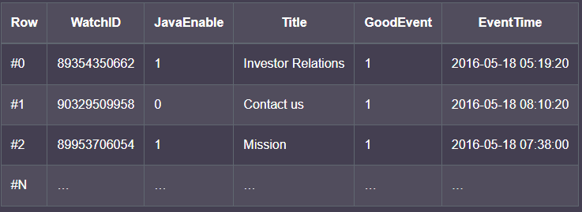
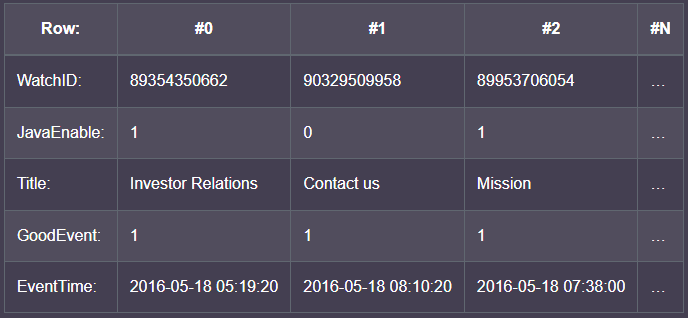
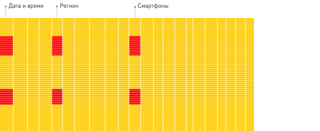

ClickHouse 是一個用於 OLAP 的列式 (column-oriented) 資料庫。

## row-oriented 與 column-oriented 資料庫的比較

以 MySQL、Postgress 這類傳統行式 (row-oriented) 資料庫會用以下方式儲存資料：

在同一行中 (Row 編號相同) 的資料在物理上是儲存在一起的。

---

ClickHouse 這類列式 (column-oriented) 資料庫則是以如下的方式儲存資料：

在不同列的值是分開儲存的，來自同一列 ( column 名稱相同) 的數據則是被儲存再一起

常見的列式數據庫有： Vertica、 Paraccel (Actian Matrix，Amazon Redshift)、 Sybase IQ、 Exasol、 Infobright、 InfiniDB、 MonetDB (VectorWise， Actian Vector)、 LucidDB、 SAP HANA、 Google Dremel、 Google PowerDrill、 Druid、 kdb+。

## OLAP 場景特性

- 以讀請求為主
- 數據不太會一次只新增單個 row，通常都是大批次 (> 1000 row) 的寫入
- 新增到資料庫的數據不會再修改
- 每個 TABLE 包含大量的 column (寬表)，但查詢通常只取少數 column
- 查詢相對較少，通常單個 server 的 qps 僅數百次或更少
- 對於簡單的查詢，允許延遲大約 50 ms
- 列中的數據相對較小：數字和短字符串
- 處理個查詢時需要高吞吐量，單個 server 每秒可能須讀取數十億行資料
- 事務不是必需的
- 對數據一致性要求低
- 查詢結果經過過濾和聚合會明顯小於源數據，因此結果適合放在單個 server 的 RAM 中

## column-oriented 資料庫更適合 OLAP 場景的原因

以下稍微演示 OLAP 查詢較為快速的原因：

- row-oriented：

- column-oriented：

[安裝](ClickHouse%2000abab3fbf90476aab2c111b2481e9b9/%E5%AE%89%E8%A3%9D%20f46924e7be8c4429909fbfdd5f561ea4.md)

[索引](ClickHouse%2000abab3fbf90476aab2c111b2481e9b9/%E7%B4%A2%E5%BC%95%200f4841ababae47f1ab2023011747cd3e.md)

[Partition](ClickHouse%2000abab3fbf90476aab2c111b2481e9b9/Partition%20726c590f33ee437eb7e3ce10d8a3b96e.md)

[**Materialized MySQL (實驗性)**](ClickHouse%2000abab3fbf90476aab2c111b2481e9b9/Materialized%20MySQL%20(%E5%AF%A6%E9%A9%97%E6%80%A7)%2023c2b7ead775457abc7b8bdf4aa0ba4d.md)

[Projection](ClickHouse%2000abab3fbf90476aab2c111b2481e9b9/Projection%20b85e3a2f7f1e47eaa42a0a0315ef9a78.md)

[儲存結構](ClickHouse%2000abab3fbf90476aab2c111b2481e9b9/%E5%84%B2%E5%AD%98%E7%B5%90%E6%A7%8B%203200211fa140428497ee211e84753973.md)

[MergeTree 表引擎](ClickHouse%2000abab3fbf90476aab2c111b2481e9b9/MergeTree%20%E8%A1%A8%E5%BC%95%E6%93%8E%2059658cc1ab934f63b632bd2a376256ee.md)

[TPC-H 測試](ClickHouse%2000abab3fbf90476aab2c111b2481e9b9/TPC-H%20%E6%B8%AC%E8%A9%A6%206e6686c61ce0439799049dbfa0298268.md)