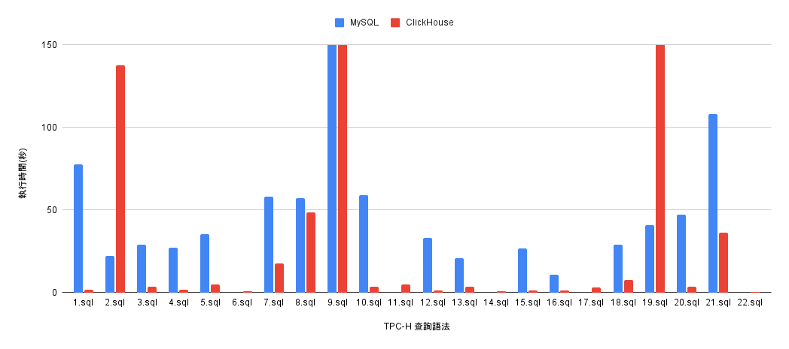
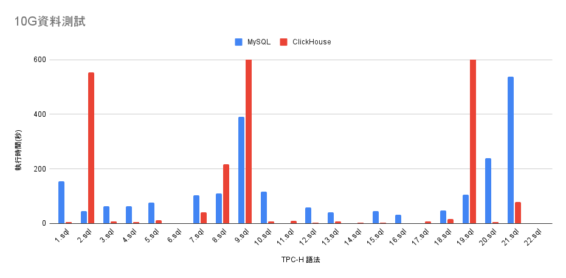

# TPC-H 測試

## 安裝

- 到 TPC 官方下載 [TPC-H 工具](http://tpc.org/TPC_Documents_Current_Versions/download_programs/tools-download-request5.asp?bm_type=TPC-H&bm_vers=3.0.0&mode=CURRENT-ONLY)

  這個步驟需填寫 email，下載連結會寄到 email

- 解壓縮檔案，並建立 Makefile 檔案

    ```bash
    unzip 025654ff-3a66-4e25-9f7c-ee2f2e6bbf18-tpc-h-tool.zip
    mv 'TPC-H V3.0.1' 'TPC-H_Tools_v3.0.1'
    cd ./TPC-H_Tools_v3.0.1/dbgen
    cp makefile.suite Makefile
    ```


## MySQL

- 修改 Makefile 中的 CC、DATABASE、MACHINE、WORKLOAD 等參數設定

    ```bash
    -> ~ vim Makefile
    CC      = gcc
    # Current values for DATABASE are: INFORMIX, DB2, TDAT (Teradata)
    #                                  SQLSERVER, SYBASE, ORACLE, VECTORWISE
    # Current values for MACHINE are:  ATT, DOS, HP, IBM, ICL, MVS,
    #                                  SGI, SUN, U2200, VMS, LINUX, WIN32
    # Current values for WORKLOAD are:  TPCH
    DATABASE= MYSQL
    MACHINE = LINUX
    WORKLOAD = TPCH
    ```

- 修改 tpcd.h 文件，新增 mysql 相關定義

    ```bash
    -> ~ vim tpcd.h 
    #ifdef MYSQL
    #define GEN_QUERY_PLAN ""
    #define START_TRAN "START TRANSACTION"
    #define END_TRAN "COMMIT"
    #define SET_OUTPUT ""
    #define SET_ROWCOUNT "limit %d;\n"
    #define SET_DBASE "use %s;\n"
    #endif
    ```

- 編譯

    ```bash
    make
    ```

  編譯後該目錄會多出 2 個可執行檔：

    - dbgen：產生測試數據的工具
    - qgen：產生 SQL 語句的工具
- 透過 dbgen 產生測試數據

    ```bash
    # 產生 5G 數據
    ./dbgen -s 5
    
    # 將數據文件放到資料夾方便處理
    mkdir test
    mv *.tbl test/
    
    -> ~ ll -h tpch5/
    總計 5.3G
    -rw-r--r-- 1 root root 117M 12月 23 16:36 customer.tbl
    -rw-r--r-- 1 root root 3.6G 12月 23 16:36 lineitem.tbl
    -rw-r--r-- 1 root root 2.2K 12月 23 16:36 nation.tbl
    -rw-r--r-- 1 root root 830M 12月 23 16:36 orders.tbl
    -rw-r--r-- 1 root root 573M 12月 23 16:36 partsupp.tbl
    -rw-r--r-- 1 root root 116M 12月 23 16:36 part.tbl
    -rw-r--r-- 1 root root  389 12月 23 16:36 region.tbl
    -rw-r--r-- 1 root root 6.8M 12月 23 16:36 supplier.tbl
    ```

    - 說明

        ```bash
        数据量的大小对查询速度有直接的影响，TPC-H中使用SF描述数据量，1SF对应1 GB单位。1000SF，即1 TB。1SF对应的数据量只是8个表的总数据量不包括索引等空间占用，准备数据时需预留更多空间。
          -s表示sf值，如-s 1表示生成1G数据：
            -s 0.16最大表lineitem约96万条数据
            -s 1.6最大表lineitem约960万条数据
            -s 16最大表lineitem约0.96亿条数据
            -s 20最大表lineitem约1.2亿条数据
          -S表示当前命令生成第几个 chunk。
          -C表示一共分成几个chunk。一条语句只能生成一个 chunk。
          -f表示强制生成，会替换之前生成的.tbl文件
        
        更多dbgen命令说明请使用./dbgen --help查看：
        
        -C <n> – separate data set into <n> chunks (requires -S, default: 1)
        -f – force. Overwrite existing files
        -h – display this message
        -q – enable QUIET mode
        -s <n> – set Scale Factor (SF) to <n> (default: 1)
        -S <n> – build the <n>th step of the data/update set (used with -C or -U)
        -U <n> – generate <n> update sets
        -v – enable VERBOSE mode
        -b <s> – load distributions for <s> (default: dists.dss)
        -d <n> – split deletes between <n> files (requires -U)
        -i <n> – split inserts between <n> files (requires -U)
        -T c – generate cutomers ONLY
        -T l – generate nation/region ONLY
        -T L – generate lineitem ONLY
        -T n – generate nation ONLY
        -T o – generate orders/lineitem ONLY
        -T O – generate orders ONLY
        -T p – generate parts/partsupp ONLY
        -T P – generate parts ONLY
        -T r – generate region ONLY
        -T s – generate suppliers ONLY
        -T S – generate partsupp ONLY
        
        To generate the SF=1 (1GB), validation database population, use:
          dbgen -vf -s 1
        To generate updates for a SF=1 (1GB), use:
          dbgen -v -U 1 -s 1
        ```

- 建立 schema
    - schema

        ```sql
        create table part (
            p_partkey     bigint not null,
            p_name        varchar(55) not null,
            p_mfgr        char(25) not null,
            p_brand       char(10) not null,
            p_type        varchar(25) not null,
            p_size        bigint not null,
            p_container   char(10) not null,
            p_retailprice decimal(15,2) not null,
            p_comment     varchar(23) not null,
            primary key (p_partkey)
        ) engine = innodb;
        
        create table supplier (
            s_suppkey     bigint not null,
            s_name        char(25) not null,
            s_address     varchar(40) not null,
            s_nationkey   bigint not null,
            s_phone       char(15) not null,
            s_acctbal     decimal(15,2) not null,
            s_comment     varchar(101) not null,
            primary key (s_suppkey)
        ) engine = innodb;
        
        create table partsupp ( 
            ps_partkey     bigint not null,
            ps_suppkey     bigint not null,
            ps_availqty    bigint not null,
            ps_supplycost  decimal(15,2)  not null,
            ps_comment     varchar(199) not null,
            primary key (ps_partkey, ps_suppkey)
        ) engine = innodb;
        
        create table customer ( 
            c_custkey     bigint not null,
            c_name        varchar(25) not null,
            c_address     varchar(40) not null,
            c_nationkey   bigint not null,
            c_phone       char(15) not null,
            c_acctbal     decimal(15,2)   not null,
            c_mktsegment  char(10) not null,
            c_comment     varchar(117) not null,
            primary key (c_custkey)
        ) engine = innodb;
        
        create table orders  ( 
            o_orderkey       bigint not null,
            o_custkey        bigint not null,
            o_orderstatus    char(1) not null,
            o_totalprice     decimal(15,2) not null,
            o_orderdate      date not null,
            o_orderpriority  char(15) not null,
            o_clerk          char(15) not null,
            o_shippriority   bigint not null,
            o_comment        varchar(79) not null,
            primary key (o_orderkey)
        ) engine = innodb;
        
        create table lineitem ( 
            l_orderkey    bigint not null,
            l_partkey     bigint not null,
            l_suppkey     bigint not null,
            l_linenumber  bigint not null,
            l_quantity    decimal(15,2) not null,
            l_extendedprice  decimal(15,2) not null,
            l_discount    decimal(15,2) not null,
            l_tax         decimal(15,2) not null,
            l_returnflag  char(1) not null,
            l_linestatus  char(1) not null,
            l_shipdate    date not null,
            l_commitdate  date not null,
            l_receiptdate date not null,
            l_shipinstruct char(25) not null,
            l_shipmode     char(10) not null,
            l_comment      varchar(44) not null,
            primary key (l_orderkey, l_linenumber)
        ) engine = innodb;
        
        create table nation  ( 
            n_nationkey  bigint not null,
            n_name       char(25) not null,
            n_regionkey  bigint not null,
            n_comment    varchar(152),
            primary key (n_nationkey)
        ) engine = innodb;
        
        create table region  ( 
            r_regionkey  bigint not null,
            r_name       char(25) not null,
            r_comment    varchar(152),
            primary key (r_regionkey)
        ) engine = innodb;
        ```


    ```bash
    mysql -uroot  -S/var/lib/mysql-replica01/mysql.sock -e"CREATE DATABASE test"
    mysql -uroot  -S/var/lib/mysql-replica01/mysql.sock -Dtest < tpch_mysql_schema.sql
    ```

- 匯數據

    ```sql
    # client 端需加上 --local-infile=1 才能 LOAD DATA
    mysql -uroot  -S/var/lib/mysql-replica01/mysql.sock --local-infile=1 -Dtest
    ```

    ```sql
    # local_infile = ON 才能 LOAD DATA
    SET GLOBAL local_infile = 'ON';
    # LOAD DATA
    LOAD DATA LOCAL INFILE '/root/TPC-H_Tools_v3.0.1/dbgen-clickhouse/test_data/customer.tbl' INTO TABLE customer FIELDS TERMINATED BY '|';
    LOAD DATA LOCAL INFILE '/root/TPC-H_Tools_v3.0.1/dbgen-clickhouse/test_data/lineitem.tbl' INTO TABLE lineitem FIELDS TERMINATED BY '|';
    LOAD DATA LOCAL INFILE '/root/TPC-H_Tools_v3.0.1/dbgen-clickhouse/test_data/nation.tbl' INTO TABLE nation FIELDS TERMINATED BY '|';
    LOAD DATA LOCAL INFILE '/root/TPC-H_Tools_v3.0.1/dbgen-clickhouse/test_data/orders.tbl' INTO TABLE orders FIELDS TERMINATED BY '|';
    LOAD DATA LOCAL INFILE '/root/TPC-H_Tools_v3.0.1/dbgen-clickhouse/test_data/part.tbl' INTO TABLE part FIELDS TERMINATED BY '|';
    LOAD DATA LOCAL INFILE '/root/TPC-H_Tools_v3.0.1/dbgen-clickhouse/test_data/partsupp.tbl' INTO TABLE partsupp FIELDS TERMINATED BY '|';
    LOAD DATA LOCAL INFILE '/root/TPC-H_Tools_v3.0.1/dbgen-clickhouse/test_data/region.tbl' INTO TABLE region FIELDS TERMINATED BY '|';
    LOAD DATA LOCAL INFILE '/root/TPC-H_Tools_v3.0.1/dbgen-clickhouse/test_data/supplier.tbl' INTO TABLE supplier FIELDS TERMINATED BY '|';
    ```


## ClickHouse

- 修改 Makefile 中的 CC、DATABASE、MACHINE、WORKLOAD 等參數設定

    ```bash
    -> ~ vim Makefile
    CC      = gcc
    # Current values for DATABASE are: INFORMIX, DB2, TDAT (Teradata)
    #                                  SQLSERVER, SYBASE, ORACLE, VECTORWISE
    # Current values for MACHINE are:  ATT, DOS, HP, IBM, ICL, MVS,
    #                                  SGI, SUN, U2200, VMS, LINUX, WIN32
    # Current values for WORKLOAD are:  TPCH
    DATABASE= CLICKHOUSE
    MACHINE = LINUX
    WORKLOAD = TPCH
    ```

- 修改 tpcd.h 文件，新增 mysql 相關定義

    ```bash
    -> ~ vim tpcd.h 
    #ifdef CLICKHOUSE
    #define GEN_QUERY_PLAN ""
    #define START_TRAN ""
    #define END_TRAN ""
    #define SET_OUTPUT ""
    #define SET_ROWCOUNT "limit %d;\n"
    #define SET_DBASE "use %s;\n"
    #endif
    ```

- 編譯

    ```bash
    make
    ```

  編譯後該目錄會多出 2 個可執行檔：

    - dbgen：產生測試數據的工具
    - qgen：產生 SQL 語句的工具
- 產生測試數據

    ```bash
    ./dbgen -s 5
    mkdir test_data
    mv *.tbl test_data
    ```

- 匯入數據
    - CH schema

        ```sql
        create table part (
            p_partkey     bigint not null,
            p_name        varchar(55) not null,
            p_mfgr        char(25) not null,
            p_brand       char(10) not null,
            p_type        varchar(25) not null,
            p_size        bigint not null,
            p_container   char(10) not null,
            p_retailprice decimal(15,2) not null,
            p_comment     varchar(23) not null 
        )
        engine = MergeTree
        order by (p_partkey);
        
        create table supplier (
            s_suppkey     bigint not null,
            s_name        char(25) not null,
            s_address     varchar(40) not null,
            s_nationkey   bigint not null,
            s_phone       char(15) not null,
            s_acctbal     decimal(15,2) not null,
            s_comment     varchar(101) not null
        )
        engine = MergeTree
        order by (s_suppkey);
        
        create table partsupp ( 
            ps_partkey     bigint not null,
            ps_suppkey     bigint not null,
            ps_availqty    bigint not null,
            ps_supplycost  decimal(15,2)  not null,
            ps_comment     varchar(199) not null
        )
        engine = MergeTree
        order by (ps_partkey, ps_suppkey);
        
        create table customer ( 
            c_custkey     bigint not null,
            c_name        varchar(25) not null,
            c_address     varchar(40) not null,
            c_nationkey   bigint not null,
            c_phone       char(15) not null,
            c_acctbal     decimal(15,2)   not null,
            c_mktsegment  char(10) not null,
            c_comment     varchar(117) not null
        )
        engine = MergeTree
        order by (c_custkey);
        
        create table orders  ( 
            o_orderkey       bigint not null,
            o_custkey        bigint not null,
            o_orderstatus    char(1) not null,
            o_totalprice     decimal(15,2) not null,
            o_orderdate      date not null,
            o_orderpriority  char(15) not null,
            o_clerk          char(15) not null,
            o_shippriority   bigint not null,
            o_comment        varchar(79) not null
        )
        engine = MergeTree
        order by (o_orderkey);
        
        create table lineitem ( 
            l_orderkey    bigint not null,
            l_partkey     bigint not null,
            l_suppkey     bigint not null,
            l_linenumber  bigint not null,
            l_quantity    decimal(15,2) not null,
            l_extendedprice  decimal(15,2) not null,
            l_discount    decimal(15,2) not null,
            l_tax         decimal(15,2) not null,
            l_returnflag  char(1) not null,
            l_linestatus  char(1) not null,
            l_shipdate    date not null,
            l_commitdate  date not null,
            l_receiptdate date not null,
            l_shipinstruct char(25) not null,
            l_shipmode     char(10) not null,
            l_comment      varchar(44) not null
        )
        engine = MergeTree
        order by (l_orderkey, l_linenumber);
        
        create table nation  ( 
            n_nationkey  bigint not null,
            n_name       char(25) not null,
            n_regionkey  bigint not null,
            n_comment    varchar(152)
        )
        engine = MergeTree
        order by (n_nationkey); 
        
        create table region  ( 
            r_regionkey  bigint not null,
            r_name       char(25) not null,
            r_comment    varchar(152)
        )
        engine = MergeTree
        order by (r_regionkey);
        ```


    ```sql
    clickhouse client -q "CREATE DATABASE IF NOT EXISTS test"
    clickhouse client -n --queries-file tpch_ch_schema.sql -d test
    
    clickhouse client -m --format_csv_delimiter="|" --query="insert into test.customer format CSV" < customer.tbl
    clickhouse client -m --format_csv_delimiter="|" --query="insert into test.lineitem format CSV" < lineitem.tbl
    clickhouse client -m --format_csv_delimiter="|" --query="insert into test.nation format CSV" < nation.tbl
    clickhouse client -m --format_csv_delimiter="|" --query="insert into test.orders format CSV" < orders.tbl
    clickhouse client -m --format_csv_delimiter="|" --query="insert into test.partsupp format CSV" < partsupp.tbl
    clickhouse client -m --format_csv_delimiter="|" --query="insert into test.part format CSV" < part.tbl
    clickhouse client -m --format_csv_delimiter="|" --query="insert into test.region format CSV" < region.tbl
    clickhouse client -m --format_csv_delimiter="|" --query="insert into test.supplier format CSV" < supplier.tbl
    ```


## MySQL & ClickHouse 測試

### 規格

- 機器規格（個人 Citrix Linux 機器）：
    - CPU：2 Core
    - Memory：8 GB
- DB 皆使用 7GB memory
- DB 皆為單 node
- 各個 Table 資料量：
    - lineitem：59,986,052
    - customer：1,500,000
    - nation：25
    - orders：15,000,000
    - part：2,000,000
    - partsupp：8,000,000
    - region：5
    - supplier：100,000

### 測試結果
- 寫入後佔用空間量 (MySQL 約為 ClickHouse 的 4 倍)

    ```sql
    localhost :) SELECT
                     table,
                     formatReadableSize(sum(bytes)) AS size
                 FROM system.parts
                 WHERE active
                 AND database = 'test'
                 GROUP BY table;
    
    ┌─table────┬─size───────┐
    │ lineitem │ 2.70 GiB   │
    │ orders   │ 614.02 MiB │
    │ partsupp │ 447.38 MiB │
    │ customer │ 121.90 MiB │
    │ part     │ 89.70 MiB  │
    │ supplier │ 7.55 MiB   │
    │ nation   │ 1.66 KiB   │
    │ region   │ 523.00 B   │
    └──────────┴────────────┘
    
    8 rows in set. Elapsed: 0.008 sec.
    ```

    ```sql
    SELECT 
        TABLE_NAME, 
        CASE 
            WHEN floor(( DATA_LENGTH + INDEX_LENGTH) / 1024 / 1024 / 1024) > 0
                THEN CONCAT(ROUND((( DATA_LENGTH + INDEX_LENGTH) / 1024 / 1024 / 1024),2), "GB")
            WHEN floor(( DATA_LENGTH + INDEX_LENGTH) / 1024 / 1024 ) > 0
                THEN CONCAT(ROUND((( DATA_LENGTH + INDEX_LENGTH) / 1024 / 1024 ),2), "MB")
            WHEN floor(( DATA_LENGTH + INDEX_LENGTH) / 1024) > 0
                THEN CONCAT(ROUND((( DATA_LENGTH + INDEX_LENGTH) / 1024),2), "KB")        
            ELSE CONCAT((( DATA_LENGTH + INDEX_LENGTH)), "Byte") 
        END AS `size`
    FROM  
        information_schema.TABLES 
    WHERE TABLE_SCHEMA = 'test'
    ORDER BY DATA_LENGTH DESC;
    
    +------------+----------+
    | TABLE_NAME | size     |
    +------------+----------+
    | lineitem   | 8.05GB   |
    | orders     | 2.06GB   |
    | partsupp   | 2.03GB   |
    | part       | 329.89MB |
    | customer   | 290.84MB |
    | supplier   | 18.55MB  |
    | nation     | 16.00KB  |
    | region     | 16.00KB  |
    +------------+----------+
    8 rows in set (0.01 sec)
    ```

- 無任何優化

| TPC-H 語法 | 語法類型 | MySQL | ClickHouse |
| --- | --- | --- | --- |
| 1.sql | lineitem GROUP BY | 1m17.663s | 0m1.780s |
| 2.sql | part, supplier, partsupp, nation, region 五表 JOIN | 0m22.257s | 2m17.674s |
| 3.sql | customer, orders, lineitem 三表 JOIN | 0m29.132s | 0m3.624s |
| 4.sql |  | 0m26.961s | 0m1.760s |
| 5.sql |  | 0m35.477s | 0m5.084s |
| 6.sql |  | 0m0.012s | 0m0.571s |
| 7.sql |  | 0m57.946s | 0m17.775s |
| 8.sql |  | 0m57.167s | 0m48.609s |
| 9.sql |  | 4m13.980s | 4m48.043s |
| 10.sql |  | 0m59.013s | 0m3.348s |
| 11.sql |  | 0m0.010s | 0m4.750s |
| 12.sql |  | 0m33.102s | 0m1.271s |
| 13.sql |  | 0m20.790s | 0m3.518s |
| 14.sql |  | 0m0.013s | 0m0.925s |
| 15.sql |  | 0m26.780s | 0m1.196s |
| 16.sql |  | 0m10.672s | 0m1.082s |
| 17.sql |  | 0m0.010s | 0m2.975s |
| 18.sql |  | 0m28.808s | 0m7.432s |
| 19.sql |  | 0m40.692s | 超過 30 m |
| 20.sql |  | 0m47.100s | 0m3.690s |
| 21.sql |  | 1m47.974s | 0m36.074s |
| 22.sql |  | 0m0.011s | 0m0.371s |



| TPC-H 語法 | 語法類型 | MySQL | ClickHouse |
| --- | --- | --- | --- |
| 1.sql | lineitem GROUP BY | 2m35.400s | 0m4.737s |
| 2.sql | part, supplier, partsupp, nation, region 五表 JOIN | 0m44.018s | 9m12.907s |
| 3.sql | customer, orders, lineitem 三表 JOIN | 1m3.439s | 0m8.025s |
| 4.sql |  | 1m3.102s | 0m3.722s |
| 5.sql |  | 1m15.256s | 0m11.686s |
| 6.sql |  | 0m0.059s | 0m1.156s |
| 7.sql |  | 1m44.087s | 0m39.855s |
| 8.sql |  | 1m50.143s | 3m37.400s |
| 9.sql |  | 6m31.232s | 24m26.138s |
| 10.sql |  | 1m57.491s | 0m6.302s |
| 11.sql |  | 0m0.065s | 0m8.977s |
| 12.sql |  | 0m58.876s | 0m2.719s |
| 13.sql |  | 0m41.079s | 0m7.431s |
| 14.sql |  | 0m0.050s | 0m1.613s |
| 15.sql |  | 0m45.950s | 0m2.278s |
| 16.sql |  | 0m30.624s | 0m1.245s |
| 17.sql |  | 0m0.060s | 0m5.937s |
| 18.sql |  | 0m46.592s | 0m15.944s |
| 19.sql |  | 1m4.889s | 超過 30 m |
| 20.sql |  | 4m0.176s | 0m4.841s |
| 21.sql |  | 8m58.563s | 1m18.094s |
| 22.sql |  | 0m0.061s | 0m1.139s |




##  Query 內容

### Q1：單張大表 GROUP BY

```sql
select
  l_returnflag,
  l_linestatus,
  sum(l_quantity) as sum_qty,
  sum(l_extendedprice) as sum_base_price, 
  sum(l_extendedprice*(1-l_discount)) as sum_disc_price, 
  sum(l_extendedprice*(1-l_discount)*(1+l_tax)) as sum_charge, 
  avg(l_quantity) as avg_qty,
  avg(l_extendedprice) as avg_price,
  avg(l_discount) as avg_disc,
  count(*) as count_order
from
    lineitem
where
    l_shipdate <= date '1998-12-01' - interval '[DELTA]' day (3)  //DELTA是60~120内的值
group by 
    l_returnflag, l_linestatus 
order by
    l_returnflag, l_linestatus;
```

### Q2：五張表 JOIN

```sql
select
    s_acctbal, s_name, n_name, p_partkey, p_mfgr, s_address, s_phone, s_comment 
  /*查询供应者的帐户余额、名字、国家、零件的号码、生产者、供应者的地址、电话号码、备注信息 */
from
    part, supplier, partsupp, nation, region //五表连接
where
    p_partkey = ps_partkey
    and s_suppkey = ps_suppkey
    and p_size = [SIZE] //指定大小，在区间[1, 50]内随机选择
    and p_type like '%[TYPE]' //指定类型，在TPC-H标准指定的范围内随机选择
    and s_nationkey = n_nationkey
    and n_regionkey = r_regionkey
    and r_name = '[REGION]' //指定地区，在TPC-H标准指定的范围内随机选择
    and ps_supplycost = ( //子查询
        select
            min(ps_supplycost) //聚集函数
        from
            partsupp, supplier, nation, region //与父查询的表有重叠
        where
            p_partkey = ps_partkey
            and s_suppkey = ps_suppkey
            and s_nationkey = n_nationkey
            and n_regionkey = r_regionkey
            and r_name = '[REGION]'
    )
order by //排序
```

## 總結
可以看出來 ClickHouse 擅長的是單張大表聚合查詢，不擅長於多表 JOIN 查詢。
