## Sparse Primary Indexes

### 說明

傳統的 RDBMS 表中的每一行數據都有一個 primary key 並且儲存為 B+ Tree 的資料結構，這樣的設計下可以快速的找到特定 row 的資料，但相應的需要額外的 disk、memory 開銷。

ClickHouse 的 `MergeTree` 引擎用來優化處理大量數據，並且數據是被一批一批的寫入表中，在這種情況下 disk、memory 效率很重要，因此不是為每一行數據建立 primary key，而是要為一組數據 (稱為 `granule`) 建立一個 index entry (稱為 `mark`)，也就是說在 ClickHouse 中 primary index 是對應多筆資料而不是唯一的資料。

sparse primery index 不像基於 B+ Tree 的索引可以直接定位到特定行，而是可以透過 binary search 的方式快速找到可能匹配查詢的 granule 並傳輸到 ClickHouse engine 來找到匹配的結果。

這種 sparse primery index 的設計，讓 primary index 足夠小可以放到 memory 中，並且對於 OLAP 的範圍查詢能有效加快。

### 事例

#### schema

```sql
CREATE TABLE hits_UserID_URL
(
    `UserID` UInt32,
    `URL` String,
    `EventTime` DateTime
)
ENGINE = MergeTree
PRIMARY KEY (UserID, URL)
ORDER BY (UserID, URL, EventTime)
SETTINGS index_granularity = 8192, index_granularity_bytes = 0;
```

schema 說明：

- ORDER BY 是排序鍵(sorting key)，決定 .bin 中的文件如何排序
- PRIMARY KEY 為選填的設定，用來生成 primary.idx 的檔案，必須是 ORDER BY 的前綴，如果沒有設定會將 PRIMARY KEY 定義為排序鍵。
- 默認情況下 sorting key 和 primary key 相同，以 sorting key 為主，因此大多情況下不需要指定 primary key，通常只有 SummingMergeTree 和 AggregatingMergeTree 引擎時
- 顯式的設置 PRIMARY KEY 和 ORDER BY 不同是為了進一步優化，例如：針對 WHERE A GROUP BY A, B, C 的查詢下，可以建立一個表 PRIMARY KEY A ORDER BY  A, B , C。
- index_granularity 默認值為 8192，意思是每 8192 行資料為一組會有一個 primary index entry
- index_granularity_bytes：0 表示禁止 adaptive index granularity，如果開啟此設定當符合以下條件時會自動最一組 n 行資料創建一個 primary index entry。
    - n < 8192 (index_granularity)，但 n 行數據大小 <= index_granularity_bytes(預設值為 10 MB)
    - n 達到 8192 (index_granularity)

插入的行會按照 PRIMARY KEY 按順序 (ascending 升序) 儲存在 disk 上，同時 ClickHouse 允許插入具有相同 PK 的多筆資料，當 PK 相同時則會依照排序鍵中的 EventTime 排序：

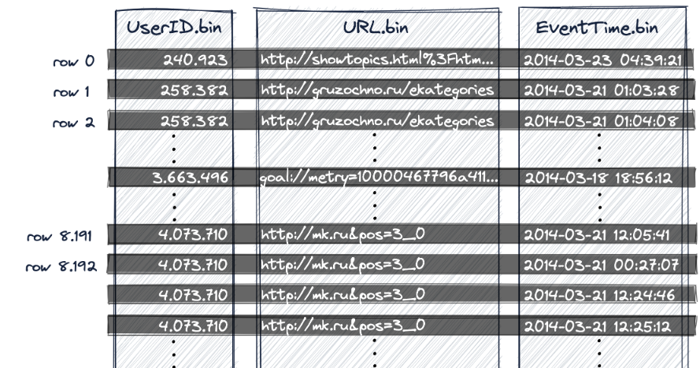

ClickHouse 將表中的資料劃分為多個 `granule`，`granule` 是 ClickHouse 進行數據處理的最小單位，也就是說 ClickHouse 不是讀取單獨行，而是總是讀取整個 `granule` 。此例中 index_granularity = 8192，因此每 8192 行為一個 `granule`：

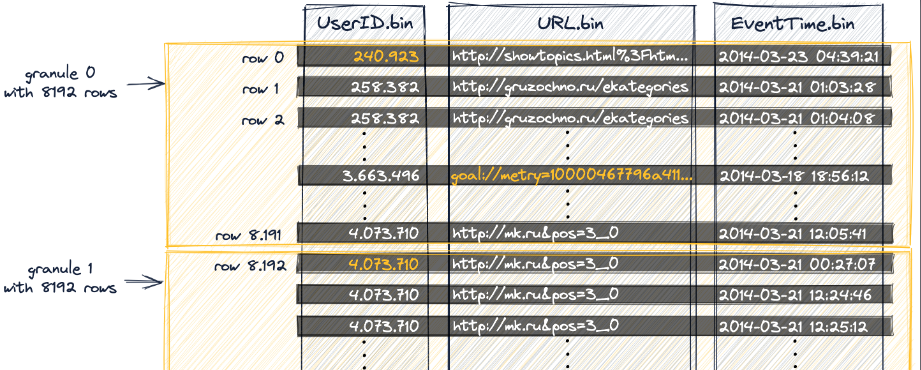

另外可以看到上圖中有橘色的字，這些表示該 column 在該 granule 中的最小值，不過最後一個 granule 中則是會最大值：

- 第一個  index entry (下圖中的 `mark 0`) 儲存 `granule 0` 中的最小值
- 第二個  index entry (下圖中的 `mark 1`) 儲存 `granule 1` 中的最小值
- 以此類推……
- 最後一個 index entry (下圖中的 `mark 1082`) 儲存 `granule 1082` 中的最大值

這些每個 column 在每個 granule 中的最小值(最後一個為最大值) 會被寫入到 `primary.idx` 檔案中：

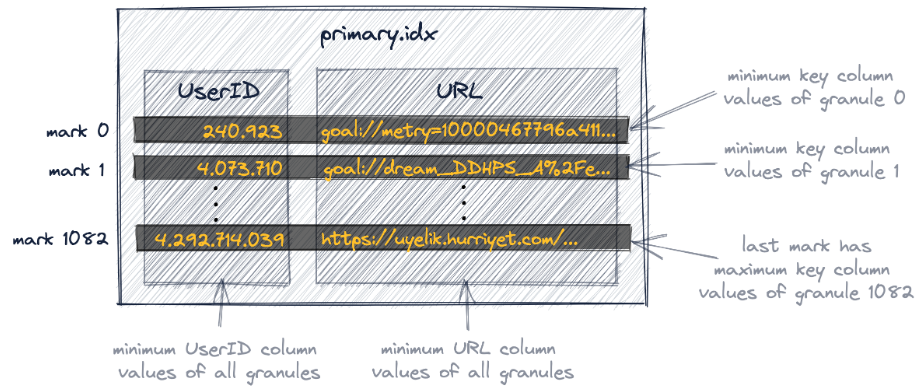

注意因為是將每個 column 在每個 granule 中的極值挑出來，所以上例中的 mark 0 的 UserID、URL 的值是來自同一個 granule 中的不同行。

> 💡 primary.idx 此文件會被完全被 loading 到內存中，如果文件大於可用的內存空間，則 ClickHouse 將引發錯誤。

#### 查詢

```sql
SELECT URL, count(URL) AS Count
FROM hits_UserID_URL
WHERE UserID = 749927693
GROUP BY URL
ORDER BY Count DESC
LIMIT 10;

10 rows in set. Elapsed: 0.005 sec.
Processed 8.19 thousand rows, 
740.18 KB (1.53 million rows/s., 138.59 MB/s.)
```

上例查詢中我們需要找到 `UserID = 749927693` 的資料，首先我們透過 primary.idx 找到 `UserID = 749927693` 的值介於 index mark 176 的 747148242 之後 mark 177 的 751802947 之前，因此只需要取出 mark 176 對應的 granule：

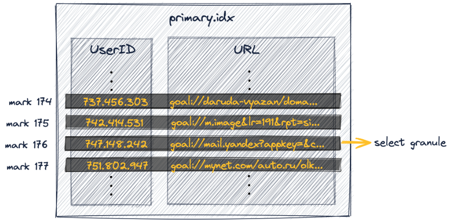

接著需要 mark 176 中對應的 granule 中的 8192 行資料讀取到 ClickHouse，因此需要知道 granule 176 物理位置，每個 granule 的物理位置被儲存在 `欄位.mrk` 的文件中：

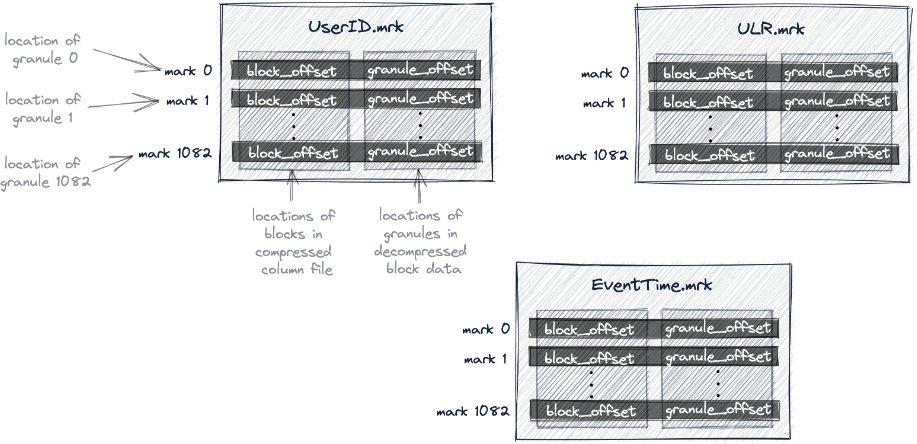

如上圖所示 `欄位.mrk` 文件中會記錄每個 granule 所在的物理位置，也就是在 `欄位.bin` 數據文件中的位置，其中有 2 個內容：

- block_offset：記錄了所選 granule 壓縮版本所在的壓縮數據塊。

  每個壓縮塊可能包含多個 granule (壓縮過的)，該壓縮數據塊在讀取時被解壓縮到內存中。

- granule_offset：記錄了 granule 在解壓縮後數據塊的位置。

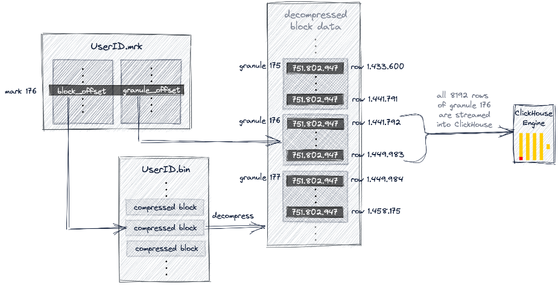

上圖顯示了 ClickHouse 透過 UserID.mrk 定位到 UserID.bin 數據文件中包含符合查詢條件 granule 的過程，同時 ClickHouse 也會對 URL 欄位執行相同的動作，隨後這 2 個不同的 granule 會被對齊倍加載到 ClickHouse 引擎進行進一步處理，也就是 Aggrigation 操作。

### 非最左前綴欄位的查詢

上面我們看到是用複合主鍵的第一個欄位 UserID 進行過濾，但是就像 MySQL 索引有最左前綴原則一樣，PK(UserID, URL) 可以明顯加快以 UserID 為條件的過濾，但是單純以 URL 為條件的查詢卻並沒有什麼幫助，因為我們是先 UserID 排序再以 URL 排序，也就是說雖然 UserID 是所有 granule 以小排到大，但是 URL 卻只有在其 granule 內中排序。

```sql
SELECT UserID, count(UserID) AS Count
FROM hits_UserID_URL
WHERE URL = 'http://public_search'
GROUP BY UserID
ORDER BY Count DESC
LIMIT 10;

10 rows in set. Elapsed: 0.086 sec.
Processed 8.81 million rows, 
799.69 MB (102.11 million rows/s., 9.27 GB/s.)
```

```sql
-- trace log
...Executor): Key condition: (column 1 in ['http://public_search', 
                                           'http://public_search'])
...Executor): Used generic exclusion search over index for part all_1_9_2 
              with 1537 steps
...Executor): Selected 1/1 parts by partition key, 1 parts by primary key,
              1076/1083 marks by primary key, 1076 marks to read from 5 ranges
...Executor): Reading approx. 8814592 rows with 10 streams
```

如上所示可以看到該查詢執行時 1083 個 granule 其中有 1076 個 granule 被選中

### **Generic exclusion search algorithm**

當查詢複合主鍵的一部分的 column (但不是第一個 column)，ClickHouse 會使用 **G**eneric exclusion search 演算法而不是用 binary search 演算法，但是此算法僅在前綴索引 cardinality 較低時才較有效果，讓我們來看看不同 cardiality 的前綴索引的情境：

- 前綴主鍵低 cardinality

  假設 UserID 的 cardinality 較低時，相同的 UserID 值可能分布在多個 granule 中，相應的 primary.idx 內多個 index mark 會有多個相同的 UserID 值，這同時也意味著這些 index mark 中的 URL 也會按順序排序：

  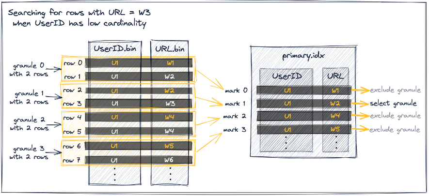

    - mark 0 的 URL 最小值為 W1 小於目標 W3，接著 mark 1、2 的 UserID 都和 mark 0 一樣是 U1，且 mark 1 的 URL 最小值為 W2 小於目標 W3，因此可以直接排除 mark 0 的 granule。
    - mark 1 的 URL 值 W2 ≤ W3，且 mark 2 的 URL 值 W4 ≥ W3，因此選擇 mark 1 的 granule。
    - mark 2、3 的 UserId 也是 U1，且 URL 值 W4、W5 > W3，因此可以直接排除 mark 2、3 的 granule。
- 前綴主鍵高 cardinality

  假設 UserID 的 cardinality 較高時，相同的 UserID 值不太可能分布在多個 granule 中，這同時意味著 primary.idx 內的 URL 不會單純按順序排序：

  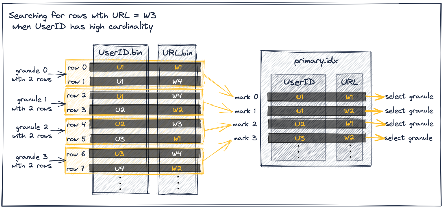

  mark 0 的 URL 最小值為 W1 小於目標 W3，雖然 mark 1 的 UserID 和 mark 0 一樣，但是因為 mark 2 的 UserID 不一樣，因此無法保證 granule 1 只包含 U1 的數據，對應的也不能保證 mark 1 的 W2 是跟 U1 同一行的資料，也就是對無法排除 granule 0 的數據沒有包含 W3 的資料，因此必須選擇 mark 0 對應的 granule 0 。

  其中 granule 1、2、3 也因為以上的原因無法被排除，都需要被挑選並 loading 到 ClickHouse 中，因此過濾的效率非常差。


### 使用多個 primary index 進行優化

如果我們想同時加快下述兩句語法：

```sql
SELECT URL, count(URL) AS Count
FROM hits_UserID_URL
WHERE UserID = 749927693
GROUP BY URL ORDER BY Count DESC LIMIT 10;

SELECT UserID, count(UserID) AS Count
FROM hits_UserID_URL
WHERE URL = 'http://public_search'
GROUP BY UserID ORDER BY Count DESC LIMIT 10;
```

分別針對 UserID、URL 進行過濾，就需要用多個 primary index 來進行優化，我們有以下三種方式：

- 新建一個有不同主鍵的新表

  新增一個具有不同 `PRIMARY KEY`、`ORDER BY` 相同欄位的 table，之後需要自行同步兩張表的資料，並根據查詢條件自行選擇適合的 table，如下所示：

  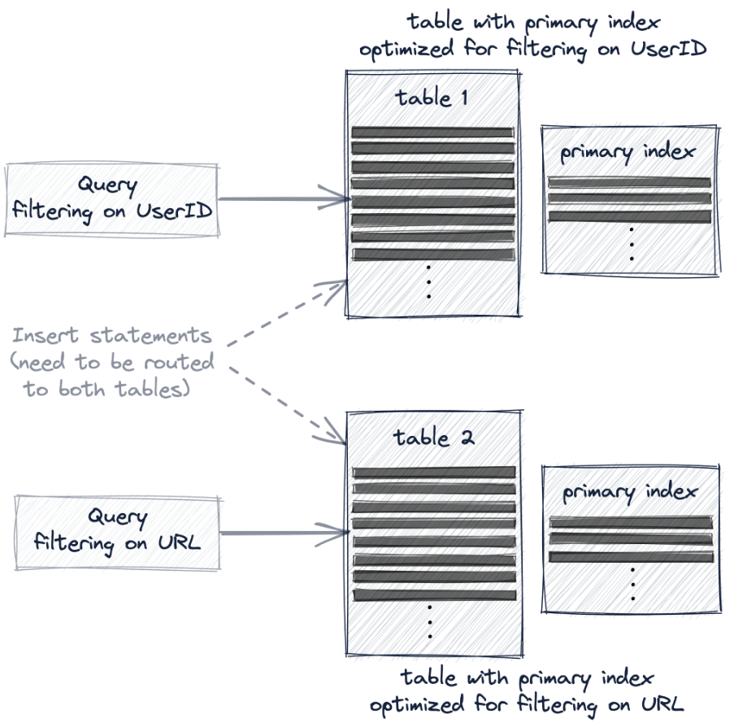

  如下示例：

    ```sql
    CREATE TABLE hits_URL_UserID(
        `UserID` UInt32,
        `URL` String,
        `EventTime` DateTime
    ) ENGINE = MergeTree
    PRIMARY KEY (URL, UserID)
    ORDER BY (URL, UserID, EventTime)
    SETTINGS index_granularity = 8192, index_granularity_bytes = 0;
    
    INSERT INTO hits_URL_UserID SELECT * from hits_UserID_URL;
    
    OPTIMIZE TABLE hits_URL_UserID FINAL;
    ```

- 創建一個 materialized view

  在原表上創建 materialized view，這個額外的表會被隱藏起來，數據會自動在表之間保持同步，也就是說仍只需在原表寫入資料，不需要像上一個方案自行寫入新的表，但查詢時需要自行選擇合適的表，並且不提供數據一致性保證，如下所示：

  

  如下示例：

    ```sql
    CREATE MATERIALIZED VIEW mv_hits_URL_UserID
    ENGINE = MergeTree()
    PRIMARY KEY (URL, UserID)
    ORDER BY (URL, UserID, EventTime)
    -- POPULATE 用來表示建立 view 後將原表的資料匯入 (若未添加則只會同步建立 view 之後插入的資料)
    POPULATE
    AS SELECT * FROM hits_UserID_URL;
    
    SELECT UserID, count(UserID) AS Count
    FROM mv_hits_URL_UserID
    WHERE URL = 'http://public_search'
    GROUP BY UserID ORDER BY Count DESC LIMIT 10;
    ```

  建立之後看到 view 的數據文件如下：

  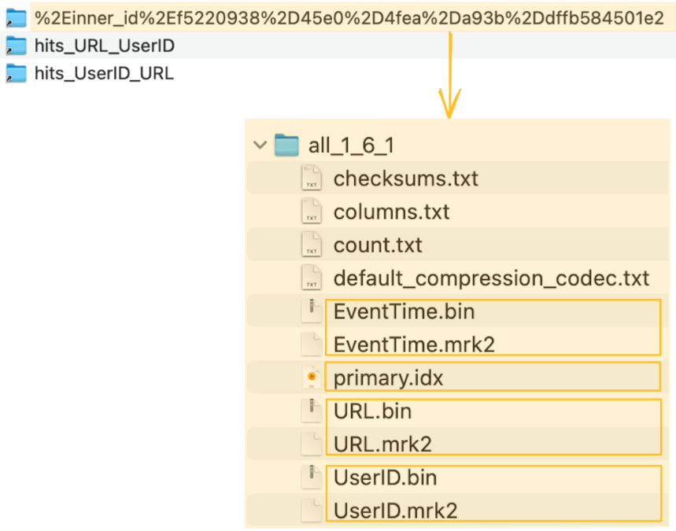

- 對該表新增 projection

  projection 是最透明的方案，因為除了會隱藏附加的表，ClickHouse 還會自動選擇最有效的表版本來查詢，並且還保證數據一致性：

  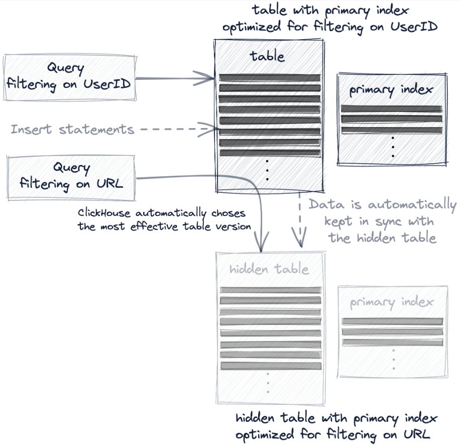

  事例如下：

    ```sql
    -- 在原表上創建 projection
    ALTER TABLE hits_UserID_URL
        ADD PROJECTION prj_url_userid
        (
            SELECT *
            ORDER BY (URL, UserID)
        );
    
    -- materialize projection，立即將源表資料導入隱藏表
    ALTER TABLE hits_UserID_URL
        MATERIALIZE PROJECTION prj_url_userid;
    ```

  建立之後會看到在該 table 下多了一個目錄紀錄 prjection 的相應資訊：

  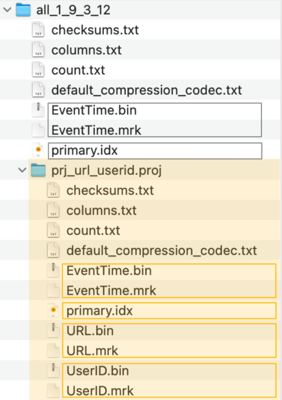


這 3 個方法都是會有效的數據複製到另一個表中，以便重新組織 table 的 primary index 和排序，區別在於對查詢和使用者的透明程度

## Skipping Indexes

在大多數情境中影響 ClickHouse 效能最關鍵的因素是 WHERE 子句的條件是否可以使用 primary index，但不管怎麼調優 primary index 還是不可避免的會出現不能有效使用的案例。

在如 MySQL 等傳統數據庫，解決方案是添加對應的 secondary index，一個 B+Tree 結構讓時間複雜度由全表掃描的 O(n) 變成 O(logn) 的索引掃描。

這種類型的 secondary index 不適合 ClickHouse (或其他 column-oriented 數據庫)，因為 disk 上數據的紀錄是以 granule 為單位，所以沒有單獨的行可以為其添加單獨的 index。 相應的 ClickHouse 提供了稱為  skipping index 來幫助跳過沒有匹配值的 granule。

skipping index 有以下 4 個參數：

- `index name`：index 名稱。
- `index expression`：計算表達是
- `TYPE`：skipping index 的類型。
- `GRANULARITY`：每個 index block 包含了 N 個 granularity。例如： index_granularity 為 8192，GRANULARITY 為 4，則每個 indexed block 包含了 8192*4 = 32768 行資料。

當創建 Skipping index，該表的數據目錄中會產生以下 2 個檔案：

- `skp*idx*{index_name}.idx`：將 index expression 的 values 排序後記錄下來。
- `skp*idx*{index_name}.mrk2`：將 index 關連到的 column 數據文件所在的偏移量。

### Skipping index Type

每隔 `index_granularity` * `GRANULARITY` 是一個 block，skipping index 會依照每個 block 內 `index expression` 產生的結果來生成 index。

Skipping index 的 Type 共分為以下 3 種：

- `minmax`：儲存每個 block 中 `index expression` 的 min/max 值。
- `set(max_size)`： 儲存每個 block 中 `index expression` 的不重複值。

  如果不重複值的數量 > max_size 時則為空，如果 max_size = 0 則表示不限制。

  此類型適合用於每個 block 中的 cardinality 低，但整個 column 的 cardinality 高的情境，該索引成本和性能取決於單個 block 的 cardinality。如果每個 block 包含大量唯一值則成本將相對高，或者是超過 max_size 而為空導致不使用此 index 。

- `Bloom Filter Types`：是一種數據結構，以少量的偽陽性 ( false positive) 為代價能夠對 block 進行高效的 space-efficient 測試。
    - 原理細節

      這邊先附上一個可以線上演示的網站：[Bloom Filters by Example (llimllib.github.io)](https://llimllib.github.io/bloomfilter-tutorial/zh_CN/)

      一個空的 bloom filter 是一個 m bits 的 bit array。

      下圖是一個 14 bits 的 bloom filter，下面的數字表示索引，上面的白色區塊表示尚未有資料，也就是 false、0：

      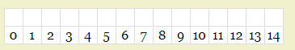

      當輸入一個數據時，會經過 k 個 hash function，產生 k 個結果並在對應的 index 上標上 true、1。

      下圖中 input 了 `ee` 這個值，經過 2 個 hash function：fnv、murmur，得出了 0、4 的結果，因此在 0、4 的 index 標上綠色，也就是 true、1：

      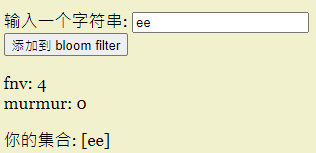

      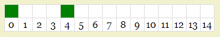

      這時候當再輸入 `eee` 時，2 個 hash function 會得出 7、11 和原本的 0、4 沒有任何交集，因此可以判斷 `eee` 還不在這個結果集內：

      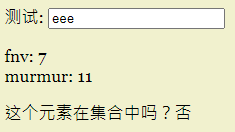

      但如果這時候輸入 `eeee` 時，2 個 hash function 會得出 0、4 和原本的 0、4 一樣，因此我們會得出 `eeee` 可能有在結果集內，但是實際上卻沒有，這就是 bloom filter 的偽陽性：

      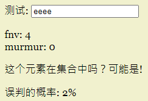


    在 skipping index 的使用場景偽陽性 ( false positive) 不是什麼問題，因為唯一的缺點是多讀取了一些不必要的 granule，而且也總比跳過有效的 granule 好。
    
    因為 Bloom Filter 可以有效的處理大量離散值的測試，所以他們更適合用於可以產生多個測試值的 index expression，特別是透過 `mapKeys` 或 `mapValues` function 來產生 array、map 來進行多值的 space-efficient 測試。
    
    - 基於 Bloom Filter 的 skipping index 又細分為 3 種：
        - 基本的bloom_filter
            
            支持的數據型態：Int*, UInt*, Float*, Enum, Date, DateTime, String, FixedString, Array, LowCardinality, Nullable。
            
            會使用到該索引的 Function：equals, notEquals, in, notin, has。
            
            有一個可選的參數 false_positive：該參數表示 0~1 之間允許的假陽性率，預設為 .025。
            
        - tokenbf_v1：對字符串做 tokenization 後儲存，適合用於 LIKE、EQUALS、in、hasToke() 等等長字符串的搜索，接受 String、FixedString、Map 型態的數據。會將`index expression` 依照非字母數字的字符進行切割，例如：This is a full text search，會被分割為 `This`  `is` `a` `full` `text` `search` 。
            
            需要以下 3 個參數：
            
            - size_of_bloom_filter_in_bytes：bloom filter 的大小，以 byte 為單位，使用的越大可以減少假陽性，但有更高的存儲成本。
            - number_of_hash_functions：使用的 hash function 的個數，使用的越多可以減少假陽性。
            - random_seed：hash function 的隨機種子
        - ngrambf_v1**：**和 tokenbf_v1 類似，但是是用 ngram 來切割而不是非字母數字的字符來切割，適合用於中文這類沒有用空格分隔的字符串。例如 n = 2，會將 `這是測試` 分割為 `這是` `是測` `測試`。
            
            比 tokenbf_v1 多一個參數，需要以下 4 個參數：
            
            - n：ngram 的短語長度。
            - size_of_bloom_filter_in_bytes
            - number_of_hash_functions
            - random_seed

### Skipping index 支持的 function

Where 子句中的條件可以包含對某個 column  進行運算的函數表達式，假如 column 是 index 的一部分，ClickHouse 會在執行 function 時嘗試使用 index。

`set` type 的 skipping index 支持所有的 function，其他 index 支持的 function 如下表所列：

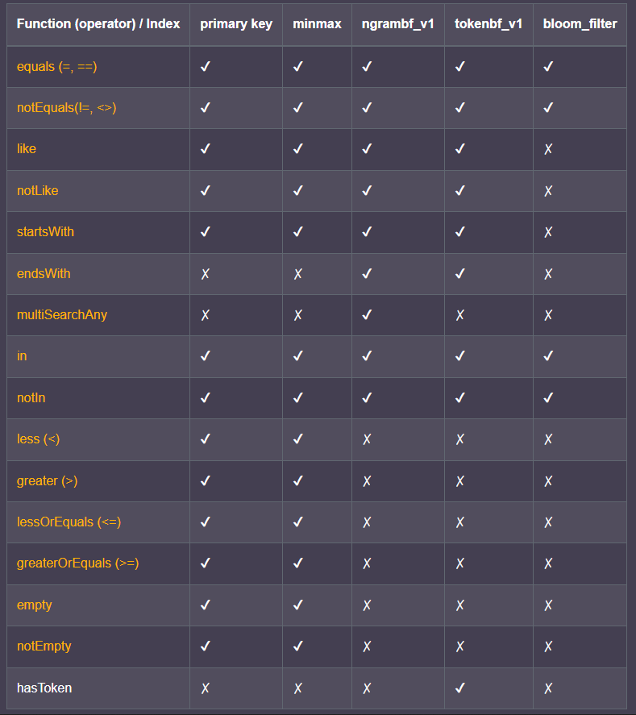

如果 function 的常量參數小於 ngram 大小則不能使用 `ngrambf_v1` 進行查詢優化。

> 💡 因為 bloom filter 有偽陽性的狀況，因此 bloom filter 的 skipping index 不能用於結果返回為 false 的 function，例如： 
能優化的場景：
s LIKE '%test%’
NOT s NOT LIKE '%test%’
s = 1
NOT s != 1
startsWith(s, ‘test’)
不能優化的場景：
NOT s LIKE '%test%’
s NOT LIKE '%test%’
NOT s = 1
S != 1
NOT startsWith(s, ‘test’)

### Skipping index 的配置

- use_skip_indexes ( 0 | 1 )：預設值為 1，對於不太可能從 Skipping index 獲益的查詢建議可以設置為 0 減少不必要的成本。
- force_data_skipping_indexes (以逗號分隔 skipping index 的名稱)：強迫查詢使用指定的 skipping index，若指定後不會用到半個 skipping index 則會返回異常，避免糟糕的查詢耗費機器效能。

### 最佳實踐

假設有一張表的 primary index 是 timestamp，並且在 visitor_id 有一個 index，並有以查詢：

SELECT timestamp, url FROM table WHERE visitor_id = 1001

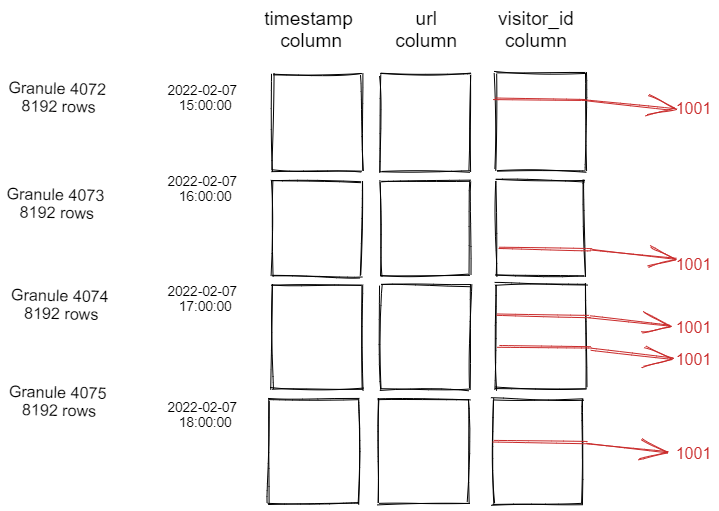

對於這種數據分布與相應的查詢，傳統 RDBMS 的 secondary index 非常有效，透過 secondary index  能夠直接讀取這 5 行數據。

對於 ClickHouse 的 Skipping index 情況卻不同，無法是哪一種 Type 的 Skipping index 都需要從 8192*4=32678 的值都需要測試。

可以看到在以上例子中 Skipping index 並沒有有效的效果，要有效的使用 Skipping index 有以下情境：

- 每個 granule 多數的資料符合條件，也就是需要在該 granule 有低 cardinality。
    - 範例：如果 primary key 是一天中的時間，另外有一個 column 是電視觀眾年齡，很明顯兩者是有相關性的，此時 `minmax` type 的 Skipping index 可能就很有效，因為只有少數的 granule 會被選中。
    - 在插入數據時可以增加這種相關性，方法如下：
        - 在排序鍵 (order by) 中添加此列
        - Insert 時先將 Primary key 與該列分組後在批次插入
- 盡可能減少 granule 被選到，也就是需要在整個 table 有高 cardinality。
    - 範例：一個 API 中很少見的 error code，但卻特別重要需要經常搜尋，此時 `set(max_size)` type 的 Skipping index 就很有效，因為大多 granule 會被跳過。

因此意圖透過簡單添加 Skipping index 來加速查詢的效能是不正確的，建議先研究其他方法，例如：修改 primary index、使用 projections、使用 materialized views，研究這些方法之後才考慮 Skipping index，而且和 secondary index 不同，Skipping index 的行為是不容易預測，因為和數據的真實分布情況息息相關，並且將他們添加到表中對於無法使用索引的查詢會產生很大的成本，因此建議在真實數據上進行測試。

# 參考

[ClickHouse主键索引最佳实践 | ClickHouse Docs](https://clickhouse.com/docs/zh/guides/improving-query-performance/sparse-primary-indexes)

[ClickHouse Index Design | ClickHouse Docs](https://clickhouse.com/docs/en/guides/improving-query-performance/sparse-primary-indexes/sparse-primary-indexes-design/)

[【ClickHouse 极简教程-图文详解原理系列】ClickHouse 主键索引的存储结构与查询性能优化 - 简书 (jianshu.com)](https://www.jianshu.com/p/91f6e9738f0c)

https://github.com/ClickHouse/ClickHouse/issues/5125

