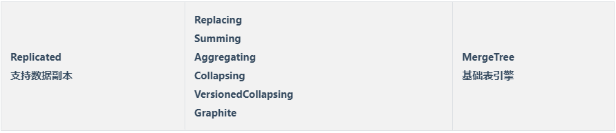

MergeTree 表引擎

1. Sparse Primary Index
2. Partition
3. Data Replication
4. Data Sampling



## Replacing MergeTree

特色：在 merge 時會刪除具有相同 sorting key 的資料。

注意事項：

- 重複的判斷是依照 `ORDER BY` 而不是 `Primary key`
- 因為只有在 merge 時會觸發，因此不保證任何時刻都沒有重複資料。
- 因為只有在 merge 時會觸發，因此不同 partition 的資料不會去重。

缺點：

- 想要得到正確的結果只能透過 `FINAL` 修飾符，或者手動執行 `OPTIMIZE` 來讓 TABLE 觸發 Merge，不論哪一種都是昂貴的操作。

以下為建立一個 ReplacingMergeTree 的語法：

```sql
CREATE TABLE [IF NOT EXISTS] [db.]table_name [ON CLUSTER cluster]
(
    name1 [type1] [DEFAULT|MATERIALIZED|ALIAS expr1],
    name2 [type2] [DEFAULT|MATERIALIZED|ALIAS expr2],
    ...
) ENGINE = ReplacingMergeTree([ver])
[PARTITION BY expr]
[ORDER BY expr]
[PRIMARY KEY expr]
[SAMPLE BY expr]
[SETTINGS name=value, ...]
```

相關參數：

- ver - 帶有版本號的欄位，允許 UInt*、Date、DateTime、DateTime64 的欄位，可選參數。

若未指定 ver 在 merge 時，同樣 sorting key 的資料會保留最後插入的一筆。

當指定 ver 在 merge 時，同樣 sorting key 的資料會保留 ver 指定的欄位最高的一筆，如果相同則同樣是保留最後插入的一筆。

### 範例

```sql
-- without ver - the last inserted 'wins'
CREATE TABLE replacing_test
(
    `key` Int64,
    `someCol` String,
    `eventTime` DateTime
)
ENGINE = ReplacingMergeTree
ORDER BY key;

INSERT INTO replacing_test Values (1, 'first', '2020-01-01 01:01:01');
INSERT INTO replacing_test Values (1, 'second', '2020-01-01 00:00:00');

SELECT * FROM replacing_testFINAL;
┌─key─┬─someCol─┬───────────eventTime─┐
│   1 │ second  │ 2020-01-01 00:00:00 │
└─────┴─────────┴─────────────────────┘

-- with ver - the row with the biggest ver 'wins'
DROP TABLE replacing_test;
CREATE TABLE replacing_test
(
    `key` Int64,
    `someCol` String,
    `eventTime` DateTime
)
ENGINE = ReplacingMergeTree(eventTime)
ORDER BY key;

INSERT INTO replacing_test Values (1, 'first', '2020-01-01 01:01:01');
INSERT INTO replacing_test Values (1, 'second', '2020-01-01 00:00:00');

# 還沒觸發 merge，因此沒有發生刪除
SELECT * FROM replacing_test;
┌─key─┬─someCol─┬───────────eventTime─┐
│   1 │ second  │ 2020-01-01 00:00:00 │
│   1 │ first   │ 2020-01-01 01:01:01 │
└─────┴─────────┴─────────────────────┘

# 使用 FINAL 修飾符直接查到最後結果
SELECT * FROM replacing_test FINAL;
┌─key─┬─someCol─┬───────────eventTime─┐
│   1 │ first   │ 2020-01-01 01:01:01 │
└─────┴─────────┴─────────────────────┘

# 使用 optimize table 觸發合併後查詢
OPTIMIZE TABLE replacing_test;
SELECT * FROM replacing_test;
┌─key─┬─someCol─┬───────────eventTime─┐
│   1 │ first   │ 2020-01-01 01:01:01 │
└─────┴─────────┴─────────────────────┘
```

## Summing MergeTree

特色：在 merge 時有相同 sorting key 的資料會進行合併，並依設定將指定或全部的數值欄位進行相加，非彙總的欄位則只會保留最早插入的數據。

注意事項：

- 判斷是依照 `ORDER BY` 而不是 `Primary key`
- 因為只有在 merge 時會觸發，因此不保證任何時刻資料都已彙整完畢，因此建議查詢時仍舊顯示指定 SUM()、GROUP BY。
- 因為只有在 merge 時觸發，因此不同 partition 的資料不會合併。

以下為建立一個 SummingMergeTree 的語法：

```sql
CREATE TABLE [IF NOT EXISTS] [db.]table_name [ON CLUSTER cluster]
(
    name1 [type1] [DEFAULT|MATERIALIZED|ALIAS expr1],
    name2 [type2] [DEFAULT|MATERIALIZED|ALIAS expr2],
    ...
) ENGINE = SummingMergeTree([columns])
[PARTITION BY expr]
[ORDER BY expr]
[SAMPLE BY expr]
[SETTINGS name=value, ...]
```

相關參數：

- columns - 指定要彙總的欄位名稱，所選的欄位必須為數值型態，並且不可在 ORDER BY 中。為可選的參數，如果未指定則會加總所有的非  ORDER BY  的數值型態欄位。
    - 非彙總的欄位只會保留最早插入的數據。

### 範例

```sql
CREATE TABLE summtt
(
    key UInt32,
    value UInt32
)
ENGINE = SummingMergeTree()
ORDER BY key

INSERT INTO summtt Values(1,1),(1,2),(2,1)

SELECT key, value FROM summtt
┌─key─┬─sum(value)─┐
│   2 │          1 │
│   1 │          3 │
└─────┴────────────┘

# 避免有還未 merge 的資料，因此應該總是使用 sum、group by 進行查詢
SELECT key, sum(value) FROM summtt GROUP BY key
┌─key─┬─sum(value)─┐
│   2 │          1 │
│   1 │          3 │
└─────┴────────────┘
```

## Aggregating MergeTree

特色：在 merge 時有相同 sorting key 的資料會進行合併，並按照預先定義的條件聚合資料。

注意事項：

- 判斷是依照 `ORDER BY` 而不是 `Primary key`
- 因為只有在 merge 時會觸發，因此不保證任何時刻資料都已彙整完畢，因此建議查詢時仍舊顯示指定 SUM()、GROUP BY。
- 因為只有在 merge 時觸發，因此不同 partition 的資料不會合併。

以下為建立一個 AggregatingMergeTree 的語法：

```sql
CREATE TABLE [IF NOT EXISTS] [db.]table_name [ON CLUSTER cluster]
(
    name1 [type1] [DEFAULT|MATERIALIZED|ALIAS expr1],
    name2 [type2] [DEFAULT|MATERIALIZED|ALIAS expr2],
    ...
) ENGINE = AggregatingMergeTree()
[PARTITION BY expr]
[ORDER BY expr]
[SAMPLE BY expr]
[TTL expr]
[SETTINGS name=value, ...]
```

### 範例

```sql
-- 建表
CREATE TABLE db_merge.t_merge_agg (
  `id` String,
  `city` String,
  `code` AggregateFunction(uniq,String), -- 聚合字段 等同於 UNIQ(code)
  `value` AggregateFunction(sum,UInt32), -- 聚合字段 等同於 SUM(value)
  `create_time` DateTime
) ENGINE = AggregatingMergeTree()
partition by toYYYYMM(create_time)
ORDER BY (id,city) -- 可以視為 group by id,city
primary key id;

-- 插入数据
-- 需要使用 UNIQ() 對應的 uniqState 方法 和 sum 對應的 sumState 方法，並使用 INSERT INTO SELECT 來插入
insert into table db_merge.t_merge_agg
select 'A01','shenzhen',uniqState('code1'),sumState(toUInt32(100)),'2021-06-04 15:27:22'
union all 
select 'A01','shenzhen',uniqState('code2'),sumState(toUInt32(200)),'2021-06-04 15:28:22';

-- 查询数据
-- 需要调用 UNIQ对应的 uniqMrege 方法 和 sum 对应的 sumMerge 方法

select id,city,uniqMerge(code),sumMerge(value) from db_merge.t_merge_agg group by id,city;

┌─id──┬─city─────┬─uniqMerge(code)─┬─sumMerge(value)─┐
│ A01 │ shenzhen │               2 │             300 │
└─────┴──────────┴─────────────────┴─────────────────┘
```

## Collapsing MergeTree

包含 collapsing(摺疊) 邏輯的 MergeTree，這在 merge 時會將 sorting key 相同的資料依照摺疊算法將數據折疊，以此減少資料量提升後續的查詢效率。

以下為建立一個 CollapsingMergeTree

```sql
CREATE TABLE [IF NOT EXISTS] [db.]table_name [ON CLUSTER cluster]
(
    name1 [type1] [DEFAULT|MATERIALIZED|ALIAS expr1],
    name2 [type2] [DEFAULT|MATERIALIZED|ALIAS expr2],
    ...
) ENGINE = CollapsingMergeTree(sign)
[PARTITION BY expr]
[ORDER BY expr]
[SAMPLE BY expr]
[SETTINGS name=value, ...]
```

相關參數：

- sign - 型態為 `Int8`，用來表示該 row 的狀態：
    - 1：表示該 row ，稱其為 `state` row。
    - -1：表示該 row ，稱其為 `cancel` row。

### 摺疊算法

當 CH 合併數據時，會將具有相同 sorting key 的行減少到不超過 2 行，一個 state 一個 cancle，具體如何保留如下：

- 如果 state = cancel 且最後一行是 state，則保留第一筆 cancel 和最後一筆 state 行。
- 如果 state > cancel ，則只保留最後一個 state 行。
- 如果 state < cancel ，則只保留第一個 cancel 行。
- 其他情況，則不保留任何行。

### 範例

```sql
# 建立一個 CollapsingMergeTree table
CREATE TABLE test_db.UAct
(
    UserID UInt64,
    PageViews UInt8,
    Duration UInt8,
    Sign Int8
)
ENGINE = CollapsingMergeTree(Sign)
ORDER BY UserID

# 塞入數據
INSERT INTO test_db.UAct VALUES (4324182021466249494, 5, 146, 1);
INSERT INTO test_db.UAct VALUES (4324182021466249494, 5, 146, -1),(4324182021466249494, 6, 185, 1);

# 查詢，因為還沒觸發 merge
SELECT * FROM test_db.UAct
┌──────────────UserID─┬─PageViews─┬─Duration─┬─Sign─┐
│ 4324182021466249494 │         5 │      146 │   -1 │
│ 4324182021466249494 │         6 │      185 │    1 │
│ 4324182021466249494 │         5 │      146 │    1 │
└─────────────────────┴───────────┴──────────┴──────┘

# 建議使用以下查詢來確保查出來的數據經過摺疊
SELECT
    UserID,
    sum(PageViews * Sign) AS PageViews,
    sum(Duration * Sign) AS Duration
FROM test_db.UAct
GROUP BY UserID
HAVING sum(Sign) > 0
┌──────────────UserID─┬─PageViews─┬─Duration─┐
│ 4324182021466249494 │         6 │      185 │ 
└─────────────────────┴───────────┴──────────┘

# 使用 Final 修飾符，查看 merge 後的結果
# 注意：不建議使用，非常消耗性能
SELECT * FROM test_db.UAct FINAL
┌──────────────UserID─┬─PageViews─┬─Duration─┬─Sign─┐
│ 4324182021466249494 │         6 │      185 │    1 │
└─────────────────────┴───────────┴──────────┴──────┘

# 強迫 merge 後查詢
optimize table test_db.UAct;
SELECT * FROM test_db.UAct
┌──────────────UserID─┬─PageViews─┬─Duration─┬─Sign─┐
│ 4324182021466249494 │         6 │      185 │    1 │
└─────────────────────┴───────────┴──────────┴──────┘
```

### 注意事項

1. 同樣只有相同分區的資料才會在 merge 時摺疊
2. Collapsing MergeTree 嚴格要求數據按照先寫入 sign = 1 再寫入 sign = -1 的順序，否則數據無法摺疊：

    ```sql
    INSERT INTO test_db.UAct VALUES (4324182021466249494, 5, 146, -1);
    INSERT INTO test_db.UAct VALUES (4324182021466249494, 5, 146, 1);
    
    optimize table test_db.UAct;
    
    SELECT * FROM test_db.UAct
    ┌──────────────UserID─┬─PageViews─┬─Duration─┬─Sign─┐
    │ 4324182021466249494 │         5 │      146 │   -1 │
    │ 4324182021466249494 │         5 │      146 │    1 │
    └─────────────────────┴───────────┴──────────┴──────┘
    ```

   如果數據是多線程寫入則不太容易控制順序，因此 Collapsing MergeTree 的摺疊機致無法順利運作，此時可以使用 CH 提供的 Versioned Collapsing MergeTree 來解決。


## Versioned Collapsing MergeTree

用途和 Collapsing MergeTree 相同，但使用不同的折疊算法，透過自定義的版本號來摺疊，因此不像 Collapsing MergeTree 受插入順序的影響。

以下為建立一個 Versioned Collapsing MergeTree 的語法：

```sql
CREATE TABLE [IF NOT EXISTS] [db.]table_name [ON CLUSTER cluster]
(
    name1 [type1] [DEFAULT|MATERIALIZED|ALIAS expr1],
    name2 [type2] [DEFAULT|MATERIALIZED|ALIAS expr2],
    ...
) ENGINE = VersionedCollapsingMergeTree(sign, version)
[PARTITION BY expr]
[ORDER BY expr]
[SAMPLE BY expr]
[SETTINGS name=value, ...]
```

相關參數：

- sign - 型態為 `Int8`，用來表示該 row 的狀態：
    - 1：表示該 row ，稱其為 `state` row。
    - -1：表示該 row ，稱其為 `cancel` row。
- version - 型態為 `UInt*` ，用來指定為版本號的欄位。

### 範例

```sql
CREATE TABLE versioned_collapsing_test
(
    `key` Int64,
    `someCol` String,
    `sign` Int8,
    `version` UInt8
)
ENGINE = VersionedCollapsingMergeTree(sign,version)
ORDER BY key;

INSERT INTO versioned_collapsing_test VALUES (1, 'first', 1, 1);
INSERT INTO versioned_collapsing_test VALUES (1, 'second', 1, 2);
INSERT INTO versioned_collapsing_test VALUES (1, 'first', -1, 1);

SELECT * FROM versioned_collapsing_test;
┌─key─┬─someCol─┬─sign─┬─version─┐
│   1 │ first   │    1 │       1 │
│   1 │ second  │    1 │       2 │
│   1 │ first   │   -1 │       1 │
└─────┴─────────┴──────┴─────────┘

# 建議使用以下查詢來確保查出來的數據經過摺疊
SELECT
    key,
    sum(someCol * Sign) AS someCol
FROM versioned_collapsing_test 
GROUP BY key
HAVING sum(Sign) > 0
┌─key─┬─someCol─┐
│   1 │ second  │ 
└─────┴─────────┘

# 使用 Final 修飾符，查看 merge 後的結果
# 注意：不建議使用，非常消耗性能
SELECT * FROM versioned_collapsing_test FINAL
┌─key─┬─someCol─┬─sign─┬─version─┐
│   1 │ second  │    1 │       2 │
└─────┴─────────┴──────┴─────────┘

# 強迫 merge 後查詢
optimize table versioned_collapsing_test;
SELECT * FROM versioned_collapsing_test
┌─key─┬─someCol─┬─sign─┬─version─┐
│   1 │ second  │    1 │       2 │
└─────┴─────────┴──────┴─────────┘
```

注意事項

1. Clickhouse 合併數據時會刪除每一對具有相同 primary key、version 以及不同 sign 的數據。
2. Clickhouse 會隱式的將 version 欄位添加到 primary key。

## Graphite MergeTree

用於 aggregating/averaging (rollup) Graphite 數據而設計。

## 參考

[MergeTree Engine Family | ClickHouse Docs](https://clickhouse.com/docs/en/engines/table-engines/mergetree-family/)

[ClickHouse 中最重要的表引擎：MergeTree 的深度原理解析 - 古明地盆 - 博客园 (cnblogs.com)](https://www.cnblogs.com/traditional/p/15218743.html)

[ClickHouse表引擎 1.MergeTree 建表方式与分区规则 | hnbian](https://www.hnbian.cn/posts/78f0aac1.html#toc-heading-23)

[ClickHouse表引擎 2.MergeTree 索引与数据存储方式 | hnbian](http://www.hnbian.cn/posts/e6ed3197.html#toc-heading-22)

[ClickHouse表引擎 5.MergeTree 家族其它引擎 | hnbian](https://www.hnbian.cn/posts/f1dd16d2.html)

[MySQL到ClickHouse的高速公路-MaterializeMySQL引擎-云社区-华为云 (huaweicloud.com)](https://bbs.huaweicloud.com/blogs/238417)