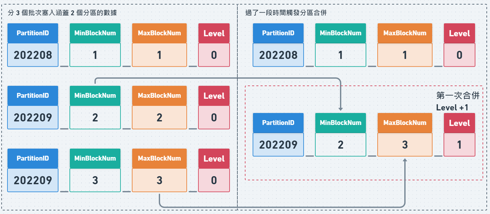
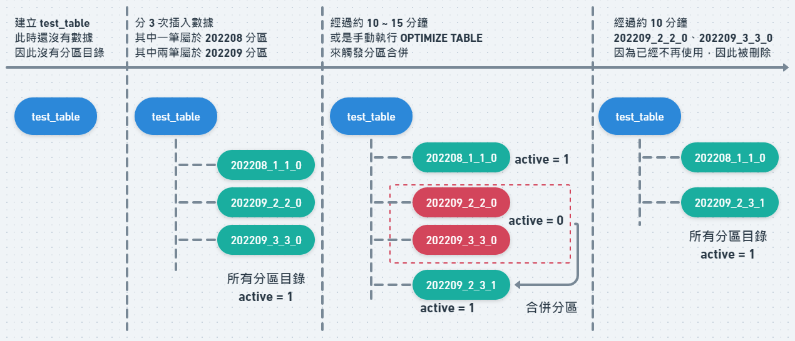

## 簡介
在 MergeTree 中會依照表上的 partition by 指定的分區鍵將 INSERT 的資料塞入到對應的分區中，不同分區的資料會分散在不同的實體目錄，在訪問數據時可以幫助 ClickHouse 盡可能少的掃描數據。

大多數的情況下不需要分區鍵，即使需要通常也不需要比月份更精細的分區鍵，過於精細的分區反而會降低效率，例如：不建議將 id  設為分區鍵，而是應該透過 order by 設為稀疏索引。

## 範例

建立一張包含分區設定的表：

```sql
CREATE DATABASE test_db;

CREATE TABLE test_db.test_table(
    id BIGINT NOT NULL,
    name String NOT NULL,
    date Datetime NOT NULL
)
ENGINE = MergeTree
PARTITION BY toYYYYMM(date)
ORDER BY (id)
SETTINGS index_granularity = 8192, index_granularity_bytes = 0;

# 查看 test_table 的分區目錄
SELECT
    partition,
    name,
    active
FROM system.parts
WHERE table = 'test_table'
0 rows in set.
```

因為表才建立還沒有塞入數據，因此看不到任何分區目錄：

```bash
➜  ~ ll /var/lib/clickhouse/data/test_db/test_table
drwxr-x--- 2 clickhouse clickhouse 6 5月  13 10:53 detached
-rw-r----- 1 clickhouse clickhouse 1 5月  13 10:53 format_version.txt
```

向表中插入新數據時，同一批次的新數據會被儲存在單獨的分區目錄：

```sql
INSERT INTO test_db.test_table VALUES
(1,'test1','2022-09-01 00:00:00'),
(2,'test2','2022-10-01 00:00:00'),
(3,'test3','2022-09-01 00:00:00');

# 查看 test_table 的分區目錄
SELECT
    partition,
    name,
    active
FROM system.parts
WHERE table = 'test_table'
┌─partition─┬─name─────────┬─active─┐
│ 202209    │ 202209_1_1_0 │      1 │
│ 202210    │ 202210_2_2_0 │      1 │
└───────────┴──────────────┴────────┘

INSERT INTO test_db.test_table VALUES
(4,'test4','2022-08-01 00:00:00'),
(5,'test5','2022-09-01 00:00:00'),
(6,'test6','2022-11-01 00:00:00');

# 查看 test_table 的分區目錄
┌─partition─┬─name─────────┬─active─┐
│ 202208    │ 202208_3_3_0 │      1 │
│ 202209    │ 202209_1_1_0 │      1 │
│ 202209    │ 202209_4_4_0 │      1 │
│ 202210    │ 202210_2_2_0 │      1 │
│ 202211    │ 202211_5_5_0 │      1 │
└───────────┴──────────────┴────────┘
```

```bash
➜  ~ ll /var/lib/clickhouse/data/test_db/test_table
# 包含 id = 1、3 的資料，此目錄 active = 1
drwxr-x--- 2 clickhouse clickhouse 4096  9月 20 14:47 202209_1_1_0
# 包含 id = 2 的資料，此目錄 active = 1
drwxr-x--- 2 clickhouse clickhouse 4096  9月 20 14:47 202210_2_2_0
# 包含 id = 4 的資料，此目錄 active = 1
drwxr-x--- 2 clickhouse clickhouse 4096  9月 20 14:47 202208_3_3_0
# 包含 id = 5 的資料，此目錄 active = 1
drwxr-x--- 2 clickhouse clickhouse 4096  9月 20 14:47 202209_4_4_0
# 包含 id = 6 的資料，此目錄 active = 1
drwxr-x--- 2 clickhouse clickhouse 4096  9月 20 14:47 202211_5_5_0
drwxr-x--- 2 clickhouse clickhouse    6  5月 13 10:53 detached
-rw-r----- 1 clickhouse clickhouse    1  5月 13 10:53 format_version.txt
```

隨後經過約 10~15 分鐘後 (或者是使用 `OPTIMIZE TABLE`) 同一分區的資料會合併到一個新的分區目錄，並且舊的分區目錄其 active 會被設為 0 不再使用：

```bash
➜  ~ ll /var/lib/clickhouse/data/test_db/test_table
# 包含 id = 1、3 的資料，此目錄 active = 0
drwxr-x--- 2 clickhouse clickhouse 4096  9月 20 14:47 202209_1_1_0
# 包含 id = 2 的資料，此目錄 active = 1
drwxr-x--- 2 clickhouse clickhouse 4096  9月 20 14:47 202210_2_2_0
# 包含 id = 4 的資料，此目錄 active = 1
drwxr-x--- 2 clickhouse clickhouse 4096  9月 20 14:47 202208_3_3_0
# 包含 id = 5 的資料，此目錄 active = 0
drwxr-x--- 2 clickhouse clickhouse 4096  9月 20 14:47 202209_4_4_0
# 包含 id = 6 的資料，此目錄 active = 1
drwxr-x--- 2 clickhouse clickhouse 4096  9月 20 14:47 202211_5_5_0
# 包含 id = 1、3、5 的資料，此目錄 active = 1
drwxr-x--- 2 clickhouse clickhouse 4096  9月 20 14:47 202209_1_4_1
drwxr-x--- 2 clickhouse clickhouse    6  5月 13 10:53 detached
-rw-r----- 1 clickhouse clickhouse    1  5月 13 10:53 format_version.txt

┌─partition─┬─name─────────┬─active─┐
│ 202208    │ 202208_3_3_0 │      1 │
│ 202209    │ 202209_1_1_0 │      0 │
│ 202209    │ 202209_1_4_1 │      1 │
│ 202209    │ 202209_4_4_0 │      0 │
│ 202210    │ 202210_2_2_0 │      1 │
│ 202211    │ 202211_5_5_0 │      1 │
└───────────┴──────────────┴────────┘
```

隨後經過約 10 分鐘後，active = 0 的分區目錄會被刪除：

```bash
➜  ~ ll /var/lib/clickhouse/data/test_db/test_table
# 包含 id = 1、3、5 的資料，此目錄 active = 1
drwxr-x--- 2 clickhouse clickhouse 4096  9月 20 14:47 202209_1_4_1
# 包含 id = 2 的資料，此目錄 active = 1
drwxr-x--- 2 clickhouse clickhouse 4096  9月 20 14:47 202210_2_2_0
# 包含 id = 4 的資料，此目錄 active = 1
drwxr-x--- 2 clickhouse clickhouse 4096  9月 20 14:47 202208_3_3_0
# 包含 id = 6 的資料，此目錄 active = 1
drwxr-x--- 2 clickhouse clickhouse 4096  9月 20 14:47 202211_5_5_0
drwxr-x--- 2 clickhouse clickhouse    6  5月 13 10:53 detached
-rw-r----- 1 clickhouse clickhouse    1  5月 13 10:53 format_version.txt
```

## 分區目錄的命名規則


- PartitionID：分區ID，為依照分區鍵計算的結果。
- MinBlockNum、MaxBlockNum：

  BlockNum 是一個以表為單位的自增值，每當新建一個分區目錄時 BlockNum 就會增長。

  因此 Min、Max 的 BlockNum 就表示該分區目錄所包含的最小和最大 BlockNum。

  對於一個新建的分區目錄 Min、Max BlockNum 會是相等的：

    ```bash
    ➜  ~ ll /var/lib/clickhouse/data/test_db/test_table
    20220920_1_1_0
    20220921_2_2_0
    20220920_3_3_0
    ```

  分區合併時才會發生分區目錄的 Min、Max BlockNum 不相同：

    ```bash
    ➜  ~ ll /var/lib/clickhouse/data/test_db/test_table
    20220920_1_3_1
    20220921_2_2_0
    
    # 原本的分區目錄 20220920_1_1_0、20220920_3_3_0 因為 PartitionID 相同，因此可以進行合併，合併之後 20220920 的 MinBlockNum = 1, MaxBlockNum = 3
    ```

- Level：分區合併的次數，對於每一個 PartitionID 所屬的分區目錄其起始值為 0。

## 分區目錄的合併過程





## 參考

[Custom Partitioning Key | ClickHouse Docs](https://clickhouse.com/docs/en/engines/table-engines/mergetree-family/custom-partitioning-key/)

[ClickHouse表引擎 1.MergeTree 建表方式与分区规则 | hnbian](https://www.hnbian.cn/posts/78f0aac1.html#toc-heading-23)

[https://github.com/ClickHouse/clickhouse-presentations/blob/master/meetup32/朱凯.ppt](https://github.com/ClickHouse/clickhouse-presentations/blob/master/meetup32/%E6%9C%B1%E5%87%AF.ppt)