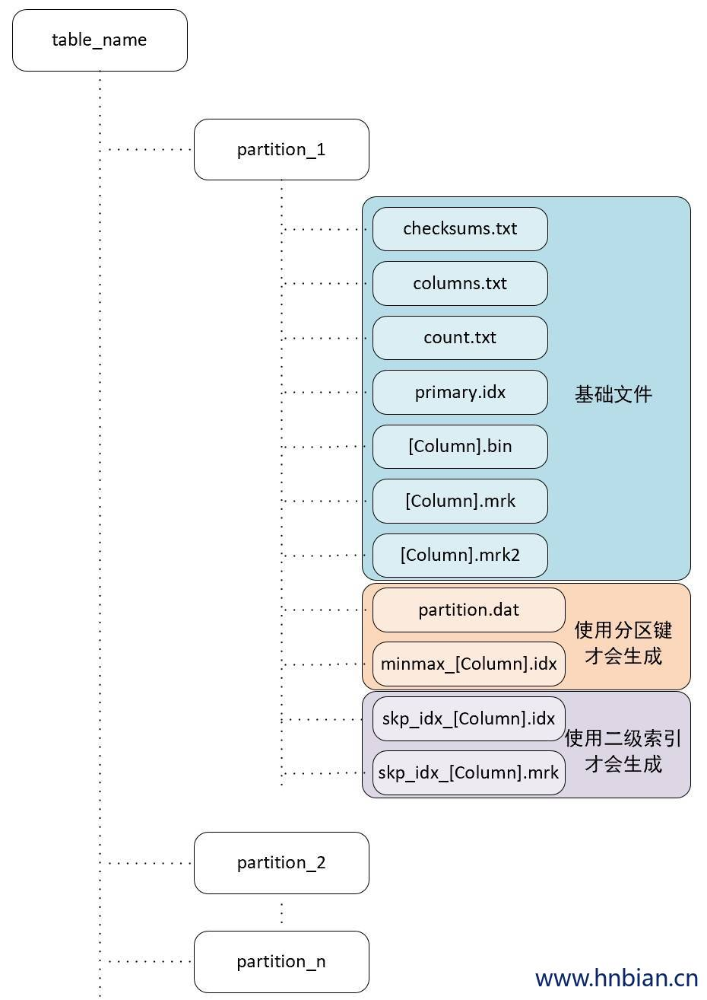

# 儲存結構



## partition dir

表內的實體檔會依照所屬的 partition 放到對應的 partition 目錄下。

## checksums.txt

二進制格式的校驗文件，儲存了該目錄下其他文件的 size 大小及 Hash 值，用來快速校驗文件的完整性和正確性。

## columns.txt

紀錄 Table 的欄位資訊，為直接使用明文紀錄，如下：

```bash
➜  ~ cat columns.txt
columns format version: 1
3 columns:
`UserID` UInt32
`URL` String
`EventTime` DateTime
```

## count.txt

以明文紀錄該 partition 下的資料總筆數，如下：

```bash

➜  ~ count.txt
1112526
```

## primary.idx

二進制格式儲存 Sparse Primary Indexes 文件。

## [column].bin

二進制數據文件，儲存該欄位的所有數據，默認使用 LZ4 壓縮格式。

由於 clickhouse 是 column-oriented 的資料庫，因此每個 column 都有一個獨立的 `.bin` 數據文件，各自紀錄屬於該 column 的所有數據。

## [column].mrk

二進制標記文件，紀錄 `primary,idx` 和 `[column].bin` 之間的映射關係。

## [column].mrk2

如果使用自適應大小索引顆粒 (adaptive index granularity) 則標記文件會以 `.mrk2` 命名，工作原理和 `mrk` 相同。

## partition.dat、minmax_[column].idx

如果使用了 `PARTITION BY` 分區鍵才會生成：

- partition.dat：二進制紀錄當前 partition 下 partition_expr 的值。
- minmax_[column].idx：二進制紀錄當前 partition 下原始數據的最小和最大值。

例如：假設 table 上定義 `PARTITION BY toYear(${column})`，在該 table 上此 column 有以下 4 個值： `2022-01-01`、`2022-06-01`、`2022-12-20` 和 `2023-02-01`，則在2022 年的 partition 目錄下

- partition.dat 會記錄 2022。
- minmax_[column].idx 會記錄 `2022-01-01`、`2022-12-20`。

## skp_idx_[column].idx、skp_idx_[column].mrk

如果在表上定義了 skipping index 才會生成：

- idx：二進制 skipping index 文件。
- mrk：二進制標記文件，紀錄 `skp_idx_[column].idx` 和 `[column].bin` 之間的映射關係。

## 參考

[ClickHouse表引擎 1.MergeTree 建表方式与分区规则 | hnbian](https://www.hnbian.cn/posts/78f0aac1.html)

[Clickhouse技术分享: 分区裁剪 | HuangZhaowei' Blog (saintbacchus.github.io)](https://saintbacchus.github.io/2021/07/15/Clickhouse%E6%8A%80%E6%9C%AF%E5%88%86%E4%BA%AB-%E5%88%86%E5%8C%BA%E8%A3%81%E5%89%AA/)

[深入浅出Clickhouse: 索引结构设计 | HuangZhaowei' Blog (saintbacchus.github.io)](https://saintbacchus.github.io/2021/08/15/%E6%B7%B1%E5%85%A5%E6%B5%85%E5%87%BAClickhouse-%E7%B4%A2%E5%BC%95%E7%BB%93%E6%9E%84%E8%AE%BE%E8%AE%A1/)