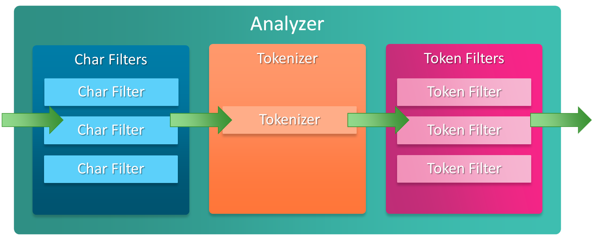

# analyzer 分詞器

## 什麼是分詞？為什麼需要分詞器？

搜尋引擎的目的是用來文本搜尋，為了更高效率的搜尋需要建立倒排索引，而建立倒排索引就需要分詞這個動作，將文本切分成一個一個的單詞並進行一些額外加工來建立高效的索引。


## Analyzer 分詞器

一個 analyzer 由以下三部分組成：

- 0...N 個 **Character Filters**：對輸入的 text 進行預處理。
- 1 個 **Tokenizer**：進行分詞。
- 0...N 個 **Token Filters**：對分詞後的結果加工。



下圖展示了 analyzer 為一個文本建立索引的過程：


### Character Filters

在將 text 傳遞給 Tokenizer 之前，會先交由 Character Filter 進行預處理。例如：去除 HTML 標籤、字串替換......等。

Elasticsearch 提供以下內建的 Character Filter：

- HTML Strip Character Filter：去除 text 中的 HTML 標籤，並使用解碼值取代 HTML 實體。

    ```bash
    GET /_analyze
    {
      "tokenizer": "keyword",
      "char_filter": [
        "html_strip"
      ],
      "text": "<p>I&apos;m so <b>happy</b>!</p>"
    }
    
    result：
    [ \nI'm so happy!\n ]
    ```

- Mapping Character Filter：將符合設定的字串替換成別的字串。

    ```bash
    GET /_analyze
    {
      "tokenizer": "keyword",
      "char_filter": [
        {
          "type": "mapping",
          "mappings": [
    				":) => _happy_",
            ":( => _sad_"
          ]
        }
      ],
      "text": "I'm delighted about it :("
    }
    
    result：
    [ I'm delighted about it _sad_ ]
    ```

- Pattern Replace Character Filter：透過正則表達式進行替換。

    ```bash
    GET /_analyze
    {
      "tokenizer": "keyword",
      "char_filter": {
          "type": "pattern_replace",
          "pattern": "(\\d+)-(?=\\d)",
          "replacement": "$1_"
        }
      ,
      "text": "My credit card is 123-456-789"
    }
    
    result：
    [ My credit card is 123_456_789 ]
    ```


### Tokenizer

接收來自 Character Filter 處理後的結果，並將其切分為一個一個 terms/tokens (通常是一個單詞)。例如：Time is money 會被切分為 [ Time, is, money ]。

Tokenizer 除了進行切分，同時還會記錄以下資訊：

- position：紀錄 terms/tokens 所在的位置順序，用於 phrase 和 word proximity Query。
- start_offset、end_offset：紀錄 terms/tokens 的開始和結束位置，用於 highlight 搜尋結果。
- type：紀錄 token type 。

```bash
GET /_analyze
{
  "text": "金钱只是一堆数字。",
  "analyzer": "ik_smart"
}

result：
{
  "tokens" : [
    {
      "token" : "金钱",
      "start_offset" : 0,
      "end_offset" : 2,
      "type" : "CN_WORD",
      "position" : 0
    },
    {
      "token" : "只是",
      "start_offset" : 2,
      "end_offset" : 4,
      "type" : "CN_WORD",
      "position" : 1
    },
    {
      "token" : "一堆",
      "start_offset" : 4,
      "end_offset" : 6,
      "type" : "CN_WORD",
      "position" : 2
    },
    {
      "token" : "数字",
      "start_offset" : 6,
      "end_offset" : 8,
      "type" : "CN_WORD",
      "position" : 3
    }
  ]
}
```

### Token Filters

接收來自 Tokenizer 的產出的 terms/tokens 並進行調整，例如：轉小寫、刪除 stopwords (停用詞)、添加 synonyms (同義詞)。

以下範例為轉小寫的 Token filter：

```bash
GET _analyze
{
  "tokenizer" : "standard",
  "filter" : ["lowercase"],
  "text" : "THE Quick FoX JUMPs"
}

result：
[ the, quick, fox, jumps ]
```

## 中文分詞

### 難點

英文本身以單詞為單位，單詞與單詞之間通常是空格、逗號和句號分隔，因此對與英文來說可以很簡單的進行分詞，例如以下例子：


---

可以看到分出了 time、is、money 這三個分詞來建立實用的索引。

但不同的是中文是以字為單位，再由多個字組成一個單詞，單詞則會連貫在一起組成句子，因此並不適用於英文的分詞方式，也因為這樣如果不使用為中文設計的分詞器，則會使用 `一元切分法` 也就是一個字單獨做為一個索引，例如以下例子：


---

上述例子中一個字做為一個單獨的索引，但使用者很可能是用 `時間` 這個單詞去搜尋，因此上述的例子查詢效率並不是很好（但適用於各種語言），因此還有一種是固定將多個字視為一個單詞－

- Lucene 提供的 CJKAnalyzer：這是一個 `二元切分法` 的分詞器，例如：時間就是金錢，這個例子會被切分為 時間、間就、就是、是金、金錢。

  

- MySQL 全文檢索中的 N-gram：透過 `ngram_token_size` 參數來決定將幾個字視為一個單詞，因此預設值 2 就等同於上方介紹的 `二元切分法`，假設將其設為 3 則時間就是金錢，這個例子會被切分為 時間就、間就是、就是金、是金錢。

雖然相較於 `一元切分法` 好了點，但還是會有許多不適用的索引，因此就有了其他專門針對中文處理的分詞器被設計出來，而我們使用搜尋引擎的時候就會需要這些中文分詞器的幫助。

### Lucene 核心 analyzer 插件

#### SmartCN

中英混合的分詞器，該分詞器針對簡體中文有較好的分詞結果，對繁體中文支援不好。

```bash
➜  ~ bin/elasticsearch-plugin install analysis-smartcn
➜  ~ systemctl restart elasticsearch
```

- 測試(展開查看)

    ```bash
    GET /_analyze
    {
      "text": "稟夫人，小人本住在蘇州的城邊，家中有屋又有田，生活樂無邊。誰知那唐伯虎，他蠻橫不留情，勾結官府目無天，占我大屋奪我田",
      "tokenizer": "smartcn_tokenizer"
    }
    ```

    ```json
    {
      "tokens" : [
        {
          "token" : "稟",
          "start_offset" : 0,
          "end_offset" : 1,
          "type" : "word",
          "position" : 0
        },
        {
          "token" : "夫人",
          "start_offset" : 1,
          "end_offset" : 3,
          "type" : "word",
          "position" : 1
        },
        {
          "token" : ",",
          "start_offset" : 3,
          "end_offset" : 4,
          "type" : "word",
          "position" : 2
        },
        {
          "token" : "小人",
          "start_offset" : 4,
          "end_offset" : 6,
          "type" : "word",
          "position" : 3
        },
        {
          "token" : "本",
          "start_offset" : 6,
          "end_offset" : 7,
          "type" : "word",
          "position" : 4
        },
        {
          "token" : "住",
          "start_offset" : 7,
          "end_offset" : 8,
          "type" : "word",
          "position" : 5
        },
        {
          "token" : "在",
          "start_offset" : 8,
          "end_offset" : 9,
          "type" : "word",
          "position" : 6
        },
        {
          "token" : "蘇",
          "start_offset" : 9,
          "end_offset" : 10,
          "type" : "word",
          "position" : 7
        },
        {
          "token" : "州",
          "start_offset" : 10,
          "end_offset" : 11,
          "type" : "word",
          "position" : 8
        },
        {
          "token" : "的",
          "start_offset" : 11,
          "end_offset" : 12,
          "type" : "word",
          "position" : 9
        },
        {
          "token" : "城",
          "start_offset" : 12,
          "end_offset" : 13,
          "type" : "word",
          "position" : 10
        },
        {
          "token" : "邊",
          "start_offset" : 13,
          "end_offset" : 14,
          "type" : "word",
          "position" : 11
        },
        {
          "token" : ",",
          "start_offset" : 14,
          "end_offset" : 15,
          "type" : "word",
          "position" : 12
        },
        {
          "token" : "家中",
          "start_offset" : 15,
          "end_offset" : 17,
          "type" : "word",
          "position" : 13
        },
        {
          "token" : "有",
          "start_offset" : 17,
          "end_offset" : 18,
          "type" : "word",
          "position" : 14
        },
        {
          "token" : "屋",
          "start_offset" : 18,
          "end_offset" : 19,
          "type" : "word",
          "position" : 15
        },
        {
          "token" : "又",
          "start_offset" : 19,
          "end_offset" : 20,
          "type" : "word",
          "position" : 16
        },
        {
          "token" : "有",
          "start_offset" : 20,
          "end_offset" : 21,
          "type" : "word",
          "position" : 17
        },
        {
          "token" : "田",
          "start_offset" : 21,
          "end_offset" : 22,
          "type" : "word",
          "position" : 18
        },
        {
          "token" : ",",
          "start_offset" : 22,
          "end_offset" : 23,
          "type" : "word",
          "position" : 19
        },
        {
          "token" : "生活",
          "start_offset" : 23,
          "end_offset" : 25,
          "type" : "word",
          "position" : 20
        },
        {
          "token" : "樂",
          "start_offset" : 25,
          "end_offset" : 26,
          "type" : "word",
          "position" : 21
        },
        {
          "token" : "無",
          "start_offset" : 26,
          "end_offset" : 27,
          "type" : "word",
          "position" : 22
        },
        {
          "token" : "邊",
          "start_offset" : 27,
          "end_offset" : 28,
          "type" : "word",
          "position" : 23
        },
        {
          "token" : ",",
          "start_offset" : 28,
          "end_offset" : 29,
          "type" : "word",
          "position" : 24
        },
        {
          "token" : "誰",
          "start_offset" : 29,
          "end_offset" : 30,
          "type" : "word",
          "position" : 25
        },
        {
          "token" : "知",
          "start_offset" : 30,
          "end_offset" : 31,
          "type" : "word",
          "position" : 26
        },
        {
          "token" : "那",
          "start_offset" : 31,
          "end_offset" : 32,
          "type" : "word",
          "position" : 27
        },
        {
          "token" : "唐",
          "start_offset" : 32,
          "end_offset" : 33,
          "type" : "word",
          "position" : 28
        },
        {
          "token" : "伯",
          "start_offset" : 33,
          "end_offset" : 34,
          "type" : "word",
          "position" : 29
        },
        {
          "token" : "虎",
          "start_offset" : 34,
          "end_offset" : 35,
          "type" : "word",
          "position" : 30
        },
        {
          "token" : ",",
          "start_offset" : 35,
          "end_offset" : 36,
          "type" : "word",
          "position" : 31
        },
        {
          "token" : "他",
          "start_offset" : 36,
          "end_offset" : 37,
          "type" : "word",
          "position" : 32
        },
        {
          "token" : "蠻",
          "start_offset" : 37,
          "end_offset" : 38,
          "type" : "word",
          "position" : 33
        },
        {
          "token" : "橫",
          "start_offset" : 38,
          "end_offset" : 39,
          "type" : "word",
          "position" : 34
        },
        {
          "token" : "不",
          "start_offset" : 39,
          "end_offset" : 40,
          "type" : "word",
          "position" : 35
        },
        {
          "token" : "留",
          "start_offset" : 40,
          "end_offset" : 41,
          "type" : "word",
          "position" : 36
        },
        {
          "token" : "情",
          "start_offset" : 41,
          "end_offset" : 42,
          "type" : "word",
          "position" : 37
        },
        {
          "token" : ",",
          "start_offset" : 42,
          "end_offset" : 43,
          "type" : "word",
          "position" : 38
        },
        {
          "token" : "勾",
          "start_offset" : 43,
          "end_offset" : 44,
          "type" : "word",
          "position" : 39
        },
        {
          "token" : "結",
          "start_offset" : 44,
          "end_offset" : 45,
          "type" : "word",
          "position" : 40
        },
        {
          "token" : "官府",
          "start_offset" : 45,
          "end_offset" : 47,
          "type" : "word",
          "position" : 41
        },
        {
          "token" : "目",
          "start_offset" : 47,
          "end_offset" : 48,
          "type" : "word",
          "position" : 42
        },
        {
          "token" : "無",
          "start_offset" : 48,
          "end_offset" : 49,
          "type" : "word",
          "position" : 43
        },
        {
          "token" : "天",
          "start_offset" : 49,
          "end_offset" : 50,
          "type" : "word",
          "position" : 44
        },
        {
          "token" : ",",
          "start_offset" : 50,
          "end_offset" : 51,
          "type" : "word",
          "position" : 45
        },
        {
          "token" : "占",
          "start_offset" : 51,
          "end_offset" : 52,
          "type" : "word",
          "position" : 46
        },
        {
          "token" : "我",
          "start_offset" : 52,
          "end_offset" : 53,
          "type" : "word",
          "position" : 47
        },
        {
          "token" : "大",
          "start_offset" : 53,
          "end_offset" : 54,
          "type" : "word",
          "position" : 48
        },
        {
          "token" : "屋",
          "start_offset" : 54,
          "end_offset" : 55,
          "type" : "word",
          "position" : 49
        },
        {
          "token" : "奪",
          "start_offset" : 55,
          "end_offset" : 56,
          "type" : "word",
          "position" : 50
        },
        {
          "token" : "我",
          "start_offset" : 56,
          "end_offset" : 57,
          "type" : "word",
          "position" : 51
        },
        {
          "token" : "田",
          "start_offset" : 57,
          "end_offset" : 58,
          "type" : "word",
          "position" : 52
        }
      ]
    }
    ```


#### ICU

添加 ICU libraries 擴展對 unicode 支持，並能更好的分析亞洲語言，對於繁體中文分詞來說效果比 SmartCN 好很多。

```bash
➜  ~ bin/elasticsearch-plugin install analysis-icu
➜  ~ systemctl restart elasticsearch
```

- 測試

    ```bash
    GET /_analyze
    {
      "text": "稟夫人，小人本住在蘇州的城邊，家中有屋又有田，生活樂無邊。誰知那唐伯虎，他蠻橫不留情，勾結官府目無天，占我大屋奪我田",
      "tokenizer": "icu_tokenizer"
    }
    ```

    ```json
    {
      "tokens" : [
        {
          "token" : "稟",
          "start_offset" : 0,
          "end_offset" : 1,
          "type" : "<IDEOGRAPHIC>",
          "position" : 0
        },
        {
          "token" : "夫人",
          "start_offset" : 1,
          "end_offset" : 3,
          "type" : "<IDEOGRAPHIC>",
          "position" : 1
        },
        {
          "token" : "小人",
          "start_offset" : 4,
          "end_offset" : 6,
          "type" : "<IDEOGRAPHIC>",
          "position" : 2
        },
        {
          "token" : "本",
          "start_offset" : 6,
          "end_offset" : 7,
          "type" : "<IDEOGRAPHIC>",
          "position" : 3
        },
        {
          "token" : "住在",
          "start_offset" : 7,
          "end_offset" : 9,
          "type" : "<IDEOGRAPHIC>",
          "position" : 4
        },
        {
          "token" : "蘇州",
          "start_offset" : 9,
          "end_offset" : 11,
          "type" : "<IDEOGRAPHIC>",
          "position" : 5
        },
        {
          "token" : "的",
          "start_offset" : 11,
          "end_offset" : 12,
          "type" : "<IDEOGRAPHIC>",
          "position" : 6
        },
        {
          "token" : "城",
          "start_offset" : 12,
          "end_offset" : 13,
          "type" : "<IDEOGRAPHIC>",
          "position" : 7
        },
        {
          "token" : "邊",
          "start_offset" : 13,
          "end_offset" : 14,
          "type" : "<IDEOGRAPHIC>",
          "position" : 8
        },
        {
          "token" : "家中",
          "start_offset" : 15,
          "end_offset" : 17,
          "type" : "<IDEOGRAPHIC>",
          "position" : 9
        },
        {
          "token" : "有",
          "start_offset" : 17,
          "end_offset" : 18,
          "type" : "<IDEOGRAPHIC>",
          "position" : 10
        },
        {
          "token" : "屋",
          "start_offset" : 18,
          "end_offset" : 19,
          "type" : "<IDEOGRAPHIC>",
          "position" : 11
        },
        {
          "token" : "又有",
          "start_offset" : 19,
          "end_offset" : 21,
          "type" : "<IDEOGRAPHIC>",
          "position" : 12
        },
        {
          "token" : "田",
          "start_offset" : 21,
          "end_offset" : 22,
          "type" : "<IDEOGRAPHIC>",
          "position" : 13
        },
        {
          "token" : "生活",
          "start_offset" : 23,
          "end_offset" : 25,
          "type" : "<IDEOGRAPHIC>",
          "position" : 14
        },
        {
          "token" : "樂",
          "start_offset" : 25,
          "end_offset" : 26,
          "type" : "<IDEOGRAPHIC>",
          "position" : 15
        },
        {
          "token" : "無邊",
          "start_offset" : 26,
          "end_offset" : 28,
          "type" : "<IDEOGRAPHIC>",
          "position" : 16
        },
        {
          "token" : "誰",
          "start_offset" : 29,
          "end_offset" : 30,
          "type" : "<IDEOGRAPHIC>",
          "position" : 17
        },
        {
          "token" : "知",
          "start_offset" : 30,
          "end_offset" : 31,
          "type" : "<IDEOGRAPHIC>",
          "position" : 18
        },
        {
          "token" : "那",
          "start_offset" : 31,
          "end_offset" : 32,
          "type" : "<IDEOGRAPHIC>",
          "position" : 19
        },
        {
          "token" : "唐伯虎",
          "start_offset" : 32,
          "end_offset" : 35,
          "type" : "<IDEOGRAPHIC>",
          "position" : 20
        },
        {
          "token" : "他",
          "start_offset" : 36,
          "end_offset" : 37,
          "type" : "<IDEOGRAPHIC>",
          "position" : 21
        },
        {
          "token" : "蠻橫",
          "start_offset" : 37,
          "end_offset" : 39,
          "type" : "<IDEOGRAPHIC>",
          "position" : 22
        },
        {
          "token" : "不留情",
          "start_offset" : 39,
          "end_offset" : 42,
          "type" : "<IDEOGRAPHIC>",
          "position" : 23
        },
        {
          "token" : "勾結",
          "start_offset" : 43,
          "end_offset" : 45,
          "type" : "<IDEOGRAPHIC>",
          "position" : 24
        },
        {
          "token" : "官府",
          "start_offset" : 45,
          "end_offset" : 47,
          "type" : "<IDEOGRAPHIC>",
          "position" : 25
        },
        {
          "token" : "目",
          "start_offset" : 47,
          "end_offset" : 48,
          "type" : "<IDEOGRAPHIC>",
          "position" : 26
        },
        {
          "token" : "無",
          "start_offset" : 48,
          "end_offset" : 49,
          "type" : "<IDEOGRAPHIC>",
          "position" : 27
        },
        {
          "token" : "天",
          "start_offset" : 49,
          "end_offset" : 50,
          "type" : "<IDEOGRAPHIC>",
          "position" : 28
        },
        {
          "token" : "占",
          "start_offset" : 51,
          "end_offset" : 52,
          "type" : "<IDEOGRAPHIC>",
          "position" : 29
        },
        {
          "token" : "我",
          "start_offset" : 52,
          "end_offset" : 53,
          "type" : "<IDEOGRAPHIC>",
          "position" : 30
        },
        {
          "token" : "大屋",
          "start_offset" : 53,
          "end_offset" : 55,
          "type" : "<IDEOGRAPHIC>",
          "position" : 31
        },
        {
          "token" : "奪",
          "start_offset" : 55,
          "end_offset" : 56,
          "type" : "<IDEOGRAPHIC>",
          "position" : 32
        },
        {
          "token" : "我",
          "start_offset" : 56,
          "end_offset" : 57,
          "type" : "<IDEOGRAPHIC>",
          "position" : 33
        },
        {
          "token" : "田",
          "start_offset" : 57,
          "end_offset" : 58,
          "type" : "<IDEOGRAPHIC>",
          "position" : 34
        }
      ]
    }
    ```


### 社群貢獻 analyzer 插件

#### ik

[https://github.com/medcl/elasticsearch-analysis-ik](https://github.com/medcl/elasticsearch-analysis-ik)

IK 是社群非常活躍的中文分詞，基本上搜尋中文分詞大部分都會推薦 IK。

不過測試發現 ik 主要也是針對簡體中文的，例如：繁體 `金錢` 使用 IK 會被拆分為 `金`、`錢`，只有簡體的 `金钱` 會被視為一個 token。

不過這方面  [**ik-analyzer-solr**](https://github.com/magese/ik-analyzer-solr) 因為還擴充了其他詞庫，所以效果是優於 [**elasticsearch-analysis-ik**](https://github.com/medcl/elasticsearch-analysis-ik)。

```bash
➜  ~ cd /usr/share/elasticsearch/plugins
➜  ~ mkdir analysis-ik
➜  ~ cd analysis-ik
# 安裝 unzip 用來解壓縮 zip
➜  ~ yum install -y unzip
# 下載並解壓縮
➜  ~ wget https://github.com/medcl/elasticsearch-analysis-ik/releases/download/v7.15.2/elasticsearch-analysis-ik-7.15.2.zip
➜  ~ unzip elasticsearch-analysis-ik-7.15.2.zip
➜  ~ rm elasticsearch-analysis-ik-7.15.2.zip
# 重啟 elastic 
➜  ~ systemctl restart elasticsearch
```

- 測試

    ```json
    GET /_analyze
    {
      "text": "稟夫人，小人本住在蘇州的城邊，家中有屋又有田，生活樂無邊。誰知那唐伯虎，他蠻橫不留情，勾結官府目無天，占我大屋奪我田",
      "tokenizer": "ik_max_word"
    }
    ```

    ```json
    {
      "tokens" : [
        {
          "token" : "稟",
          "start_offset" : 0,
          "end_offset" : 1,
          "type" : "CN_CHAR",
          "position" : 0
        },
        {
          "token" : "夫人",
          "start_offset" : 1,
          "end_offset" : 3,
          "type" : "CN_WORD",
          "position" : 1
        },
        {
          "token" : "小人",
          "start_offset" : 4,
          "end_offset" : 6,
          "type" : "CN_WORD",
          "position" : 2
        },
        {
          "token" : "人本",
          "start_offset" : 5,
          "end_offset" : 7,
          "type" : "CN_WORD",
          "position" : 3
        },
        {
          "token" : "住在",
          "start_offset" : 7,
          "end_offset" : 9,
          "type" : "CN_WORD",
          "position" : 4
        },
        {
          "token" : "蘇",
          "start_offset" : 9,
          "end_offset" : 10,
          "type" : "CN_CHAR",
          "position" : 5
        },
        {
          "token" : "州",
          "start_offset" : 10,
          "end_offset" : 11,
          "type" : "CN_CHAR",
          "position" : 6
        },
        {
          "token" : "的",
          "start_offset" : 11,
          "end_offset" : 12,
          "type" : "CN_CHAR",
          "position" : 7
        },
        {
          "token" : "城",
          "start_offset" : 12,
          "end_offset" : 13,
          "type" : "CN_CHAR",
          "position" : 8
        },
        {
          "token" : "邊",
          "start_offset" : 13,
          "end_offset" : 14,
          "type" : "CN_CHAR",
          "position" : 9
        },
        {
          "token" : "家中",
          "start_offset" : 15,
          "end_offset" : 17,
          "type" : "CN_WORD",
          "position" : 10
        },
        {
          "token" : "中有",
          "start_offset" : 16,
          "end_offset" : 18,
          "type" : "CN_WORD",
          "position" : 11
        },
        {
          "token" : "屋",
          "start_offset" : 18,
          "end_offset" : 19,
          "type" : "CN_CHAR",
          "position" : 12
        },
        {
          "token" : "又有",
          "start_offset" : 19,
          "end_offset" : 21,
          "type" : "CN_WORD",
          "position" : 13
        },
        {
          "token" : "田",
          "start_offset" : 21,
          "end_offset" : 22,
          "type" : "CN_CHAR",
          "position" : 14
        },
        {
          "token" : "生活",
          "start_offset" : 23,
          "end_offset" : 25,
          "type" : "CN_WORD",
          "position" : 15
        },
        {
          "token" : "樂",
          "start_offset" : 25,
          "end_offset" : 26,
          "type" : "CN_CHAR",
          "position" : 16
        },
        {
          "token" : "無",
          "start_offset" : 26,
          "end_offset" : 27,
          "type" : "CN_CHAR",
          "position" : 17
        },
        {
          "token" : "邊",
          "start_offset" : 27,
          "end_offset" : 28,
          "type" : "CN_CHAR",
          "position" : 18
        },
        {
          "token" : "誰",
          "start_offset" : 29,
          "end_offset" : 30,
          "type" : "CN_CHAR",
          "position" : 19
        },
        {
          "token" : "知",
          "start_offset" : 30,
          "end_offset" : 31,
          "type" : "CN_CHAR",
          "position" : 20
        },
        {
          "token" : "那",
          "start_offset" : 31,
          "end_offset" : 32,
          "type" : "CN_CHAR",
          "position" : 21
        },
        {
          "token" : "唐伯虎",
          "start_offset" : 32,
          "end_offset" : 35,
          "type" : "CN_WORD",
          "position" : 22
        },
        {
          "token" : "他",
          "start_offset" : 36,
          "end_offset" : 37,
          "type" : "CN_CHAR",
          "position" : 23
        },
        {
          "token" : "蠻",
          "start_offset" : 37,
          "end_offset" : 38,
          "type" : "CN_CHAR",
          "position" : 24
        },
        {
          "token" : "橫",
          "start_offset" : 38,
          "end_offset" : 39,
          "type" : "CN_CHAR",
          "position" : 25
        },
        {
          "token" : "不留情",
          "start_offset" : 39,
          "end_offset" : 42,
          "type" : "CN_WORD",
          "position" : 26
        },
        {
          "token" : "不留",
          "start_offset" : 39,
          "end_offset" : 41,
          "type" : "CN_WORD",
          "position" : 27
        },
        {
          "token" : "留情",
          "start_offset" : 40,
          "end_offset" : 42,
          "type" : "CN_WORD",
          "position" : 28
        },
        {
          "token" : "勾",
          "start_offset" : 43,
          "end_offset" : 44,
          "type" : "CN_CHAR",
          "position" : 29
        },
        {
          "token" : "結",
          "start_offset" : 44,
          "end_offset" : 45,
          "type" : "CN_CHAR",
          "position" : 30
        },
        {
          "token" : "官府",
          "start_offset" : 45,
          "end_offset" : 47,
          "type" : "CN_WORD",
          "position" : 31
        },
        {
          "token" : "目",
          "start_offset" : 47,
          "end_offset" : 48,
          "type" : "CN_CHAR",
          "position" : 32
        },
        {
          "token" : "無",
          "start_offset" : 48,
          "end_offset" : 49,
          "type" : "CN_CHAR",
          "position" : 33
        },
        {
          "token" : "天",
          "start_offset" : 49,
          "end_offset" : 50,
          "type" : "CN_CHAR",
          "position" : 34
        },
        {
          "token" : "占",
          "start_offset" : 51,
          "end_offset" : 52,
          "type" : "CN_CHAR",
          "position" : 35
        },
        {
          "token" : "我",
          "start_offset" : 52,
          "end_offset" : 53,
          "type" : "CN_CHAR",
          "position" : 36
        },
        {
          "token" : "大屋",
          "start_offset" : 53,
          "end_offset" : 55,
          "type" : "CN_WORD",
          "position" : 37
        },
        {
          "token" : "奪",
          "start_offset" : 55,
          "end_offset" : 56,
          "type" : "CN_CHAR",
          "position" : 38
        },
        {
          "token" : "我",
          "start_offset" : 56,
          "end_offset" : 57,
          "type" : "CN_CHAR",
          "position" : 39
        },
        {
          "token" : "田",
          "start_offset" : 57,
          "end_offset" : 58,
          "type" : "CN_CHAR",
          "position" : 40
        }
      ]
    }
    ```


#### stconvert

[https://github.com/medcl/elasticsearch-analysis-stconvert](https://github.com/medcl/elasticsearch-analysis-stconvert)

嚴格來說這只是一個 filter，因為 stconvert 不會進行分詞的動作，他只會將字進行繁簡轉換。

```bash
➜  ~ cd /usr/share/elasticsearch/plugins
➜  ~ mkdir analysis-stconvert
➜  ~ cd analysis-stconvert
➜  ~ wget https://github.com/medcl/elasticsearch-analysis-stconvert/releases/download/v7.15.2/elasticsearch-analysis-stconvert-7.15.2.zip
➜  ~ unzip elasticsearch-analysis-stconvert-7.15.2.zip
➜  ~ systemctl restart elasticsearch
```

- 測試

    ```json
    PUT /stconvert/
    {
        "settings" : {
            "analysis" : {
                "analyzer" : {
                    "tsconvert" : {
                        "tokenizer" : "tsconvert"
                        }
                },
                "tokenizer" : {
                    "tsconvert" : {
                        "type" : "stconvert",
                        "delimiter" : "#",
                        "keep_both" : false,
                        "convert_type" : "t2s"
                    }
                },   
                 "filter": {
                   "tsconvert" : {
                         "type" : "stconvert",
                         "delimiter" : "#",
                         "keep_both" : false,
                         "convert_type" : "t2s"
                     }
                 },
                "char_filter" : {
                    "tsconvert" : {
                        "type" : "stconvert",
                        "convert_type" : "t2s"
                    }
                }
            }
        }
    }
    
    GET /stconvert/_analyze
    {
      "text":  "稟夫人，小人本住在蘇州的城邊， 家中有屋又有田，生活樂無邊。",
      "analyzer": "tsconvert"
    }
    ```

    ```json
    {
      "tokens" : [
        {
          "token" : "禀夫人，小人本住在苏州的城边， 家中有屋又有田，生活乐无边。",
          "start_offset" : 0,
          "end_offset" : 30,
          "type" : "word",
          "position" : 0
        }
      ]
    }
    ```


#### jieba

[https://github.com/sing1ee/elasticsearch-jieba-plugin](https://github.com/sing1ee/elasticsearch-jieba-plugin)

支援繁體中文，但文檔不友善。

在 github https://github.com/fxsjy/jieba 上也有提供對繁體分詞更好的字典。

```bash
# 安裝 gradle
wget https://services.gradle.org/distributions/gradle-7.3.1-bin.zip
mkdir /opt/gradle
unzip ./gradle-7.3.1-bin.zip -d /opt/gradle
export PATH=$PATH:/opt/gradle/gradle-7.3.1/bin

# clone 此步驟需要配置 github sshkey
➜  ~ git clone https://github.com/sing1ee/elasticsearch-jieba-plugin.git --recursive
➜  ~ cd elasticsearch-jieba-plugin
➜  ~ git submodule foreach --recursive git checkout master

# 根據 elasticsearch 版本調整設定檔內的版本號
➜  ~ vim build.gradle
version = '7.15.2' // 适配不通版本的ES，可以修改这里。
implementation 'org.elasticsearch:elasticsearch:7.15.2' // 适配不通版本的ES，可以修改这里。
➜  ~ vim ./src/main/resources/plugin-descriptor.properties
# 'version': plugin's version
version=7.15.2
# 'elasticsearch.version' version of elasticsearch compiled against
elasticsearch.version=7.15.2

# 使用 gradle 打包
➜  ~ gradle wrapper
BUILD SUCCESSFUL in 1s
1 actionable task: 1 executed
➜  ~ ./gradlew pz
BUILD SUCCESSFUL in 32s
7 actionable tasks: 7 executed

# 解壓縮打包檔
➜  ~ ls ./build/distributions/
elasticsearch-jieba-plugin-7.15.2.zip
➜  ~ unzip ./build/distributions/elasticsearch-jieba-plugin-7.15.2.zip -d /usr/share/elasticsearch/plugins/

# 重啟 elasticserach
➜  ~ systemctl restart elasticsearch
```

- 測試

    ```bash
    GET /_analyze
    {
      "text": "時間就是金錢，金錢只是一堆數字",
      "analyzer": "jieba_index"
    }
    ```

    ```bash
    {
      "tokens" : [
        {
          "token" : "時間",
          "start_offset" : 0,
          "end_offset" : 2,
          "type" : "word",
          "position" : 0
        },
        {
          "token" : "就是",
          "start_offset" : 2,
          "end_offset" : 4,
          "type" : "word",
          "position" : 1
        },
        {
          "token" : "金錢",
          "start_offset" : 4,
          "end_offset" : 6,
          "type" : "word",
          "position" : 2
        },
        {
          "token" : "，",
          "start_offset" : 6,
          "end_offset" : 7,
          "type" : "word",
          "position" : 3
        },
        {
          "token" : "金錢",
          "start_offset" : 7,
          "end_offset" : 9,
          "type" : "word",
          "position" : 4
        },
        {
          "token" : "只是",
          "start_offset" : 9,
          "end_offset" : 11,
          "type" : "word",
          "position" : 5
        },
        {
          "token" : "一堆",
          "start_offset" : 11,
          "end_offset" : 13,
          "type" : "word",
          "position" : 6
        },
        {
          "token" : "數字",
          "start_offset" : 13,
          "end_offset" : 15,
          "type" : "word",
          "position" : 7
        }
      ]
    }
    ```


#### THULAC

[https://github.com/microbun/elasticsearch-thulac-plugin](https://github.com/microbun/elasticsearch-thulac-plugin)

由清華大學自然語言處理與社會人文計算實驗室研製的一套中文詞法分析工具包。

到[官方 demo](http://thulac.thunlp.org/demo) 試用了一下，可以發現就算是繁體中文效果也非常好：


不過看了一下 PRO 版本是需要提交申請書的，所以只能用 Lite 版本將就一下了

- Elasticsearch Lite 版本測試結果，雖然沒有 PRO 那麼厲害，但是效果還可以。(展開查看)

    ```bash
    GET /_analyze
    {
      "text": "稟夫人，小人本住在蘇州的城邊， 家中有屋又有田，生活樂無邊。誰知那唐伯虎，他蠻橫不留情，勾結官府目無天，占我大屋奪我田。我爺爺跟他來翻臉，慘被他一棍來打扁， 我奶奶罵他欺騙善民，反被他捉進了唐府， 強姦了一百遍，一百遍，最後她懸樑自盡遺恨人間。 他還將我父子，逐出了家園，流落到江邊。我為求養老爹，只有獨自行乞在廟前。誰知那唐伯虎，他實在太陰險 知道此情形，竟派人來暗算，把我父子狂毆在市前，小人身壯健，殘命得留存，可憐老父他魂歸天!此恨更難填。為求葬老爹，唯有賣身為奴自作賤， 一面勤賺錢，一面讀書篇， 發誓把功名顯，手刃仇人意志堅! 從此唐寅詩集伴身邊，我銘記此仇不共戴天!!!",
      "tokenizer": "thulac"
    }
    ```

    ```bash
    {
      "tokens" : [
        {
          "token" : "稟",
          "start_offset" : 0,
          "end_offset" : 1,
          "type" : "word",
          "position" : 0
        },
        {
          "token" : "夫人",
          "start_offset" : 1,
          "end_offset" : 3,
          "type" : "word",
          "position" : 1
        },
        {
          "token" : "，",
          "start_offset" : 3,
          "end_offset" : 4,
          "type" : "word",
          "position" : 2
        },
        {
          "token" : "小人本",
          "start_offset" : 4,
          "end_offset" : 7,
          "type" : "word",
          "position" : 3
        },
        {
          "token" : "住",
          "start_offset" : 7,
          "end_offset" : 8,
          "type" : "word",
          "position" : 4
        },
        {
          "token" : "在",
          "start_offset" : 8,
          "end_offset" : 9,
          "type" : "word",
          "position" : 5
        },
        {
          "token" : "蘇州",
          "start_offset" : 9,
          "end_offset" : 11,
          "type" : "word",
          "position" : 6
        },
        {
          "token" : "的",
          "start_offset" : 11,
          "end_offset" : 12,
          "type" : "word",
          "position" : 7
        },
        {
          "token" : "城邊",
          "start_offset" : 12,
          "end_offset" : 14,
          "type" : "word",
          "position" : 8
        },
        {
          "token" : "，",
          "start_offset" : 14,
          "end_offset" : 15,
          "type" : "word",
          "position" : 9
        },
        {
          "token" : "家中",
          "start_offset" : 15,
          "end_offset" : 17,
          "type" : "word",
          "position" : 10
        },
        {
          "token" : "有",
          "start_offset" : 17,
          "end_offset" : 18,
          "type" : "word",
          "position" : 11
        },
        {
          "token" : "屋",
          "start_offset" : 18,
          "end_offset" : 19,
          "type" : "word",
          "position" : 12
        },
        {
          "token" : "又",
          "start_offset" : 19,
          "end_offset" : 20,
          "type" : "word",
          "position" : 13
        },
        {
          "token" : "有",
          "start_offset" : 20,
          "end_offset" : 21,
          "type" : "word",
          "position" : 14
        },
        {
          "token" : "田",
          "start_offset" : 21,
          "end_offset" : 22,
          "type" : "word",
          "position" : 15
        },
        {
          "token" : "，",
          "start_offset" : 22,
          "end_offset" : 23,
          "type" : "word",
          "position" : 16
        },
        {
          "token" : "生活",
          "start_offset" : 23,
          "end_offset" : 25,
          "type" : "word",
          "position" : 17
        },
        {
          "token" : "樂無邊",
          "start_offset" : 25,
          "end_offset" : 28,
          "type" : "word",
          "position" : 18
        },
        {
          "token" : "。",
          "start_offset" : 28,
          "end_offset" : 29,
          "type" : "word",
          "position" : 19
        },
        {
          "token" : "誰知",
          "start_offset" : 29,
          "end_offset" : 31,
          "type" : "word",
          "position" : 20
        },
        {
          "token" : "那",
          "start_offset" : 31,
          "end_offset" : 32,
          "type" : "word",
          "position" : 21
        },
        {
          "token" : "唐伯虎",
          "start_offset" : 32,
          "end_offset" : 35,
          "type" : "word",
          "position" : 22
        },
        {
          "token" : "，",
          "start_offset" : 35,
          "end_offset" : 36,
          "type" : "word",
          "position" : 23
        },
        {
          "token" : "他",
          "start_offset" : 36,
          "end_offset" : 37,
          "type" : "word",
          "position" : 24
        },
        {
          "token" : "蠻橫不留情",
          "start_offset" : 37,
          "end_offset" : 42,
          "type" : "word",
          "position" : 25
        },
        {
          "token" : "，",
          "start_offset" : 42,
          "end_offset" : 43,
          "type" : "word",
          "position" : 26
        },
        {
          "token" : "勾結",
          "start_offset" : 43,
          "end_offset" : 45,
          "type" : "word",
          "position" : 27
        },
        {
          "token" : "官府",
          "start_offset" : 45,
          "end_offset" : 47,
          "type" : "word",
          "position" : 28
        },
        {
          "token" : "目無天",
          "start_offset" : 47,
          "end_offset" : 50,
          "type" : "word",
          "position" : 29
        },
        {
          "token" : "，",
          "start_offset" : 50,
          "end_offset" : 51,
          "type" : "word",
          "position" : 30
        },
        {
          "token" : "占",
          "start_offset" : 51,
          "end_offset" : 52,
          "type" : "word",
          "position" : 31
        },
        {
          "token" : "我",
          "start_offset" : 52,
          "end_offset" : 53,
          "type" : "word",
          "position" : 32
        },
        {
          "token" : "大",
          "start_offset" : 53,
          "end_offset" : 54,
          "type" : "word",
          "position" : 33
        },
        {
          "token" : "屋奪",
          "start_offset" : 54,
          "end_offset" : 56,
          "type" : "word",
          "position" : 34
        },
        {
          "token" : "我",
          "start_offset" : 56,
          "end_offset" : 57,
          "type" : "word",
          "position" : 35
        },
        {
          "token" : "田",
          "start_offset" : 57,
          "end_offset" : 58,
          "type" : "word",
          "position" : 36
        },
        {
          "token" : "。",
          "start_offset" : 58,
          "end_offset" : 59,
          "type" : "word",
          "position" : 37
        },
        {
          "token" : "我",
          "start_offset" : 59,
          "end_offset" : 60,
          "type" : "word",
          "position" : 38
        },
        {
          "token" : "爺爺",
          "start_offset" : 60,
          "end_offset" : 62,
          "type" : "word",
          "position" : 39
        },
        {
          "token" : "跟",
          "start_offset" : 62,
          "end_offset" : 63,
          "type" : "word",
          "position" : 40
        },
        {
          "token" : "他",
          "start_offset" : 63,
          "end_offset" : 64,
          "type" : "word",
          "position" : 41
        },
        {
          "token" : "來",
          "start_offset" : 64,
          "end_offset" : 65,
          "type" : "word",
          "position" : 42
        },
        {
          "token" : "翻臉",
          "start_offset" : 65,
          "end_offset" : 67,
          "type" : "word",
          "position" : 43
        },
        {
          "token" : "，",
          "start_offset" : 67,
          "end_offset" : 68,
          "type" : "word",
          "position" : 44
        },
        {
          "token" : "慘",
          "start_offset" : 68,
          "end_offset" : 69,
          "type" : "word",
          "position" : 45
        },
        {
          "token" : "被",
          "start_offset" : 69,
          "end_offset" : 70,
          "type" : "word",
          "position" : 46
        },
        {
          "token" : "他",
          "start_offset" : 70,
          "end_offset" : 71,
          "type" : "word",
          "position" : 47
        },
        {
          "token" : "一棍來",
          "start_offset" : 71,
          "end_offset" : 74,
          "type" : "word",
          "position" : 48
        },
        {
          "token" : "打扁",
          "start_offset" : 74,
          "end_offset" : 76,
          "type" : "word",
          "position" : 49
        },
        {
          "token" : "，",
          "start_offset" : 76,
          "end_offset" : 77,
          "type" : "word",
          "position" : 50
        },
        {
          "token" : "我",
          "start_offset" : 77,
          "end_offset" : 78,
          "type" : "word",
          "position" : 51
        },
        {
          "token" : "奶奶",
          "start_offset" : 78,
          "end_offset" : 80,
          "type" : "word",
          "position" : 52
        },
        {
          "token" : "罵",
          "start_offset" : 80,
          "end_offset" : 81,
          "type" : "word",
          "position" : 53
        },
        {
          "token" : "他",
          "start_offset" : 81,
          "end_offset" : 82,
          "type" : "word",
          "position" : 54
        },
        {
          "token" : "欺騙善民",
          "start_offset" : 82,
          "end_offset" : 86,
          "type" : "word",
          "position" : 55
        },
        {
          "token" : "，",
          "start_offset" : 86,
          "end_offset" : 87,
          "type" : "word",
          "position" : 56
        },
        {
          "token" : "反",
          "start_offset" : 87,
          "end_offset" : 88,
          "type" : "word",
          "position" : 57
        },
        {
          "token" : "被",
          "start_offset" : 88,
          "end_offset" : 89,
          "type" : "word",
          "position" : 58
        },
        {
          "token" : "他",
          "start_offset" : 89,
          "end_offset" : 90,
          "type" : "word",
          "position" : 59
        },
        {
          "token" : "捉進",
          "start_offset" : 90,
          "end_offset" : 92,
          "type" : "word",
          "position" : 60
        },
        {
          "token" : "了",
          "start_offset" : 92,
          "end_offset" : 93,
          "type" : "word",
          "position" : 61
        },
        {
          "token" : "唐府",
          "start_offset" : 93,
          "end_offset" : 95,
          "type" : "word",
          "position" : 62
        },
        {
          "token" : "，",
          "start_offset" : 95,
          "end_offset" : 96,
          "type" : "word",
          "position" : 63
        },
        {
          "token" : "強姦",
          "start_offset" : 96,
          "end_offset" : 98,
          "type" : "word",
          "position" : 64
        },
        {
          "token" : "了",
          "start_offset" : 98,
          "end_offset" : 99,
          "type" : "word",
          "position" : 65
        },
        {
          "token" : "一百",
          "start_offset" : 99,
          "end_offset" : 101,
          "type" : "word",
          "position" : 66
        },
        {
          "token" : "遍",
          "start_offset" : 101,
          "end_offset" : 102,
          "type" : "word",
          "position" : 67
        },
        {
          "token" : "，",
          "start_offset" : 102,
          "end_offset" : 103,
          "type" : "word",
          "position" : 68
        },
        {
          "token" : "一百",
          "start_offset" : 103,
          "end_offset" : 105,
          "type" : "word",
          "position" : 69
        },
        {
          "token" : "遍",
          "start_offset" : 105,
          "end_offset" : 106,
          "type" : "word",
          "position" : 70
        },
        {
          "token" : "，",
          "start_offset" : 106,
          "end_offset" : 107,
          "type" : "word",
          "position" : 71
        },
        {
          "token" : "最",
          "start_offset" : 107,
          "end_offset" : 108,
          "type" : "word",
          "position" : 72
        },
        {
          "token" : "後",
          "start_offset" : 108,
          "end_offset" : 109,
          "type" : "word",
          "position" : 73
        },
        {
          "token" : "她",
          "start_offset" : 109,
          "end_offset" : 110,
          "type" : "word",
          "position" : 74
        },
        {
          "token" : "懸樑",
          "start_offset" : 110,
          "end_offset" : 112,
          "type" : "word",
          "position" : 75
        },
        {
          "token" : "自盡",
          "start_offset" : 112,
          "end_offset" : 114,
          "type" : "word",
          "position" : 76
        },
        {
          "token" : "遺恨",
          "start_offset" : 114,
          "end_offset" : 116,
          "type" : "word",
          "position" : 77
        },
        {
          "token" : "人",
          "start_offset" : 116,
          "end_offset" : 117,
          "type" : "word",
          "position" : 78
        },
        {
          "token" : "間",
          "start_offset" : 117,
          "end_offset" : 118,
          "type" : "word",
          "position" : 79
        },
        {
          "token" : "。",
          "start_offset" : 118,
          "end_offset" : 119,
          "type" : "word",
          "position" : 80
        },
        {
          "token" : "他",
          "start_offset" : 119,
          "end_offset" : 120,
          "type" : "word",
          "position" : 81
        },
        {
          "token" : "還將",
          "start_offset" : 120,
          "end_offset" : 122,
          "type" : "word",
          "position" : 82
        },
        {
          "token" : "我",
          "start_offset" : 122,
          "end_offset" : 123,
          "type" : "word",
          "position" : 83
        },
        {
          "token" : "父子",
          "start_offset" : 123,
          "end_offset" : 125,
          "type" : "word",
          "position" : 84
        },
        {
          "token" : "，",
          "start_offset" : 125,
          "end_offset" : 126,
          "type" : "word",
          "position" : 85
        },
        {
          "token" : "逐出",
          "start_offset" : 126,
          "end_offset" : 128,
          "type" : "word",
          "position" : 86
        },
        {
          "token" : "了",
          "start_offset" : 128,
          "end_offset" : 129,
          "type" : "word",
          "position" : 87
        },
        {
          "token" : "家園",
          "start_offset" : 129,
          "end_offset" : 131,
          "type" : "word",
          "position" : 88
        },
        {
          "token" : "，",
          "start_offset" : 131,
          "end_offset" : 132,
          "type" : "word",
          "position" : 89
        },
        {
          "token" : "流落",
          "start_offset" : 132,
          "end_offset" : 134,
          "type" : "word",
          "position" : 90
        },
        {
          "token" : "到",
          "start_offset" : 134,
          "end_offset" : 135,
          "type" : "word",
          "position" : 91
        },
        {
          "token" : "江邊",
          "start_offset" : 135,
          "end_offset" : 137,
          "type" : "word",
          "position" : 92
        },
        {
          "token" : "。",
          "start_offset" : 137,
          "end_offset" : 138,
          "type" : "word",
          "position" : 93
        },
        {
          "token" : "我",
          "start_offset" : 138,
          "end_offset" : 139,
          "type" : "word",
          "position" : 94
        },
        {
          "token" : "為求",
          "start_offset" : 139,
          "end_offset" : 141,
          "type" : "word",
          "position" : 95
        },
        {
          "token" : "養",
          "start_offset" : 141,
          "end_offset" : 142,
          "type" : "word",
          "position" : 96
        },
        {
          "token" : "老爹",
          "start_offset" : 142,
          "end_offset" : 144,
          "type" : "word",
          "position" : 97
        },
        {
          "token" : "，",
          "start_offset" : 144,
          "end_offset" : 145,
          "type" : "word",
          "position" : 98
        },
        {
          "token" : "只有",
          "start_offset" : 145,
          "end_offset" : 147,
          "type" : "word",
          "position" : 99
        },
        {
          "token" : "獨",
          "start_offset" : 147,
          "end_offset" : 148,
          "type" : "word",
          "position" : 100
        },
        {
          "token" : "自行乞",
          "start_offset" : 148,
          "end_offset" : 151,
          "type" : "word",
          "position" : 101
        },
        {
          "token" : "在",
          "start_offset" : 151,
          "end_offset" : 152,
          "type" : "word",
          "position" : 102
        },
        {
          "token" : "廟前",
          "start_offset" : 152,
          "end_offset" : 154,
          "type" : "word",
          "position" : 103
        },
        {
          "token" : "。",
          "start_offset" : 154,
          "end_offset" : 155,
          "type" : "word",
          "position" : 104
        },
        {
          "token" : "誰知",
          "start_offset" : 155,
          "end_offset" : 157,
          "type" : "word",
          "position" : 105
        },
        {
          "token" : "那",
          "start_offset" : 157,
          "end_offset" : 158,
          "type" : "word",
          "position" : 106
        },
        {
          "token" : "唐伯虎",
          "start_offset" : 158,
          "end_offset" : 161,
          "type" : "word",
          "position" : 107
        },
        {
          "token" : "，",
          "start_offset" : 161,
          "end_offset" : 162,
          "type" : "word",
          "position" : 108
        },
        {
          "token" : "他",
          "start_offset" : 162,
          "end_offset" : 163,
          "type" : "word",
          "position" : 109
        },
        {
          "token" : "實",
          "start_offset" : 163,
          "end_offset" : 164,
          "type" : "word",
          "position" : 110
        },
        {
          "token" : "在",
          "start_offset" : 164,
          "end_offset" : 165,
          "type" : "word",
          "position" : 111
        },
        {
          "token" : "太",
          "start_offset" : 165,
          "end_offset" : 166,
          "type" : "word",
          "position" : 112
        },
        {
          "token" : "陰險",
          "start_offset" : 166,
          "end_offset" : 168,
          "type" : "word",
          "position" : 113
        },
        {
          "token" : "知道",
          "start_offset" : 168,
          "end_offset" : 170,
          "type" : "word",
          "position" : 114
        },
        {
          "token" : "此情形",
          "start_offset" : 170,
          "end_offset" : 173,
          "type" : "word",
          "position" : 115
        },
        {
          "token" : "，",
          "start_offset" : 173,
          "end_offset" : 174,
          "type" : "word",
          "position" : 116
        },
        {
          "token" : "竟",
          "start_offset" : 174,
          "end_offset" : 175,
          "type" : "word",
          "position" : 117
        },
        {
          "token" : "派",
          "start_offset" : 175,
          "end_offset" : 176,
          "type" : "word",
          "position" : 118
        },
        {
          "token" : "人",
          "start_offset" : 176,
          "end_offset" : 177,
          "type" : "word",
          "position" : 119
        },
        {
          "token" : "來",
          "start_offset" : 177,
          "end_offset" : 178,
          "type" : "word",
          "position" : 120
        },
        {
          "token" : "暗算",
          "start_offset" : 178,
          "end_offset" : 180,
          "type" : "word",
          "position" : 121
        },
        {
          "token" : "，",
          "start_offset" : 180,
          "end_offset" : 181,
          "type" : "word",
          "position" : 122
        },
        {
          "token" : "把",
          "start_offset" : 181,
          "end_offset" : 182,
          "type" : "word",
          "position" : 123
        },
        {
          "token" : "我",
          "start_offset" : 182,
          "end_offset" : 183,
          "type" : "word",
          "position" : 124
        },
        {
          "token" : "父子",
          "start_offset" : 183,
          "end_offset" : 185,
          "type" : "word",
          "position" : 125
        },
        {
          "token" : "狂毆",
          "start_offset" : 185,
          "end_offset" : 187,
          "type" : "word",
          "position" : 126
        },
        {
          "token" : "在",
          "start_offset" : 187,
          "end_offset" : 188,
          "type" : "word",
          "position" : 127
        },
        {
          "token" : "市前",
          "start_offset" : 188,
          "end_offset" : 190,
          "type" : "word",
          "position" : 128
        },
        {
          "token" : "，",
          "start_offset" : 190,
          "end_offset" : 191,
          "type" : "word",
          "position" : 129
        },
        {
          "token" : "小人身",
          "start_offset" : 191,
          "end_offset" : 194,
          "type" : "word",
          "position" : 130
        },
        {
          "token" : "壯健",
          "start_offset" : 194,
          "end_offset" : 196,
          "type" : "word",
          "position" : 131
        },
        {
          "token" : "，",
          "start_offset" : 196,
          "end_offset" : 197,
          "type" : "word",
          "position" : 132
        },
        {
          "token" : "殘命",
          "start_offset" : 197,
          "end_offset" : 199,
          "type" : "word",
          "position" : 133
        },
        {
          "token" : "得",
          "start_offset" : 199,
          "end_offset" : 200,
          "type" : "word",
          "position" : 134
        },
        {
          "token" : "留存",
          "start_offset" : 200,
          "end_offset" : 202,
          "type" : "word",
          "position" : 135
        },
        {
          "token" : "，",
          "start_offset" : 202,
          "end_offset" : 203,
          "type" : "word",
          "position" : 136
        },
        {
          "token" : "可",
          "start_offset" : 203,
          "end_offset" : 204,
          "type" : "word",
          "position" : 137
        },
        {
          "token" : "憐",
          "start_offset" : 204,
          "end_offset" : 205,
          "type" : "word",
          "position" : 138
        },
        {
          "token" : "老父",
          "start_offset" : 205,
          "end_offset" : 207,
          "type" : "word",
          "position" : 139
        },
        {
          "token" : "他",
          "start_offset" : 207,
          "end_offset" : 208,
          "type" : "word",
          "position" : 140
        },
        {
          "token" : "魂",
          "start_offset" : 208,
          "end_offset" : 209,
          "type" : "word",
          "position" : 141
        },
        {
          "token" : "歸天",
          "start_offset" : 209,
          "end_offset" : 211,
          "type" : "word",
          "position" : 142
        },
        {
          "token" : "!",
          "start_offset" : 211,
          "end_offset" : 212,
          "type" : "word",
          "position" : 143
        },
        {
          "token" : "此",
          "start_offset" : 212,
          "end_offset" : 213,
          "type" : "word",
          "position" : 144
        },
        {
          "token" : "恨",
          "start_offset" : 213,
          "end_offset" : 214,
          "type" : "word",
          "position" : 145
        },
        {
          "token" : "更",
          "start_offset" : 214,
          "end_offset" : 215,
          "type" : "word",
          "position" : 146
        },
        {
          "token" : "難",
          "start_offset" : 215,
          "end_offset" : 216,
          "type" : "word",
          "position" : 147
        },
        {
          "token" : "填",
          "start_offset" : 216,
          "end_offset" : 217,
          "type" : "word",
          "position" : 148
        },
        {
          "token" : "。",
          "start_offset" : 217,
          "end_offset" : 218,
          "type" : "word",
          "position" : 149
        },
        {
          "token" : "為",
          "start_offset" : 218,
          "end_offset" : 219,
          "type" : "word",
          "position" : 150
        },
        {
          "token" : "求葬",
          "start_offset" : 219,
          "end_offset" : 221,
          "type" : "word",
          "position" : 151
        },
        {
          "token" : "老爹",
          "start_offset" : 221,
          "end_offset" : 223,
          "type" : "word",
          "position" : 152
        },
        {
          "token" : "，",
          "start_offset" : 223,
          "end_offset" : 224,
          "type" : "word",
          "position" : 153
        },
        {
          "token" : "唯有",
          "start_offset" : 224,
          "end_offset" : 226,
          "type" : "word",
          "position" : 154
        },
        {
          "token" : "賣身",
          "start_offset" : 226,
          "end_offset" : 228,
          "type" : "word",
          "position" : 155
        },
        {
          "token" : "為奴",
          "start_offset" : 228,
          "end_offset" : 230,
          "type" : "word",
          "position" : 156
        },
        {
          "token" : "自作賤",
          "start_offset" : 230,
          "end_offset" : 233,
          "type" : "word",
          "position" : 157
        },
        {
          "token" : "，",
          "start_offset" : 233,
          "end_offset" : 234,
          "type" : "word",
          "position" : 158
        },
        {
          "token" : "一面勤",
          "start_offset" : 234,
          "end_offset" : 237,
          "type" : "word",
          "position" : 159
        },
        {
          "token" : "賺錢",
          "start_offset" : 237,
          "end_offset" : 239,
          "type" : "word",
          "position" : 160
        },
        {
          "token" : "，",
          "start_offset" : 239,
          "end_offset" : 240,
          "type" : "word",
          "position" : 161
        },
        {
          "token" : "一面",
          "start_offset" : 240,
          "end_offset" : 242,
          "type" : "word",
          "position" : 162
        },
        {
          "token" : "讀書篇",
          "start_offset" : 242,
          "end_offset" : 245,
          "type" : "word",
          "position" : 163
        },
        {
          "token" : "，",
          "start_offset" : 245,
          "end_offset" : 246,
          "type" : "word",
          "position" : 164
        },
        {
          "token" : "發誓",
          "start_offset" : 246,
          "end_offset" : 248,
          "type" : "word",
          "position" : 165
        },
        {
          "token" : "把",
          "start_offset" : 248,
          "end_offset" : 249,
          "type" : "word",
          "position" : 166
        },
        {
          "token" : "功名顯",
          "start_offset" : 249,
          "end_offset" : 252,
          "type" : "word",
          "position" : 167
        },
        {
          "token" : "，",
          "start_offset" : 252,
          "end_offset" : 253,
          "type" : "word",
          "position" : 168
        },
        {
          "token" : "手刃仇人",
          "start_offset" : 253,
          "end_offset" : 257,
          "type" : "word",
          "position" : 169
        },
        {
          "token" : "意志",
          "start_offset" : 257,
          "end_offset" : 259,
          "type" : "word",
          "position" : 170
        },
        {
          "token" : "堅",
          "start_offset" : 259,
          "end_offset" : 260,
          "type" : "word",
          "position" : 171
        },
        {
          "token" : "!",
          "start_offset" : 260,
          "end_offset" : 261,
          "type" : "word",
          "position" : 172
        },
        {
          "token" : "從",
          "start_offset" : 261,
          "end_offset" : 262,
          "type" : "word",
          "position" : 173
        },
        {
          "token" : "此",
          "start_offset" : 262,
          "end_offset" : 263,
          "type" : "word",
          "position" : 174
        },
        {
          "token" : "唐寅詩",
          "start_offset" : 263,
          "end_offset" : 266,
          "type" : "word",
          "position" : 175
        },
        {
          "token" : "集伴",
          "start_offset" : 266,
          "end_offset" : 268,
          "type" : "word",
          "position" : 176
        },
        {
          "token" : "身邊",
          "start_offset" : 268,
          "end_offset" : 270,
          "type" : "word",
          "position" : 177
        },
        {
          "token" : "，",
          "start_offset" : 270,
          "end_offset" : 271,
          "type" : "word",
          "position" : 178
        },
        {
          "token" : "我",
          "start_offset" : 271,
          "end_offset" : 272,
          "type" : "word",
          "position" : 179
        },
        {
          "token" : "銘記",
          "start_offset" : 272,
          "end_offset" : 274,
          "type" : "word",
          "position" : 180
        },
        {
          "token" : "此",
          "start_offset" : 274,
          "end_offset" : 275,
          "type" : "word",
          "position" : 181
        },
        {
          "token" : "仇",
          "start_offset" : 275,
          "end_offset" : 276,
          "type" : "word",
          "position" : 182
        },
        {
          "token" : "不共戴天",
          "start_offset" : 276,
          "end_offset" : 280,
          "type" : "word",
          "position" : 183
        },
        {
          "token" : "!",
          "start_offset" : 280,
          "end_offset" : 281,
          "type" : "word",
          "position" : 184
        },
        {
          "token" : "!",
          "start_offset" : 281,
          "end_offset" : 282,
          "type" : "word",
          "position" : 185
        },
        {
          "token" : "!",
          "start_offset" : 282,
          "end_offset" : 283,
          "type" : "word",
          "position" : 186
        }
      ]
    }
    
    ```


安裝步驟如下：

```bash
# 下載並解壓縮
➜  ~ cd /usr/share/elasticsearch/plugins
➜  ~ wget https://github.com/microbun/elasticsearch-thulac-plugin/releases/download/7.9.1/elasticsearch-thulac-plugin-7.9.1.zip
➜  ~ unzip elasticsearch-thulac-plugin-7.9.1.zip
➜  ~ rm ./elasticsearch-thulac-plugin-7.9.1.zip
# 根據 ES 版本調整設定檔
➜  ~ cd analysis-thulac
➜  ~ mv elasticsearch-thulac-plugin-7.9.1.jar elasticsearch-thulac-plugin-7.15.2.jar
➜  ~ vim plugin-descriptor.properties
version=7.15.2
elasticsearch.version=7.15.2

# 下載模型
➜  ~ cd /usr/share/elasticsearch/plugins/analysis-thulac/models
➜  ~ wget http://thulac.thunlp.org/source/Models_v1_v2.zip
➜  ~ unzip Models_v1_v2.zip
➜  ~ mv ./models/* ./
➜  ~ rm -r models __MACOSX Models_v1_v2.zip

# 重啟 elastic 
➜  ~ systemctl restart elasticsearch
```

## 中文方案推薦

### 簡體中文

基本上推薦直接使用 IK 就可以了，方便使用社群活躍。

### 繁體中文

因為 IK 對於繁體中文支持不夠，因此需要另尋方案：

- **jieba**：雖然一樣是中國開發的，但是是有支持繁體分詞的。
- **STConvert + IK**：先在 char_filter 透過 STConvert 將繁體轉為簡體，再交給 tokenizer IK 來進行分詞，透過這種方式解決 IK 在繁體分詞的不足。
    - 範例(展開查看)

        ```bash
        PUT /my-index-000002
        {
          "settings": {
            "analysis": {
              "analyzer": {
                "my_custom_analyzer": { 
                  "char_filter": [
                    "tsconvert"
                  ],
                  "tokenizer": "ik_max_word"
                }
              },
              "char_filter": {
                "tsconvert": { 
                  "type": "stconvert",
                  "convert_type" : "t2s"
                }
              },
              "filter": {
                "stconvert": { 
                  "type": "stconvert",
                  "convert_type" : "s2t"
                }
              }
            }
          },
          "mappings":{
            "properties":{
              "id":{
                "type":"integer"
              },
              "content":{
                "type":"text",
                "analyzer": "my_custom_analyzer",
                "search_analyzer": "my_custom_analyzer"
              },
              "create_time":{
                "type":"date"
              }
            }
          }
        }
        
        PUT /my-index-000002/_doc/1
        {
          "id":1,
          "content": "稟夫人，小人本住在蘇州的城邊，家中有屋又有田，生活樂無邊。誰知那唐伯虎，他蠻橫不留情，勾結官府目無天，占我大屋奪我田。",
          "create_time":"2021-12-09"
        }
        
        GET /my-index-000002/_analyze
        {
          "text":  "稟夫人，小人本住在蘇州的城邊，家中有屋又有田，生活樂無邊。誰知那唐伯虎，他蠻橫不留情，勾結官府目無天，占我大屋奪我田。",
          "analyzer": "my_custom_analyzer"
        }
        ```

        ```json
        {
          "tokens" : [
            {
              "token" : "禀",
              "start_offset" : 0,
              "end_offset" : 1,
              "type" : "CN_CHAR",
              "position" : 0
            },
            {
              "token" : "夫人",
              "start_offset" : 1,
              "end_offset" : 3,
              "type" : "CN_WORD",
              "position" : 1
            },
            {
              "token" : "小人",
              "start_offset" : 4,
              "end_offset" : 6,
              "type" : "CN_WORD",
              "position" : 2
            },
            {
              "token" : "人本",
              "start_offset" : 5,
              "end_offset" : 7,
              "type" : "CN_WORD",
              "position" : 3
            },
            {
              "token" : "住在",
              "start_offset" : 7,
              "end_offset" : 9,
              "type" : "CN_WORD",
              "position" : 4
            },
            {
              "token" : "苏州",
              "start_offset" : 9,
              "end_offset" : 11,
              "type" : "CN_WORD",
              "position" : 5
            },
            {
              "token" : "的",
              "start_offset" : 11,
              "end_offset" : 12,
              "type" : "CN_CHAR",
              "position" : 6
            },
            {
              "token" : "城",
              "start_offset" : 12,
              "end_offset" : 13,
              "type" : "CN_CHAR",
              "position" : 7
            },
            {
              "token" : "边",
              "start_offset" : 13,
              "end_offset" : 14,
              "type" : "CN_CHAR",
              "position" : 8
            },
            {
              "token" : "家中",
              "start_offset" : 15,
              "end_offset" : 17,
              "type" : "CN_WORD",
              "position" : 9
            },
            {
              "token" : "中有",
              "start_offset" : 16,
              "end_offset" : 18,
              "type" : "CN_WORD",
              "position" : 10
            },
            {
              "token" : "屋",
              "start_offset" : 18,
              "end_offset" : 19,
              "type" : "CN_CHAR",
              "position" : 11
            },
            {
              "token" : "又有",
              "start_offset" : 19,
              "end_offset" : 21,
              "type" : "CN_WORD",
              "position" : 12
            },
            {
              "token" : "田",
              "start_offset" : 21,
              "end_offset" : 22,
              "type" : "CN_CHAR",
              "position" : 13
            },
            {
              "token" : "生活",
              "start_offset" : 23,
              "end_offset" : 25,
              "type" : "CN_WORD",
              "position" : 14
            },
            {
              "token" : "乐",
              "start_offset" : 25,
              "end_offset" : 26,
              "type" : "CN_CHAR",
              "position" : 15
            },
            {
              "token" : "无边",
              "start_offset" : 26,
              "end_offset" : 28,
              "type" : "CN_WORD",
              "position" : 16
            },
            {
              "token" : "谁知",
              "start_offset" : 29,
              "end_offset" : 31,
              "type" : "CN_WORD",
              "position" : 17
            },
            {
              "token" : "那",
              "start_offset" : 31,
              "end_offset" : 32,
              "type" : "CN_CHAR",
              "position" : 18
            },
            {
              "token" : "唐伯虎",
              "start_offset" : 32,
              "end_offset" : 35,
              "type" : "CN_WORD",
              "position" : 19
            },
            {
              "token" : "他",
              "start_offset" : 36,
              "end_offset" : 37,
              "type" : "CN_CHAR",
              "position" : 20
            },
            {
              "token" : "蛮横",
              "start_offset" : 37,
              "end_offset" : 39,
              "type" : "CN_WORD",
              "position" : 21
            },
            {
              "token" : "不留情",
              "start_offset" : 39,
              "end_offset" : 42,
              "type" : "CN_WORD",
              "position" : 22
            },
            {
              "token" : "不留",
              "start_offset" : 39,
              "end_offset" : 41,
              "type" : "CN_WORD",
              "position" : 23
            },
            {
              "token" : "留情",
              "start_offset" : 40,
              "end_offset" : 42,
              "type" : "CN_WORD",
              "position" : 24
            },
            {
              "token" : "勾结",
              "start_offset" : 43,
              "end_offset" : 45,
              "type" : "CN_WORD",
              "position" : 25
            },
            {
              "token" : "官府",
              "start_offset" : 45,
              "end_offset" : 47,
              "type" : "CN_WORD",
              "position" : 26
            },
            {
              "token" : "目无",
              "start_offset" : 47,
              "end_offset" : 49,
              "type" : "CN_WORD",
              "position" : 27
            },
            {
              "token" : "天",
              "start_offset" : 49,
              "end_offset" : 50,
              "type" : "CN_CHAR",
              "position" : 28
            },
            {
              "token" : "占",
              "start_offset" : 51,
              "end_offset" : 52,
              "type" : "CN_CHAR",
              "position" : 29
            },
            {
              "token" : "我",
              "start_offset" : 52,
              "end_offset" : 53,
              "type" : "CN_CHAR",
              "position" : 30
            },
            {
              "token" : "大屋",
              "start_offset" : 53,
              "end_offset" : 55,
              "type" : "CN_WORD",
              "position" : 31
            },
            {
              "token" : "夺",
              "start_offset" : 55,
              "end_offset" : 56,
              "type" : "CN_CHAR",
              "position" : 32
            },
            {
              "token" : "我",
              "start_offset" : 56,
              "end_offset" : 57,
              "type" : "CN_CHAR",
              "position" : 33
            },
            {
              "token" : "田",
              "start_offset" : 57,
              "end_offset" : 58,
              "type" : "CN_CHAR",
              "position" : 34
            }
          ]
        }
        ```

- **THULAC**：雖然不能使用 PRO 版本，但 Lite 版本也非常不錯了，而且同樣有自訂辭典的功能。
    - 範例(展開查看)

        ```json
        GET /_analyze
        {
          "text": "稟夫人，小人本住在蘇州的城邊，家中有屋又有田，生活樂無邊。誰知那唐伯虎，他蠻橫不留情，勾結官府目無天，占我大屋奪我田",
          "tokenizer": "thulac"
        }
        ```

        ```json
        {
          "tokens" : [
            {
              "token" : "稟",
              "start_offset" : 0,
              "end_offset" : 1,
              "type" : "word",
              "position" : 0
            },
            {
              "token" : "夫人",
              "start_offset" : 1,
              "end_offset" : 3,
              "type" : "word",
              "position" : 1
            },
            {
              "token" : "，",
              "start_offset" : 3,
              "end_offset" : 4,
              "type" : "word",
              "position" : 2
            },
            {
              "token" : "小人本",
              "start_offset" : 4,
              "end_offset" : 7,
              "type" : "word",
              "position" : 3
            },
            {
              "token" : "住",
              "start_offset" : 7,
              "end_offset" : 8,
              "type" : "word",
              "position" : 4
            },
            {
              "token" : "在",
              "start_offset" : 8,
              "end_offset" : 9,
              "type" : "word",
              "position" : 5
            },
            {
              "token" : "蘇州",
              "start_offset" : 9,
              "end_offset" : 11,
              "type" : "word",
              "position" : 6
            },
            {
              "token" : "的",
              "start_offset" : 11,
              "end_offset" : 12,
              "type" : "word",
              "position" : 7
            },
            {
              "token" : "城邊",
              "start_offset" : 12,
              "end_offset" : 14,
              "type" : "word",
              "position" : 8
            },
            {
              "token" : "，",
              "start_offset" : 14,
              "end_offset" : 15,
              "type" : "word",
              "position" : 9
            },
            {
              "token" : "家中",
              "start_offset" : 15,
              "end_offset" : 17,
              "type" : "word",
              "position" : 10
            },
            {
              "token" : "有",
              "start_offset" : 17,
              "end_offset" : 18,
              "type" : "word",
              "position" : 11
            },
            {
              "token" : "屋",
              "start_offset" : 18,
              "end_offset" : 19,
              "type" : "word",
              "position" : 12
            },
            {
              "token" : "又",
              "start_offset" : 19,
              "end_offset" : 20,
              "type" : "word",
              "position" : 13
            },
            {
              "token" : "有",
              "start_offset" : 20,
              "end_offset" : 21,
              "type" : "word",
              "position" : 14
            },
            {
              "token" : "田",
              "start_offset" : 21,
              "end_offset" : 22,
              "type" : "word",
              "position" : 15
            },
            {
              "token" : "，",
              "start_offset" : 22,
              "end_offset" : 23,
              "type" : "word",
              "position" : 16
            },
            {
              "token" : "生活",
              "start_offset" : 23,
              "end_offset" : 25,
              "type" : "word",
              "position" : 17
            },
            {
              "token" : "樂無邊",
              "start_offset" : 25,
              "end_offset" : 28,
              "type" : "word",
              "position" : 18
            },
            {
              "token" : "。",
              "start_offset" : 28,
              "end_offset" : 29,
              "type" : "word",
              "position" : 19
            },
            {
              "token" : "誰知",
              "start_offset" : 29,
              "end_offset" : 31,
              "type" : "word",
              "position" : 20
            },
            {
              "token" : "那",
              "start_offset" : 31,
              "end_offset" : 32,
              "type" : "word",
              "position" : 21
            },
            {
              "token" : "唐伯虎",
              "start_offset" : 32,
              "end_offset" : 35,
              "type" : "word",
              "position" : 22
            },
            {
              "token" : "，",
              "start_offset" : 35,
              "end_offset" : 36,
              "type" : "word",
              "position" : 23
            },
            {
              "token" : "他",
              "start_offset" : 36,
              "end_offset" : 37,
              "type" : "word",
              "position" : 24
            },
            {
              "token" : "蠻橫不留情",
              "start_offset" : 37,
              "end_offset" : 42,
              "type" : "word",
              "position" : 25
            },
            {
              "token" : "，",
              "start_offset" : 42,
              "end_offset" : 43,
              "type" : "word",
              "position" : 26
            },
            {
              "token" : "勾結",
              "start_offset" : 43,
              "end_offset" : 45,
              "type" : "word",
              "position" : 27
            },
            {
              "token" : "官府",
              "start_offset" : 45,
              "end_offset" : 47,
              "type" : "word",
              "position" : 28
            },
            {
              "token" : "目無天",
              "start_offset" : 47,
              "end_offset" : 50,
              "type" : "word",
              "position" : 29
            },
            {
              "token" : "，",
              "start_offset" : 50,
              "end_offset" : 51,
              "type" : "word",
              "position" : 30
            },
            {
              "token" : "占",
              "start_offset" : 51,
              "end_offset" : 52,
              "type" : "word",
              "position" : 31
            },
            {
              "token" : "我",
              "start_offset" : 52,
              "end_offset" : 53,
              "type" : "word",
              "position" : 32
            },
            {
              "token" : "大",
              "start_offset" : 53,
              "end_offset" : 54,
              "type" : "word",
              "position" : 33
            },
            {
              "token" : "屋奪",
              "start_offset" : 54,
              "end_offset" : 56,
              "type" : "word",
              "position" : 34
            },
            {
              "token" : "我",
              "start_offset" : 56,
              "end_offset" : 57,
              "type" : "word",
              "position" : 35
            },
            {
              "token" : "田",
              "start_offset" : 57,
              "end_offset" : 58,
              "type" : "word",
              "position" : 36
            }
          ]
        }
        ```

- **IK + 自訂繁體辭典**：透過 IK 的自訂辭典導入繁體中文詞庫來改善。
- **ICU**：Lucene 自帶的，對於繁體字來說效果還不錯。
    - 範例(展開查看)

        ```json
        GET /_analyze
        {
          "text": "稟夫人，小人本住在蘇州的城邊，家中有屋又有田，生活樂無邊。誰知那唐伯虎，他蠻橫不留情，勾結官府目無天，占我大屋奪我田",
          "tokenizer": "icu_tokenizer"
        }
        ```

        ```json
        {
          "tokens" : [
            {
              "token" : "稟",
              "start_offset" : 0,
              "end_offset" : 1,
              "type" : "<IDEOGRAPHIC>",
              "position" : 0
            },
            {
              "token" : "夫人",
              "start_offset" : 1,
              "end_offset" : 3,
              "type" : "<IDEOGRAPHIC>",
              "position" : 1
            },
            {
              "token" : "小人",
              "start_offset" : 4,
              "end_offset" : 6,
              "type" : "<IDEOGRAPHIC>",
              "position" : 2
            },
            {
              "token" : "本",
              "start_offset" : 6,
              "end_offset" : 7,
              "type" : "<IDEOGRAPHIC>",
              "position" : 3
            },
            {
              "token" : "住在",
              "start_offset" : 7,
              "end_offset" : 9,
              "type" : "<IDEOGRAPHIC>",
              "position" : 4
            },
            {
              "token" : "蘇州",
              "start_offset" : 9,
              "end_offset" : 11,
              "type" : "<IDEOGRAPHIC>",
              "position" : 5
            },
            {
              "token" : "的",
              "start_offset" : 11,
              "end_offset" : 12,
              "type" : "<IDEOGRAPHIC>",
              "position" : 6
            },
            {
              "token" : "城",
              "start_offset" : 12,
              "end_offset" : 13,
              "type" : "<IDEOGRAPHIC>",
              "position" : 7
            },
            {
              "token" : "邊",
              "start_offset" : 13,
              "end_offset" : 14,
              "type" : "<IDEOGRAPHIC>",
              "position" : 8
            },
            {
              "token" : "家中",
              "start_offset" : 15,
              "end_offset" : 17,
              "type" : "<IDEOGRAPHIC>",
              "position" : 9
            },
            {
              "token" : "有",
              "start_offset" : 17,
              "end_offset" : 18,
              "type" : "<IDEOGRAPHIC>",
              "position" : 10
            },
            {
              "token" : "屋",
              "start_offset" : 18,
              "end_offset" : 19,
              "type" : "<IDEOGRAPHIC>",
              "position" : 11
            },
            {
              "token" : "又有",
              "start_offset" : 19,
              "end_offset" : 21,
              "type" : "<IDEOGRAPHIC>",
              "position" : 12
            },
            {
              "token" : "田",
              "start_offset" : 21,
              "end_offset" : 22,
              "type" : "<IDEOGRAPHIC>",
              "position" : 13
            },
            {
              "token" : "生活",
              "start_offset" : 23,
              "end_offset" : 25,
              "type" : "<IDEOGRAPHIC>",
              "position" : 14
            },
            {
              "token" : "樂",
              "start_offset" : 25,
              "end_offset" : 26,
              "type" : "<IDEOGRAPHIC>",
              "position" : 15
            },
            {
              "token" : "無邊",
              "start_offset" : 26,
              "end_offset" : 28,
              "type" : "<IDEOGRAPHIC>",
              "position" : 16
            },
            {
              "token" : "誰",
              "start_offset" : 29,
              "end_offset" : 30,
              "type" : "<IDEOGRAPHIC>",
              "position" : 17
            },
            {
              "token" : "知",
              "start_offset" : 30,
              "end_offset" : 31,
              "type" : "<IDEOGRAPHIC>",
              "position" : 18
            },
            {
              "token" : "那",
              "start_offset" : 31,
              "end_offset" : 32,
              "type" : "<IDEOGRAPHIC>",
              "position" : 19
            },
            {
              "token" : "唐伯虎",
              "start_offset" : 32,
              "end_offset" : 35,
              "type" : "<IDEOGRAPHIC>",
              "position" : 20
            },
            {
              "token" : "他",
              "start_offset" : 36,
              "end_offset" : 37,
              "type" : "<IDEOGRAPHIC>",
              "position" : 21
            },
            {
              "token" : "蠻橫",
              "start_offset" : 37,
              "end_offset" : 39,
              "type" : "<IDEOGRAPHIC>",
              "position" : 22
            },
            {
              "token" : "不留情",
              "start_offset" : 39,
              "end_offset" : 42,
              "type" : "<IDEOGRAPHIC>",
              "position" : 23
            },
            {
              "token" : "勾結",
              "start_offset" : 43,
              "end_offset" : 45,
              "type" : "<IDEOGRAPHIC>",
              "position" : 24
            },
            {
              "token" : "官府",
              "start_offset" : 45,
              "end_offset" : 47,
              "type" : "<IDEOGRAPHIC>",
              "position" : 25
            },
            {
              "token" : "目",
              "start_offset" : 47,
              "end_offset" : 48,
              "type" : "<IDEOGRAPHIC>",
              "position" : 26
            },
            {
              "token" : "無",
              "start_offset" : 48,
              "end_offset" : 49,
              "type" : "<IDEOGRAPHIC>",
              "position" : 27
            },
            {
              "token" : "天",
              "start_offset" : 49,
              "end_offset" : 50,
              "type" : "<IDEOGRAPHIC>",
              "position" : 28
            },
            {
              "token" : "占",
              "start_offset" : 51,
              "end_offset" : 52,
              "type" : "<IDEOGRAPHIC>",
              "position" : 29
            },
            {
              "token" : "我",
              "start_offset" : 52,
              "end_offset" : 53,
              "type" : "<IDEOGRAPHIC>",
              "position" : 30
            },
            {
              "token" : "大屋",
              "start_offset" : 53,
              "end_offset" : 55,
              "type" : "<IDEOGRAPHIC>",
              "position" : 31
            },
            {
              "token" : "奪",
              "start_offset" : 55,
              "end_offset" : 56,
              "type" : "<IDEOGRAPHIC>",
              "position" : 32
            },
            {
              "token" : "我",
              "start_offset" : 56,
              "end_offset" : 57,
              "type" : "<IDEOGRAPHIC>",
              "position" : 33
            },
            {
              "token" : "田",
              "start_offset" : 57,
              "end_offset" : 58,
              "type" : "<IDEOGRAPHIC>",
              "position" : 34
            }
          ]
        }
        ```

- **CJKAnalyzer**：直接使用二元切分法，也比使用預設、smartCN 有更好的效果，但會有很多無意義佔用空間的 token。

## 課外知識

中研院 CKIP Lab 中文詞知識庫小組在 2019/09 的時候開源了專屬於台灣的繁體中文斷詞 **ckiptagger** ，對於繁體中文斷詞是我目前看到效果最好的，在官方提供的測試數據中準確率也比 **jieba-zh_TW** 效果更好，可惜的是目前沒有其他人將其變成搜尋引擎的 plugin。

[https://github.com/ckiplab/ckiptagger](https://github.com/ckiplab/ckiptagger)

[CKIP Lab 中文詞知識庫小組 | 中文斷詞 (sinica.edu.tw)](https://ckip.iis.sinica.edu.tw/project/ws)

## 參考

ES+Solr 文檔：

[Analyzers | Apache Solr Reference Guide 6.6](https://solr.apache.org/guide/6_6/analyzers.html)

[Text analysis overview | Elasticsearch Guide [7.15] | Elastic](https://www.elastic.co/guide/en/elasticsearch/reference/current/analysis-overview.html)

[Create a custom analyzer | Elasticsearch Guide [7.15] | Elastic](https://www.elastic.co/guide/en/elasticsearch/reference/current/analysis-custom-analyzer.html)

[Character filters reference | Elasticsearch Guide [7.15] | Elastic](https://www.elastic.co/guide/en/elasticsearch/reference/current/analysis-charfilters.html)

[Tokenizer reference | Elasticsearch Guide [7.15] | Elastic](https://www.elastic.co/guide/en/elasticsearch/reference/current/analysis-tokenizers.html)

[Token filter reference | Elasticsearch Guide [7.15] | Elastic](https://www.elastic.co/guide/en/elasticsearch/reference/current/analysis-tokenfilters.html)

[Analysis Plugins | Elasticsearch Plugins and Integrations [7.15] | Elastic](https://www.elastic.co/guide/en/elasticsearch/plugins/7.15/analysis.html)

分詞器：

[Elasticsearch中文分词之Thulac和IK_zDREAM_UTOPIA的专栏-CSDN博客](https://blog.csdn.net/zDREAM_UTOPIA/article/details/120472713)

[Elasticsearch (五) - Analyzer 分析器 | Tienyu Note (tienyulin.com)](https://blog.tienyulin.com/elasticsearch-analyzer/)

[ElasticSearch 分词器，了解一下 - 知乎 (zhihu.com)](https://zhuanlan.zhihu.com/p/111775508)

[使用Elasticsearch进行高效的中文搜索_culh2177的博客-CSDN博客](https://blog.csdn.net/culh2177/article/details/108374874)

stconvert 相關：

[简繁处理 :: Elastic 搜索开发实战 (medcl.com)](https://elastic-search-in-action.medcl.com/3.site_search/3.3.search_box/unify_traditional_chinese_and_simplified_chinese/)

THULAC 相關：

[THULAC：一个高效的中文词法分析工具包 (thunlp.org)](http://thulac.thunlp.org/)

- 測試文本

    ```json
    # http://10.17.117.203:5601/app/dev_tools#/console
    
    GET /_analyze
    {
      "text": "稟夫人，小人本住在蘇州的城邊，家中有屋又有田，生活樂無邊。誰知那唐伯虎，他蠻橫不留情，勾結官府目無天，占我大屋奪我田。我爺爺跟他來翻臉，慘被他一棍來打扁，我奶奶罵他欺騙善民，反被他捉進了唐府， 強姦了一百遍，一百遍，最後她懸樑自盡遺恨人間。 他還將我父子，逐出了家園，流落到江邊。我為求養老爹，只有獨自行乞在廟前。誰知那唐伯虎，他實在太陰險 知道此情形，竟派人來暗算，把我父子狂毆在市前，小人身壯健，殘命得留存，可憐老父他魂歸天!此恨更難填。為求葬老爹，唯有賣身為奴自作賤， 一面勤賺錢，一面讀書篇， 發誓把功名顯，手刃仇人意志堅! 從此唐寅詩集伴身邊，我銘記此仇不共戴天!!!",
      "analyzer": "standard"
    }
      #"analyzer": "cjk"
      #"analyzer": "thulac"
    	#"analyzer": "smartcn_tokenizer"
    	#"analyzer": "icu_tokenizer"
      #"analyzer": "ik_smart"
    	#"analyzer": "ik_max_word"
      #"analyzer": "thulac"
      #"analyzer": "jieba_index"
    
    # stconvert + ik
    PUT /stconvert-ik
    {
      "settings": {
        "analysis": {
          "analyzer": {
            "my_custom_analyzer": { 
              "char_filter": [
                "tsconvert"
              ],
              "tokenizer": "ik_max_word"
            }
          },
          "char_filter": {
            "tsconvert": { 
              "type": "stconvert",
              "convert_type" : "t2s"
            }
          },
          "filter": {
            "stconvert": { 
              "type": "stconvert",
              "convert_type" : "s2t"
            }
          }
        }
      },
      "mappings":{
        "properties":{
          "id":{
            "type":"integer"
          },
          "content":{
            "type":"text",
            "analyzer": "my_custom_analyzer",
            "search_analyzer": "my_custom_analyzer"
          },
          "create_time":{
            "type":"date"
          }
        }
      }
    }
    
    GET /stconvert-ik/_analyze
    {
      "text":  "稟夫人，小人本住在蘇州的城邊，家中有屋又有田，生活樂無邊。誰知那唐伯虎，他蠻橫不留情，勾結官府目無天，占我大屋奪我田。我爺爺跟他來翻臉，慘被他一棍來打扁，我奶奶罵他欺騙善民，反被他捉進了唐府， 強姦了一百遍，一百遍，最後她懸樑自盡遺恨人間。 他還將我父子，逐出了家園，流落到江邊。我為求養老爹，只有獨自行乞在廟前。誰知那唐伯虎，他實在太陰險 知道此情形，竟派人來暗算，把我父子狂毆在市前，小人身壯健，殘命得留存，可憐老父他魂歸天!此恨更難填。為求葬老爹，唯有賣身為奴自作賤， 一面勤賺錢，一面讀書篇， 發誓把功名顯，手刃仇人意志堅! 從此唐寅詩集伴身邊，我銘記此仇不共戴天!!!",
      "analyzer": "my_custom_analyzer"
    }
    
    # 清除 index 
    DELETE /stconvert-ik
    ```