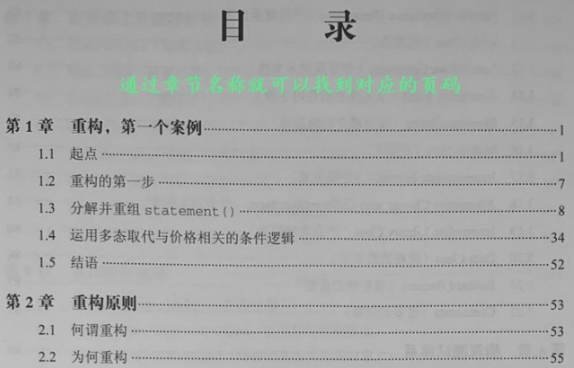
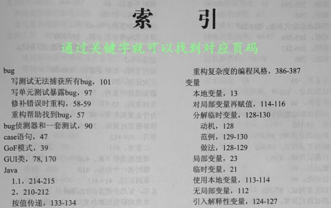
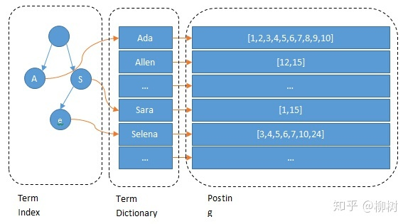

# Inverted index 反向索引

## 前言

索引的目的是為了快速檢索數據。

每一種 DB 都有其適用的情境，所以會需要不同的數據結構和索引來解決問題。

對 MySQL 來說是 B+tree 結構的索引，而在 Lucene 來說是 inverted index。

## Inverted index 是什麼?

有反向索引(inverted index) 那當然就有正向索引(forward index)。

正向索引(forward index) 就像一本書開頭的目錄一樣，我們可以依照章節名稱直接找到頁數。

---

這個時候如果你想找到包含某個關鍵字的頁數要怎麼辦呢？有些書的後面就會列出某些關鍵字出現的頁數，這就是反向索引(inverted index)的一種。

---

讓我們看一下例子，假設在搜尋引擎中存有以下紀錄：

| doc_id | content |
| --- | --- |
| 1 | 時間就是金錢 |
| 2 | 金錢只是一堆數字 |
| 3 | 這是數字 |

以上範例 doc_id 是唯一值，透過唯一值去尋找整個文檔的值就是運用了正向索引(forward index)。

如果我想找到 content 中包含 `金錢` 兩個字的文檔時， 就需要一個一個查看文檔的 content。

這時候我們對 content 做反向索引(inverted index)：

| 單詞(Token) | doc_id | count | doc_id + position |
| --- | --- | --- | --- |
| 時間 | [1] | 1 | [1:0] |
| 金錢 | [1,2] | 2 | [1:3,2:0] |
| 數字 | [2,3] | 2 | [2:3,3:0] |

如上表，可以看到這樣就能快速找到我們想要的文檔，這也是搜尋引擎的解決方案。

## 參考

[搜索引擎之倒排索引浅析【附源码】_武培轩_51CTO博客](https://blog.51cto.com/u_14901336/2522708)

[聊聊 Elasticsearch 的倒排索引 - 知乎 (zhihu.com)](https://zhuanlan.zhihu.com/p/76485252)

[Elasticsearch 倒排索引原理 - Silverming (xiaoming.net.cn)](https://xiaoming.net.cn/2020/11/25/Elasticsearch%20%E5%80%92%E6%8E%92%E7%B4%A2%E5%BC%95/)

[ElasticSearch 索引 VS MySQL 索引 | crossoverJie's Blog](https://crossoverjie.top/2020/08/24/elasticsearch/ElasticSearch%20VS%20MySQL/)