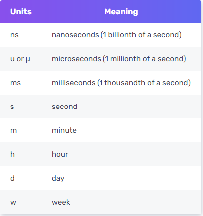
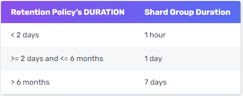

### CREATE DATABASE

```sql
CREATE DATABASE <database_name> [WITH [DURATION <duration>] [REPLICATION <n>] [SHARD DURATION <duration>] [NAME <retention-policy-name>]]
```

`WITH` 後面是可選的，用來為 database 設定 retention policy，若沒有指定則會預設為 `autogen`

範例：

```sql
> CREATE DATABASE test
> SHOW DATABASES
name: databases
name
----
_internal
test
> CREATE DATABASE test2 WITH DURATION 3d REPLICATION 1 SHARD DURATION 1h NAME "liquid"
> SHOW DATABASES
name: databases
name
----
_internal
test
test2
```

### DROP DATABASE

```sql
DROP DATABASE <database_name>
```

### USE DATABASE

```sql
USE <database_name>
```

### CREATE Retention policy

```sql
CREATE RETENTION POLICY <retention_policy_name> ON <database_name> DURATION <duration> REPLICATION <n> [SHARD DURATION <duration>] [DEFAULT]
```

- DURATION：用來定義 InfluxDB 會保存數據多久。

    <duration> 格式為 int + 時間單位，此外還可以設置成 `INF(infinite)` 表示永久保存。

    ```sql
    duration_unit = "ns" | "u" | "µ" | "ms" | "s" | "m" | "h" | "d" | "w" 
    <duration>    = int duration_unit | INF
    ```

  duration_unit：

  

- REPLICATION： 數據存在 `cluster` 裡面的副本數量，開源單節點版本只會是 1。
- SHARD DURATION：選填，表示每個 `shard group` 包含的時間範圍。

    <duration> 格式為 int + 時間單位，但不可以設置成 `INF`，最小值為 `1h`。

  當  `1h` > `duration` >  `0s` 則會自動將 <duration> 改為 `1h`；

  當 `duration` =  `0s` 則會自動將 <duration> 改為預設值。

  預設值會根據 retention policy 的 `DURATITION` 決定，如下圖：

  

- DEFAULT：選填，將此 `RP` 設定為 database 預設的 `RP`。

範例：

```sql
CREATE RETENTION POLICY "one_day_only" ON "NOAA_water_database" DURATION 23h60m REPLICATION 1 DEFAULT
```

### ALTER Retention policy

```sql
ALTER RETENTION POLICY <retention_policy_name> ON <database_name> [DURATION <duration>] [REPLICATION <n>] [SHARD DURATION <duration>] [DEFAULT]
```

`DURATION`、 `REPLICATION`、 `SHARD DURATION` 和 `DEFAULT` 至少選填其中一項，未填寫的部分會保持原本的設定值。

### DROP Retention policy

刪除 RP 和該 RP 底下所有的 measurements and data

```sql
DROP RETENTION POLICY <retention_policy_name> ON <database_name>
```

### CREATE Measurement

在 InfluxDB 中不需要顯式的建立 measurement，在 `INSERT` 數據時就會自動建立。

### DROP Measurement

```sql
DROP MEASUREMENT <measurement_name>
```

### DROP SERIES

刪除指定 series 的所有 Points，並將 series 從 index 中刪除

```sql
DROP SERIES FROM <measurement_name[,measurement_name]> WHERE <tag_key>='<tag_value>'
```

刪除單個 measurement 的所有 series 和 points

```sql
> DROP SERIES FROM "test"
```

刪除單個 measurement 的特定 tag pair 的 series 和 points

```sql
> DROP SERIES FROM "test" WHERE "host" = 'A'
```

刪除 database 內所有擁有特定 tag pair 的 measurement 內的 series 和 points

```sql
> DROP SERIES WHERE "host" = 'A'
```

### DELETE Series

刪除指定 series 的所有 Points，但不將 series 從 index 中刪除。

```sql
DELETE FROM <measurement_name> WHERE [<tag_key>='<tag_value>'] | [<time interval>]
```

刪除 database 內所有小於 2020-01-01 的 Points

```sql
> DELETE WHERE time < '2020-01-01'
```

1. `DELETE` 在 `FROM` 的 `<measurement_name>` 和 `WHERE` 的 `tag_value` 都支持正則表達式。
2. `DELETE` 不支持在 `WHERE` 條件中以 `fields` 為條件。
3. `DELETE` 預設會帶入 `time < now()` 條件，因此若要刪除未來時間的資料，需要明確指定時間。

### DROP Shard

```sql
DROP SHARD <shard_id_number>
```