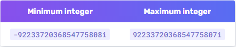
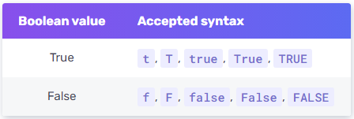
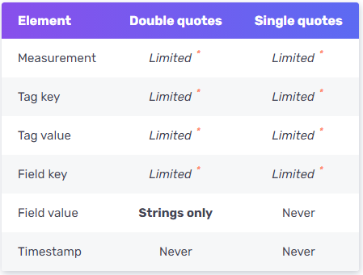

## Syntax

```sql
-- insert 不指定 RP
INSERT <line protocol>
-- insert 指定 RP
INSERT INTO <retention policy> <line protocol>
-- line protocol
<line protocol>: <measurement>[,<tag_key>=<tag_value>[,<tag_key>=<tag_value>]] <field_key>=<field_value>[,<field_key>=<field_value>] [<timestamp>]
```

## line protocol 元素

```sql
measurementName,tagKey=tagValue fieldKey="fieldValue" 1465839830100400200
--------------- --------------- --------------------- -------------------
       |               |       |          |          |         |
  Measurement       Tag set   空格      Field set   空格    Timestamp
```

### Measurement

- 必填， `Measurement` 名稱對於**大小寫是敏感**的，並且不可以 `_` 為開頭，此 `_` 為 InfluxDB system 保留使用。

***Data type**: [**String**](https://docs.influxdata.com/influxdb/v2.0/reference/syntax/line-protocol/#string)*

### Tag set

- 選填，當有多個 `Tag set` 時用 `,` 做為區隔。
- `Tag set` 對於**大小寫是敏感**的， `Tag key` 不可以 `_` 為開頭。

***Key data type**: [**String**](https://docs.influxdata.com/influxdb/v2.0/reference/syntax/line-protocol/#string)*

***Value data type**: [**String**](https://docs.influxdata.com/influxdb/v2.0/reference/syntax/line-protocol/#string)*

### Field set

- 必填， `Point` 必須至少有一對 `Field set`，當有多個 `Field set` 時用 `,` 做為區隔。
- `Field keys` 對於**大小寫是敏感**的，且不可以 `_` 為開頭。
- 當 `Field values` 為 `String` 型態時，請使用雙引號 `"` 包起來。

***Key data type:** [**String**](https://docs.influxdata.com/influxdb/v2.0/reference/syntax/line-protocol/#string)*

***Value data type:** [**Float**](https://docs.influxdata.com/influxdb/v2.0/reference/syntax/line-protocol/#float) | [**Integer**](https://docs.influxdata.com/influxdb/v2.0/reference/syntax/line-protocol/#integer) | [**UInteger**](https://docs.influxdata.com/influxdb/v2.0/reference/syntax/line-protocol/#uinteger) | [**String**](https://docs.influxdata.com/influxdb/v2.0/reference/syntax/line-protocol/#string) | [**Boolean**](https://docs.influxdata.com/influxdb/v2.0/reference/syntax/line-protocol/#boolean)*

### Timestamp

- 選填，預設使用 InfluxDB Host 的系統時間(UTC)。
- 為了確保 `Point` 上的時間為觀測到數據的時間，而不是 InfluxDB 收到的時間，因此建議總是帶入 `Timestamp`。
- 默認精度為 `nanoseconds(ns)`，若 `insert` 的時間精度不是 `ns` 則必須指定精度，InfluxDB 接受以下精度： `nanoseconds(ns)`、`microseconds(us)`、`milliseconds(ms)` 和 `seconds(s)`。

***Data type***: [***Unix timestamp***](https://docs.influxdata.com/influxdb/v2.0/reference/syntax/line-protocol/#unix-timestamp)

## Line Protocol Data types

### Float

此為預設的數值型態，為 IEEE-754 64-bit 的浮點數，並且 InfluxDB 支援科學記號的方式記錄

```sql
myMeasurement fieldKey=1.0
myMeasurement fieldKey=1
myMeasurement fieldKey=-1.234456e+78
```

### Integer

在數值的後方加上 `i` 指定其為整數型態，為 `Signed` 64-bit 整數。



```sql
myMeasurement fieldKey=-1i
myMeasurement fieldKey=12485903i
myMeasurement fieldKey=-12485903i
```

### UInteger

在數值的後方加上 `u` 指定其為 `Unsigned` 的整數型態，為 `Unsigned` 64-bit 整數。


```sql
myMeasurement fieldKey=1u
myMeasurement fieldKey=12485903u
```

### String

字串，長度限制為 64KB

```sql
# String measurement name, field key, and field value
myMeasurement fieldKey="this is a string"
```

### Bollean

True or False，支持以下名稱：



注意不可包含 `"` ，否則會被轉換為 `string` 型態

```sql
myMeasurement fieldKey=true
myMeasurement fieldKey=false
myMeasurement fieldKey=t
myMeasurement fieldKey=f
myMeasurement fieldKey=TRUE
myMeasurement fieldKey=FALSE
```

### Unix timestamp

支持的精度：`nanoseconds(ns)`、`microseconds(us)`、`milliseconds(ms)` 和 `seconds(s)`，預設為 `ns`。


```sql
myMeasurementName fieldKey="fieldValue" 1556813561098000000
```

### 引號(Quotes)

InfluxDB 支持單雙引號，具體如下：



- `Field value` 的 `String` 必須也只能使用雙引號 `"` 包起來。
- `Limited` 表示引號會被視為名稱的部分，範例：

    ```sql
    > insert test,'host'="A",host=A value="test"
    > select * from test
    name: test
    time                'host' host value
    ----                ------ ---- -----
    1607417652586210324 "A"    A    test
    ```


### 特殊字元與轉義

當 `Strings` 型態中出現特殊字元時，需要使用 `\` 進行轉義，以下特殊字元需要轉義：


```sql
# Measurement 名稱中有空格
my\ Measurement fieldKey="string value"

# field values 的 sting 中有雙引號
myMeasurement fieldKey="\"string\" within a string"

# Tag keys and values 名稱中有空格
myMeasurement,tag\ Key1=tag\ Value1,tag\ Key2=tag\ Value2 fieldKey=100

# Emojis 不需要轉義
myMeasurement,tagKey=🍭 fieldKey="Launch 🚀" 1556813561098000000
```

### 註解

寫在 `#` 後的皆為註解，直到換行 `\n`。

```sql
# This is a comment
myMeasurement fieldKey="string value" 1556813561098000000
```

### 命名限制

`Measurement names`、 `tag keys` 和 `field keys` 不能以 `_` 為開頭，此開頭為 InfluxDB 系統使用。

## 參考

[Write data to InfluxDB with insert - influxdata 文檔](https://docs.influxdata.com/influxdb/v1.7/tools/shell/#write-data-to-influxdb-with-insert)

[Line protocol - influxdata 文檔](https://docs.influxdata.com/influxdb/v2.0/reference/syntax/line-protocol/)

[line protocol - data types and format - influxdata 文檔](https://docs.influxdata.com/influxdb/v2.0/reference/syntax/line-protocol/#data-types-and-format)