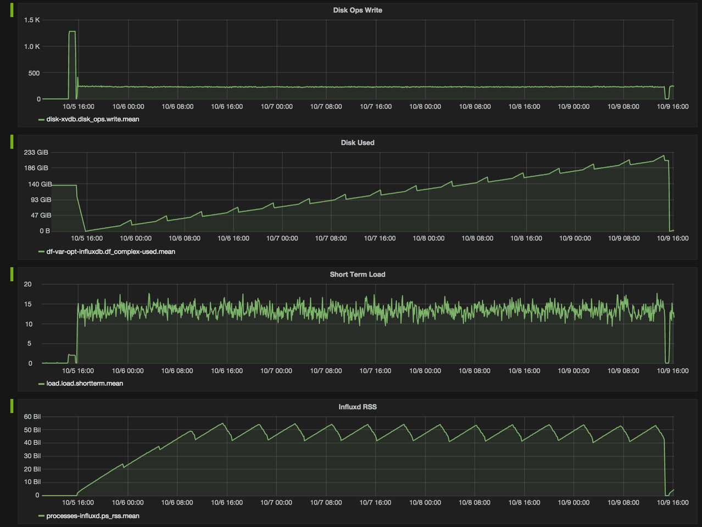
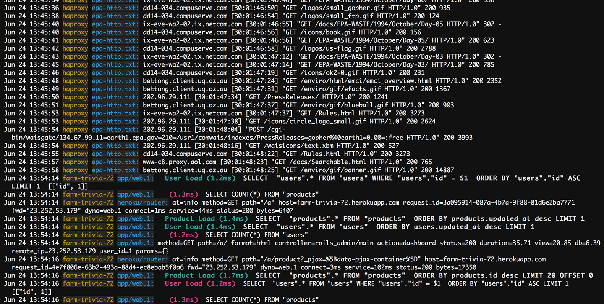
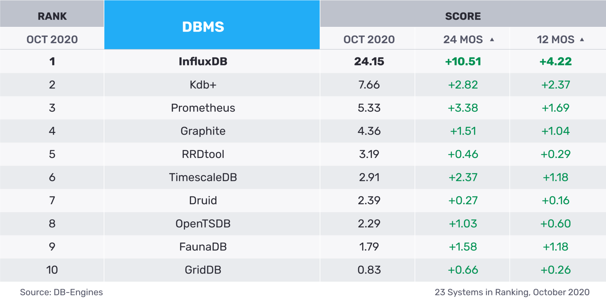
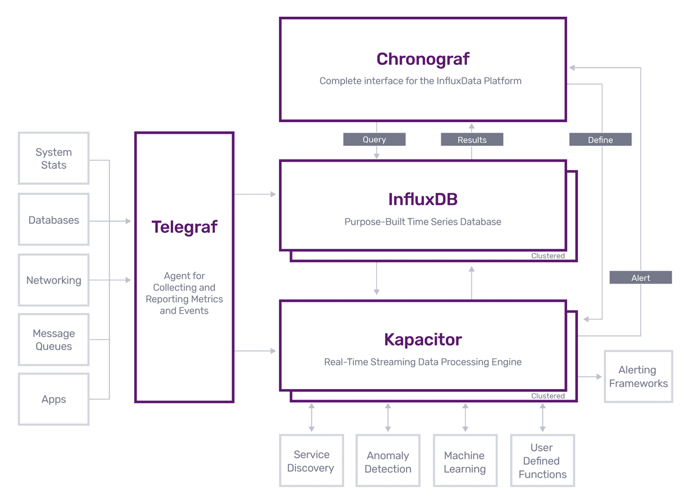
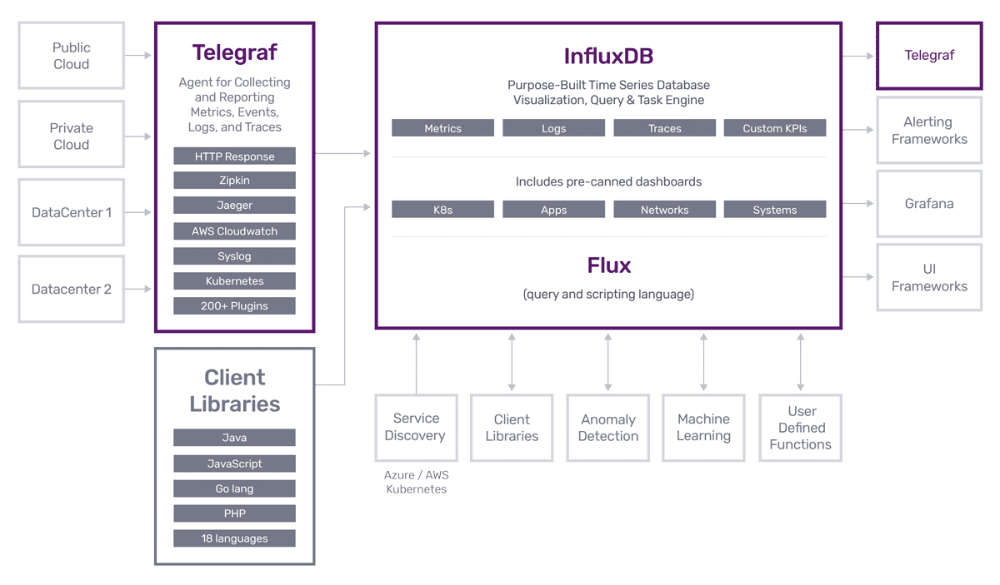

## 時間序列數據(Time Series Data)

時間序列數據是在一段時間內重複測量取得的結果集，如 CPU 使用率隨時間的變化。

時序數據以時間作為主要的查詢維度，將連續的多個時序數據繪製成報表，可以用於揭示背後的趨勢、規律和異常，做為預測和預警的依據。

時序數據具有以下特性：

1. 不變性：因為資料是歷史數據，一旦產生就不會在異動。
2. 唯一性：同一個時間同一個對象同一個指標，只會有一個值。
3. 按時間排序：時間主要的座標軸，數據隨著時間順序產生。

時間序列數據分為兩種類型：

1. 定期收集到的 `metrics(指標)`，例如：監控。

   

2. 不定期收集到的 `events(事件)`，例如：Logs。

   

## 時序型資料庫(Time Series Database、TSDB)

TSDB 專門處理帶有 `time-stamped` 的 `metrics(指標)`、 `events` 這種時間序列數據的數據庫。

TSDB 和其他資料庫的負載不同：

1. 平穩、持續的高併發的 `INSERT` 時序數據，沒有 `UPDATE` 操作
2. 資料的儲存和壓縮
3. 數據的生命週期管理
4. 數據彙整
5. 大範圍且大量的數據掃描

## InfluxDB

由 InfluxData 使用 GO 語言開發的開源 TSDB，並提供 SQL LIKE 的查詢語言 InfluxQL，在 [DB-ENGINES Ranking](https://db-engines.com/en/ranking/time+series+dbms) 時序行數據庫中排名第一。

排名第二的 `Kdb+` 則是商業軟體，只有 32 位元的免費版本可以使用，爬文說是華爾街廣泛應用於行情服務的 TSDB，以速度快著稱。

排名第三的 `Prometheus` 也是開源 TSDB，則是更適合應用在監控系統的場景。

> 💡 延伸閱讀：
在早期 InfluxDB 是完全開源的，後來為了維持公司運營，因而閉源了集群版本。
在 2017 的 Percona Live 上 InfluxData 做了[開源數據庫商業模型正面臨危機](https://www.youtube.com/watch?v=Kvf5jWZjw0U&ab_channel=Percona)的演講，雲服務供應商(如：AWS) 將開源項目作為 `SaaS(軟體及服務)` 進行營利獲取大部分的利潤，而且大部分還不回饋開源社區，被其稱為開源吸血鬼，也讓部分開源軟體修改了開源的許可方式，例如： `MongoDB`、 `Redis`、`Kafka`...... 等。

Influxdata 團隊還提供了一個完整的生態環境 `TICK`，其中除了 influxDB 還包含了其他三種軟體：

- [Telegraf](https://www.influxdata.com/time-series-platform/telegraf/)：數據收集器，協助收集指標的 agent，類似 pmm 中 pmm-client 的角色。
- [influxDB](https://www.influxdata.com/products/influxdb-overview/)：時序數據庫，用來儲存時序數據的資料庫，類似 pmm 中 prometheus 的角色。
- [Chronograf](https://www.influxdata.com/time-series-platform/chronograf/)：可視化 UI，用來查詢展示 influxDB 的數據，類似 pmm 中 grafana 的角色。
- [Kapacitor](https://www.influxdata.com/time-series-platform/kapacitor/)：處理和監控服務，用於處理、監控和告警時序數據的框架。

在 2020-11-10 Influxdata 發佈了 `influxDB 2.0 (GA)` 版本，目標是將 `TICK` 整合為一個整體，並提供了新的 `Flux` 語言用來取代 `Kapacitor` 原本使用的 `TICKscript`。

## 參考

TSDB：

- influxdata (官方文檔 & blog)

  [influxdata](https://www.influxdata.com/time-series-platform/)

  [influxdata - What is time series data](https://www.influxdata.com/what-is-time-series-data/)

  [influxdata - TSDB](https://www.influxdata.com/time-series-database/)

- 中文 blog

  [Influxdb · 源码分析 · Influxdb cluster实现探究](http://mysql.taobao.org/monthly/2018/02/02/)

  [時間序列數據庫(TSDB) - 簡書](https://www.jianshu.com/p/31afb8492eff)

  [InfluxDB與Prometheus用在於監控系統上的比較](https://opensource.dwins.com/?p=260)

- 其他

  [DB-ENGINES Ranking of TSDB](https://db-engines.com/en/ranking/time+series+dbms)

  [开源危机：云计算厂商成为开源吸血鬼？](https://www.infoq.cn/article/OE1EVpAi_LYzapRP4oYk)

  [时序数据库InfluxDB 2.0 alpha 发布：主推新的Flux查询语言，TICK栈将成为整体](https://www.infoq.cn/article/662MdX6QNzcL-5D4axKb)

  [DolphinDB 在台湾永丰金证券的应用](https://www.infoq.cn/article/ko89kotheesipiuzoiza)