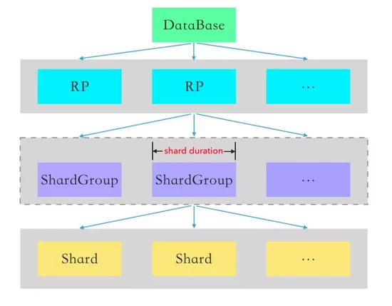

# InfluxDB 核心術語

## Database

對應 SQL 中的 database。不同的 database 資料存放在不同目錄。

```sql
-- influxDB
> create database test;
> show databases;
name: databases
name
----
_internal
test
> use test;
Using database test

-- linux
root@e6c0eae8a31f:/var/lib/influxdb/data# ls -l
total 0
drwx------ 4 root root 36 Nov  3 02:49 _internal
drwx------ 4 root root 36 Nov 13 10:05 test
```

## Retention Policy

用來設定數據保留策略，過期的數據會被刪除。包含以下三個元素－

- duration：用來描述 influxDB 會保存數據多久。
- replication factor：數據存在 `cluster` 裡面的副本數量，開源版本只會是 1。
- shard (group) duration：表示一個 `shard (group)`  跨越了多少的時間。

範例：

```sql
-- autogen 為默認的保留策略，數據保留時間為永久
> show retention policies;
name    duration shardGroupDuration replicaN default
----    -------- ------------------ -------- -------
autogen 0s       168h0m0s           1        true

> show shards
name: test
id database retention_policy shard_group start_time           end_time             expiry_time          owners
-- -------- --------------- ----------- ----------           --------             -----------          ------
12 test     autogen          12          2020-11-09T00:00:00Z 2020-11-16T00:00:00Z 2020-11-16T00:00:00Z
16 test     autogen          16          2020-11-16T00:00:00Z 2020-11-23T00:00:00Z 2020-11-23T00:00:00Z
24 test     autogen          24          2020-11-23T00:00:00Z 2020-11-30T00:00:00Z 2020-11-30T00:00:00Z
32 test     autogen          32          2020-11-30T00:00:00Z 2020-12-07T00:00:00Z 2020-12-07T00:00:00Z
```

## Shard



類似於 MySQL 的 `partition` 在同一個實例上將一張 `table` 切為多個實體檔案。

包含實際的數據，在 disk 上儲存為 `TSM` 文件，每一個 `shard` 都包含了一個彼此不重複的時間段。

```sql
> show shards
name: test
id database retention_policy shard_group start_time           end_time             expiry_time          owners
-- -------- --------------- ----------- ----------           --------             -----------          ------
12 test     autogen          12          2020-11-09T00:00:00Z 2020-11-16T00:00:00Z 2020-11-16T00:00:00Z
16 test     autogen          16          2020-11-16T00:00:00Z 2020-11-23T00:00:00Z 2020-11-23T00:00:00Z
24 test     autogen          24          2020-11-23T00:00:00Z 2020-11-30T00:00:00Z 2020-11-30T00:00:00Z
32 test     autogen          32          2020-11-30T00:00:00Z 2020-12-07T00:00:00Z 2020-12-07T00:00:00Z
```

```bash
root@e6c0eae8a31f:/var/lib/influxdb# tree ./data/test/autogen
test
|-- autogen
    |-- 12
    `-- 16
        |-- 000000003-000000002.tsm
        `-- fields.idx
```

## Shard groups

類似於 `Mongo` 的 `sharding`，將同個 table 的資料分散到不同的實例上。

`shard` 的 `logical containers`，每個 `shard` 都只會屬於其中一個 `shard group`，InfluxDB 將數據進行 `hash` 寫入到不同的 `server`，每個 `server` 同一個時間區間的所有`shard` 就屬於同一個 `shard group`。

此為付費版本的 cluster 功能，開源的單實例版本無此功能。

## Shard (group) duration

表示一個 `shard (group)`  跨越了多少的時間，可以在 `retention policy` 中設定。

## Measurement

對應 SQL 中的 table，但不需要預先建立，insert 資料時自動建立。

```sql
> show measurements
> INSERT cpu,host=A loading=0.65
> show measurements
name: measurements
name
----
cpu
> select * from "cpu"
name: cpu
time                host loading
----                ---- -------
1605592932144992788 A    0.65
```

## Timestamp

數據關聯的時間點，在 InfluxDB 裡的所有時間都是 UTC。

## Field (set)

儲存 metadata 和 真實數據。作為查詢條件不會被索引，只能全表掃描。

- field key：和 MySQL 中沒有建立 index 的 column 概念相似。
- field value：field key 所對應的值。

```sql

-- 除了 time 以外，還有 host 和 loading 2個欄位
> select * from "cpu"
name: cpu
time                host loading
----                ---- -------
1605592932144992788 A    0.65

>  show field keys from cpu;
name: cpu
fieldKey fieldType
-------- ---------
loading  float
-- loading        是 field key 
-- 0.65           是 field value
-- loading = 0.65 是 field set
```

## Tag (set)

選用，用於儲存常用的 metadata。作為查詢條件會被索引，查詢效率高。

- Tag key：和 MySQL 中有建立 index 的 column 概念相似。
- Tag value：tag key 所對應的值。

```sql
-- 除了 time 以外，還有 host 和 loading 2個欄位
> select * from "cpu"
name: cpu
time                host loading
----                ---- -------
1605592932144992788 A    0.65

>  show tag keys from cpu;
name: cpu
tagKey
------
host

-- host        是 tag key 
-- A           是 tag value
-- host = A    是 tag set
```

## Series

擁有相同 `measurement` 和 `tag set` 的結果集。

- series key： 由 `measurement`、 `tag set` 和 `field key` 定義。

```sql
> select * from cpu
name: cpu
time                comment host loading
----                ------- ---- -------
1605592932144992788 new     A    0.65
1605592932144992788         B    0.05
1605592932144992790 next    A    0.85

> show series from cpu
key
---
cpu,host=A
cpu,host=B

# 上述例子中有兩個 series
cpu,host=A
1605592932144992788 new     A    0.65
1605592932144992790 next    A    0.85
cpu,host=B
1605592932144992788         B    0.05

# 上述例子中 series key 有以下4組
cpu, host=A loading
cpu, host=A comment
cpu, host=B loading
cpu, host=B comment

```

## Point

對應 MySQL 中一個完整的 Row，由 `measurement`、 `tag set`、 `field set` 和 `timestamp`組成。

在同一個 `series` 底下時，同一個 `timestamp` 只會有一個 `point` ，因此 `series` + `timestamp` 可以視為 MySQL 的 `Primary key`。

若在同一個 `series` + `timestamp` INSERT 資料，field 會合併，範例如下：

series 為 cpu,host=A，因此在 cpu 裡面 host = A 且 time=1605592932144992788 只會有一筆紀錄。

```sql
> select * from "cpu"
name: cpu
time                host loading
----                ---- -------
1605592932144992788 A    0.65

> show series from cpu
key
---
cpu,host=A
```

新增 series 相同，但 field key 不同的資料，會發現資料合併。

```sql
> INSERT cpu,host=A comment="old"  1605592932144992788
> select * from cpu
name: cpu
time                comment host loading
----                ------- ---- -------
1605592932144992788 old     A    0.65
```

新增 series 相同，且 field key 相同的資料，則會發現資料被覆蓋。

```sql

> INSERT cpu,host=A loading=0.05,comment="new"  1605592932144992788
> select * from cpu
name: cpu
time                comment host loading
----                ------- ---- -------
1605592932144992788 new     A    0.05
```

## 參考

[influxdata - data elements](https://docs.influxdata.com/influxdb/v2.0/reference/key-concepts/data-elements/#series)

[influxdata - Simplifying InfluxDB: Shards and Retention Policies](https://www.influxdata.com/blog/influxdb-shards-retention-policies/)

[influxDB  shard - Go語言中文網](https://www.mdeditor.tw/pl/pgbb/zh-tw)