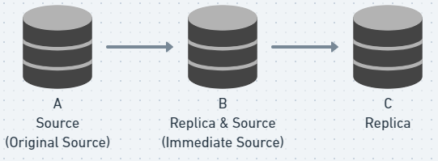

在 MySQL 8.0 之前只能從 SHOW SLAVE STATUS 中的 Second_Behind_Master 來確認  replication delay，但是這對於複雜的 replication topologies (拓撲) 不適用，例如：



如上圖，在 8.0 之前我們在 C 的機器只能知道 B、C 之間的 replication delay，無法知道 A、C 之間的 replication delay，而 MySQL 8.0 進行了一些改善。

## **Replication Delay Timestamps**

MySQL 8.0 開始提供了新的方式來測量 replication delay，方法是在 binlog 中為 Transaction 添加以下兩個時間戳：

- original_commit_timestamp：紀錄 Transaction 在最原本的 Master commit 的時間戳
- immediate_commit_timestamp：紀錄 Transaction 在 Slave 連線的 Master 上 commit 的時間戳

透過 mysqlbinlog 指令查看 MySQL 8.0 之後的 binlog：

```
#221202 18:02:25 server id 1  end_log_pos 707 CRC32 0xf8ff712d  Anonymous_GTID  last_committed=2        sequence_number=3       rbr_only=yes    original_committed_timestamp=1669975345432917 immediate_commit_timestamp=1669975527438008     transaction_length=357
/*!50718 SET TRANSACTION ISOLATION LEVEL READ COMMITTED*//*!*/;
# original_commit_timestamp=1669975345432917 (2022-12-02 18:02:25.432917 CST)
# immediate_commit_timestamp=1669975527438008 (2022-12-02 18:05:27.438008 CST)
/*!80001 SET @@session.original_commit_timestamp=1669975345432917*//*!*/;
/*!80014 SET @@session.original_server_version=80031*//*!*/;
/*!80014 SET @@session.immediate_server_version=80031*//*!*/;
SET @@SESSION.GTID_NEXT= 'ANONYMOUS'/*!*/;
# at 707
```

- 在所有的 Replica 中，所有被回放的 Transaction 其 original_commit_timestamp 始終相同，都是最源頭的 Source 執行該 Query 時 commit 的時間。
- 在源頭的 Source  binlog 中 original_commit_timestamp 等於 immediate_commit_timestamp。
- 在 Replica 的 relay log 中其 original_commit_timestamp 、immediate_commit_timestamp 會等於其連線 Source 上的 binlog 紀錄。
- 在 Replica 的 binlog 中，immediate_commit_timestamp 是自己 commit 的時間戳。

## **Monitoring Replication Delay**

除了添加了新的 replication delay timestamp，8.0 也在 performance_schema 中新增以下三張表方便觀察 replication delay：

- replication_connection_status：紀錄 IO_THREAD 在寫入 relay log 的工作狀態。
    - LAST_QUEUED_TRANSACTION_ORIGINAL_COMMIT_TIMESTAMP

      最後一個已寫入 relay log 的 Transaction 其 original_commit_timestamp。

    - LAST_QUEUED_TRANSACTION_IMMEDIATE_COMMIT_TIMESTAMP
      最後一個已寫入 relay log 的 Transaction 其 immediate_commit_timestamp。
    - LAST_QUEUED_TRANSACTION_START_QUEUE_TIMESTAMP
      最後一個已寫入 relay log 的 Transaction 的開始時間。
    - LAST_QUEUED_TRANSACTION_END_QUEUE_TIMESTAMP
      最後一個已寫入 relay log 的 Transaction 的結束時間。
    - QUEUEING_TRANSACTION_ORIGINAL_COMMIT_TIMESTAMP
      正在寫入 relay log 的 Transaction 其 original_commit_timestamp。
    - QUEUEING_TRANSACTION_IMMEDIATE_COMMIT_TIMESTAMP
      正在寫入 relay log 的 Transaction 其 immediate_commit_timestamp。
    - QUEUEING_TRANSACTION_START_QUEUE_TIMESTAMP
      正在寫入 relay log 的 Transaction 其開始寫入的時間。
- replication_applier_status_by_worker：記錄每一條 SQL_THREAD 的工作狀態。
    - LAST_APPLIED_TRANSACTION_ORIGINAL_COMMIT_TIMESTAMP
      最後一個被回放的 Transaction 其 original_commit_timestamp。
    - LAST_APPLIED_TRANSACTION_IMMEDIATE_COMMIT_TIMESTAMP
      最後一個被回放的 Transaction 其 immediate_commit_timestamp。
    - LAST_APPLIED_TRANSACTION_START_APPLY_TIMESTAMP
      最後一個被回放的 Transaction 其回放的開始時間。
    - LAST_APPLIED_TRANSACTION_END_APPLY_TIMESTAMP
      最後一個被回放的 Transaction 其回放的結束時間。
    - APPLYING_TRANSACTION_ORIGINAL_COMMIT_TIMESTAMP
      正在被回放的 Transaction 其 original_commit_timestamp。
    - APPLYING_TRANSACTION_IMMEDIATE_COMMIT_TIMESTAMP
      正在被回放的 Transaction 其 immediate_commit_timestamp。
    - APPLYING_TRANSACTION_START_APPLY_TIMESTAMP
      正在被回放的 Transaction 其回放的開始時間。
- replication_applier_status_by_coordinator：紀錄 MTS 中的 Coordinator 線程的工作狀態，當未開啟 MTS 此表為空。
    - LAST_PROCESSED_TRANSACTION_ORIGINAL_COMMIT_TIMESTAMP
      最後一個被 Coordinator 線程處理的 Transaction 其 original_commit_timestamp。
    - LAST_PROCESSED_TRANSACTION_IMMEDIATE_COMMIT_TIMESTAMP
      最後一個被 Coordinator 線程處理的 Transaction 其 immediate_commit_timestamp。
    - LAST_PROCESSED_TRANSACTION_START_BUFFER_TIMESTAMP
      最後一個 Transaction 什麼時候開始被 Coordinator 寫入 Worker 線程的 buffer。
    - LAST_PROCESSED_TRANSACTION_END_BUFFER_TIMESTAMP

      最後一個 Transaction 什麼時候被 Coordinator 寫入 Worker 線程的 buffer。

    - PROCESSING_TRANSACTION_ORIGINAL_COMMIT_TIMESTAMP

      正在被 Coordinator 線程處理的 Transaction 其 original_commit_timestamp。

    - PROCESSING_TRANSACTION_IMMEDIATE_COMMIT_TIMESTAMP
      正在被 Coordinator 線程處理的 Transaction 其 immediate_commit_timestamp。
    - PROCESSING_TRANSACTION_START_BUFFER_TIMESTAMP

      正在被 Coordinator 線程處理的 Transaction 其開始寫入 Worker 線程的 buffer 的時間。


注意：這些 Table 中的 immediate_commit_timestamp 都是從 `relay log`  中取得。

## 範例


1. 觀察 A → C 之間完整的延遲

    ```sql
    SELECT TIMEDIFF(
    	LAST_APPLIED_TRANSACTION_END_APPLY_TIMESTAMP, 
    	LAST_APPLIED_TRANSACTION_ORIGINAL_COMMIT_TIMESTAMP
    )
    FROM performance_schema.replication_applier_status_by_worker
    ```

2. 觀察 B → C 之間完整的延遲

    ```sql
    SELECT TIMEDIFF(
    	LAST_APPLIED_TRANSACTION_END_APPLY_TIMESTAMP, 
    	LAST_APPLIED_TRANSACTION_IMMEDIATE_COMMIT_TIMESTAMP
    )
    FROM performance_schema.replication_applier_status_by_worker
    ```

3. C 正在回放的 Transaction 和 B 的延遲

    ```sql
    SELECT TIMEDIFF(
    	APPLYING_TRANSACTION_START_APPLY_TIMESTAMP, 
    	APPLYING_TRANSACTION_IMMEDIATE_COMMIT_TIMESTAMP
    )
    FROM performance_schema.replication_applier_status_by_worker
    ```

4. 開啟 MTS 時，Coordinator 正在處理的 Transaction 和 B 的延遲

    ```sql
    SELECT TIME_DIFF(
    	PROCESSING_TRANSACTION_START_BUFFER_TIMESTAMP, 
    	PROCESSING_TRANSACTION_IMMEDIATE_COMMIT_TIMESTAMP
    )
    FROM performance_schema.replication_applier_status_by_coordinator
    ```

5. 觀察  C  relaylog 中最後寫入的 Transaction 在 A commit 的延遲

    ```sql
    SELECT TIMEDIFF(
    	LAST_QUEUED_TRANSACTION_END_QUEUE_TIMESTAMP, 
    	LAST_QUEUED_TRANSACTION_ORIGINAL_COMMIT_TIMESTAMP
    )
    FROM performance_schema.replication_connection_status
    ```

6. 觀察 B → C 之間 relaylog 的寫入延遲

    ```sql
    SELECT TIMEDIFF(
    	QUEUEING_TRANSACTION_START_QUEUE_TIMESTAMP, 
    	QUEUEING_TRANSACTION_IMMEDIATE_COMMIT_TIMESTAMP
    )
    FROM performance_schema.replication_connection_status
    ```


## 其他用途

在 binlog 中我們知道有 exec_time 這個值，但這個值並不能讓我們準確的知道 Transaction commit 的確切時間，但在 MySQL 8.0 之後我們可以透過觀測 original_commit_timestamp 來確認，參考以下例子：在一張表上執行了 458752 筆資料的 update，總計花費時間  13.62 sec

```sql
mysql> select now(); update t1 set name=repeat('c',2000);
+---------------------+
| now()               |
+---------------------+
| 2022-12-06 08:55:06 |
+---------------------+
1 row in set (0.00 sec)

Query OK, 458752 rows affected (13.62 sec)
Rows matched: 524288  Changed: 458752  
```

讓我們看一下 binlog：

```
#221206 16:55:06 server id 1  end_log_pos 241 CRC32 0x4cc632cf  Anonymous_GTID  last_committed=0        sequence_number=1       rbr_only=yes    original_committed_timestamp=1670316919294397 immediate_commit_timestamp=1670316919294397     transaction_length=190792863
/*!50718 SET TRANSACTION ISOLATION LEVEL READ COMMITTED*//*!*/;
# original_commit_timestamp=1670316919294397 (2022-12-06 16:55:19.294397 CST)
# immediate_commit_timestamp=1670316919294397 (2022-12-06 16:55:19.294397 CST)
/*!80001 SET @@session.original_commit_timestamp=1670316919294397*//*!*/;
/*!80014 SET @@session.original_server_version=80021*//*!*/;
/*!80014 SET @@session.immediate_server_version=80021*//*!*/;
SET @@SESSION.GTID_NEXT= 'ANONYMOUS'/*!*/;
# at 241
#221206 16:55:06 server id 1  end_log_pos 325 CRC32 0x3035566a  Query   thread_id=2244  exec_time=1     error_code=0
...
#221206 16:55:06 server id 1  end_log_pos 384 CRC32 0xeed08d18  Rows_query
# update t1 set name=repeat('c',2000)
...
```

可以看到 exec_time 顯示的是 1，而不是正確的執行時間，這是因為 exec_time 指的是 update 第一筆資料花費的時間，而不是整個 update 語句執行的時間。

不過從 MySQL 8.0 開始我們就可以透過 transaction 開始時間 (也就是 16:55:06) 和  transaction commit 的時間 - immediate_commit_timestamp (也就是 16:55:19) 判斷出這個 transaction 執行了 13 sec。

## 參考

[MySQL :: MySQL 8.0 Reference Manual :: 17.4.11 Delayed Replication](https://dev.mysql.com/doc/refman/8.0/en/replication-delayed.html)

[MySQL :: WL#7319: Infrastructure for GTID based delayed replication and replication lag monitoring](https://dev.mysql.com/worklog/task/?id=7319)

[MySQL :: WL#7374: Performance schema tables to monitor replication lags and queue](https://dev.mysql.com/worklog/task/?id=7374)

[新特性解读 | MySQL 8 复制延迟观测新方式，更全面更精准 - 知乎 (zhihu.com)](https://zhuanlan.zhihu.com/p/110874581)

[binlog记录SQL执行时间吗，准不准，时间是否包含锁等待时间 - 柴米油盐酱醋 - 博客园 (cnblogs.com)](https://www.cnblogs.com/nanxiang/p/13062989.html)

[MySQL · 答疑解惑 · 备库Seconds_Behind_Master计算 (taobao.org)](http://mysql.taobao.org/monthly/2016/03/09/)

[MySQL 复制延迟计算的问题分析 - ZhenXing_Yu - 博客园 (cnblogs.com)](https://www.cnblogs.com/zhenxing/p/15102590.html)