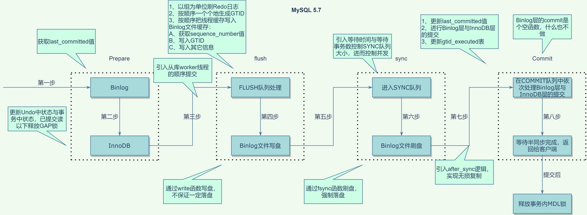
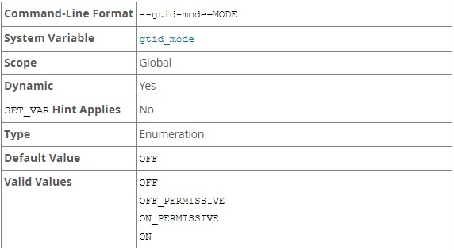
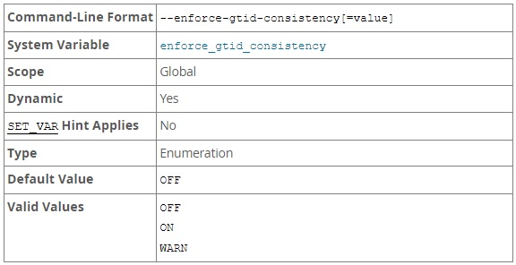
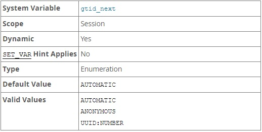
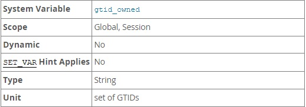
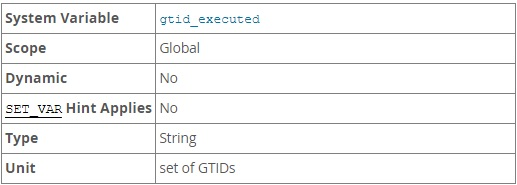
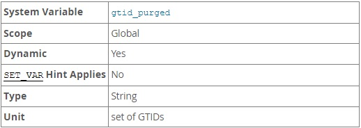
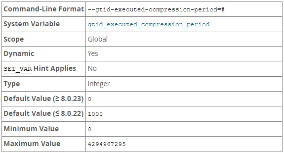
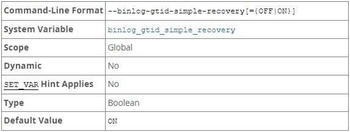

GTID 的全名是 Global Transaction identifier, MySQL 會為每一個 DML/DDL 操作都分配一個在整個 replicaion topology 都唯一的 GTID。

在 replication 環境中，master 可以直接透過 GTID 定位發送 binlog 給 slave 不再需要指定 binlog 名稱和 postition 在同步上更為方便。此外 Slave 還會保留從 Master 同步過來的 Transaction 相同的 GTID，並持久化到 mysql.gtid_executed，搭配上 GTID 的自動跳過功能，保證了相同 GTID 的 Transaction 在同一個 instance 中只會執行一次，更加有助於 Replication 的一致性。

## GTID 組成

GTID 的組成為 source_id:transaction_id，範例 `3E11FA47-71CA-11E1-9E33-C80AA9429562:23`

- source_id：該 DML/DDL 最原始執行的 server 其 UUID。

  在源碼中稱為 sid，會在 MySQL 啟動時從 auto.cnf  取得，如果沒有則根據啟動時間、線程的 LWP ID 及隨機內存地址生成後並記錄在 auto.cnf 中。

  注意：也就是說如果刪除現有的 auto.cnf 會在下次啟動時產生一個不同的 server uuid。

- transaction_id：原始 server 為該  DML/DDL 操作分配的唯一序列號，該序列號是順序遞增的。

  在源碼中稱為 gno 會在 Transaction 進入 Flush 階段中生成，MySQL 內部維護了一個全局變量 next_free_gno 的計數來生成 gno。


## GTID Life cycle

以下以 MySQL 8.0.17 以上來說明

1. 當 Transaction 在 Master 上執行時，會在 commit 過程中的 Flush 階段生成 GTID 。

   

2. 當分配 GTID 之後會將 Transaction 和其對應的 GTID 一起寫入 binlog (尚未進入 sync  階段進行 fsync 因此只是寫入 OS cache) 同時更新  mysql.gtid_executed 表及 @@GLOBAL.gtid_executed 變量。
3. 當 sync_binlog ≠ 1 時，就在 Flush 階段將 binlog 寫入 OS cache 後發送 binlog event 給 slave。

   當 sync_binlog = 1 時，在 sync 階段 fsycn 到 disk 後才發送 binlog event 給 slave。

   因此當 sync_binlog ≠ 1 時，當 Master crash 時可能導致 Slave 進度大於 Master。

4. Master 的 dump 線程將 binlog event 傳送給 Slave 保存至 relay log。
    - 詳細過程
        1. 在 Slave 的 IO_Thread 建立連線時，會將 `Retrieved_Gtid_Set` 和 `Executed_Gtid_Set`的並集 (UNION) 及自己的 server_id 發送給 Master。
        2. Master 確認自己的 `gtid_purged` 是否為 Slave 發送的子集，以此來檢查 master 的 binlog 尚未 purge。
        3. Master 判斷 Slave 有哪些 GTID 還沒執行，並發送對應的 binlog 給 Slave。
5. Slave 從 relay log 讀取 GTID，並將 gtid_next 設為該 GTID，並判斷以下：
    - 從 `@@GLOBAL.gtid_owned` 中確認沒有其他線程正在使用該 GTID，保證一次只有一個線程在處理該 GTID。
    - 從 `@@GLOBAL.gtid_executed` 中確認該 GTID 是否已經應用過。
6. 如果該 GTID 尚未被被應用，則在 Slave 應用該 Event 並維持該 Event 在 Master 上的 GTID，同時更新  mysql.gtid_executed 表及 @@GLOBAL.gtid_executed 變量。若有開啟 log_slave_update 則也寫入 binlog。

在 8.0.17 (含 5.7 所有版本) 之前 mysql.gtid_executed  並不總是及時更新：

- 當 `log_bin = OFF` 或者 `log_slave_update = OFF` 時，則 transaction 和 mysql.gtid_executed 會一起 commit 或 rollback。
- 當 slave `log_bin = ON` 且 `log_slave_update = ON` 時 (注意：如果是 master `log_bin = ON` 也適用)， 每當 binlog rotate 或者 server 關閉時，才會將先前 binlog 的所有 transaction gtid 寫入 mysql.gtid_executed 表。
- 當 server crash 時，會在 crash recovery 時將 binlog 中的 GTID 添加到 mysql.gtid_executed 表。

  注意：當開啟時 log_bin = OFF 時，會無法恢復 GTID 導致無法啟動 replication。

- 會使用每次 Transaction commit 時更新的 @@GLOBAL.gtid_executed 來表示 server 的 GTID 狀態，而不是使用 mysql.gtid_executed 表(因為不會即時更新)。

因為以上行為當開啟 gtid 模式且 log_slave_update = ON 時，必須要同時設置 sync_binlog = 1 & innodb_flush_log_at_trx_commit = 1，否則會導致 relication 在 OS crash 時發生問題。

從 8.0.17 開始為了實現 clone 功能 ([WL#9211](https://dev.mysql.com/worklog/task/?id=9211)) 更改了此行為，不論如何設置 mysql.gtid_executed 表總是和對應的 Event 一起 commit (rollback) 。

## mysql.gtid_execute 表

設計的初衷是用於當 slave 未開啟 binlog 或者是 `log_slave_update = OFF` 時，或者是當 binlog 丟失時能夠保留 GTID 的狀態，因此會在這張表中持久化已經執行的 GTID SET。

<aside>
💡 RESET MASTER 會清空此表

</aside>

### 壓縮

隨著時間推移 mysql.gtid_executed 表會有許多筆資料：

```
+--------------------------------------+----------------+--------------+
| source_uuid                          | interval_start | interval_end |
|--------------------------------------+----------------+--------------|
| 3E11FA47-71CA-11E1-9E33-C80AA9429562 | 37             | 37           |
| 3E11FA47-71CA-11E1-9E33-C80AA9429562 | 38             | 38           |
| 3E11FA47-71CA-11E1-9E33-C80AA9429562 | 39             | 39           |
| 3E11FA47-71CA-11E1-9E33-C80AA9429562 | 40             | 40           |
| 3E11FA47-71CA-11E1-9E33-C80AA9429562 | 41             | 41           |
| 3E11FA47-71CA-11E1-9E33-C80AA9429562 | 42             | 42           |
| 3E11FA47-71CA-11E1-9E33-C80AA9429562 | 43             | 43           |
+--------------------------------------+----------------+--------------+
```

為了節省空間，MySQL 會定期壓縮 mysql.gtid_executed 表，壓縮的方式如下：

```
+--------------------------------------+----------------+--------------+
| source_uuid                          | interval_start | interval_end |
|--------------------------------------+----------------+--------------|
| 3E11FA47-71CA-11E1-9E33-C80AA9429562 | 37             | 43           |
+--------------------------------------+----------------+--------------+
```

啟用 binlog 時，當發生 binlog rotation 時會壓縮 mysql.gtid_executed 表。

當禁用 binlog 時會依據 [gtid_executed_compression_period](GTID%20903c4e34f0cc474ea92f3368b7d552de.md) 的值決定壓縮的時機點，每當處理 N 個 Transaction 後會喚醒壓縮線程 (thread/sql/compress_gtid_table) 壓縮 mysql.gtid_executed 表。

在 8.0.17 之前預設值為 1000，表示每 1000 個 Transaction 進行壓縮，在該版本之前不建議在關閉 binlog 時設定為 0，這將會增加所需的 disk 空間。

從 8.0.17 開始建議設置為 0 (8.0.23 預設值)，這是因為從該版本開始 InnoDB 的 Transaction 寫入會由另一個 innodb/clone_gtid_thread 線程來控制寫入和壓縮， compress_gtid_table 線程會干擾其作業並降低速度。

```sql
mysql> SELECT * FROM performance_schema.threads WHERE NAME LIKE '%gtid%'\G
*************************** 1. row ***************************
          THREAD_ID: 26
               NAME: thread/sql/compress_gtid_table
               TYPE: FOREGROUND
     PROCESSLIST_ID: 1
   PROCESSLIST_USER: NULL
   PROCESSLIST_HOST: NULL
     PROCESSLIST_DB: NULL
PROCESSLIST_COMMAND: Daemon
   PROCESSLIST_TIME: 1509
  PROCESSLIST_STATE: Suspending
   PROCESSLIST_INFO: NULL
   PARENT_THREAD_ID: 1
               ROLE: NULL
       INSTRUMENTED: YES
            HISTORY: YES
    CONNECTION_TYPE: NULL
       THREAD_OS_ID: 18677
```

## 系統變量 gtid_executed 和 gtid_purged 的初始化與更新

### 初始化

每個 binlog 的開頭都有 `Previous-GTIDs`：這是由上一個 binlog 文件的 `Previous-GTIDs` 和上一個 binlog 文件所有的 Transaction GTID 組成。

```
~ -> mysqlbinlog --no-defaults --base64-output=DECODE-ROWS -vvv mysql-bin.000004
...
#230217  8:17:55 server id 1  end_log_pos 125 CRC32 0xa9000aca  Start: binlog v 4, server v 8.0.21 created 230217  8:17:55 at startup
ROLLBACK/*!*/;
# at 125
#230217  8:17:55 server id 1  end_log_pos 196 CRC32 0xf3d86d46  Previous-GTIDs
# 6c3c06b0-ae9b-11ed-a26c-0242ac1d0002:1-3
...
SET @@SESSION.GTID_NEXT= '6c3c06b0-ae9b-11ed-a26c-0242ac1d0002:4'/*!*/;
...
SET @@SESSION.GTID_NEXT= '6c3c06b0-ae9b-11ed-a26c-0242ac1d0002:5'/*!*/;
...
# End of log file

~ -> mysql-docker $ mysqlbinlog --no-defaults --base64-output=DECODE-ROWS -vvv mysql-bin.000005
...
#230217  8:19:12 server id 1  end_log_pos 125 CRC32 0xd5587e96  Start: binlog v 4, server v 8.0.21 created 230217  8:19:12 at startup
# Warning: this binlog is either in use or was not closed properly.
ROLLBACK/*!*/;
# at 125
#230217  8:19:12 server id 1  end_log_pos 196 CRC32 0x2416aa2b  Previous-GTIDs
# 6c3c06b0-ae9b-11ed-a26c-0242ac1d0002:1-5
...
```

gtid_executed 和 gtid_purged 這 2 個系統變量在 MySQL 啟動時會透過 binlog 計算進行初始化：

- gtid_executed：由最新的 binlog 文件的 `Previous-GTIDs`、最新的 binlog 文件所有的 Transaction GTID、mysql.gtid_excuted 並集 (UNION) 計算得出。
- gtid_purged：
    1. 將最新的 binlog 文件的 `Previous-GTIDs`、最新的 binlog 文件所有的 Transaction GTID 相加，計算出 gtids_in_binlog (表示曾出現在 binlog 的所有 gtid)。
    2. 將 gtids_in_binlog 減去最舊的 binlog 文件的 `Previous-GTIDs`，計算出 gtids_in_binlog_not_purged (表示所在的 binlog 尚未被清除的 gtid)。
    3. 將 gtid_executed 減去 gtids_in_binlog_not_purged，得出在 server 上執行過但 binlog 已被清楚的 GTID SET。

       由上計算得知如果 binlog 未開啟時，gtid_purged = gtid_executed 。


### 更新

- gtid_executed：
    - 會在 Transaction commit 的時候同步更新。
    - set global gtid_purged，設為原先 gtid_execute 和新設置 gtid_purged  的並集 (UNION)。
- gtid_purged：
    - 當 log_slave_updates = OFF 時，會在 Transaction commit 的時候同步更新。
    - 當 Master 開啟 binlog 時，當執行 purge binary logs 或 binlog 超過 expire_logs_days (binlog_expire_logs_seconds) 的設置時，觸發清除 binlog 的動作更新。
    - 當 Slave 開啟 log_slave_updates，當執行 purge binary logs 或 binlog 超過 expire_logs_days (binlog_expire_logs_seconds) 的設置時，觸發清除 binlog 的動作更新。
    - 當 Slave 關閉 log_slave_updates ，會在 Transaction commit 的時候同步更新。
    - set global gtid_purged，被設定或增加指定 gtid set。
- 共同：
    - RESET MASTER 時設為空值。
    - 在 MySQL 啟動時初始化。
    - Master 未開啟 binlog 時，因為不會產生 GTID，因此不會有任何更新。

## GTID 相關變量

### gtid_mode



控制是否開啟 GTID 功能。

可以設置為以下值：

- OFF：所有新的或回放的 Transaction 都是 anonymous。
- OFF_PERMISSIVE：所有新的 Transaction 都是 anonymous，但回放的 Transaction 可以是 anonymous 也可以包含 GTID。
- ON_PERMISSIVE：所有新的 Transaction 都包含 GTID，但回放的 Transaction 可以是 anonymous 也可以包含 GTID。
- ON：必須同時設置 enforce_gtid_consistency = ON。

在修改 gtid_mode 時一次只能變更為上一個或下一個值，例如：原先設置為 OFF_PERMISSIVE 則只能設置為 OFF 或 ON_PERMISSIVE。

### enforce_gtid_consistency



控制是否允許違反 GTID 一致性的語句執行，必須設置為 ON 才能設置 gtid_mode = ON。

可以設置為以下值：

- OFF (0)：允許所有違反 GTID 一致性的語句執行。
- ON (1)：不允許任何違反 GTID 一致性的語句執行。
- WARN (2)：允許所有違反 GTID 一致性的語句執行，但會產生 warning。

只有在語句寫入 binlog 時才會檢查，也就是未開啟 binlog 或當語句被 filter 過濾時不會檢查。

違反 GTID 一致性的語句可以參考 [GTID 限制](GTID%20903c4e34f0cc474ea92f3368b7d552de.md) 章節。

### gtid_next



gtid_next 用於指定如何獲取下一個 GTID。

gtid_next 可以設為以下值：

- AUTOMATIC：使用下一個自動生成的 GTID。
- ANONYMOUS：Transaction 沒有 GTID，只有 gtid_mode = OFF 時才能設置的值。
- 指定 GTID

將 gtid_next 設置為指定 GTID 後，需要在 Transaction commit 或 rollback 後，必須在執行其他語句之前再次顯式的 SET GTID_NEXT：

```sql
mysql> set gtid_next = '08d3c091-addb-11ed-8959-0242ac1c0002:5';
Query OK, 0 rows affected (0.00 sec)

mysql> begin;
Query OK, 0 rows affected (0.00 sec)

mysql> insert into test values(2,20);
Query OK, 1 row affected (0.00 sec)

mysql> rollback;
Query OK, 0 rows affected (0.01 sec)

mysql> insert into test values(2,20);
ERROR 1837 (HY000): When @@SESSION.GTID_NEXT is set to a GTID, you must explicitly set it to a different value after a COMMIT or ROLLBACK. Please check GTID_NEXT variable manual page for detailed explanation. Current @@SESSION.GTID_NEXT is '08d3c091-addb-11ed-8959-0242ac1c0002:5'.
```

### gtid_owned



此為 read-only 的變量，根據 Scope 的不同有不同意思：

- Global：列出 server 正在使用的所有 GTID 以及擁有該 GTID 的線程 ID。

  主要用於開啟 MTS 時，檢查是否有其他 applier 已經在應用該 GTID，避免同一個 GTID 在同時被多個線程同時處理。

- Session：列出該 session 使用中的 GTID。

  當手動設置 gtid_next 為指定 GTID 時，可以在 Transaction 在 commit (rollback) 之前透過 gtid_owned 觀察到此設置。

  當 gtid_next = AUTOMATIC 時，只有在 Trasnsaction commit 時能從 gtid_next 中短暫觀察到，其餘時候會是空值。


### gtid_executed



此為 read-only 的變量，指的是所有該 server 已經執行的 GTID，也會等同於 SHOW MASTER ( | SLAVE ) STATUS 中的 Executed_Gtid_Set 值。

**當執行 RESET MASTER 時會將 gtid_executed 設置為空值。**

gtid_executed 的 Gtid_Set 會包含 gtid_purged 的 Gtid_Set ，因此在任何時候執行 GTID_SUBTRACT(@@GLOBAL.gtid_executed, @@GLOBAL.gtid_purged) 可以得到未清除的 binlog 中所有的 GTID。

### gtid_purged



此變量表示在 server 上已經執行，但是對應的 binlog 已經被清除的 GTID SET，因此 gtid_purged 為 gtid_executed 的子集。

以下情況的 GTID 會包含在 gtid_purged：

- 當 slave 未開啟 log_slave_updates 時，已經回放的 Transaction 的 GTID。
- 包含該 GTID 的 binlog 已經被清除。
- 透過 SET @@GLOBAL.gtid_purged 來顯示設置。

**當執行 RESET MASTER 時會將 gtid_purged 設置為空值。**

可以透過 SET @@GLOBAL.gtid_purged 來顯示設定，有以下兩種方式：

- 將 gtid_purged 變更為指定的 GTID SET：

    ```sql
    SET @@GLOBAL.gtid_purged = 'gtid_set'
    ```

  經過此設置後 gtid_purged 等於 gtid_set，且 gtid_executed 值 (mysql.gtid_executed) 等於 gtid_executed 原本的值和 gtid_set 的並集 (UNION)。

  gtid_set 限制：

    - 指定的 gtid_set 必須是 gtid_purged 當前值的超集 (superset)，也就是新設置的 GTID SET 必須包含原本的 gtid_purged。
    - 指定的 gtid_set不得和 gtid_subtract(gtid_executed,gtid_purged) 相交，也就是新設置的 GTID SET 不能包含在 gtid_executed 中尚未被清除的值。
    - 指定的 gtid_set 不能包含 @@global.gtid_owned 中的任何 GTID，也就是不能包含當前 server 正在執行的 gtid。

  用途範例：使用 mysqldump 還原 slave 上損壞的表，因為備份檔和原先 slave 的 gtid 有重疊，因此可以使用使方式進行 gtid_purged 的設置。

- 為 gtid_purged append (新增) 指定的 GTID SET

    ```sql
    SET @@GLOBAL.gtid_purged = '+gtid_set'
    ```

  經過此設置後 gtid_executed (包含 mysql.gtid_executed)、gtid_purged 會新增 gtid_set。

  gtid_set 限制：

    - gtid_set 不得與 gtid_executed 的當前值相交，也就是新附加上去的 GTID SET 不能包含在 gtid_executed 和 gtid_purged 中的 GTID。
    - 指定的 gtid_set 不能包含 @@global.gtid_owned 中的任何 GTID，也就是不能包含當前 server 正在執行的 gtid。

  用途範例：為了配置多個 channel 的 salve，將來自不同 master 的備份還原到同一個 server，因為兩者的 Transaction 不相交，因此使用 append 的方式更新 gtid_purged。


注意：在 MySQL 5.7 中只能直接變更成指定的 GTID SET，無法使用 append 的方式，且只有當 gtid_executed 為空 (也就是 gtid_purged 值也為空) 時才可以更新 gtid_purged 的值

### gtid_executed_compression_period



此設置只有禁用 binlog 才有效，每當處理 N 個 Transaction 後會喚醒線程壓縮 mysql.gtid_executed 表，當設置為 0 時表示壓縮不固定執行，而是根據需要進行壓縮。

當啟用 binlog 時，不會使用此設置，而是當 binlog rotation 時才會壓縮 mysql.gtid_executed 表。

### binlog_gtid_simple_recovery



控制 MySQL 啟動時從 binlog 尋找 GTID 的行為。

## GTID 限制

1. 不能在一個 Transaction 中同時涉及 nontransactional 儲存引擎 (例如：MyISAM) 和 transactional儲存引擎 (例如：InnoDB) 的表進行更新。
2. 不支持 sql_slave_skip_counter，除非 slave 在 CHANGE MASTER  時包含了 ASSIGN_GTIDS_TO_ANONYMOUS_TRANSACTIONS 才能使用 sql_slave_skip_counter。

   備註：ASSIGN_GTIDS_TO_ANONYMOUS_TRANSACTIONS 該功能用來在未開啟 GTID 的 Master 和開啟 GTID 的 Slave  進行 Replication，且會為 Slave 執行的 Transaction 生成 GTID。

3. 不支持 CHANGE MASTER 時使用 IGNORE_SERVER_IDS 選項。
4. 在 MySQL 8.0.21 之前，不支援 **CREATE TABLE ... SELECT** 語句，因為該語句基於 STATEMENT 會產生一個 GTID，但ROW 格式紀錄會產生 2 個 GTID，這會導致無法正確處理 Transaction。

   在 MySQL 8.0.21 之後，因為支持 atomic (原子) DDL 操作，因此不再有該限制。

5. 在 MySQL 8.0.13 之前不能在 Transaction、Procedures、Functions 和 Triggers 內都不能使用 CREATE/DROP TEMPORARY TABLE，只能在非 Transaction 內且 autocommit = 1 時才能使用。

   從 MySQL 8.0.13 開始，當 binlog_format 設置為 ROW 或 MIXED 時，在使用 GTID 時允許使用 CREATE/DROP TEMPORARY TABLE，因為這些語句將不會寫入 binlog。

6. 在 MySQL 8.0.16 之前，不能在 mysql_upgrade 中加上 `--write-binlog` 選項。

   從 MySQL 8.0.16 開始，執行 mysql_upgrade 期間總是會自動禁用 binlog，因此沒有問題。


## 在線開啟 GTID

1. 在所有的 MySQL server 設置：

    ```sql
    SET @@GLOBAL.ENFORCE_GTID_CONSISTENCY = WARN;
    ```

   設置後讓 MySQL 接受正常的操作，並在期間從 Error Log 確認是否有出現 GTID 不支持的 Query，並對其進行修正。

2. 在所有的 MySQL server 設置：

    ```sql
    SET @@GLOBAL.ENFORCE_GTID_CONSISTENCY = ON;
    ```

   設置後所有 GTID 不支持的操作都將被拒絕。

3. 在所有的 MySQL server 設置：

    ```sql
    SET @@GLOBAL.GTID_MODE = OFF_PERMISSIVE;
    ```

   表示 Master 生成的是 ANONYMOUS Transaction，Slave 可以應用 ANONYMOUS 、GTID Transaction。

   注意務必在所有 server 都設置此步驟後，才執行下一步驟。

4. 在所有的 MySQL server 設置：

    ```sql
    SET @@GLOBAL.GTID_MODE = ON_PERMISSIVE;
    ```

   表示 Master 生成的是 GTID Transaction，Slave 可以應用 ANONYMOUS 、GTID Transaction。

5. 在所有的 MySQL  server 中確定以下變量為 0：

    ```sql
    SHOW STATUS LIKE 'ONGOING_ANONYMOUS_TRANSACTION_COUNT';
    ```

   該值就是尚未 commit ANONYMOUS Transaction 數量，因此必須確認該值為 0 表示沒有  ANONYMOUS Transaction 都是 GTID Transaction 。

    - ONGOING_ANONYMOUS_TRANSACTION_COUNT 增減的時機
        - 在 Master 上
            - 增加：當 FLUSH 階段分配 GTID 時，如果為 ANONYMOUS Transaction 則增加該計數。
            - 減少：在 COMMIT 階段 InnoDB COMMIT 之後會減少該計數。
        - 在 Slave 上
            - 增加：當 SQL Tread 應用到 ANONYMOUS Transaction 則增加該計數。
            - 減少：當 SQL Tread 執行 InnoDB COMMIT 之後會減少該計數。
6. 當 ONGOING_ANONYMOUS_TRANSACTION_COUNT 都為 0 的時候，確認所有 slave 都有執行過對應 master binlog 的 position，並非指不能有延遲只是要確保所有的 ANONYMOUS Transaction 都已經被執行。

   在 Master 以下指令， 獲取 Master binlog、Master position

    ```sql
    # 獲取 Master binlog、Master position
    SHOW MASTER STATUS\G
    ```

   在 Slave 執行以下指令，確認 slave 是否已執行 master 對應的 binlog 及 position

    ```sql
    # 確認 slave 是否已執行 master 對應的 binlog 及 position
    SELECT MASTER_POS_WAIT(file, position);
    ```

7. 如果 binlog 有用於 replication 以外的用途 (例如：基於時間點的備份和恢復)，請在此時確保包含 ANONYMOUS Transaction 的 Binlog 已不再需要。

   例如：在第 6 步完成後，在備份機上執行 flush logs 後進行備份。

8. 在所有的 MySQL server 設置：

    ```sql
    SET @@GLOBAL.GTID_MODE = ON;
    ```

9. 在所有的 MySQL server 的 my.cnf 中添加

    ```sql
    gtid_mode=ON
    enforce_gtid_consistency=ON
    ```

10. 在 slave 執行 change master

    ```sql
    STOP SLAVE [FOR CHANNEL 'channel'];
    CHANGE MASTER TO MASTER_AUTO_POSITION = 1 [FOR CHANNEL 'channel'];
    START SLAVE [FOR CHANNEL 'channel'];
    ```


## GTID 中的維運

### SHOW SLAVE STATUS

在開啟 GTID 後，透過 SHOW SLAVE STATUS 會增加以下資訊：

- Retrieved_Gtid_Set：Slave 從 Master 收到的 GTID SET，也就是 IO_Thread 已經接收到的 GTID。

  當 relay-log-recovery = 1 或 RESET SLAVE 或 CHANGE MASTER 時會被清空。

  當 relay-log-recovery = 0 時，在 MySQL 重啟時會從 relay log 中掃描確認。

- Executed_Gtid_Set：Slave 已經執行的 GTID SET (包含直接在 slave 上執行的語句)，等同於 gtid_executed。

### 清除 GTID 歷史紀錄

如果要完全清楚 GTID 歷史紀錄可以使用 RESET MASTER 指令。

執行前務必備份 binlog、binlog index 文件，獲取並且保存 gtid_executed 變量。

RESET MASTER 執行以下操作：

- gtid_purged 被設為空字串。
- gtid_executed 被設為空字串。
- mysql.gtid_executed 表被清空。
- 刪除現有 binlog，並清除 binlog index 文件。

注意只有 RESET MSTER 會重置 GTID 的歷史紀錄，RESET SLAVE 沒有任何影響。

### 跳過一個 Transaction

當有 Transaction 在 SQL_Thread 中發生錯誤時，可以透過 performance_schema 中的`replication_applier_status_by_worker` 該表中的 APPLYING_TRANSACTION 欄位獲取該 Transaction 的 GTID。

當確認要跳過該失敗的 Transaction 時，在 GTID 模式下傳統的 sql_slave_skip_counter 不能使用，而是要使用以下方式：

```sql
STOP SLAVE;
# 將 GTID_NEXT 設為要跳過的 Transaction GTID
SET GTID_NEXT='aaa-bbb-ccc-ddd:N';
# 將該 Transaction GTID 設為一個空 Transaction
BEGIN;
COMMIT;
SET GTID_NEXT='AUTOMATIC';
START SLAVE;
```

在上述步驟後會將要跳過的 GTID 設為一個空的 Transaction 並將其應用，此時 slave 會認為自己已執行完畢該 GTID，因此可以將 GTID_NEXT 設回 `AUTOMATIC` 讓 slave 自行找到下一個要執行的 GTID。

如果是有多個 channel 的 slave，commit 一個空的 Transaction 時不需要指定 channel，只有在 START SLAVE  才需要指定 channel 名稱。

注意：此方法不適用 ASSIGN_GTIDS_TO_ANONYMOUS_TRANSACTIONS

參考

[MySQL :: MySQL 8.0 Reference Manual :: 17.1.7.3 Skipping Transactions](https://dev.mysql.com/doc/refman/8.0/en/replication-administration-skip.html)

### mysqldump 行為的變化

mysqldump 在開啟 gtid 後預設的 dump 行為會有所改變，這是因為 `--set-gtid-purged` 該選項預設值的影響：

- AUTO (預設值)：在開啟 GTID (gtid_mode = ON) 時自動設為 ON，在未開啟 GTID (gtid_mode = OFF) 時自動設為 OFF。
- ON：備份檔中會包含 `gtid_purgrd` 且會添加 `sql_log_bin = 0`：

    ```
    SET @MYSQLDUMP_TEMP_LOG_BIN = @@SESSION.SQL_LOG_BIN;
    SET @@SESSION.SQL_LOG_BIN= 0;
    
    --
    -- GTID state at the beginning of the backup 
    --
    
    SET @@GLOBAL.GTID_PURGED='42fe5059-32a7-11e6-9d29-000c29fcecda:1';
    ```

  這樣的設置下會有以下結果：

    - 設置 `sql_log_bin = 0`：關閉了 binlog 紀錄，因此還原的機器不會生成新的 GTID。
    - 設置 `gtid_purgrd` ：同時也會同時修改 `gtid_executed` 值及 `mysql.gtid_executed` 表。

  此設置適合用於還原一個 slave 接上備份檔來源的 replication topology。

- OFF：備份檔中不會包含 `gtid_purgrd` 且不會添加 `sql_log_bin = 0`，此設置用於未開啟 GTID 的 MySQL 或是適合於還原一個和原本 replication topology 無關的新 master。
- COMMENTED：從 8.0.17 開始可用，備份檔中會添加 `sql_log_bin = 0`，並在備份中用註解的方式記錄 `gtid_purgrd`。此方式較為彈性適合，用於不需生成新的 gtid (基本上表示會在同一個 replication topology) 但情境較為複雜的需要自行調整 `gtid_purgrd` 時，例如：還原後的機器會有多個 channel。

因此當開啟 gtid 後在使用 mysqldump 時需要注意 `--set-gtid-purged` 的設置：

- 當 `gtid_mode = OFF` 未開啟 GTID 時，可以不需要調整該參數或顯式指定為 OFF。
- 當 `gtid_mode = ON` 開啟 GTID 時，若用於還原到同一個 replication topology 的機器，例如：新增一個 slave、為 slave 補上在 master binlog 上已經 purge 的資料……等，這時候就可以保留預設值或顯式指定為 `ON`。
- 當 `gtid_mode = ON` 開啟 GTID 時，但還原到不同 replication topology 的機器或需要生成新的 GTID，例如：還原成一個新的 master……等，這時候就可以設置為 `OFF`。

  注意：如果在同一個 replication topology 中設置 OFF，除了可能 MS 無法順利建置，也可能導致在 MS 切換時 新 Slave (原本的 Master) 會收到 新 Master (原本的 Slave) 透過備份檔還原的資料導致重複執行的問題。

- 當 `gtid_mode = ON` 開啟 GTID 時，雖然不需要生成新的 GTID 但情況特殊需要手動設置 `gtid_purged` 時，例如：還原的 Slave 上有多個 channel ……等，這時候就可以設置為 `COMMENTED` 後，根據實際需要手動調整該機器的 `gtid_purgrd`。

### Replication filter

曾經線上環境從傳統 Position 點位的 Replication 切換到 GTID 時發生了問題

Replication 拓樸結構如下：
- A Instance 的 test database 同時同步 B, C Instance
- B Instance Replication 給 C，同時設置 Replicat_Do_DB 不包含 test database

當切換到 GTID 時，會因為以下情況丟失資料：
1. A 執行對 test database 的異動 Query 同步給 B, C
2. B 收到並執行 A 對 test database 的異動 Query 給 C
3. C 收到 B 同步過來的 Query，但因為 Replicat_Do_DB 的設置，C 並不會執行 B 同步過來 test database 異動語法。

   **注意： 儘管沒有真的執行，但此時該 GTID 會被加入到 C 的 gtid_executed 中**
4. C 隨後收到 A 同步過來的 test database 異動 Query，但因為該 GTID 在步驟 3 已經執行過，所以直接跳過。

解決方案也很簡單：直接移除 B, C 之間的 replication filter，因為 GTID 不會重複執行不用像傳統 Position 一樣需要 filter 避免重複執行。

截自官方文檔說明：
>**Important:**
For a multi-source replica in a diamond topology (where the replica replicates from two or more sources, which in turn replicate from a common source), when GTID-based replication is in use, ensure that any replication filters or other channel configuration are identical on all channels on the multi-source replica. With GTID-based replication, filters are applied only to the transaction data, and GTIDs are not filtered out. This happens so that a replica’s GTID set stays consistent with the source’s, meaning GTID auto-positioning can be used without re-acquiring filtered out transactions each time. In the case where the downstream replica is multi-source and receives the same transaction from multiple sources in a diamond topology, the downstream replica now has multiple versions of the transaction, and the result depends on which channel applies the transaction first. The second channel to attempt it skips the transaction using GTID auto-skip, because the transaction’s GTID was added to the [`gtid_executed`](https://dev.mysql.com/doc/refman/8.0/en/replication-options-gtids.html#sysvar_gtid_executed) set by the first channel. With identical filtering on the channels, there is no problem because all versions of the transaction contain the same data, so the results are the same. However, with different filtering on the channels, the database can become inconsistent and replication can hang.

[MySQL :: MySQL 8.0 Reference Manual :: 17.2.5.4 Replication Channel Based Filters](https://dev.mysql.com/doc/refman/8.0/en/replication-rules-channel-based-filters.html)