## 並行複製 (Multi-Thread Slave, MTS)

在 MySQL 8.0.27 之前，Replica 預設只有一個 IO_THREAD 和一個 SQL_THREAD：

- IO_THREAD 負責從 Source 接收 binlog 並寫入 Replica 的 relaylog
- SQL_THREAD 負責解析和重放 relaylog 中的 event

當 Source 有併發大量寫入時，Replica 的 IO_THREAD 因為是順序寫入一般不會導致 replication delay，但是只有單線程 SQL_THREAD 回放速度是跟不上有多線程寫入的 Source，因此會造成 replication delay 不斷變大，相應也導致 Replica 的 relaylog 大量堆積占滿 disk 空間。

因此從 MySQL 5.6 開始提供了 Multi-Tread Slave (MTS)，透過多線程的 SQL_THREAD 來緩解這種問題，並且在後續的大版本中不斷進行優化。

## 各個版本的 MTS

### 基於 database 級別的 MTS (5.6)

在 MySQL 5.6 只有基於 Database 級別的 MTS，只有在不同 Database 的語句才可以並行執行，因此這無法解決單表高寫入所造成的同步延遲。

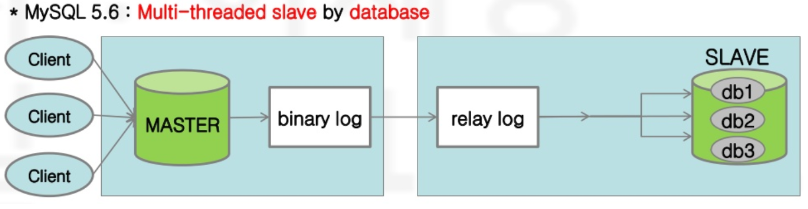

### 基於 Group Commit 的 MTS (5.7)

#### Group Commit 簡述

Group Commit 是 MySQL 5.6 版本引入用來優化 BinLog、RedoLog 在 2PC 時寫入的瓶頸，簡單來說原本每個 Transaction 都需要獨自 `fsync` 操作來寫入 Disk 持久化，經過 Group Commit 的優化後會將多個 Transaction 組成一個對列一起進行 `fsync` 操作，大幅減少 `fsync` 操作解決在雙 1 時造成的性能急速下降的問題。

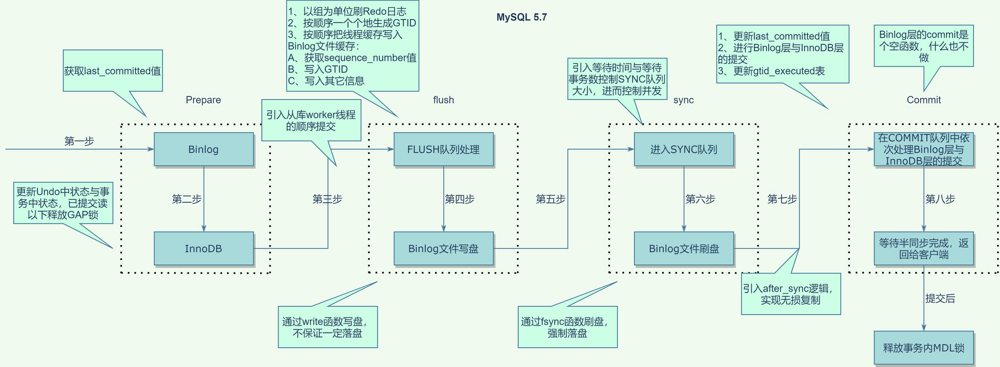

關於 Group Commit 的具體描述，可參考 [MySQL Group Commit 演進]()。

#### slave_parallel_type

在 MySQL 5.7 引入了 `slave_parallel_type` 這個新參數，可使用的值有以下 2 個：

- DATABASE：也就是 5.6 版本，不同 DATABASE 的才能並行回放。
- LOGICAL_CLOCK：5.7 版本基於 Group Commit 的並行回放。

#### LOGICAL_CLOCK - Commit Parent Based 模式

在 Source 中能夠在同一個對列一起進行 Group commit，表示這個對列中的所有 Transaction 都沒有鎖衝突，因此也可在 Replica 內並行回放。

為了讓 Replica 能基於 Group Commit 實現 MTS，在 Binlog 中為每個 Transaction 添加了 LOGICAL CLOCK 也就是以下 2 個值：

- sequence_number：每個 Transaction 的唯一序列號，具體在 Transaction 進入 flush 階段的對列之前分配。
- last_commited：紀錄上次 Group commit 時最大的 sequence_number，也就是說 last_committed  相同表示同屬一個 Group。

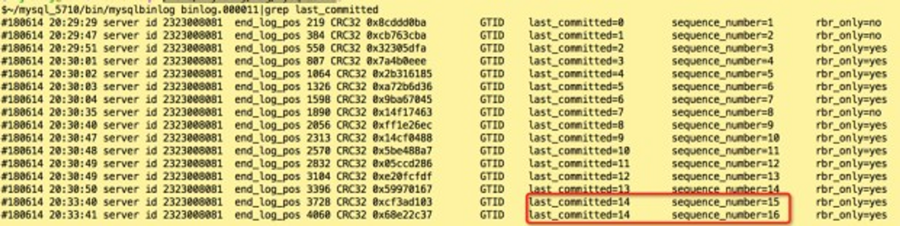

透過 mysqlbinlog 可以看到 binlog 中每個 Transaction 都有這 2 個變量

備註：sequence_number、last_commited 只在同一個 BinLog 文件不重複，每當換到新的 BinLog 文件時會重新從 0 開始計數。

---

不過 Commit Parent Based 有一個缺陷，讓我們看一下例子：

```
Trx1 ------------P----------C-------------------------------->
                                |
Trx2 ----------------P------+---C---------------------------->
                                |   |
Trx3 -------------------P---+---+-----C---------------------->
                                |   |     |
Trx4 -----------------------+-P-+-----+----C----------------->
                                |   |     |    |
Trx5 -----------------------+---+-P---+----+---C------------->
                                |   |     |    |   |
Trx6 -----------------------+---+---P-+----+---+---C---------->
```

每一個水平線代表一個 Transaction 由左到右的時間點，其中 P 表示 prepare 階段取得上一個 Group 更新 last_committed 的時間點，C 表示 commit 前更新 last_committed 的時間點。

其中可以觀察到：

- Trx4 的 P 時間點取得的是 Trx1 commit 產生的 last_committed
- Trx5 和 Trx6 的 P 時間點取得的是 Trx2 commit 產生的 last_committed

依照 Commit Parent 模式下 Trx5、Trx6 可以一起在 Replica 回放，但是 Trx4 不可以和 Trx5、Trx6 一起在 Replica 回放。

然而，實際上依照時間線我們可以看到 Trx4 在 prepare 到 commit 的過程中，Trx5、Trx6 有在這個過程中 prepare，也就是說實際上他們並沒有鎖衝突 (如果衝突 Trx5、Trx6 會卡在 lock wait)，所以理論上他們在 Replica 是可以並行回放到。

#### LOGICAL_CLOCK -  Lock Based 模式

為了進一步優化 Commit Parent Based 的缺陷，MySQL 5.7 馬上實現了 [MySQL :: WL#7165: MTS: Optimizing MTS scheduling by increasing the parallelization window on master](https://dev.mysql.com/worklog/task/?id=7165) 的優化，也就是基於 Lock Based 模式的 LOGICAL_CLOCK，只要 Transaction 在各自持有的鎖沒有衝突時就可以並行執行。

在此模式下 binlog 中的 sequence_number、last_commited 涵義如下：

- sequence_number：每個 Transaction 的唯一序列號，具體在 Transaction 進入 flush 階段的對列之前分配，
- last_commited：當 Transaction 開始加鎖時，將全局變量 max_committed_transaction 當下的值作為 last_commited。
    - 全局變量 max_committed_transaction：已經結束 Lock interval 的最大 sequence_number，每個 Transaction 在 InnoDB commit 階段時，如果自己的 sequence_number > max_committed_transaction 時會將其更新為自己的 sequence_number 。
    - 因為無法預先知道哪一個鎖是最後一個，因此 Transaction 內每一個 DML 都會不斷更新該 Transaction 的 last_commited。

在 Source 寫入 sequence_number、last_commited 之後，接下來就是看 Replica 如何依據這 2 個直來實現 Lock Based 的 MTS。

首先複習一下，只有當 Transaction 和 Transaction 在 Lock ~ Commit (也就是釋放鎖) 之間有交集才能在 Replica 並行回放：

```
- Can execute in parallel:
    Trx1 -----L---------C------------>
    Trx2 ----------L---------C------->

- Can not execute in parallel:
    Trx1 -----L----C----------------->
    Trx2 ---------------L----C------->
```

讓我們首先為上圖中的 L~C 的期間定義一個新的名詞 `Lock interval`：

- Lock interval 的起始點(上圖L)：在 Binlog Prepare 階段取得最後一把鎖的時間點。
- Lock interval 的結束點(上圖C)：在 InnoDB Commit 階段釋放第一把鎖的時間點。

也就是說對於 Replica 在讀取 BinLog 時：

- last_commited 作為 Lock interval 的起始點：因為 Transaction 開始加鎖的邏輯時間是目前最後一個已結束 lock interval 的最後一個 sequence_number，就是全局變量 max_committed_transaction。
- sequence_number 作為 Lock interval 的結束點：因為當該 Transaction 結束 lock interval 時會將自己的 sequence_number 更新到 max_committed_transaction，也就是說對於下個 Transaction 而言的 last_commited。

在 Replica 回放時只有 Transaction 之間如果 last_commited~sequence_number 之間有重疊就可以並行回放。

實現方式如下：

- 定義一個變量 `last_lwm_timestamp`：為一個已經完成回放 Transaction 的 sequence_number ，該 Transaction 其 sequence_number 之前的所有 Transaction 都已經 commit。
- 當 coordinator 線程讀取一個 Transaction 的 last_committed：
    - 當 `last_committed` < `last_lwm_timestamp` 表示 Lock interval  有交集，因此可以丟給 work 線程並行回放。

        ```
            Trx1 -----L---------C------------>
            Trx2 ----------L---------C------->
        ```

    - 當 `last_committed` = `last_lwm_timestamp` 雖然 Lock interval 沒有交集，但是該情況表示前一個 Transaction 完成，所以當前 Transaction 才會拿到前一個的 sequence_number 作為自己的 last_commited，而 `last_lwm_timestamp` 是已經 commit 的 Transaction，因此可以丟給 work 線程回放了。

        ```
            Trx1 -----L----C----------------->
            Trx2 ----------L---------C------->
        ```

    - 當 `last_committed` > `last_lwm_timestamp` 表示 Lock interval 沒有交集，因此不能丟給 work 線程並行回放。

        ```
            Trx1 -----L----C----------------->
            Trx2 ---------------L----C------->
        ```


#### Commit Parent Based VS Lock Based  舉例

假設有以下 binlog：

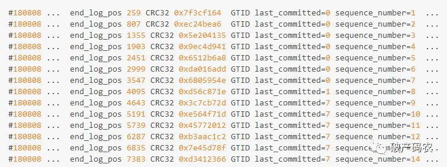

在 Commit Parent Based 下：

- sequence_number 1~7 的 Transaction 其 last_committed 都是 0，所以可在 replica 並行回放。
- sequence_number 8 的 Transaction 其 last_committed 是 1，所以不能和 sequence_number 1~7一起在 replica 並行回放。
  *備註：在 Commit Parent Based 下，正確的 last_committed 應該要是 7，此處僅方便舉例使用 Lock Based 舉例。
- sequence_number 9~14 的 Transaction 其 last_committed 都是 7，不能和 sequence_number 1~8 一起在 replica 並行回放。

在 Lock Based 下：

- sequence_number 1~7 的 Transaction 其 last_committed 都是 0 表示為同一個 Group，所以 1~7 可在 replica 並行回放。
- sequence_number 8 的 last_committed = 1，表示 8 和 1~7 的鎖不衝突，因此 1~8 可在 replica 並行回放。
- sequence_number 9~14 的 Transaction 其 last_committed 都是 7 表示為同一個 Group，同時 8~14 的鎖不衝突，因次 8~14 可在 replica 並行回放

#### 缺陷

基於 Group Commit 的 MTS 不論是 Commit Parent Based 還是 Lock Based 都一樣，都是只有在 Source 上每個 Group 的 Transaction 足夠多，也就是併發度夠高的情況下才能在 Replica 上有較好的並行回放效率。

雖然在 5.7 新增 `binlog_group_commit_sync_delay`、`binlog_group_commit_sync_no_delay_count`這 2 個設定，可以讓一個 Group 有更多的 Transaction，然而效果仍然十分有限。

### 基於 WriteSet 的 MTS (5.7.22、8.0)

MySQL 5.7 雖然透過 Group Commit 優化了 MTS，但這主要是優化在 Master 上有高並行度的情況下，如果 Master 並行度不高則同一個 Group 的 Event 相對少，因此 Slave 回放速度無法有效加快。

在 8.0 為了解決上述問題，即使在 Source 上是串行 commit 的 Transaction，只要互相不衝突那麼在 Replica 上就能並行回放。

在 8.0 新增了 `binlog_transaction_dependency_tracking` 這個參數來控制 binlog 寫入相關資訊，讓 Replica 據此進行並行回放，有以下三個值：

- COMMIT_ORDER：使用 5.7 Group commit 的方式判斷。
- WRITESET：使用 WriteSet 的方式判斷 Transaction 是否有衝突。
- WRITESET_SESSION：WRITESET 的基礎上保證同一個 session 內的 Transaction 不可並行。

#### WriteSet 簡述

`WriteSet` 在 MySQL Group Replication(MGR) 中就已經實現了：

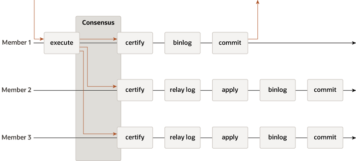

**MySQL Group Replication Protocol**

使用的地方是 certify 階段用來判斷 Transaction 是否允許 commit，這個時候就會透過 `WriteSet` 來判斷是否和其他 member 上的 Transaction 有衝突。

> 💡 因為 MGR 可以在多個 member 上寫入，因此不像單機模式可以透過 Lock 衝突來避免 Transaction 之間的衝突，同時為了提高效能 MGR 採用樂觀的方式不透過其他方式額外加鎖，只有準備 commit 的時候透過 `WriteSet` 判斷 member 之間的 Transaction 是否衝突。

#### WriteSet 應用到 MTS 簡述

假設在 Source 上 Transaction commit 時間軸如下，同一個時間只有 1~2 個 Transaction：

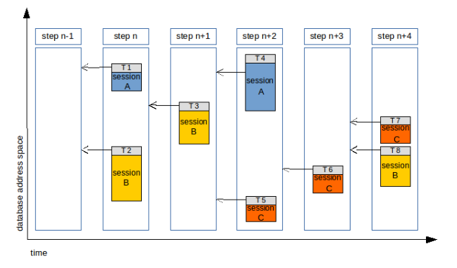

上途中方塊對應 Transaction 修改的資料範圍，如果沒有重疊表示 Transaction 之間修改的數據不衝突，那麼透過 WriteSet 判斷 Transaction 之間是否衝突後，就可以在 Replica上如下並行：

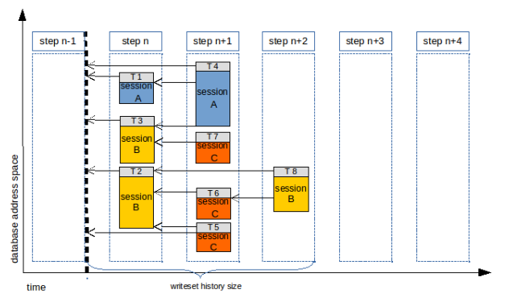

不過上圖有個小問題是可能發生 T3 比 T2 早執行的狀況，導致 Source 和 Replica 中同一個 session 產生有不同的執行紀錄，如果評估後覺得不可接受有以下 2 個方式可以解決：

- slave_preserve_commit_order = ON
- binlog_transaction_dependency_tracking = WRITESET_SESSION

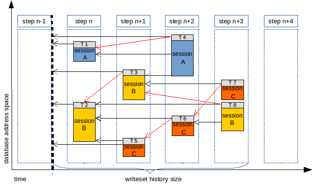

如上圖調整後可以發現同一個 session 的都不能並行回放。

#### 實現方式

### WriteSet 是什麼？

WriteSet 是一個 hash 數組，大小由 `binlog_transaction_dependency_history_size` 來決定。

在 InooDB 修改數據後，會將修改的 row 數據以下內容進行 hash 後寫入 `WriteSet`：


- WriteSet 產出細節

    
   > 💡 產生的 Hash 值的方式可以參考 sql/rpl_write_set_handler.cc 中的 add_pke function
    [mysql-server/rpl_write_set_handler.cc at 8.0 · mysql/mysql-server · GitHub](https://github.com/mysql/mysql-server/blob/8.0/sql/rpl_write_set_handler.cc)

  範例：

    ```sql
    mysql> use db_name
    Database changed
    
    mysql> show create table table_name \G
    *************************** 1. row ***************************
           Table: table_name
    Create Table: CREATE TABLE `table_name` (
      `pk_column` int(11) NOT NULL,
      `uk_column` int(11) NOT NULL,
      `idx_column` int(11) NOT NULL,
      PRIMARY KEY (`pk_column`),
      UNIQUE KEY `uk_column` (`uk_column`),
      KEY `idx_column` (`idx_column`)
    ) ENGINE=InnoDB DEFAULT CHARSET=utf8mb4
    
    mysql> INSERT INTO db_name.table_name VALUES(6, 7, 8)
    ```

    ```bash
    # 透過編譯 mysqld debug 執行查看
    ~ -> tail -f /tmp/mysqld.trace
    T@6: | | | | | | | | <generate_hash_pke 441
    T@6: | | | | | | | | >generate_hash_pke
    T@6: | | | | | | | | | >Rpl_transaction_write_set_ctx::add_write_set
    T@6: | | | | | | | | | <Rpl_transaction_write_set_ctx::add_write_set 51
    T@6: | | | | | | | | | info: pke: PRIMARY½db_name½7table_name½106½1; hash: 10113078337023140702
    T@6: | | | | | | | | <generate_hash_pke 441
    T@6: | | | | | | | | >generate_hash_pke
    T@6: | | | | | | | | | >Rpl_transaction_write_set_ctx::add_write_set
    T@6: | | | | | | | | | <Rpl_transaction_write_set_ctx::add_write_set 51
    T@6: | | | | | | | | | info: pke: uk_column½db_name½7table_name½107½1; hash: 406567197175550244
    ```

  偽代碼如下：

    ```cpp
    如果表中存在索引：
       将数据库名，表名信息写入临时变量
       循环扫描表中每个索引：
            如果不是唯一索引：
                 退出本次循环继续循环。
            循环两种生成数据的方式(二进制格式和字符串格式)：
                 将索引名字写入到pke中。
                 将临时变量信息写入到pke中。
                 循环扫描索引中的每一个字段：
                    将每一个字段的信息写入到pke中。
                    如果字段扫描完成：
                       将pke生成hash值并且写入到写集合中。
        如果没有找到主键或者唯一键记录一个标记，后面通过这个标记来
        判定是否使用Writeset的并行复制方式
    ```


### 基於 WriteSet 的 MTS 怎麼實現？

該模式下 Replica 同樣是基於 Source 產生的 binlog 中的 `last_commited` 和 `sequenct_number` 來決定是否可以並行回放，也就是說如果要進一步增加並行回放的效率，就需要盡可能為每個 Transaction 找出更小的 `last_commited`。

基於 WriteSet 的 MTS 能找出更小的 `last_commited` 的方式就是維護一個先前 Transaction 所組成的 WriteSet 的歷史紀錄，之後新進來的 Transaction 計算 WriteSet 後和這個歷史紀錄進行衝突比對，以此來嘗試找出更小的 `last_commited`。

#### binlog_transaction_dependency_tracking 不同對 last_commit 的處理

基於 WriteSet 的 MTS 實際上是基於 ORDER_COMMIT (Group Commit) 進一步處理而已。

根據 binlog_transaction_dependency_tracking 的設定不同，在 Source code 有如下內容：

```cpp
case DEPENDENCY_TRACKING_COMMIT_ORDER:
      m_commit_order.get_dependency(thd, sequence_number, commit_parent);
      break;

case DEPENDENCY_TRACKING_WRITESET:
      m_commit_order.get_dependency(thd, sequence_number, commit_parent);
      m_writeset.get_dependency(thd, sequence_number, commit_parent);
      break;

case DEPENDENCY_TRACKING_WRITESET_SESSION:
      m_commit_order.get_dependency(thd, sequence_number, commit_parent);
      m_writeset.get_dependency(thd, sequence_number, commit_parent);
      m_writeset_session.get_dependency(thd, sequence_number, commit_parent);
      break;
```

可以看到從 COMMIT_ORDER 到 WRITESET 再到 WRITESET_SESSION 其實都是以上一個設定的為基礎進一步透過一個新的 function 進行修改而已，這些 function 修改的是 `last_commited` 值。

#### WriteSet 歷史紀錄詳解

WriteSet 的歷史紀錄包含了 2 個元素：

- WriteSet 的 Hash 值
- 最後一次修改該行的 Transaction 其 `sequence_number`

```cpp
/*
    Track the last transaction sequence number that changed each row
    in the database, using row hashes from the writeset as the index.
  */
  typedef std::map<uint64,int64> Writeset_history; //map实现
  Writeset_history m_writeset_history;
```

另外 `binlog_transaction_dependency_history_size` 決定了可以儲存幾組紀錄，內部會依照 WriteSet Hash 值進行排序。

如果 WriteSet 的歷史紀錄達到 `binlog_transaction_dependency_history_size`  設定的值就會將歷史紀錄清空，並且本次的 Transaction 會成為清空後歷史紀錄的第一筆紀錄。

另外除了歷史紀錄還有有一個 `m_writeset_history_start` 的值，用來儲存這個歷史紀錄中的最小 `sequence_number`。

```cpp
if (exceeds_capacity || !can_use_writesets)
//Writeset的历史MAP已满
  {
    m_writeset_history_start= sequence_number; 
//如果超过最大设置，清空writeset history。从当前seq number 重新记录， 也就是最小的那个事务seq number
    m_writeset_history.clear();
//清空历史MAP
  }
```

#### WriteSet MTS 對 last_commit 的處理流程

這裡透過一個例子解釋，假設如下：

- 當前的 Transaction 基於 ORDER_COMMIT (Group Commit) 的方式產生了結果：
    - last_commit = 125
    - sequence_number = 130
- 該 Transaction 修改的表只有 PK 沒有 UK。
- 該 Transaction 修改了 4 行資料，分別為 ROW1、ROW7、ROW6、ROW10。

下圖展示了該 Transaction 和 WriteSet 歷史紀錄：

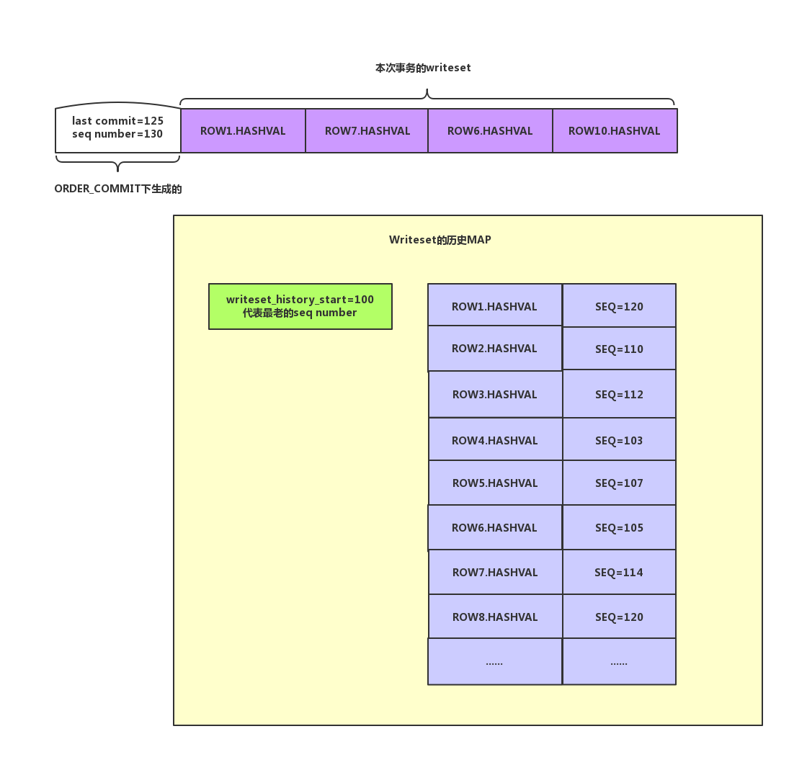

接下來就會透過 WriteSet 方式找到更小的 last_commit：

1. 將 last_commit 由 125 調整為 100 (歷史紀錄中最小的 sequence_number `m_writeset_history_start`)。

   備註：因為該 Transaction 比歷史紀錄中的 Transaction 晚執行，因此 last_commit 一定都比他們的 sequence_number 大。

2. 將 ROW1 的 Hash 值在 WriteSet 歷史紀錄中確認，發現有修改相同紀錄的 Transaction：
    - 將歷史紀錄中該行的 sequence_number 由 120 (歷史紀錄值) 調整為 130(該 Transaction)。
    - 將該 Transaction 的 last_commit 由 100 調整為 120。
3. 將 ROW7 的 Hash 值在 WriteSet 歷史紀錄中確認，發現有修改相同紀錄的 Transaction：
    - 將歷史紀錄中該行的 sequence_number 由 114 (歷史紀錄值) 調整為 130(該 Transaction)。
    - 當前 Transaction 當前 last_commit 為 120 比歷史紀錄中的 114 大，因為在 120 就衝突了，所以不能改成更小的 114，因此 last_commit 不變依舊是 120。
4. 將 ROW6 的 Hash 值在 WriteSet 歷史紀錄中確認，發現有修改相同紀錄的 Transaction：
    - 將歷史紀錄中該行的 sequence_number 由 105 (歷史紀錄值) 調整為 130(該 Transaction)。
    - 當前 Transaction 當前 last_commit 為 120 比歷史紀錄中的 105 大，因為在 120 就衝突了，所以不能改成更小的 105，因此 last_commit 不變依舊是 120。
5. 將 ROW10 的 Hash 值在 WriteSet 歷史紀錄中確認，發現並沒有修改相同紀錄的 Transaction：
    - 因為沒有找到相同的 WriteSet，因此需要把該 Transaction ROW10 的 Hast 值和 sequence_number 寫入 WriteSet 歷史紀錄。
        - 如果歷史紀錄大小超過 `binlog_transaction_dependency_history_size`，則清空當前歷史紀錄，隨後將 Transaction ROW10 的 Hast 值和 sequence_number(130) 寫入 WriteSet 新的歷史紀錄，並將 `m_writeset_history_start` 改為 130。
        - 如果歷史紀錄大小沒有超過 `binlog_transaction_dependency_history_size`，將 Transaction ROW10 的 Hast 值和 sequence_number(130) 寫入 WriteSet 當前歷史紀錄。

整個過程結束，該 Transaction 的 last_commit 由原本的 125 降低為 120，最後結果如下圖：

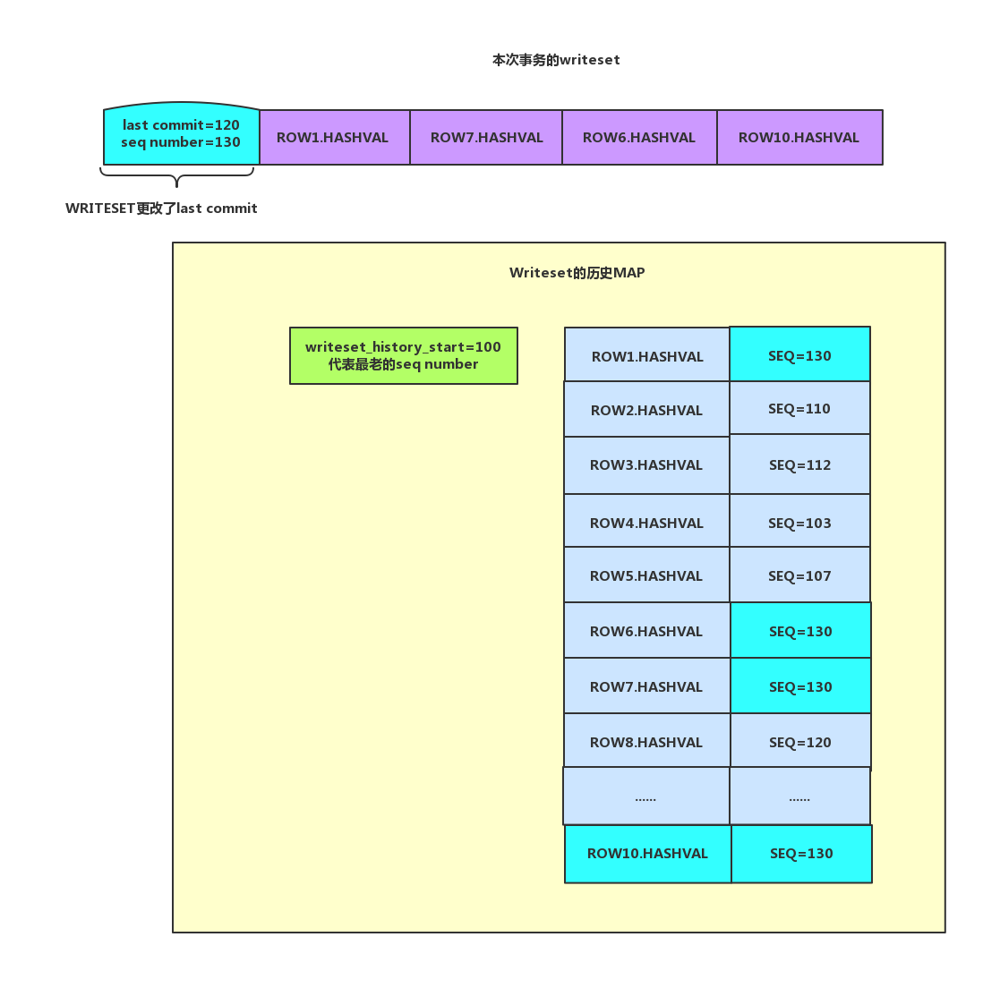

- 該過程在 Function `Writeset_trx_dependency_tracker::get_dependency` 中：

    ```cpp
    if (can_use_writesets) //如果能够使用writeset 方式
      {
        /*
         Check if adding this transaction exceeds the capacity of the writeset
         history. If that happens, m_writeset_history will be cleared only after  而 add_pke
         using its information for current transaction.
        */
        exceeds_capacity=
          m_writeset_history.size() + writeset->size() > m_opt_max_history_size; 
    //如果大于参数binlog_transaction_dependency_history_size设置清理标记
        /*
         Compute the greatest sequence_number among all conflicts and add the
         transaction's row hashes to the history.
        */
        int64 last_parent= m_writeset_history_start;
    //临时变量，首先设置为最小的一个seq number
        for (std::set<uint64>::iterator it= writeset->begin(); it != writeset->end(); ++it)
    //循环每一个Writeset中的每一个元素 
        {
          Writeset_history::iterator hst= m_writeset_history.find(*it);
    //是否在writeset history中 已经存在了。 map中的元素是 key是writeset 值是sequence number
          if (hst != m_writeset_history.end()) //如果存在
          {    
            if (hst->second > last_parent && hst->second < sequence_number) 
              last_parent= hst->second;
    //如果已经大于了不需要设置
            hst->second= sequence_number; 
    //更改这行记录的sequence_number
          }
          else
          {
            if (!exceeds_capacity)
              m_writeset_history.insert(std::pair<uint64, int64>(*it, sequence_number));
    //没有冲突则插入。
          }
        }
    
    ......
        if (!write_set_ctx->get_has_missing_keys())
    //如果没有主键和唯一键那么不更改last commit
        {
          /*
           The WRITESET commit_parent then becomes the minimum of largest parent
           found using the hashes of the row touched by the transaction and the
           commit parent calculated with COMMIT_ORDER.
          */；
          commit_parent= std::min(last_parent, commit_parent);
    //这里对last commit做更改了。降低他的last commit
        }
      }
        }
      }
    
      if (exceeds_capacity || !can_use_writesets)
      {
        m_writeset_history_start= sequence_number; 
    //如果超过最大设置 清空writeset history。从当前sequence 重新记录 也就是最小的那个事务seqnuce number
        m_writeset_history.clear();//清空真个MAP
      }
    ```


#### WRITESET_SESSION 怎麼做?

前面有提到過 WRITESET_SESSION 是基於 WRITESET 的基礎上繼續處理的，WRITESET_SESSION 要做到的是同一個 session 的 Transaction 不能在 Replica 並行回放，要實現非常簡單：

```cpp
int64 session_parent= thd->rpl_thd_ctx.dependency_tracker_ctx().
                        get_last_session_sequence_number();
//取本session的上一次事务的seq number
  if (session_parent != 0 && session_parent < sequence_number) 
//如果本session已经做过事务并且本次当前的seq number大于上一次的seq number
    commit_parent= std::max(commit_parent, session_parent);
//说明这个session做过多次事务不允许并发，修改为order_commit生成的last commit
  thd->rpl_thd_ctx.dependency_tracker_ctx().
    set_last_session_sequence_number(sequence_number);
//设置session_parent的值为本次seq number的值
```

#### 關於 binlog_transaction_dependency_history_size 參數說明

該參數默認值為 25000，代表的是 WriteSet 裡元素的數量。

從前面 WriteSet 實現細節說明中我們可以知道修改一行數據可能會產生多個 Hash，所以這個值不會等於修改的行數，可以理解為如下：

- 5.7 版本：binlog_transaction_dependency_history_size = 修改的行數 * ( 1 + UK 數量 ) * 2
- 8.0 版本：binlog_transaction_dependency_history_size = 修改的行數 * ( 1 + UK 數量 )

備註：不同原因在於 5.7 會生成包含 collation 和不包含 collation，在 8.0 中則沒有。

如果將這個參數加大，那麼 Source 上的 WriteSet 就能放越多的元素，也就是說 Transaction 可以生成更小的 last_commited，這在 Replica 上就能提高並行回放的效率，當然缺點就是在 Source 會消耗更多的資源。

#### WriteSet 不適用情境

以下情境不適用 WriteSet，MySQL 會自動退回使用 commit_order (基於 group commit) 模式

1. 沒有 PK 也沒有 UK
2. DDL
3. session 的 hash 算法換 history 不同
4. Transaction 更新了有 Forign key 關聯的欄位

## **slave_preserve_commit_order 介紹**

當開啟 MTS 且 slave_parallel_type = LOGICAL_CLOCK (不論具體是基於 commit_order 還是 writeset) 的時候，有可能會發生 Source 和 Replica 執行順序不同的情況，雖然這並不會導致資料不一致的狀況，但是可能會發生在 Source 上先看到 T1 才看到 T2 卻在 Replica 上卻是先看到 T2 才看到 T1 執行，也就是說在 Source 和 Replica 各自的 binlog 歷史紀錄順序也會不一致，沒有保證 `Causal Consistency`。

> 💡 `Causal Consistency` (因果一致性) 意思是如果兩個事件有因果關係，那麼在所有節點都必須能觀測到這種因果關係。

如果評估業務需要保證`Causal Consistency`，除了不使用 MTS 使用單線程 replication 也可以透過設置 `slave_preserve_commit_order=ON`  來避免，這會讓 Replica 上回放的 Transaction 在進入 flush 階段之前會先等待 sequence_number 之前的 Transaction 先進入 flush 階段。

### GAP

如果 `slave_preserve_commit_order = OFF` 除了上面提到 `Causal Consistency` 還有一個問題在官方文檔中稱為 GAP。

開啟 MTS 時透過 show slave status 查看 `Exec_Source_Log_Pos` 指的是 `low-watermark` 也就是保證這個 postition 之前的 Transaction 都已經 commit，但是該 postition 之後的 Transaction 有可能 commit 也可能沒有 commit，

## 相關參數

- [slave_parallel_workers](https://dev.mysql.com/doc/refman/8.0/en/replication-options-replica.html#sysvar_slave_parallel_workers) (5.6 \~ 8.0.25)、[replica_parallel_workers](https://dev.mysql.com/doc/refman/8.0/en/replication-options-replica.html#sysvar_replica_parallel_workers) (8.0.26 \~)

  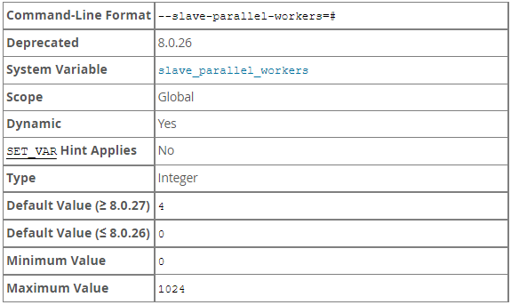

  設定要在 replica 並行的 thread 數量。

  如果 slave 有多個 channel，則每個 channel 都會有此數量的 thread。

  設置此參數後必須重新 START REPLICA 才會生效。

- [slave_parallel_type](https://dev.mysql.com/doc/refman/8.0/en/replication-options-replica.html#sysvar_slave_parallel_type) (5.7 \~ 8.0.25)、[replica_parallel_type](https://dev.mysql.com/doc/refman/8.0/en/replication-options-replica.html#sysvar_replica_parallel_type) (8.0.26 \~ 8.0.29)

  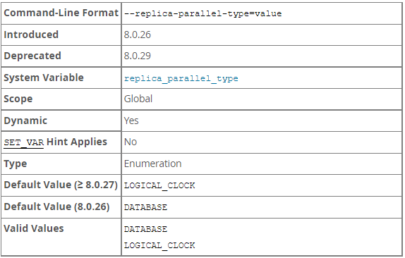

  設定在 replica 上允許哪些 Transaction 並行回放

    - DATABASE：Transaction 必須作用於不同 Database 才能並行。
    - LOGICAL_CLOCK：基於 Source 寫入 binlog 的 timestamp 來決定 Transaction 的並行，也就是基於 Group Commit。

  建議將 binlog_transaction_dependency_tracking 設置為 WRITESET 或 WRITESET_SESSION ，這樣在合適的情況下會走 WriteSet 來提高並行度。

  預計 8.0.29 之後棄用此參數，總是以 LOGICAL_CLOCK 的方式運行。

- [binlog_group_commit_sync_delay](https://dev.mysql.com/doc/refman/8.0/en/replication-options-binary-log.html#sysvar_binlog_group_commit_sync_delay)

  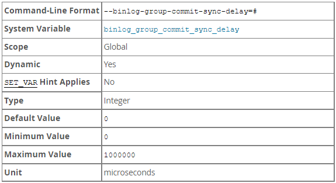

  控制 binlog commit 之後等待 N 微秒後才 fsync 到 Disk，設置越大單個 Group 可以有更多時間等到更多的 Transaction 一起 fsync Disk，減少 fsync 的次數及減少每個 Transaction commit 的單位時間。

  此外適度的增加對於以下設置的 MTS 也能增加在 Slave 的並行度：

    ```
    # Master
    binlog_transaction_dependency_tracking = COMMIT_ORDER
    
    # Slave
    slave_parallel_type = LOGICAL_CLOCK
    ```

  注意：會增加 server 上 transaction 的延遲，也就是 client 端收到 transaction commit 的時間會變晚，另外相應的會增加資源的競爭，因此需評估最好的設置。

  補充：在有 Group Commit 之後，sync_binlog 的單位指的是 Group 而不是 Transaction，例如：sync_binlog = 1000，表示的不是每 1000 個 Transaction 就 sync binlog，而是每 1000 個 Group 才 sync binlog。

- [binlog_group_commit_sync_no_delay_count](https://dev.mysql.com/doc/refman/8.0/en/replication-options-binary-log.html#sysvar_binlog_group_commit_sync_no_delay_count)

  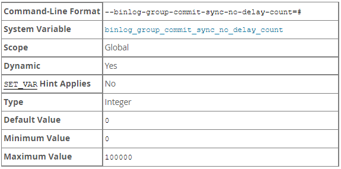

  在 Group commit 中等待的 N 個 Transaction 後就不等待 binlog_group_commit_sync_delay 設置的時間直接開始 sync binlog。

  當 binlog_group_commit_sync_delay = 0 ，此參數無效。

- [slave_preserve_commit_order](https://dev.mysql.com/doc/refman/8.0/en/replication-options-replica.html#sysvar_slave_preserve_commit_order) (5.7 \~ 8.0.25)、[replica_preserve_commit_order](https://dev.mysql.com/doc/refman/8.0/en/replication-options-replica.html#sysvar_replica_preserve_commit_order) (8.0.26 \~)

  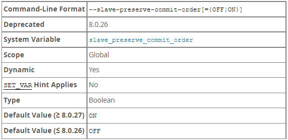

  只有當 slave_parallel_type = LOGICAL_CLOCK 且 log-slave-updates 開啟時才能設置。

  當設置為 0 或 OFF 時，在 Replica 上的讀取操作無法滿足 `Causal Consistency` ，在 Source 和 Replica 上 Transaction 在 binlog 中可能有不同的寫入順序，另外在檢查 Replica 上最近執行的 Transaction 無法保證對應到 Source 上該 Transaction 位置之前的 Transaction 都已經執行完畢。

  設置為 1 或 ON 確保 Transaction 在執行時按照在 relay log 中的順序，這可以讓 Master 和 Replica 有相同的  Transaction history log，也就是符合 `Causal Consistency`。

- [binlog_transaction_dependency_tracking](https://dev.mysql.com/doc/refman/8.0/en/replication-options-binary-log.html#sysvar_binlog_transaction_dependency_tracking) (5.7.22 \~)

  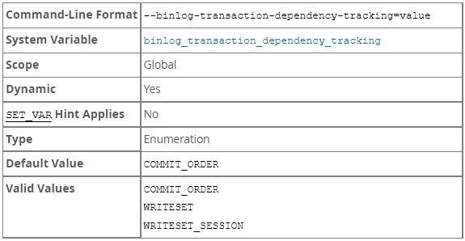

  指定 Source 依據什麼方式來生成 Transaction 之間的依賴關係寫入 binlog，協助 Replica 確定那些 Transaction 能夠並行執行。

  必須設置 replica_parallel_type 為 LOGICAL_CLOCK。

  有以下三種值：

    - COMMIT_ORDER：使用 5.7 Group commit 的方式判斷。
    - WRITESET：使用 WriteSet 的方式判斷 Transaction 是否有衝突。
    - WRITESET_SESSION：WRITESET 的基礎上保證同一個 session 內的 Transaction 不可並行。
- [binlog_transaction_dependency_history_size](https://dev.mysql.com/doc/refman/8.0/en/replication-options-binary-log.html#sysvar_binlog_transaction_dependency_history_size) (8.0 \~)

  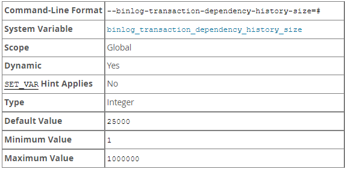

  WriteSet 會判斷 Transaction 之間是否衝突，因此需要將 commit 的 Transaction 修改的行 hash 後暫時保存在內存。

  此參數用來設定儲存的 hash 上限，超過此上限會清除先前的歷史紀錄。

  若 Source 性能有餘裕可以考慮提升此參數，進一步提高 Replica 的並行度。

- [transaction_write_set_extraction](https://dev.mysql.com/doc/refman/8.0/en/replication-options-binary-log.html#sysvar_transaction_write_set_extraction)

  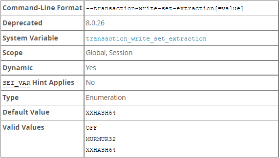

  設定 WriteSet 使用的 Hash 演算法。

  MySQL 5.7 預設為 OFF，MySQL 8.0.26 後棄用，一般不用特別調整。


## 官方測試數據

以下為官方使用SYSBENCH進行壓測的圖表，可以觀察到：

- 在 Source 低並行率的情況，WRITESET 的機制下 Replica 仍舊能夠有良好的並行率。
- 當 Source 並行率越高，COMMIT_ORDER 和 WriteSet 差距會縮小。

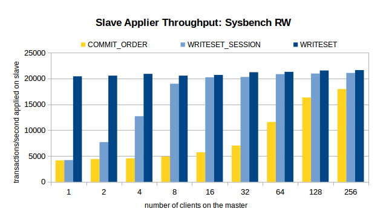

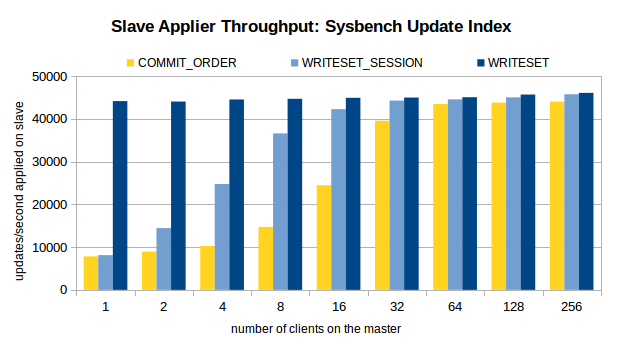

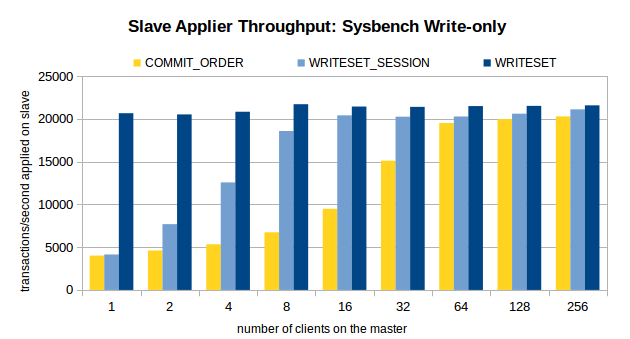

## 親自測試

環境：Mysql 8.0.12，測試前stop slave，待sysbench跑完後在start slave

確認在performance_schema中，MTS相關的統計ENABLED皆有開啟(YES)

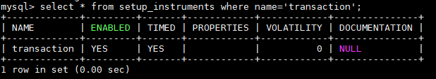

(*啟用或禁用transaction event的收集)

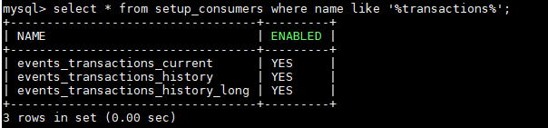

(分別為當前的transaction event，每個線程最近的transaction event，global(跨線程)最近的transaction event)

查詢MTS並行度的語法

```
select thread_id,count_star
from events_transactions_summary_by_thread_by_event_name
where thread_id in (
select thread_id
from replication_applier_status_by_worker
);

OR

USE test;
CREATE VIEW rep_thread_count AS SELECT a.THREAD_ID AS THREAD_ID,a.COUNT_STAR AS COUNT_STAR
FROM performance_schema.events_transactions_summary_by_thread_by_event_name a
WHERE a.THREAD_ID in (SELECT b.THREAD_ID FROM performance_schema.replication_applier_status_by_worker b);

SELECT SUM(COUNT_STAR) FROM rep_thread_count INTO @total;
SELECT 100*(COUNT_STAR/@total) AS thread_usage FROM rep_thread_count;

#replication_applier_status_by_worker可以查看replication各個線程的運作狀況
#events_transactions_summary_by_thread_by_event_name彙總的每個線程的事件名稱，包含已關閉線程
#透過replication...table找出正在運作的線程再到event...table找到他們的count_star(執行的transaction數量)
```

首次壓測以Threads 1 進行10分鐘壓測

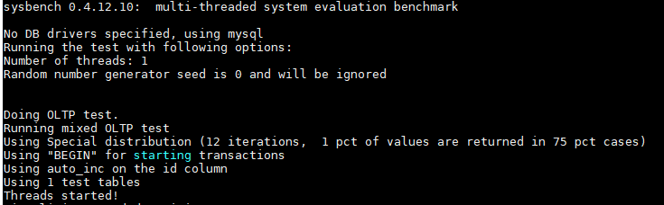

在commit_order下測試(即MySQL 5.7使用)

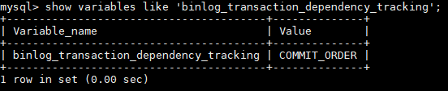

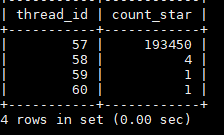

在WriteSet下測試(MySQL 8.0新方案)

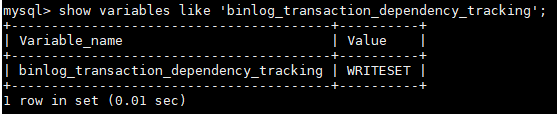

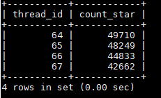

接著試試看Threads 128進行10分鐘壓測

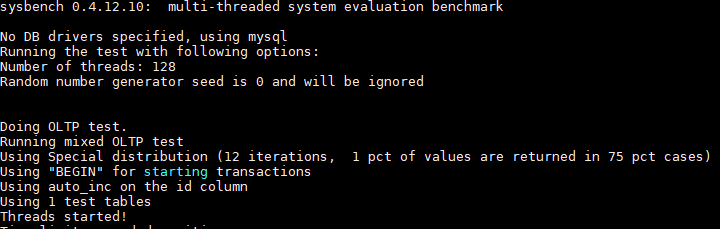

在commit_order下測試(即MySQL 5.7使用)


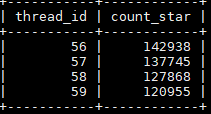

在WriteSet下測試(MySQL 8.0新方案)


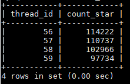

測試結果基本上和官方提供的差不多，主要是解決在Master低並行度的情況下，提高MTS的效率。

## LOG

當開啟 MTS 且 log_error_verbosity = 3 (NOTE) 時，會在

```
2023-01-30T03:08:36.440821Z 6 [Note] [MY-010559] [Repl] Multi-threaded slave statistics for channel '': seconds elapsed = 277; events assigned = 20795393; worker queues filled over overrun level = 0; waited due a Worker queue full = 0; waited due the total size = 0; waited at clock conflicts = 12923330700 waited (count) when Workers occupied = 0 waited when Workers occupied = 0
```

## 懶人包

### MySQL 5.7~5.7.21 參數設定

- Source (Master)

    ```
    # 以下非必須，依據實際情況評估調整
    binlog_group_commit_sync_delay = ?
    binlog_group_commit_sync_no_delay_count = ?
    ```

- Replica (Slave)

    ```
    # 推薦調整
    slave_parallel_workers = ?
    slave_parallel_type = LOGICAL_CLOCK
    slave_preserve_commit_order = ON
    ```


### MySQL 5.7.22~8.0.XX 參數設定

- Source (Master)

    ```
    # 推薦調整
    binlog_transaction_dependency_tracking = WRITESET_SESSION
    transaction_write_set_extraction = XXHASH64
    
    # 以下依據實際情況評估調整
    # 優先調整
    binlog_transaction_dependency_history_size = ?
    
    # 調整優先度低，因為退化回 commit order 時才有效，情境為：
    # 1. 沒有 pk 或 uk
    # 2. DDL 語句
    # 3. Transaction 的更新包含 FK
    # 4. history 剛被清空
    # 5. 同一個 session 的 Transaction (WRITESET_SESSION)
    binlog_group_commit_sync_delay = ?
    binlog_group_commit_sync_no_delay_count = ?
    ```

- Replica (Slave)

    ```
    # 推薦調整
    slave_parallel_workers = ?
    slave_parallel_type = LOGICAL_CLOCK
    slave_preserve_commit_order = ON
    ```


### MTS 效率確認

調整後可以使用以下語法查看調整後 MTS 並行的效率，理想的情況下同一個 channel 的每個 sql thread 的 count_star 應該差不多：

```sql
-- mysql 5.7 需先開啟以下設定
update performance_schema.setup_consumers set enabled= 'yes' where name like 'events_transactions%'
update performance_schema.setup_instruments set enabled= 'yes' where name like 'transaction'
-- mysql 5.7 需先開啟以上設定

SELECT
    replication_status.CHANNEL_NAME,
    replication_status.thread_id,
    enent_summary.count_star
FROM performance_schema.events_transactions_summary_by_thread_by_event_name AS enent_summary
INNER JOIN performance_schema.replication_applier_status_by_worker AS replication_status
USING(thread_id)
```

## BUG

- [MySQL Bugs: #103636: Slave hangs with slave_preserve_commit_order On](https://bugs.mysql.com/bug.php?id=103636)

  說明：當 replica 設置了 replica_preserve_commit_order = 1 在高負載下長時間使用時，可能會用完 commit order sequence tickets 導致 applier 掛起 (hang) 並且無期限的持續等待 commit order queue。

  影響版本：MySQL 8.0.28 之前

  修復版本： MySQL 8.0.28

  github 資訊：[BUG#32891221 REPLICA HANGS WITH REPLICA_PRESERVE_COMMIT_ORDER ON · mysql/mysql-server@f6bb5e7 · GitHub](https://github.com/mysql/mysql-server/commit/f6bb5e7cc5e57f44c881a3f63ee507102c3e398d)


# 參考

[MySQL · 特性分析 · 8.0 WriteSet 并行复制](http://mysql.taobao.org/monthly/2018/06/04/)

[速度提升5~10倍，基于WRITESET的MySQL并行复制 #M1013# - VicLW - 博客园 (cnblogs.com)](https://www.cnblogs.com/VicLiu/p/14653400.html)

[MySQL 5.7并行复制中并行的真正含义_仲培艺的博客-CSDN博客](https://blog.csdn.net/joy0921/article/details/80130768)

[MySQL · 特性分析 · LOGICAL_CLOCK 并行复制原理及实现分析 (taobao.org)](http://mysql.taobao.org/monthly/2017/12/03/)

[MySQL :: WL#6314: MTS: Prepared transactions slave parallel applier](https://dev.mysql.com/worklog/task/?id=6314)

[MySQL :: WL#7165: MTS: Optimizing MTS scheduling by increasing the parallelization window on master](https://dev.mysql.com/worklog/task/?id=7165)

[MySQL-组提交与并行复制 - 掘金 (juejin.cn)](https://juejin.cn/post/6949470247673921567)

[MySQL :: WL#9556: Writeset-based MTS dependency tracking on master](https://dev.mysql.com/worklog/task/?id=9556)

[MySQL · 引擎特性 · Group Replication内核解析 (taobao.org)](http://mysql.taobao.org/monthly/2017/08/01/)

[社区投稿 | 基于 WRITESET 的并行复制方式 (actionsky.com)](https://opensource.actionsky.com/20190902-mysql/)

[MySQL :: Improving the Parallel Applier with Writeset-based Dependency Tracking](https://dev.mysql.com/blog-archive/improving-the-parallel-applier-with-writeset-based-dependency-tracking/)

[MySQL Group Replication冲突检测机制再剖析 - 知乎 (zhihu.com)](https://zhuanlan.zhihu.com/p/61336729)

[深入浅析一致性模型之Causal Consistency - 知乎 (zhihu.com)](https://zhuanlan.zhihu.com/p/71913226)

[MySQL :: MySQL 8.0 Reference Manual :: 17.5.1.34 Replication and Transaction Inconsistencies](https://dev.mysql.com/doc/refman/8.0/en/replication-features-transaction-inconsistencies.html)

[MySQL :: MySQL 8.0 Reference Manual :: 13.4.2.8 START REPLICA Statement](https://dev.mysql.com/doc/refman/8.0/en/start-replica.html)

[MySQL :: MySQL 8.0 Reference Manual :: 13.7.7.35 SHOW REPLICA STATUS Statement](https://dev.mysql.com/doc/refman/8.0/en/show-replica-status.html)