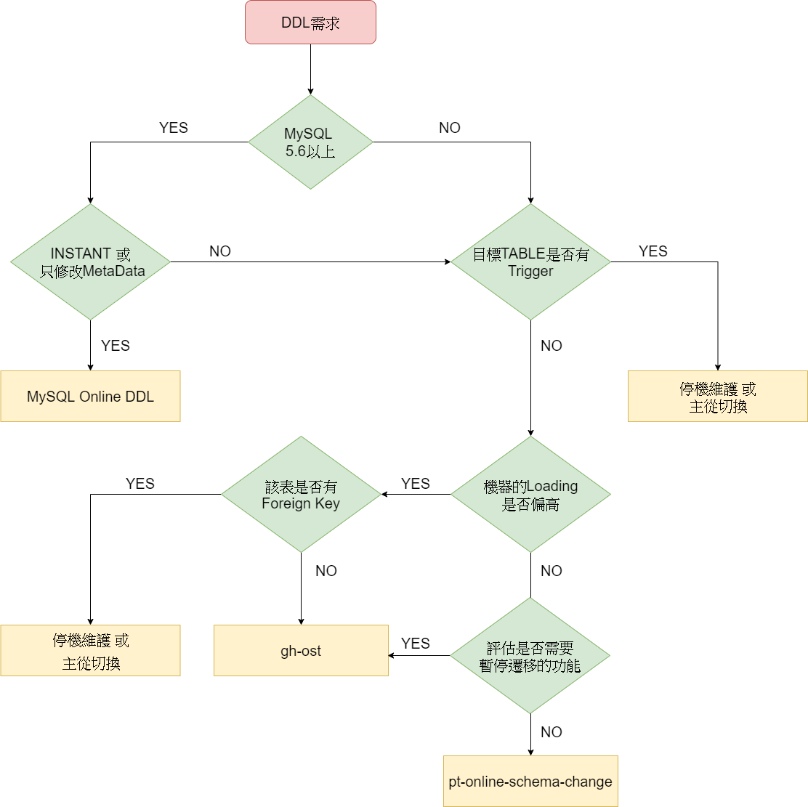

## 決定更新方式



## MySQL Online DDL

```
// 以下更新項目可直接使用 MySQL Online DDL 更新即可
MySQL 5.7：
    1. drop & rename index
    2. rename column & table
    3. 調整默認值
    4. varchar欄位加大 (0~255) or (256~)
    5. 新增 & 刪除虛擬列
    6. auto_increment = ?


MySQL 8.0.29以下 快速加列條件與限制：
    1. 不能和其他不支持 INSTANT 的 DDL 語句同時使用
    2. 只能加在表中的最後一列
    3. 加列不能在 ROW_FORMAT = COMPRESSED 使用
    4. 加列不能在包含 FULLTEXT INDEX 的表中使用
    5. 加列不能添加到 temporary table 中
    6. Columns cannot be added to tables that reside in the data dictionary tablespace.
    7. 只在 UPDATE、INSERT 時，才檢查 ROW 是否符合 TABLE 大小限制

MySQL 8.0.29開始：
    1. 快速加列不再有位置限制
    2. drop column

注意：當達 64 次操作 INSTANT 算法後，需要使用 COPY 算法或 gh-ost 等方案重置此計數，不過 MySQL 9.1 開始次數增加到 225 次。

可透過以下語法確認目前次數：
SELECT NAME, TOTAL_ROW_VERSIONS FROM INFORMATION_SCHEMA.INNODB_TABLES WHERE NAME LIKE 'dbname/tablename';
```

## gh-ost 方案

### 事前設定

```sql
// Linux 安裝 gh-ost
sudo rpm -ivh gh-ost.rpm

// Linux 安裝 nc 
sudo yum install nc

// vim my.cnf，持久化 binlog_format 設定
binlog_format = ROW
binlog_rows_query_log_events = ON
binlog_row_image = full
```

### 執行步驟

1.  `system variables` 檢查

    ```sql
    // 檢查 system variables
    SHOW GLOBAL VARIABLES LIKE 'binlog_format';     # ROW
    SHOW GLOBAL VARIABLES LIKE 'binlog_row_image';  # full
    SHOW GLOBAL VARIABLES LIKE 'sql_mode';          # ''，若不是嚴格模式，需添加-skip-strict-mode
    SHOW GLOBAL VARIABLES LIKE 'log_bin';           # ON
    SHOW GLOBAL VARIABLES LIKE 'log_slave_updates'; # ON
    ```

2. 不要帶入 `--execute` 進行簡易測試

    ```bash
    slave_host="slave_host"
    database_name="ghost_test"
    table_name="event_1"
    ddl_query="ADD COLUMN test varchar(20) AFTER remark,
    ADD COLUMN test2 varchar(20) AFTER test"
    gh_ost_user="OdLd"
    
    # 參數詳細可參考：[https://www.notion.so/eb0d22b2eea64fb7bfed176a8efab6c1?v=b9f4fd843f69483cbbe74aa04c4a1372](gh-ost%20b1e6f809c8c54a009cde6b2b7f1ab00c/%E5%8F%83%E6%95%B8%20eb0d22b2eea64fb7bfed176a8efab6c1.md)
    gh-ost \
    --assume-rbr \
    --exact-rowcount \
    --concurrent-rowcount \
    `# global sql_mode 不是嚴格模式需添加` \
    --skip-strict-mode \
    --host="${slave_host}" --port=3306 --user="${gh_ost_user}" --ask-pass \
    --database="${database_name}" --table="${table_name}" \
    --alter="${ddl_query}" \
    --timestamp-old-table \
    `# gh-ost 的 server_id, 設定為 1000000000 + linux pid` \
    --replica-server-id=$((1000000000+$$)) \
    `# 進入 throttle 的 loading 門檻` \
    --max-load=Threads_running=200 \
    `# 需要監控replication lag 的slave，當gh-ost偵測不到時使用，格式：myhost1.com:3307,myhost2.com:3308` \
    `#--throttle-control-replicas=myhost1.com:3307,myhost2.com:3308` \
    --max-lag-millis=1000 \
    `# 當存在該文件時，進入throttle` \
    --throttle-flag-file=/tmp/gh-ost_${database_name}_${table_name}_throttle.flag \
    --throttle-additional-flag-file=/tmp/gh-ost_all_throttle.flag \
    `# --throttle-query string` \
    `# critical load 設定，格式:some_status=<numeric-threshold>[,some_status=<numeric-threshold>...]` \
    --critical-load=Threads_running=250 \
    --critical-load-hibernate-seconds 60 \
    `# 每次處理的行數，可以視loading調整，預設1000` \
    --chunk-size=1000 \
    `# 範圍 0.0~100.0，每複製完一個chunk的資料後， gh-ost 將休眠 複製消耗的時間 * nice-ratio` \
    `# 假設每複製一個chunk的資料需要 100ms，當 nice-ratio=0.5 時， gh-ost 將休眠 100*0.5=50ms` \
    --nice-ratio=0 \
    `# gh-ost 批次應用 binlog 事件的數量，通常不需要調整` \
    --dml-batch-size=10 \
    `# 該文件存在時，gh-ost會直接中斷，並且不處理已複製的資料` \
    --panic-flag-file=/tmp/gh-ost_${database_name}_${table_name}_panic.flag \
    --force-named-cut-over --force-named-panic \
    `#若想立刻切換新表，請取註解下方參數，但不建議` \
    --postpone-cut-over-flag-file=/tmp/gh-ost_${database_name}_${table_name}_postpone.flag \
    --verbose
    ```

3. 若以上測試後沒有問題可以正式執行

    ```bash
    slave_host="slave_host"
    database_name="ghost_test"
    table_name="event_1"
    ddl_query="ADD COLUMN test varchar(20) AFTER remark,
    ADD COLUMN test2 varchar(20) AFTER test"
    gh_ost_user="OdLd"
    
    gh-ost \
    --assume-rbr \
    --exact-rowcount \
    --concurrent-rowcount \
    `# global sql_mode 不是嚴格模式需添加` \
    --skip-strict-mode \
    --host="${slave_host}" --port=3306 --user="${gh_ost_user}" --ask-pass \
    --database="${database_name}" --table="${table_name}" \
    --alter="${ddl_query}" \
    --timestamp-old-table \
    `# gh-ost 的 server_id, 設定為 1000000000 + linux pid` \
    --replica-server-id=$((1000000000+$$)) \
    `# 進入 throttle 的 loading 門檻` \
    --max-load=Threads_running=200 \
    `# 需要監控replication lag 的slave，當gh-ost偵測不到時使用，格式：myhost1.com:3307,myhost2.com:3308` \
    `#--throttle-control-replicas=myhost1.com:3307,myhost2.com:3308` \
    --max-lag-millis=1000 \
    `# 當存在該文件時，進入throttle` \
    --throttle-flag-file=/tmp/gh-ost_${database_name}_${table_name}_throttle.flag \
    --throttle-additional-flag-file=/tmp/gh-ost_all_throttle.flag \
    `# --throttle-query string` \
    `# critical load 設定，格式:some_status=<numeric-threshold>[,some_status=<numeric-threshold>...]` \
    --critical-load=Threads_running=250 \
    --critical-load-hibernate-seconds 60 \
    `# 每次處理的行數，可以視loading調整，預設1000` \
    --chunk-size=1000 \
    `# 範圍 0.0~100.0，每複製完一個chunk的資料後， gh-ost 將休眠 複製消耗的時間 * nice-ratio` \
    `# 假設每複製一個chunk的資料需要 100ms，當 nice-ratio=0.5 時， gh-ost 將休眠 100*0.5=50ms` \
    --nice-ratio=0 \
    `# gh-ost 批次應用 binlog 事件的數量，通常不需要調整` \
    --dml-batch-size=10 \
    `# 該文件存在時，gh-ost會直接中斷，並且不處理已複製的資料` \
    --panic-flag-file=/tmp/gh-ost_${database_name}_${table_name}_panic.flag \
    --force-named-cut-over --force-named-panic \
    --verbose \
    `#若想立刻切換新表，請取註解下方參數，但不建議` \
    --postpone-cut-over-flag-file=/tmp/gh-ost_${database_name}_${table_name}_postpone.flag \
    --hooks-path=/var/lib/DBA/gh-ost/gh-ost_hooks \
    --execute 2>&1 | tee /tmp/gh-ost_${database_name}_${table_name}.log
    ```

4. 若在非正式環境，可以在切換前直接比較新舊表的部分資料；若在正式環境，可以在切換前到 `備份機` stop slave 後，徹底比較新舊表的資料更安心
5. 確定要切換表之後，開啟另外一個視窗，刪除 `postpone-cut-over-flag-file` 指定的檔案

    ```bash
    #Copy: 0/0 100.0%; Applied: 0; Backlog: 0/1000; Time: 1s(total), 0s(copy); 
    #streamer: bin.000002:104008387; Lag: 0.01s, State: postponing cut-over; ETA: due
    #如上例當進度中出現State: postponing cut-over表示原表皆已遷移完成，此時進度也會是100%
    #可以將新舊表交換了，此時可以透過以下兩種方式繼續下一步切表動作
    
    # 第一種方式
    ls -l /tmp
    rm -f /tmp/gh-ost_databasename_tablename_postpone.flag
    
    # 第二種方式
    echo unpostpone='tablename' | nc -U /tmp/gh-ost.dbname.tablename.sock
    ```

6. 於 loading 較低的時段執行刪除舊表的動作

    ```sql
    DROP TABLE ...
    ```


### 特殊情況

#### _gho(或_ghc) already exists 或 sock: bind:address already in use

當發生錯誤： `_gho(或_ghc)` already exists 或 `sock: bind:address` already in use，有可能是 `上一次遷移失敗` 或者 `已經有gh-ost在遷移該張表`，如果是 `上一次遷移失敗` 請刪除 `table OR socket` 即可正常運作。

```powershell
# table 已存在
FATAL Table `_tablename_gho` already exists. Panicking. 
Use --initially-drop-ghost-table to force dropping it, 
though I really prefer that you drop it or rename it away

# socket 已存在
FATAL listen unix /tmp/gh-ost.databasename.tablename.sock: bind: 
address already in use
```

#### 如果沒有Slave，如何使用 `gh-ost` 呢?

```powershell
# host 的部分填入 master，並加上 allow-on-master 的參數
slave_host="master_host"

gh-ost \
--allow-on-master \
```

#### [error] binlogstreamer.go:77 close sync with err: sync is been closing...

成功執行完畢後出現以下錯誤，若DDL有正常執行可以忽略

```bash
# gh-ost 重複關閉複製通道
[error] binlogstreamer.go:77 close sync with err: sync is been closing...
# 可參考 [https://github.com/github/gh-ost/issues/597](https://github.com/github/gh-ost/issues/597)
```

#### ERROR Error 1146: Table 'account_proxy._sms_validate_code_ghc' doesn't exist

成功執行完畢後出現以下錯誤，若DDL有正常執行可以忽略

```bash
# gh-ost 刪除 ghc table後，binlog應用跟到此語法且被 gh-ost 捕捉到
ERROR Error 1146: Table 'account_proxy._sms_validate_code_ghc' doesn't exist
# 可參考 [https://github.com/github/gh-ost/issues/657](https://github.com/github/gh-ost/issues/657)
```

#### gh-ost 執行過程出現 ERROR 1364

當執行 gh-ost 途中出現 ERROR 1364 如下錯誤：

```bash
Copy: 1/1 100.0%; Applied: 0; Backlog: 0/1000; Time: 22s(total), 1s(copy); streamer: binlog.000002:382415; Lag: 0.12s, State: postponing cut-over; ETA: due
2021-11-24 15:21:26 ERROR Error 1364: Field 'test_2' doesn't have a default value; query=
                        replace /* gh-ost `test`.`_test_gho` */ into
                                `test`.`_test_gho`
                                        (`id`, `test_1`)
                                values
                                        (?, ?)
                ; args=[2 test2]
```

這個原因通常是發生在新增一個 NOT NULL 且沒有 DEFAULT 值的欄位的時候，因為 gh-ost 預設會如下在 session 加上嚴格模式：

```sql
SET SESSION time_zone = '+00:00', 
sql_mode = CONCAT(@@session.sql_mode, ',,NO_AUTO_VALUE_ON_ZERO,STRICT_ALL_TABLES')
```

我們都知道當 sql_mode 在嚴格模式 (STRICT_ALL_TABLES) 之下時，對於 NOT NULL 沒有預設值的欄位如果在 `insert into`  和 `replace into` 沒有給值，就會導致噴錯 `doesn't have a default value` 而無法新增。

接下來讓我們複習一下 gh-ost 是如何作資料遷移的：

| 應用類型 | 原表操作 | 新表操作 |
| --- | --- | --- |
| Row Copy | SELECT | INSERT IGNORE INTO  |
| Binlog Apply | INSERT | REPLACE INTO |

對於原表已經存在的資料 gh-ost  是採用 `INSERT IGNORE INTO` 來寫到 `_gho` 表，所以雖然一樣會發生 ERROR 1364，但是 `IGNORE` 操作只會 `warnings` 提示，而不會阻擋 `INSERT`，如下事例：

```sql
mysql> show create table test\G
*************************** 1. row ***************************
       Table: test
Create Table: CREATE TABLE `test` (
  `id` int NOT NULL AUTO_INCREMENT,
  `test` varchar(10) NOT NULL,
  PRIMARY KEY (`id`)
) ENGINE=InnoDB DEFAULT CHARSET=utf8mb4 COLLATE=utf8mb4_0900_ai_ci

mysql>  INSERT IGNORE INTO test(id) values(1);
Query OK, 1 row affected, 1 warnings (0.00 sec)

mysql> SHOW warnings\G
*************************** 1. row ***************************
  Level: Warning
   Code: 1364
Message: Field 'test' doesn't have a default value

mysql> SELECT * FROM test;
+----+--------+
| id | test_1 |
+----+--------+
|  1 |        |
+----+--------+
```

對於 gh-ost 執行期間 INSERT 進來的新資料是採用 `REPLACE INTO` 來寫到 `_gho` 表，會發生 ERROR 1364 並被阻擋 INSERT，如下事例：

```bash
mysql>  REPLACE INTO test(id) values(2);
ERROR 1364 (HY000): Field 'test_1' doesn't have a default value

mysql> SELECT * FROM test;
+----+--------+
| id | test_1 |
+----+--------+
|  1 |        |
+----+--------+
```

解決方法有兩種：

1. NOT NULL 欄位都加上默認的 defaults 屬性
2. 確保 GLOBAL sql_mode 在非嚴格模式時，可以在 gh-ost 添加 `--skip-strict-mode` 選項。
   添加此選項後 gh-ost 的 session 連線就不會主動設定嚴格模式了，如下：

    ```bash
    SET SESSION time_zone = '+00:00', 
    sql_mode = CONCAT(@@session.sql_mode, ',,NO_AUTO_VALUE_ON_ZERO')
    ```


#### 手動暫時停止 gh-ost 帶來的 loading

```bash
# 暫停 gh-ost 寫入資料
echo throttle | nc -U /tmp/gh-ost.dbname.tablename.sock

# 檢查目前狀況，可以發現 throttled, commanded by user
$ echo status | nc -U /tmp/gh-ost.test.sample_data_0.sock
# Migrating `test`.`sample_data_0`; Ghost table is `test`.`_sample_data_0_gst`
# Migration started at Tue Jun 07 11:56:03 +0200 2016
# chunk-size: 250; max lag: 1500ms; max-load: map[Threads_connected:20]
# Throttle additional flag file: /tmp/gh-ost.throttle
# Serving on unix socket: /tmp/gh-ost.test.sample_data_0.sock
# Serving on TCP port: 10001
Copy: 0/2915 0.0%; Applied: 0; Backlog: 0/100; Elapsed: 59s(copy), 59s(total); streamer: mysql-bin.000551:68067; ETA: throttled, commanded by user

# gh-ost 繼續寫入資料
echo no-throttle | nc -U /tmp/gh-ost.dbname.tablename.sock
```

#### 如何中斷 gh-ost

```bash
# 中斷 gh-ost 
echo panic='tablename' | nc -U /tmp/gh-ost.dbname.tablename.sock
```

#### 調整 gh-ost loading 相關的參數

```bash
# 查詢
echo "chunk-size=?" | nc -U /tmp/gh-ost.dbname.tablename.sock
1000

# 修改
echo "chunk-size=250" | nc -U /tmp/gh-ost.dbname.tablename.sock
# Migrating `test`.`sample_data_0`; Ghost table is `test`.`_sample_data_0_gst`
# Migration started at Tue Jun 07 11:56:03 +0200 2016
# chunk-size: 250; max lag: 1500ms; dml-batch-size: 10; max-load: map[Threads_connected:20]
# Throttle additional flag file: /tmp/gh-ost.throttle
# Serving on unix socket: /tmp/gh-ost.test.sample_data_0.sock
# Serving on TCP port: 10001

# 再次查詢
echo "chunk-size=?" | nc -U /tmp/gh-ost.dbname.tablename.sock
250
```

#### 如何調整 primary key

由於 `gh-ost`要求每次遷移新表和舊表必須共享一個 `唯一且NOT NULL` 的 `KEY(只需要欄位相同，不需要同名)`。因此如果當表中只有 `primary key`時，無法直接調整 `primary key`，而是需要先新增一個 `unique key`，再第二次遷移時才能調整 `primark key`。

```sql
# 原表
CREATE TABLE tbl (
  id bigint unsigned not null,
  data varchar(255),
  new_pk_column int not null,
  PRIMARY KEY(id)
)

# gh-ost 第一次執行
# ddl_query="ADD UNIQUE KEY temp_pk(new_pk_column)"
CREATE TABLE tbl (
  id bigint unsigned not null,
  data varchar(255),
  new_pk_column int not null,
  PRIMARY KEY(id),
	UNIQUE temp_pk(new_pk_column)
)
# 原表和新表以 PRIMARY KEY(id) 作為 Shared key

# gh-ost 第二次執行
# ddl_query="DROP PRIMARY KEY, 
# DROP KEY temp_pk,
# ADD PRIMARY KEY (new_pk_column)"
CREATE TABLE tbl (
  id bigint unsigned not null,
  data varchar(255),
  new_pk_column int not null,
  PRIMARY KEY(new_pk_column)
)
# 原表 UNIQUE temp_pk(new_pk_column) 和新表 PRIMARY KEY(new_pk_column) 
# 作為 Shared key
```

#### 如何解決 Unexpected database port

當對雲服務商的 `rds` 或者 `docker`， `--port` 指定為非 `3306` 時，會因為其內部確實是 `3306` 而導致未通過驗證，此時可以透過使用 `--aliyun-rds` 或 `--gcp` 來跳過驗證。

參考：[https://github.com/github/gh-ost/issues/631](https://github.com/github/gh-ost/issues/631)

```bash
# 對 rds 或 docker 指定 3306 以外的 port
gh-ost \
--port=3307 \
--verbose

# error 
2020-10-16 16:27:09 FATAL Unexpected database port reported: 3306

# 加上 --aliyun-rds 跳過驗證
gh-ost \
--port=3307 \
--aliyun-rds
--verbose

# 正常運作
```

#### gh-ost 偷吃步

只跑一次 `gh-ost` 的偷吃步方法，因為 `gh-ost` 只有在一開始會驗證新舊表是否可以搬遷，所以可以等 `gh-ost` 建立完新表 `gho` 後，先暫停複製資料的過程，我們則可以進到 DB 手動 `ALTER` 新表 `gho`，此方法可以用來越過某些限制，但可能造成資料損毀，請明確知道自己在做什麼才能使用！

```bash
# 透過建立此檔案，讓 gh-ost 建立完新表後就先暫停複製資料(注意：會暫停所有gh-ost)
touch /tmp/gh-ost_all_throttle.flag
# 備註：不使用 throttle-flag-file 是因為必須要 gh-ost 執行後，建立才會生效

# 執行 gh-ost
gh-ost \
--alter="ADD COLUMN test VARCHAR(10) NOT NULL DEFAULT ''" \
... \
--throttle-additional-flag-file=/tmp/gh-ost_all_throttle.flag \
--execute

# Copy: 0/1 0.0%; Applied: 0; Backlog: 0/1000; Time: 0s(total), 0s(copy); streamer: bin-log.000006:305893; Lag: 0.01s, State: migrating; ETA: N/A
# Copy: 0/1 0.0%; Applied: 0; Backlog: 0/1000; Time: 1s(total), 1s(copy); streamer: bin-log.000006:311112; Lag: 0.01s, State: throttled, flag-file; ETA: N/A
# ...

# 進到 MySQL 調整新表
mysql > ALTER TABLE table_gho ADD INDEX test(`test`);

# 刪除 flag
rm -rf /tmp/gh-ost_all_throttle.flag

# gh-ost 正常運行，新的表會同時多一個 test 欄位和 test index
```

```bash
# 執行 gh-ost，讓 throttle 門檻很低，一啟動就暫停
gh-ost \
--alter="ADD COLUMN test VARCHAR(10) NOT NULL DEFAULT ''" \
... \
--max-load=Threads_running=0 \
--execute

# Copy: 0/1 0.0%; Applied: 0; Backlog: 0/1000; Time: 0s(total), 0s(copy); streamer: bin-log.000006:305893; Lag: 0.01s, State: migrating; ETA: N/A
# Copy: 0/1 0.0%; Applied: 0; Backlog: 0/1000; Time: 1s(total), 1s(copy); streamer: bin-log.000006:311112; Lag: 0.01s, State: throttled, flag-file; ETA: N/A
# ...

# 進到 MySQL 調整新表
mysql > ALTER TABLE table_gho ADD INDEX test(`test`);

# 調回門檻
echo "max-load=Threads_running=200" | nc -U /tmp/gh-ost.test.sample_data_0.sock

# gh-ost 正常運行，新的表會同時多一個 test 欄位和 test index
```

## pt-osc 方案

### 執行

1. 給予super權限

    ```sql
    SELECT host FROM mysql.user WHERE user = 'OdLd';
    GRANT PROCESS,SUPER ON *.* TO 'OdLd'@'';
    ```

2. 基本測試

    ```bash
    pt-online-schema-change \
    --host=master_host  --port=3306 \
    u=OdLd,D=database_name,t=table_name \
    --ask-pass \
    `#如果新增的欄位為Not Null 則必須設定Default值,否則pt工具會失敗` \
    --alter "add column test varchar(50) not null default '' after remark" \
    --print \
    --statistics \
    `#slave延遲時間` \
    --max-lag=1500 \
    `#暫停多久後再繼續` \
    --check-interval=5 \
    `#達到 --max-load 會暫停程序` \
    --max-load Threads_running=200 \
    `#達到 --critical-load 會停止程序` \
    --critical-load Threads_running=400 \
    `#若不想立刻切換新表，請註解下方，但不建議` \
    --no-drop-trigger --no-swap-tables \
    `#執行前建議先用dry-run做基本的測試` \
    --charset=utf8 \
    --dry-run 
    ```

3. 正式執行

    ```bash
    pt-online-schema-change \
    --host=master_host  --port=3306 \
    u=OdLd,D=database_name,t=table_name \
    --ask-pass \
    `#如果新增的欄位為Not Null 則必須設定Default值,否則pt工具會失敗` \
    --alter "add column test varchar(50) not null default ''  after remark" \
    --print \
    --statistics \
    `#slave延遲時間` \
    --max-lag=1500 \
    `#暫停多久後再繼續` \
    --check-interval=5 \
    `#達到 --max-load 會暫停程序` \
    --max-load Threads_running=200 \
    `#達到 --critical-load 會停止程序` \
    --critical-load Threads_running=400 \
    `#若不想立刻切換新表，請註解下方，但不建議` \
    --no-drop-trigger --no-swap-tables \
    --charset=utf8 \
    --execute
    ```

4. 如果要手動切換 table－

    ```sql
    # 交換
    RENAME TABLE origan_table TO origan_table_old,new_table TO origan_table;
    
    # 刪除 Trigger
    DROP TRIGGER IF EXISTS database_name.pt_osc_database_name_table_name_del;
    DROP TRIGGER IF EXISTS database_name.pt_osc_database_name_table_name_upd;
    DROP TRIGGER IF EXISTS database_name.pt_osc_database_name_table_name_ins;
    
    # 刪除舊表
    DROP TABLE IF EXISTS origan_table_old;
    
    # 移除權限
    REVOKE PROCESS,SUPER ON *.* FROM 'OdLd'@'';
    ```