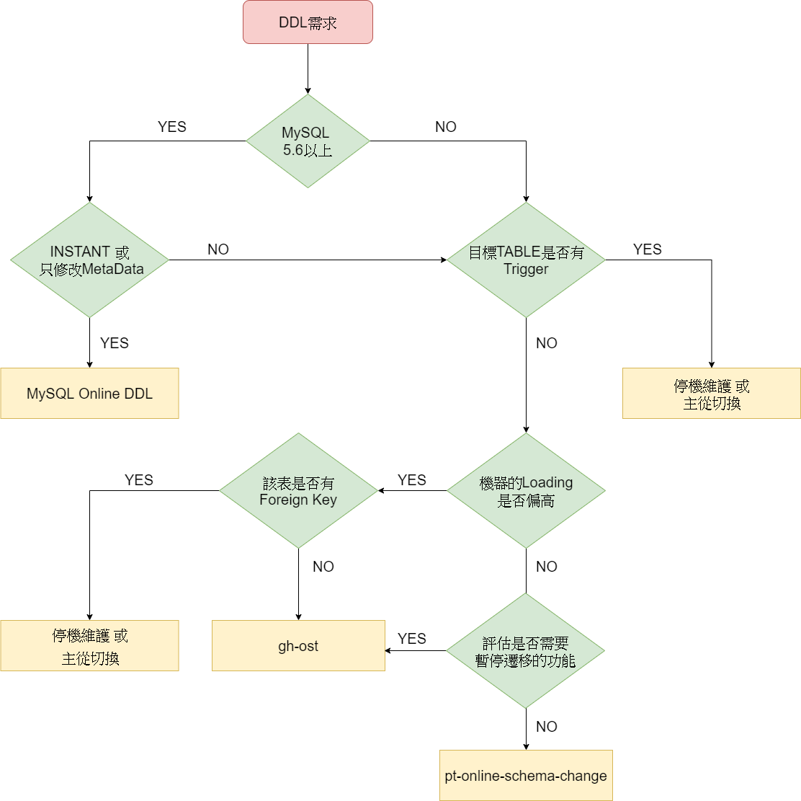

本文較長建議搭配右側目錄點擊查看。
## HOW?


- 建立一張和原表結構相同的 `ghost` 表
- ALTER `ghost` 表
- `gh-ost` 偽裝成 `SLAVE` 從 `Master/Slave` 拉取 `binlog`
- 將資料寫入 `ghost` 表
    - 將 `binlog event` 應用到 `ghost` 表
    - 從原表複製 `rows` 到 `ghost` 表
- 切換 `ghost` 表和原表

上述的步驟中可以看出 `gh-ost` 的大部分和其他online DDL 工具大體相同，唯一的不同處就是 `gh-ost` 不是基於 `trigger` 。 `gh-ost` 的開發團隊認為使用 `trigger` 有許多的限制與風險，有興趣可以參考官方文檔 [Why triggerless](https://github.com/github/gh-ost/blob/master/doc/why-triggerless.md) 這篇說明。

取而代之的是 `gh-ost` 透過 `binlog` 來獲取原表資料的改動，並將之異步應用到 `ghost` 表。 `gh-ost` 承擔了其他工具留給 DATABASE 執行的任務(`trigger`)，等於是完全分離了遷移資料時的寫Loading和 DATABASE 服務本身的 Loading，因此 `gh-ost` 可能更好的控制整個遷移的過程，可以做到真正的暫停。

## 特點

- No `trigger`：這是 `gh-ost`的特點，基於 `trigger`的方案會對 `MySQL`的性能造成較大的影響。 `gh-ost` 解析 `binlog` 後寫入數據，不僅可控對 `MySQL` 的性能影響也很小。
- 真正的暫停：當 `gh-ost`進入 `throttle`狀態時， `gh-ost` 真正停止了對 `MASTER` 的寫入(除了必要的低負載的心跳紀錄)，讓 `MASTER` 可以回到原始的 Loading 狀態。
- 動態控制：即使已經開始運行 `gh-ost`，也可以透過 `交互式命令` 隨時重新配置 `gh-ost` 部分參數，甚至你可以強制讓 `gh-ost` 進入 `throttle` 狀態。
- 可審核：可以透過 `unix socket`、 `TCP` 或 `table _ghc` 查詢 `gh-ost` 狀態。
- 可測試： `gh-ost` 可以在 `SLAVE` 進行遷移，用以觀察 Loading 和 正確性後再投入使用。
- 控制切換階段： `cut over` 是 `gh-ost` 最關鍵的一個步驟，你可以隨時決定 `cut over` 的時間。
- 外部 hook： `gh-ost` 提供 `hook` 功能，例如：可以用於推送到 `SLACK` 群組告知進度。

## 執行步驟
初始步驟檢查一下參數，並新增兩張表 `ghost table(_gho)`、 `log&heartbeat table(_ghc)`

```sql
-- SLAVE
SET autocommit=true
SET NAMES utf8mb4
select @@global.version
select @@global.port
select @@global.hostname, @@global.port
show /* gh-ost */ grants for current_user()
select @@global.log_bin, @@global.binlog_format
select @@global.binlog_row_image
show /* gh-ost */ table status from `ghost_test` like 'event_1'

-- Master
SET autocommit=true
SET NAMES utf8mb4
select @@global.version
select @@global.port
select @@global.time_zone
select @@global.hostname, @@global.port
show columns from `ghost_test`.`event_1`
show /* gh-ost */ table status from `ghost_test` like '_event_1_gho'
show /* gh-ost */ table status from `ghost_test` like '_event_1_del'
drop /* gh-ost */ table if exists `ghost_test`.`_event_1_ghc`
create /* gh-ost */ table `ghost_test`.`_event_1_ghc` (
 id bigint auto_increment,
 last_update timestamp not null DEFAULT CURRENT_TIMESTAMP ON UPDATE CURRENT_TIMESTAMP,
 hint varchar(64) charset ascii not null,
 value varchar(4096) charset ascii not null,
 primary key(id),
 unique key hint_uidx(hint)
) auto_increment=256
create /* gh-ost */ table `ghost_test`.`_event_1_gho` like `ghost_test`.`event_1`
alter /* gh-ost */ table `ghost_test`.`_event_1_gho` ADD COLUMN test varchar(20) AFTER remark
```

根據 `exact-rowcount` 的設定來決定計算行數的方式，在 `Slave` 執行

```sql
--no exact-rowcount：透過explian取得估算值
explain select /* gh-ost */ * from `ghost_test`.`event_1` where 1=1;
--exact-rowcount：透過count(*)取得精準值
select /* gh-ost */ count(*) as rows from `ghost_test`.`event_1`;
```

通過 `order by` 來取得 `shared key` 最小值和最大值範圍

```sql
-- Master
select /* gh-ost `ghost_test`.`event_1` */ `order_id`
from `ghost_test`.`event_1`
order by `order_id` asc limit 1

select /* gh-ost `ghost_test`.`event_1` */ `order_id`
from `ghost_test`.`event_1`
order by `order_id` desc limit 1
```

透過以下語法判斷是否還有未複製的資料

```sql
-- Master
-- 假設每次批次為1000筆
-- 取得每次批次的第1000、2000...筆order_id
select  /* gh-ost `ghost_test`.`event_1` iteration:0 */ `order_id`
from `ghost_test`.`event_1`
where ((`order_id` > _binary'00AD4267F1A3467') or ((`order_id` = _binary'00AD4267F1A3467'))) 
and ((`order_id` < _binary'FEB556F8553843A') or ((`order_id` = _binary'FEB556F8553843A')))
order by `order_id` asc
limit 1 offset 999
 
-- 若上述sql返回空值，則使用此語法撈取最後一筆order_id
select /* gh-ost `ghost_test`.`event_1` iteration:1 */ `order_id`
from (
	select `order_id`
	from `ghost_test`.`event_1`
	where ((`order_id` > _binary'FE01373BB55A45F')) and 
	((`order_id` < _binary'FEB556F8553843A') or ((`order_id` = _binary'FEB556F8553843A')))
	order by `order_id` asc limit 1000
) select_osc_chunk
order by `order_id` desc limit 1
```

當有未複製的資料，透過下面的方式從原表複製資料到 `ghost table`

```sql
-- Master
insert /* gh-ost `ghost_test`.`event_1` */ ignore into `ghost_test`.`_event_1_gho` (`site_id`, `order_id`, `game_hall`, `user_id`, `op_id`, `txn_id`, `amount`, `event_time`, `remark`, `create_time`, `update_time`)
(select `site_id`, `order_id`, `game_hall`, `user_id`, `op_id`, `txn_id`, `amount`, `event_time`, `remark`, `create_time`, `update_time` 
from `ghost_test`.`event_1` force index (`PRIMARY`)
where (((`order_id` > _binary'2B94A39A501247D') or ((`order_id` = _binary'2B94A39A501247D'))) 
and ((`order_id` < _binary'2B94A39A501247D') or ((`order_id` = _binary'2B94A39A501247D')))) 
lock in share mode)
```

最後一步`cut-over` 階段

```sql
-- Master
create /* gh-ost */ table `ghost_test`.`_event_1_del` (
id int auto_increment primary key
) engine=InnoDB comment='ghost-cut-over-sentry'

lock /* gh-ost */ tables `ghost_test`.`event_1` write, `g
host_test`.`_event_1_del` write

rename /* gh-ost */ table `ghost_test`.`event_1` to `ghost_test`.`_event_1_del`, 
`ghost_test`.`_event_1_gho` to `ghost_test`.`event_1`
drop /* gh-ost */ table if exists `ghost_test`.`_event_1_del`
drop /* gh-ost */ table if exists `ghost_test`.`_event_1_ghc`

unlock tables
```

讓我們整理一下 gh-ost 的操作：
| 應用類型         | 原表操作   | 新表操作               |
|--------------|--------|--------------------|
| Row Copy     | SELECT | INSERT IGNORE INTO |
| Binlog Apply | INSERT | REPLACE INTO       |
| Binlog Apply | UPDATE | UPDATE (所有欄位）      |
| Binlog Apply | DELETE | DELETE             |

在數據遷移的過程中，數據的變動有以下三種組合：
- 從原表 `RowCopy` → 對 `原表DML`操作 → `Binlog Apply`
  - 在此情況下一切都照順序運行，因此不論是 `INSERT`、 `UPDATE`、 `DELETE` 都沒有疑慮。
- 對 `原表DML`操作 → `Binlog Apply` → 從原表 `RowCopy`
  - `INSERT`： `Row Copy` 被轉換為 `INSERT INGNORE INTO`，因此不會蓋掉 `Binlog Apply` 的 `INSERT` 操作。
  - `UPDATE、DELETE`：因為還沒從原表 `Copy` 過來，所以 `Binlog Apply` 的操作會沒有任何結果，但是最後從原表 `Copy` 過來時即會是最新的數據，因此也沒有問題。
- 對 `原表DML` 操作 → 從原表 `RowCopy` → `Binlog Apply`
  - `INSERT`： `Binlog Apply:INSERT`被轉換為 `REPLACE INTO`，會覆蓋掉 `Row Copy:INSERT` 操作，但兩者的結果一樣因此不影響。
  - `UPDATE、DELETE`：從原表 `Copy` 過來就是最新的數據，後續的 `Binlog Apply` 也不會影響到數據，因此也沒有問題。

## 要求與限制
Requirements 要求：
- `gh-ost` 需要在 MySQL 5.7 以上的版本上運行
- server 必須開啟 `log_bin`，若為 Slave 同時也必須開啟 `log_slave_updates`
- 需要一台 `binlog_format` 為 `ROW` 及 `binlog_row_image` 為 `full` 模式的 server
- 如果在slave上使用，必須確保要ALTER的TABLE在Master和Slave上Schema相同
- 權限：
  - ALTER, CREATE, DELETE, DROP, INDEX, INSERT, LOCK TABLES, SELECT, TRIGGER, UPDATE ON database.* OR `*.*`
  - SUPER, REPLICATION SLAVE on `*.*` 或 REPLICATION CLIENT, REPLICATION SLAVE on `*.*`
    > `SUPER`權限用於 `STOP SLAVE` 和 `START SLAVE`，具體用途為：
      > 1. 當 `binlog_format`不是 `ROW` 並且指定 `--switch-to-rbr` 時，將切換 `binlog_format` 並重啟 replication。如果是 `ROW` 模式可以指定 `--assume-rbr` 避免 `STOP SLAVE` 和 `START SLAVE` ，在此情況下，不需要提供 `SUPER` 權限。
        (提醒！若自行切換 `binlog_format` 須記得重啟replication！)
      > 2. 運行 `--test-on-replica` 時，gh-ost切換表後會停止 `replication` ，讓使用者比較兩張表。

Limitations 限制：

- 目前不支持外鍵。未來可能會提供一定程度的支持
- 目前不支持trigger。未來可能會提供支持
- 支持MySQL 5.7的 `JSON` ，但前提是不能是 `PRIMARY KEY` 的一部分
- 新表和舊表必須使用相同的 `PRIMARY KEY` 或 `UNIQUE KEY` 。因為複製時會 `gh-ost` 會利用該 KEY遍歷所有行。遷移鍵必須為 `NOT NULL` (可以為空值)。或是有 `NULL屬性` 並使用 `--allow-nullable-unique-key` 但必須確保實際上沒有 `NULL` 值，否則可能導致數據不完整。
- 當存在名稱相同僅大小寫不同的table時無法進行
- 阿里雲RDS能正常運作，僅需要添加 `--aliyun-rds`
- Google Cloud SQL可使用，僅需添加 `--gcp`
- Amazon RDS可以使用，但有些限制，請參閱[官方文檔](https://github.com/github/gh-ost/blob/master/doc/rds.md)
- 當 `SLAVE` 的來源為multi時，無法支持在 `SLAVE` 上執行，建議直接在 `MASTER`上進行，需添加 `--allow-on-master`
- 目前當在 `master-master` 運行 `gh-ost` 時，沒有辦法支援兩邊都有寫入的情況。將來可能支援
- 若將 `enum` 型態的欄位作為 `PRIMARY KEY` 將使性能降低
- 不支援 `federated Table` ，並且與 `gh-ost` 想要解決的方案無關
- 不支持 `ALTER TABLE ... RENAME TO some_other_name` ，這樣的操作不應該是用 `gh-ost`

## 並發遷移(Concurrent migrations)

- 絕對不要運行在同一個 `Table` 上。
- 如果運行在不同的 `SLAVE` 上，不需要其他調整。例如：table1 on slave1 和 table2 on slave2。
- 如果在同一個機器運行 `gh-ost`
  - 確保 `-server-socket-file` 設置不同名稱（或由 `gh-ost` 命名）。
  - 透過 `-throttle-additional-flag-file` 控制所有 `gh-ost`，另外透過 `throttle-flag-file` 控制單一 `gh-ost` 。
- 如果 `-host` 相同，則必須對每個 `gh-ost` 設定唯一的 `replica-server-id` 避免衝突。

## Throttle
### 介紹
在遷移的過中， `gh-ost` 的狀態除了持續的複製原表和應用binlog外，還有另一個狀態是 `throttling`

當 `throttled(限制)` 的時候， `gh-ost` 會暫停所有寫操作，包含複製原表的資料和檢查binlog，但仍會做 `low-volume changlog status writes` 和 `heartbeat writes` 。

當 `gh-ost` 被限制時，對主機的 Loading 將徹底消失，和基於 `trigger` 原理的工具相比這是 `gh-ost` 的優勢，因為 `trigger` 無法暫停會持續的寫入新資料，相反的 `gh-ost` 包含複製原表資料和寫入新資料（透過應用 `binlog event`）都是由 `gh-ost` 進行控制。

`gh-ost` 支持各種限制的方法，並且他能允許使用者動態的調整。

### 參數和因素
#### Replication lag
推薦將 `gh-ost` 連結到 `Slave`， `gh-ost` 會自行找出 `Master` 開始進行遷移的同時， `gh-ost` 有自己的心跳機制去檢查他所連接的 `Slave` 是否有 `replication lag` 的狀況。或者也可以自行指定要檢查 `replication lag` 的清單。

- `--throttle-control-replicas` ：明確列出需要 `gh-ost` 檢查 `replication lag` 的 `Slave` 清單
 範例：--throttle-control-replicas=myhost1.com:3306,myhost2.com,myhost3.com:3307

- `--max-lag-millis`：允許 `replication lag` 的最大值，任何在檢查清單中的 `replication lag` 超過此值都將導致 `throttling`，除非清單中的所有 `replication lag` 都小於此值才會恢復。 
   
以上設定可以透過 `Interaction commands` 來隨時動態調整。

#### Status thresholds
`--max-load` ：當指定的指標超過設定的閾值時，將導致 `throttling` 發生。

範例：--max-load='Threads_running=100,Threads_connected=500'

指標必須是有效且為數字的 [`status variables`](https://dev.mysql.com/doc/refman/5.7/en/server-status-variables.html) (可參考mysql 官網)

#### Throttle query
當提供 `--throttle-query` 時，必須確保返回整數，每秒會執行該查詢(因此應確保此查詢為輕量的)，當返回值 `> 0` 時 `gh-ost` 將進入 `throttling` 狀態；反之當返回值 `<= 0` 時且沒有其他限制因素時，則 `gh-ost` 正常運作

範例：--throttle-query="select hour(now()) between 8 and 17" 表示 `8:00am` 開始進入 `throttling` 狀態，直到 `18:00pm` 解除。

#### HTTP Throttle
The `--throttle-http` flag allows for throttling via HTTP. Every 100ms `gh-ost` issues a `HEAD` request to the provided URL. If the response status code is not `200` throttling will kick in until a `200` response status code is returned.

If no URL is provided or the URL provided doesn't contain the scheme then the HTTP check will be disabled. For example `--throttle-http="http://1.2.3.4:6789/throttle"` will enable the HTTP check/throttling, but `--throttle-http="1.2.3.4:6789/throttle"` will not.

The URL can be queried and updated dynamically via [interactive interface](https://github.com/github/gh-ost/blob/master/doc/interactive-commands.md).

#### 手動控制
除了以上的自動控制，還可以隨時手動讓 `gh-ost` 進入 `throttling` 狀態。

- `--throttle-flag-file` ：當該文件存在時，進入 `throttling` 狀態。可以使用 `touch` 建立即可
- `--throttle-additional-flag-file` ：與上述類似，當該文件存在時，進入 `throttling` 狀態。

  默認值為： `/tmp/gh-ost.throttle`

  有兩種參數的原因是可以運行多個 `gh-ost` ，`--throttle-flag-file` 為單個 `gh-ost` 所使用，`--throttle-additional-flag-file` 則是同時控制所有 `gh-ost` ，因此我們可以透過 `touch` 不同的文件來限制單個或多個 `gh-ost`

- 透過 `Interactive commands` 對 `gh-ost` 下達 `throttle`

  範例：

    ```bash
    echo throttle | nc -U /tmp/gh-ost.test.sample_data_0.sock
    echo no-throttle | nc -U /tmp/gh-ost.test.sample_data_0.sock
    ```
  
### Throttle precedence
上述提到的任何因素都將導致 `gh-ost` 進入 `throttling` 狀態，因此一旦其中一個因素引發 `throttling` 你都無法強制繼續執行遷移。

`gh-ost` 會在不同的時間點獨立收集不同的指標，並異步檢查不同的指標是否有達到閾值，因此 `gh-ost` 只會返回第一個超過閾值的指標作為 `throttling` 原因。

### Throttle status
`throttle` 狀態會作為 `status message` 定期的 `print` 出來：

```bash
Copy: 0/2915 0.0%; Applied: 0; Backlog: 0/100; Elapsed: 41s(copy), 41s(total); streamer: mysql-bin.000551:47983; ETA: throttled, flag-file
Copy: 0/2915 0.0%; Applied: 0; Backlog: 0/100; Elapsed: 42s(copy), 42s(total); streamer: mysql-bin.000551:49370; ETA: throttled, commanded by user
```

### 可以 throttle 多久
最長可以維持 `throttle` 狀態的時間依賴於 `binlog` 保留的時間，因為當進入 `throttling` 狀態時， `gh-ost` 將暫停讀取 `binlog` ，之後恢復會從同一個 `binlog` 開始。

`binlog` 保留時間通常透過 `expire_logs_days` 設定，或者是其他外部腳本，因此必須先確認機器上的部屬，另外雖然 `binlog` 保留多久 `gh-ost` 就能 `throttle` 多久，但是在此期間 `gh-ost` 必須一直運行，並且相應的當恢復之後需要應用相當大量的 `binlog event` 。

## 互動指令
`gh-ost` 允許用戶在運行時控制其行為

### Interactive interfaces

`gh-ost` 可以透過以下方式進行監聽：

- UNIX socket file： `gh-ost` 運行時會產生 `socket file` 也可以透過 `--server-socket-file` 指定位置。
- TCP：需要帶入 `--server-tcp-port` 參數

### Known commands

- `help`：提示可以使用的命令
- `status`：返回遷移的進度，和詳細的狀態
- `sup`：返回遷移進度的簡要狀態
- `coordinates`：返回被檢查 binlog 的 server，最新的position位置
- `chunk-size=<newsize>`：修改 `chunk-size`，將在下一次 `copy-iteration` 生效
- `dml-batch-size=<newsize>`：修改 `dml-batch-size`，將在下一次應用 `binlog event` 生效
- `max-lag-millis=<max-lag>`：調整 `max-lag-millis` 的配置
- `max-load=<max-load-thresholds>`：修改 `max-load` 的配置，將在下一次 `copy-iteration` 生效
- `critical-load=<critical-load-thresholds>`：修改 `critical-load` 的配置
- `nice-ratio=<ratio>`：修改 `nice-ratio` 比例
- `throttle-http`：change throttle HTTP endpoint
- `throttle-query`：修改 throttle query
- `throttle-control-replicas='replica1,replica2'`：修改 throttle control replicas
- `throttle`：強制進入 throttle 狀態
- `no-throttle`：取消強制進入 throttle 狀態，但仍會受其他因素暫停
- `unpostpone`：在 `gh-ost` 推遲 `cut-over` 階段時，只是 `gh-ost` 停止推遲並立刻 `cut-over`
- `panic`：立即 `panic` 並停止操作

### Querying for data

對於上述命令在傳遞參數時，設置為 `?` 時，可以查詢數據

### 範例

```bash
$ echo status | nc -U /tmp/gh-ost.test.sample_data_0.sock
# Migrating `test`.`sample_data_0`; Ghost table is `test`.`_sample_data_0_gst`
# Migration started at Tue Jun 07 11:45:16 +0200 2016
# chunk-size: 200; max lag: 1500ms; dml-batch-size: 10; max-load: map[Threads_connected:20]
# Throttle additional flag file: /tmp/gh-ost.throttle
# Serving on unix socket: /tmp/gh-ost.test.sample_data_0.sock
# Serving on TCP port: 10001
Copy: 0/2915 0.0%; Applied: 0; Backlog: 0/100; Elapsed: 40s(copy), 41s(total); streamer: mysql-bin.000550:49942; ETA: throttled, flag-file
```

```bash
$ echo "chunk-size=250" | nc -U /tmp/gh-ost.test.sample_data_0.sock
# Migrating `test`.`sample_data_0`; Ghost table is `test`.`_sample_data_0_gst`
# Migration started at Tue Jun 07 11:56:03 +0200 2016
# chunk-size: 250; max lag: 1500ms; dml-batch-size: 10; max-load: map[Threads_connected:20]
# Throttle additional flag file: /tmp/gh-ost.throttle
# Serving on unix socket: /tmp/gh-ost.test.sample_data_0.sock
# Serving on TCP port: 10001
```

```bash
$ echo "chunk-size=?" | nc -U /tmp/gh-ost.test.sample_data_0.sock
250
```

```bash
$ echo throttle | nc -U /tmp/gh-ost.test.sample_data_0.sock

$ echo status | nc -U /tmp/gh-ost.test.sample_data_0.sock
# Migrating `test`.`sample_data_0`; Ghost table is `test`.`_sample_data_0_gst`
# Migration started at Tue Jun 07 11:56:03 +0200 2016
# chunk-size: 250; max lag: 1500ms; max-load: map[Threads_connected:20]
# Throttle additional flag file: /tmp/gh-ost.throttle
# Serving on unix socket: /tmp/gh-ost.test.sample_data_0.sock
# Serving on TCP port: 10001
Copy: 0/2915 0.0%; Applied: 0; Backlog: 0/100; Elapsed: 59s(copy), 59s(total); streamer: mysql-bin.000551:68067; ETA: throttled, commanded by user
```

## Cut over 解析
### 情境

假設 `C10、C20` 為 `gh-ost` 所使用的連結， `C1..C9`、 `C11..C19`、 `C21..C29` 為其他連線。

- `C1..C9`：對 `原表(tb1)` 進行 `INSERT、UPDATE、DELETE` 等DML操作
- `C10`： `CREATE TABLE tb1_old(id int primary key) COMMENT='magic-be-here'`
- `C10`： `LOCK TABLES tb1 WRITE, tb1_old WRITE`
- `C11..C19`：新的連線對 `tb1`進行DML操作，但由於 `tb1`被 `LOCK`住而阻塞
- `C20`： `RENAME TABLE tbl TO tbl_old, ghost TO tbl`，雖然因為 `LOCK` 此操作會被阻塞，但在阻塞的對列中優先級會高於 `C1..C9` 和 `C11..C19`
- `C21..C29`：新的連線對 `tb1`進行DML操作，但由於 `tb1`被 `LOCK`住而阻塞
- `C10`：透過 `show processlist` 確認是否有 `C20的RENAME` 操作
- `C10`： `DROP TABLE tbl_old`，什麼事都沒有發生 `tb1` 仍舊被 `LOCK`
- `C10`： `UNLOCK TABLES`

最後，阻塞的對列中 `RENAME` 優先被執行，接下來是 `C1..C9` `C11..C19` `C21..C29` 都直接應用到更新後的 `tb1`。

### 解析

- 在 `MySQL` 中有兩種方式可以 `RENAME TABLE`：
  1. `RENAME TABLE`：能夠同時 `rename`多張表，這表示 `rename`多張表是原子的操作。但在 `8.0.13` 之前無法在同一個 session 同時 `LOCK`和 `RENAME`。
  2. `ALTER TABLE RENAME`：能夠在 `LOCK TABLE` 的 session 進行，但卻無法一次 `RENAME`多張表。
- `tb1_old`的存在，避免 `Lock`連線死掉後的影響。
- `Lock Table` 避免 `RENAME` 過早執行。
- 在阻塞的對列中， `RENAME`總是優先於 `INSERT、UPDATE、DELETE`。

### 失敗的影響

1. 如果在 `C10 Create table 或 Lock table`失敗，則不會繼續執行後續步驟。
2. 如果在 `C20 Rename`時 `C10 Lock連線死亡`，因為 `tb1_old`的存在 `Rename`失敗，同時 `Lock` 解除， `C1..C9`和 `C11..C19`正常執行，唯一的影響只有查詢被阻塞了一段時間。
3. 如果 `C20 Rename`在 `C10 Drop 或 Unlock`之前死亡， `gh-ost`會正常執行 `Drop、UnLock`，因此唯一的影響一樣只是查詢被阻塞一段時間。

## hook
### 用途範例

- 希望遷移完成/失敗時，能夠收到通知
- 希望當 `gh-ost` 開始推遲 `cut-over` 時收到通知
- 希望 `gh-ost` 定期回報進度

### 使用hook

所有的hook都應該放在 `--hooks-path` 指定的目錄裡，如果沒有提供則不執行 hook。

hook的命名必須為以下前綴：

- `gh-ost-on-startup`
- `gh-ost-on-validated`
- `gh-ost-on-rowcount-complete`
- `gh-ost-on-before-row-copy`
- `gh-ost-on-status`
- `gh-ost-on-interactive-command`
- `gh-ost-on-row-copy-complete`
- `gh-ost-on-stop-replication`
- `gh-ost-on-start-replication`
- `gh-ost-on-begin-postponed`
- `gh-ost-on-before-cut-over`
- `gh-ost-on-success`
- `gh-ost-on-failure`

### 環境變量

- `GH_OST_DATABASE_NAME`
- `GH_OST_TABLE_NAME`
- `GH_OST_GHOST_TABLE_NAME`
- `GH_OST_OLD_TABLE_NAME`：原始表在 cut-over 之後的名稱
- `GH_OST_DDL`：DDL 語句
- `GH_OST_ELAPSED_SECONDS`：總運行時間
- `GH_OST_ELAPSED_COPY_SECONDS`：Row copy 花費的時間
- `GH_OST_ESTIMATED_ROWS`：估計的行數
- `GH_OST_COPIED_ROWS`：gh-ost 複製的行數
- `GH_OST_INSPECTED_LAG`：replication lag (second)
- `GH_OST_PROGRESS`：遷移的進度 [0...100] %
- `GH_OST_MIGRATED_HOST`
- `GH_OST_INSPECTED_HOST`
- `GH_OST_EXECUTING_HOST`
- `GH_OST_HOOKS_HINT`： `--hooks-hint`的值
- `GH_OST_HOOKS_HINT_OWNER`： `--hooks-hint-owner`的值
- `GH_OST_HOOKS_HINT_TOKEN`：`--hooks-hint-token`的值
- `GH_OST_DRY_RUN`： `gh-ost` 是否是 `dry run`
- `GH_OST_COMMAND`：only available in gh-ost-on-interactive-command
- `GH_OST_STATUS`：only available in gh-ost-on-status

### 範例

```bash
#!/bin/bash
# 當gh-ost啟動時推送到slack

slack_hook=`cat /var/lib/DBA/gh-ost/gh-ost_hooks/slack-webhook`
show_time=$(date +"(%:z)%Y-%m-%d %H:%M:%S")
show_day=$(date +"%b %-d")
GH_OST_MIGRATED_HOST=$GH_OST_MIGRATED_HOST
GH_OST_DATABASE_NAME=$GH_OST_DATABASE_NAME
GH_OST_TABLE_NAME=$GH_OST_TABLE_NAME
GH_OST_DDL=$GH_OST_DDL

# 推送到slack
curl -X POST -H 'Content-type: application/json' --data '{"blocks": [{"type": "section","text": {"type": "mrkdwn","text": "*<gh-ost.com|[Start] - gh-ost 已開始熱更新 :gh-ost:>*"}},{"type": "section","text": {"type": "mrkdwn","text": "*Start_Time:* '"${show_time}"'\n*Host:* '"${GH_OST_MIGRATED_HOST}"'\n*Table:* `'"${GH_OST_DATABASE_NAME}"'`.`'"${GH_OST_TABLE_NAME}"'`\n*DDL:* '"${GH_OST_DDL}"'"}},{"type": "context","elements": [{"type": "mrkdwn","text": ":gh-ost: *gh-ost* | '"${show_day}"' "}]}]}' ${slack_hook}
```

```bash
#!/bin/bash
# Sample hook file for gh-ost-on-status
# gh-ost 推送狀態到 slack

slack_hook=`cat /var/lib/DBA/gh-ost/gh-ost_hooks/slack-webhook`
show_time=$(date +"(%:z)%Y-%m-%d %H:%M:%S")
show_day=$(date +"%b %-d")
GH_OST_MIGRATED_HOST=$GH_OST_MIGRATED_HOST
GH_OST_DATABASE_NAME=$GH_OST_DATABASE_NAME
GH_OST_TABLE_NAME=$GH_OST_TABLE_NAME
GH_OST_DDL=$GH_OST_DDL
GH_OST_ELAPSED_SECONDS=$GH_OST_ELAPSED_SECONDS
GH_OST_STATUS=$GH_OST_STATUS
GH_OST_PROGRESS=$GH_OST_PROGRESS

# 計算每分鐘平均進度
cycle_calc=`echo | awk "{print $GH_OST_PROGRESS/$GH_OST_ELAPSED_SECONDS*60}"`
# 計算上一分鐘的進度
last_progress=`echo | awk "{print $GH_OST_PROGRESS-$cycle_calc}"`

# 進度超過80%以上時推送一次即可。當本分鐘進度 > 80 且 上一分鐘進度小於80時印出
if [ `echo $GH_OST_PROGRESS | cut -d . -f 1` -eq 100 ] && [ `echo $GH_OST_PROGRESS | cut -d . -f 1` -ge 80 ] && [ `echo $last_progress | cut -d . -f 1` -lt 80 ]; then
curl -X POST -H 'Content-type: application/json' --data '{"blocks": [{"type": "section","text": {"type": "mrkdwn","text": "*<gh-ost.com|[Report] - gh-ost 回報目前狀態 :busy:>*"}},{"type": "section","text": {"type": "mrkdwn","text": "*Report_Time:* '"${show_time}"'\n*Host:* '"${GH_OST_MIGRATED_HOST}"'\n*Table:* `'"${GH_OST_DATABASE_NAME}"'`.`'"${GH_OST_TABLE_NAME}"'`\n*DDL:* '"${GH_OST_DDL}"'\n*Time elapsed(sec):* '"${GH_OST_ELAPSED_SECONDS}"'\n*Status:*\n ```'"${GH_OST_STATUS}"'```\n*當前進度:* '"${GH_OST_PROGRESS}"'%"}},{"type": "context","elements": [{"type": "mrkdwn","text": ":gh-ost: *gh-ost* | '"${show_day}"'"}]}]}' ${slack_hook}
fi
```

```bash
#!/bin/bash
# Sample hook file for gh-ost-on-failure
# 當gh-ost失敗時推送到slack

slack_hook=`cat /var/lib/DBA/gh-ost/gh-ost_hooks/slack-webhook`
show_time=$(date +"(%:z)%Y-%m-%d %H:%M:%S")
show_day=$(date +"%b %-d")
GH_OST_MIGRATED_HOST=$GH_OST_MIGRATED_HOST
GH_OST_DATABASE_NAME=$GH_OST_DATABASE_NAME
GH_OST_TABLE_NAME=$GH_OST_TABLE_NAME
GH_OST_DDL=$GH_OST_DDL

curl -X POST -H 'Content-type: application/json' --data '{"blocks": [{"type": "section","text": {"type": "mrkdwn","text": "*<gh-ost.com|[`Warning`] - gh-ost 熱更新失敗:alert:>*"}},{"type": "section","text": {"type": "mrkdwn","text": "*Failed_Time:* '"${show_time}"'\n*Host:* '"${GH_OST_MIGRATED_HOST}"'\n*Table:* `'"${GH_OST_DATABASE_NAME}"'`.`'"${GH_OST_TABLE_NAME}"'`\n*DDL:* '"${GH_OST_DDL}"'"}},{"type": "context","elements": [{"type": "mrkdwn","text": ":gh-ost: *gh-ost* | '"${show_day}"'"}]}]}' ${slack_hook}
```

```bash
#!/bin/bash
# Sample hook file for gh-ost-on-begin-postponed
# 當gh-ost 開始推遲cut over時推送slack

slack_hook=`cat /var/lib/DBA/gh-ost/gh-ost_hooks/slack-webhook`
show_time=$(date +"(%:z)%Y-%m-%d %H:%M:%S")
show_day=$(date +"%b %-d")
GH_OST_MIGRATED_HOST=$GH_OST_MIGRATED_HOST
GH_OST_DATABASE_NAME=$GH_OST_DATABASE_NAME
GH_OST_TABLE_NAME=$GH_OST_TABLE_NAME
GH_OST_DDL=$GH_OST_DDL
GH_OST_ELAPSED_SECONDS=$GH_OST_ELAPSED_SECONDS

curl -X POST -H 'Content-type: application/json' --data '{"blocks": [{"type": "section","text": {"type": "mrkdwn","text": "*<gh-ost.com|[Postpon] - gh-ost is ready to cut-over(rename) :gj:>*"}},{"type": "section","text": {"type": "mrkdwn","text": "*Postponed_Time:* '"${show_time}"'\n*Host:* '"${GH_OST_MIGRATED_HOST}"'\n*Table:* `'"${GH_OST_DATABASE_NAME}"'`.`'"${GH_OST_TABLE_NAME}"'`\n*DDL:* '"${GH_OST_DDL}"'\n*Time elapsed(sec):* '"${GH_OST_ELAPSED_SECONDS}"'"}},{"type": "context","elements": [{"type": "mrkdwn","text": ":gh-ost: *gh-ost* | '"${show_day}"'"}]}]}' ${slack_hook}
```

```bash
#!/bin/bash
# Sample hook file for gh-ost-on-status
# gh-ost 收到互動式命令時推送到 slack

slack_hook=`cat /var/lib/DBA/gh-ost/gh-ost_hooks/slack-webhook`
show_time=$(date +"(%:z)%Y-%m-%d %H:%M:%S")
show_day=$(date +"%b %-d")
GH_OST_MIGRATED_HOST=$GH_OST_MIGRATED_HOST
GH_OST_DATABASE_NAME=$GH_OST_DATABASE_NAME
GH_OST_TABLE_NAME=$GH_OST_TABLE_NAME
GH_OST_DDL=$GH_OST_DDL
GH_OST_ELAPSED_SECONDS=$GH_OST_ELAPSED_SECONDS
GH_OST_STATUS=$GH_OST_STATUS
GH_OST_PROGRESS=$GH_OST_PROGRESS
GH_OST_COMMAND=$(echo $GH_OST_COMMAND | sed 's/'"'"/'`''/g')

if [ ${GH_OST_COMMAND} = '`unpostpone`' ] || [ ${GH_OST_COMMAND} = '`throttle`' ] || [ ${GH_OST_COMMAD} = '`panic`' ] || [ ${GH_OST_COMMAND} = '`no-throttle`' ] ; then
curl -X POST -H 'Content-type: application/json' --data '{"blocks": [{"type": "section","text": {"type": "mrkdwn","text": "*<gh-ost.com|[New command] - gh-ost 收到命令
 :ook:>*"}},{"type": "section","text": {"type": "mrkdwn","text": "*Report_Time:* '"${show_time}"'\n*Host:* '"${GH_OST_MIGRATED_HOST}"'\n*Table:* `'"${GH_OST_DATABASE_NAME}"'`.`'"${GH_OST_TABLE_NAME}"'`\n*DDL:* '"${GH_OST_DDL}"'\n*Time elapsed(sec):* '"${GH_OST_ELAPSED_SECONDS}"'\n*當前進度:* '"${GH_OST_PROGRESS}"'%\n*Command:*'"${GH_OST_COMMAND}"'"}},{"type": "context","elements": [{"type": "mrkdwn","text": ":gh-ost: *gh-ost* | '"${show_day}"'"}]}]}' ${slack_hook}
fi
```

```bash
#!/bin/bash
# Sample hook file for gh-ost-on-success
# 當gh-ost 完成時推送slack

slack_hook=`cat /var/lib/DBA/gh-ost/gh-ost_hooks/slack-webhook`
show_time=$(date +"(%:z)%Y-%m-%d %H:%M:%S")
show_day=$(date +"%b %-d")
GH_OST_MIGRATED_HOST=$GH_OST_MIGRATED_HOST
GH_OST_DATABASE_NAME=$GH_OST_DATABASE_NAME
GH_OST_TABLE_NAME=$GH_OST_TABLE_NAME
GH_OST_DDL=$GH_OST_DDL

curl -X POST -H 'Content-type: application/json' --data '{"blocks": [{"type": "section","text": {"type": "mrkdwn","text": "*<gh-ost.com|[Success] - gh-ost 已完成熱更新:tada:>*"}},{"type": "section","text": {"type": "mrkdwn","text": "*Success_Time:* '"${show_time}"'\n*Host:* '"${GH_OST_MIGRATED_HOST}"'\n*Table:* `'"${GH_OST_DATABASE_NAME}"'`.`'"${GH_OST_TABLE_NAME}"'`\n*DDL:* '"${GH_OST_DDL}"'"}},{"type": "context","elements": [{"type": "mrkdwn","text": ":gh-ost: *gh-ost* | '"${show_day}"'"}]}]}' ${slack_hook}
```

## 方案比較與選擇


