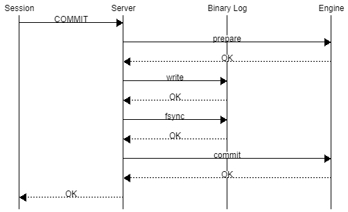
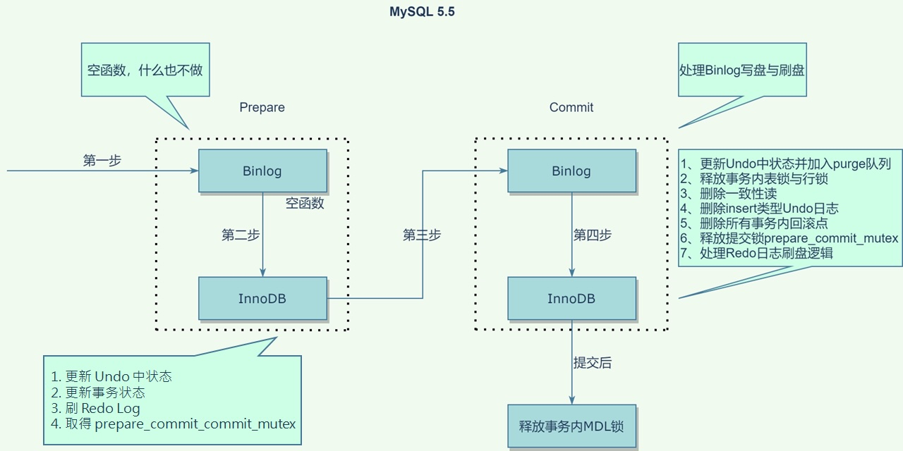
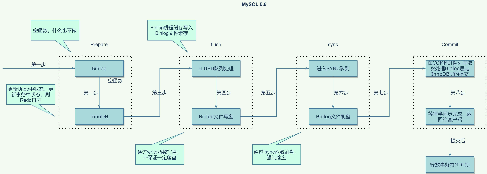
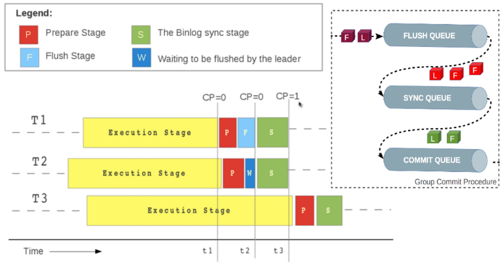
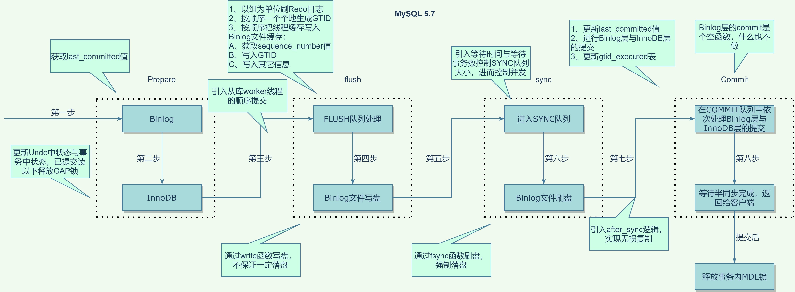
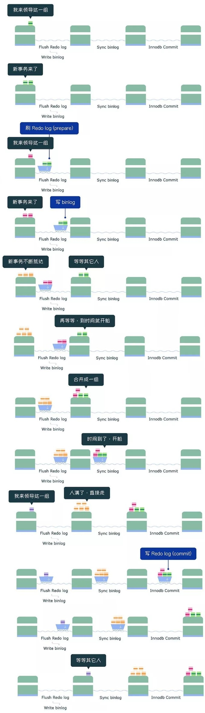

在研究 MySQL MTS 時了解到 MySQL 有 Group Commit 機制，因此進行深入了解。

本文以下內容都基於 sync_binlog = 1 & innodb_flush_log_at_trx_commit = 1 的情境。

## 前置知識

### InnoDB Group Commit

InnoDB 出於性能考量使用了 WAL (write-ahead logging) 技術：將更新操作修改內存中的數據修改後，先寫 log  (InnoDB redo log) 就可以返回告訴 client 端 transaction 已經完成 commit， 後續再慢慢將 dirty page 寫入 Disk 持久化數據修改後的結果。

這樣除了可以透過 redo log 達到原子性 (atomicity) 和持久性 (durability) 的同時也能增加效率，因為寫 Log 是順序寫入相較於修改數據的隨機寫入快上許多。

雖然 WAL 技術下順序寫入的 redo log 比隨機寫入快，但是每次 Transaction commit 之前我們還是必須調用 `fsync()` 將 redo log 持久化到 Disk，然而 `fsync()` 是昂貴的操作 (消耗較多 IO 資源，並且響應較慢)，因此早在 MySQL 5.0 之前，就在 InnoDB  redo log 上實現了 Group Commit 優化：將多個 Transaction 放入對列後一起 commit，減少 `fsync()` 的次數。

#### Binlog/Engine 2PC

在大部分的情境下，為了實現 replication 和基於時間點的恢復，一般 MySQL 實例都會開啟 binlog 來達成相應的目的，這個時候為了保證 Transaction 在 server 層 Log (Binlog) 和 engine 層 Log (例如：InnoDB 的 Redolog) 之間的原子性 (Atomicity)，因此需要透過兩階段提交 (Two-Phase-Commit, 2PC) 來確保，MySQL 透過內部 XA Transaction 來實現 2PC：

在上述過程下 MySQL  確保了 transaction 在 redo log 和 binlog 之間的原子性 (Atomicity)。

為什麼這樣能確保  redo log 和 binlog 之間的原子性 (Atomicity) 呢？

MySQL crash recovery 的流程：

1. 掃描最後一個 binlog 文件，提取其中的 XID

   備註：只需要掃描最後一個 binlog 是因為 MySQL 在 rotate 到新的 binlog 文件時，總是保證沒有正在 commit 的 Transaction 之後，會調用 `fsync()` 持久化 redo log，來保證舊的 binlog 裡的所有 Transaction 都在 redo log 中 commit。

2. 將 redo log 中還在 prepare 的 Transaction 的 XID 和 binlog 比對：
    1. 如果已經在 binlog，則 commit trnsaction。
    2. 如果不在 binlog，則 rollback transaction。

由上述步驟我們可以知道當 MySQL Crash 後，透過 Crash Recovery 可以保證 Transaction 在 redo log 和 binlog 的 commit 狀態是一致的，也就達到  redo log 和 binlog 之間的原子性 (Atomicity)。

## MySQL 5.5(含)之前 InnoDB Group Commit Bug

在 MySQL 5.5 (含)之前的版本，當 Binlog 開啟時會導致 InnoDB Group Commit 失效，這導致了效能的急遽下降，尤其是當 sync_binlog = 1 & innodb_flush_log_at_trx_commit = 1 的時候簡直是災難。

在 MySQL 5.5 的時候 2PC 的具體過程如下：

在上述過程中 InnoDB Prepare 階段的最後會上一個 prepare_commit_mutex 的鎖，並在 InnoDB Commit 階段釋放，用來確保同一個時刻只有一個線程在處理 Binlog 寫入和 InnoDB Commit，保證 Transaction 在 Binlog 和 Redo Log 中 Commit 順序是一致的。

可以發現有以下問題：

1. 因為一次只能有一個 Transaction 取得 prepare_commit_mutex 這個鎖，導致無法應用 InnoDB Group Commit，每一個 Transaction 都必須單獨 `fsync()`。
2. 一個 Transaction 就調用了 3次 `fsync()`：
    1. InnoDB Prepare (寫 redolog)
    2. Binlog Commit (寫 binlog)
    3. InnoDB Commit (寫 commit)

也就是說在開啟雙 1 時，每個 Transaction 都必須單獨 `fsync()` 3 次導致了性能的急遽下降，這就是很知名的 [**MySQL Bugs: #13669: Group commit is broken in 5.0](https://bugs.mysql.com/bug.php?id=13669)**  同時也有人提議讓 Binlog 也支援 Group Commit： [**MySQL Bugs: #49326: Support group commit for the binlog**](https://bugs.mysql.com/bug.php?id=49326)。

## MySQL 5.6 BinLog Group Commit

在 MySQL 5.6 時 binlog 實現了 Group Commit 減少了 binlog 的 `fsync()` 次數，同時透過將 commit 操作拆分成 3 個階段 (同時 prepare_commit_mutex  大鎖也被拆分為 3 個小鎖) 以此來並行執行增加效率。

MySQL 5.6 的時候 2PC 的具體過程如下：

和 MySQL 5.5 相比，可以看到 prepare 階段保持不變，但移除了 prepare_commit_mutex 這把大鎖，並將 commit 階段拆分為以下三個過程：

1. flush 階段：寫入 binlog 文件，也就是寫入 OS Page Cache 不強制執行 `fsync()` 寫入 Disk。
2. sync 階段：對 binlog 文件做 `fsync()` 操作 (也就是 binlog group commit)。
3. commit 階段：執行 InnoDB commit 操作。

在每個階段都有一個對列，同一個對列中第一個進入的 Transaction (稱為 Leader) 會帶領後續進入的 Transaction (稱為 Follower) 執行該階段的任務。

在執行該階段的任務時會持有該階段的鎖，保證一個階段只有一個對列在工作，同時每個對列中的 Transaction 依次執行，這確保了 Transaction 寫入的順序。

## MySQL 5.7 RedoLog Group Commit

在 5.6 的時候雖然實現了 binlog group commit 的優化，但是 InnoDB redo log 仍沒有。

在 MySQL 5.7 的時候 2PC 的具體過程如下：

和 MySQL 5.6 相比，在 InnoDB Prepare 的時候不進行 redolog 的 `fsync()`，而是在 flush 階段寫 binlog 文件前進行 redolog 的 write/fsync，在 flush 階段已經有對列了等於實現了 InnoDB Group Commit 的動作，大幅減少了 redolog 執行的 `fsync()` 操作。

具體可以這樣優化的原因需要從 Crash Recovery 的邏輯來看－

從上述 crash recovery 的恢復邏輯中我們可以知道，只要保證 InnoDB Prepare 的 RedoLog 只要在寫入 binlog 之前完成 write/fsync 即可，因此 RedoLog 的 write/fsync 可以移到 flush 階段內 binlog 寫入之前。

<aside>
💡 這是由阿里巴巴貢獻的優化：[MySQL Bugs: #73202: write/sync redo log before flush thread cache to binlog](https://bugs.mysql.com/bug.php?id=73202)

</aside>

### 圖解 Group Commit

### 參數調優

此外還新增了以下 2 個參數用來控制 sync 階段等待的時間點：

- binlog_group_commit_sync_delay = N：對列等待 N 微秒後，開始 sync binlog。
- binlog_group_commit_sync_no_delay_count = N：當對列中的 Transaction 達到 N 個後就忽略 binlog_group_commit_sync_delay  的設定開始 sync binlog。

當以上設定越大時，就能一次 commit 更多的 transaction 也就是調用更少的 `fsync()`，但同時 client 端也需先等待才能收到 commit 的回覆，因此需要謹慎評估適合的值。

### 5.7 基於 Group Commit 的 MTS 優化

5.7 這個版本也優化了 MTS 的回放效率，在 5.6 時只有不同 Database 的 Transaction 才能在 Replica 並行回放，在 5.7 時只要在 Source 是同一個 Group 一起 Commit 的 Transaction 就能在 Replica 並行回放，實現方式是在 Binlog 中添加以下 2 個值：

- sequence_number：每個 Transaction 的序列號，在同一個 Binlog 文件中不會重複。
- last_commited：紀錄 binlog group commit 時 leader 的 sequence_number

透過 mysqlbinlog 可以看到 binlog 中每個 Transaction 都有這 2 個變量

也就是只要 Transaction 在 Binlog 中的 last_committed 相同，那麼就可以在 Replica 並行回放。

# 參考

[MySQL · 源码分析 · 内部 XA 和组提交 (taobao.org)](http://mysql.taobao.org/monthly/2020/05/07/)

[MySQL · 性能优化· Group Commit优化 (taobao.org)](http://mysql.taobao.org/monthly/2015/01/01/)

[MySQL · 特性分析 · 8.0 WriteSet 并行复制 (taobao.org)](http://mysql.taobao.org/monthly/2018/06/04/)

[MySQL · 引擎特性 · 主库 binlog 概览 (taobao.org)](http://mysql.taobao.org/monthly/2018/08/01/)

[MySQL · 引擎特性 · InnoDB 事务子系统介绍 (taobao.org)](http://mysql.taobao.org/monthly/2015/12/01/)

[MySQL · 引擎特性· InnoDB undo log 漫游](https://www.linuxidc.com/wap.aspx?nid=128831&p=2&cid=7&sp=427)

[MySQL · 引擎特性 · InnoDB redo log漫游 (taobao.org)](http://mysql.taobao.org/monthly/2015/05/01/)

[MySQL · 引擎特性 · InnoDB 崩溃恢复过程 (taobao.org)](http://mysql.taobao.org/monthly/2015/06/01/)

[金融级角度专业理解MySQL两阶段提交](https://zhuanlan.zhihu.com/p/348828585)

[MySQL/InnoDB和Group Commit(1) - Life, Database and Cloud Computing (orczhou.com)](https://www.orczhou.com/index.php/2010/08/time-to-group-commit-1/)

[MySQL5.7 核心技术揭秘：MySQL Group commit | Focus on MySQL,Focus on Life (keithlan.github.io)](http://keithlan.github.io/2018/07/24/mysql_group_commit/)

[图解MySQL | MySQL组提交(group commit) (actionsky.com)](https://opensource.actionsky.com/20190404-mgr/)

[MySQL Musings: Binary Log Group Commit in MySQL 5.6](http://mysqlmusings.blogspot.com/2012/06/binary-log-group-commit-in-mysql-56.html)

[MySQL 的 crash-safe 原理解析 - 知乎 (zhihu.com)](https://zhuanlan.zhihu.com/p/142491549)

[Mysql+Innodb源代码调试跟踪分析+何登成_IT168文库 - 百度文库 (baidu.com)](https://wenku.baidu.com/view/493a0b3d4b35eefdc9d33306.html?re=view&_wkts_=1671088504639)

[mysql 事务提交过程 - yuyue2014 - 博客园 (cnblogs.com)](https://www.cnblogs.com/yuyue2014/p/4738007.html)

[MySQL 5.7版本XA事务若干bug分析 - 知乎 (zhihu.com)](https://zhuanlan.zhihu.com/p/38382205)

[深入剖析MySQL group commit实现 （上）-社区博客-网易数帆 (163.com)](https://sq.sf.163.com/blog/article/188020255134334976)

[深入剖析MySQL group commit实现（下）-社区博客-网易数帆 (163.com)](https://sq.sf.163.com/blog/article/188020984930648064)