曾經在正式環境遇過一個特殊的情境，我們都知道 `DEADLOCK` 的成因在於不同的加鎖順序，加上這兩句 `WHERE`條件是相似的語法，卻還是遇到了 `DEADLOCK`，因此我的第一個反應是兩個 `TRANSACTION` 中已執行語句的 `LOCK` 未釋放，導致互相阻塞對方引起的。不過事後查看 `LOG` 加上詢問開發確認了該語句皆是單獨執行，只好回頭透過 `EXPLAIN` 確認執行計畫，發現兩句語法走了不同的 `INDEX`以此找到思路，最後了解發生成因並找到解決方案，更重要的是知道了 **`隱式鎖(implicit lock)`**的存在。

## 重現

```sql
-- 準備資料
CREATE DATABASE test_g_order;
USE test_g_order;

CREATE TABLE `g_order` (
  `id` bigint(20) unsigned NOT NULL COMMENT '注單ID',
  `round_id` bigint(20) unsigned NOT NULL COMMENT '期數ID',
  `site` char(10) NOT NULL COMMENT '站台代號',
  `user` varchar(10) NOT NULL COMMENT '使用者ID',
  `status` tinyint(1) unsigned NOT NULL DEFAULT '0' COMMENT '注單狀態',
  `game_id` varchar(20) NOT NULL COMMENT '遊戲ID',
  `wager` varchar(50) NOT NULL COMMENT '玩法',
  `bet_info` json NOT NULL COMMENT '下注資訊',
  `bet` decimal(25,4) NOT NULL COMMENT '下注額度(無負值)',
  `pay` decimal(25,4) NOT NULL COMMENT '派彩金額(無負值)',
  `created_at` timestamp NOT NULL DEFAULT CURRENT_TIMESTAMP COMMENT '注單創建時間',
  `updated_at` timestamp NOT NULL DEFAULT CURRENT_TIMESTAMP ON UPDATE CURRENT_TIMESTAMP COMMENT '注單更新時間',
  `round_closed_at` timestamp NOT NULL DEFAULT '0000-00-00 00:00:00' COMMENT '關盤時間',
  `odds_key` varchar(50) GENERATED ALWAYS AS (json_unquote(json_extract(`bet_info`,'$.odds.key'))) VIRTUAL,
  PRIMARY KEY (`id`,`round_closed_at`),
  KEY `ID_report` (`status`,`site`,`user`,`created_at`),
  KEY `ID_settle` (`round_id`,`status`,`game_id`,`wager`,`odds_key`)
) ENGINE=InnoDB DEFAULT CHARSET=utf8mb4 COMMENT='訪客注單';

INSERT INTO `g_order` (`id`, `round_id`, `site`, `user`, `status`, `game_id`, `wager`, `bet_info`, `bet`, `pay`, `created_at`, `updated_at`, `round_closed_at`) VALUES 
(1,1,'site_1','user_1',1,'game_1','any','{\"odds\": {\"key\": \"2\"}}',10000.0000,0.0000,'2019-07-02 10:33:28','2019-07-04 07:00:32','2019-07-02 10:30:00'),
(2,1,'site_1','user_1',1,'game_1','any','{\"odds\": {\"key\": \"3\"}}',10000.0000,0.0000,'2019-07-02 10:33:35','2019-07-04 07:00:32','2019-07-02 10:30:00'),
(3,1,'site_1','user_1',1,'game_1','sum','{\"odds\": {\"key\": \"ALL\"}}',20000.0000,0.0000,'2019-07-02 10:33:42','2019-07-04 07:00:32','2019-07-02 10:30:00');

-- 同時執行兩句語法，為了還原當時情境需使用 force index 指定索引
UPDATE test_g_order.g_order force index(ID_report) 
SET status = 3, pay = bet * 10 
WHERE round_closed_at = '2019-07-02 10:30:00' 
AND round_id = 1 
AND game_id = 'game_1' 
AND wager = 'compare' 
AND status = 1 
AND odds_key IN ('1','2','3','4','5');

UPDATE test_g_order.g_order force index(ID_settle) 
SET status = 3, pay = 0 
WHERE round_closed_at = '2019-07-02 10:30:00' 
AND round_id = 1 
AND game_id = 'game_1' 
AND wager = 'any' 
AND status = 1;
```

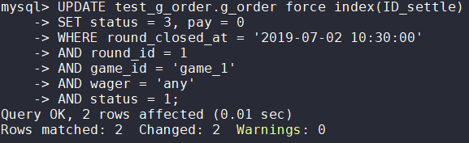

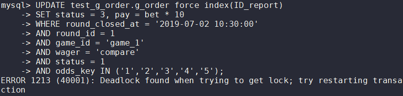

```sql
------------------------
LATEST DETECTED DEADLOCK
------------------------
2020-09-29 03:38:46 0x7f22347f8700
*** (1) TRANSACTION:
TRANSACTION 12800, ACTIVE 0 sec starting index read
mysql tables in use 1, locked 1
LOCK WAIT 3 lock struct(s), heap size 1136, 2 row lock(s)
MySQL thread id 11343, OS thread handle 139784886118144, query id 803 10.17.117.203 sysbench Searching rows for update
UPDATE g_order force index(ID_report) SET status = 3, winlose = 1, updated_at = CURTIME(), paid_amount = bet_amount * bet_info->'$.odds.value' WHERE round_closed_at = '2019-07-02 10:34:00' AND round_id = 4781292 AND game_id = '652B75-SSC5' AND wager = 'compare' AND status = 1 AND odds_key IN ('1:OVER','2:UNDER','3:OVER','4:UNDER','5:OVER')
*** (1) WAITING FOR THIS LOCK TO BE GRANTED:
RECORD LOCKS space id 139 page no 3 n bits 72 index PRIMARY of table `test_g_order`.`g_order` trx id 12800 lock_mode X locks rec but not gap waiting
Record lock, heap no 2 PHYSICAL RECORD: n_fields 22; compact format; info bits 0
 0: len 8; hex 0000a40000001cdb; asc         ;;
 1: len 4; hex 5d1b3318; asc ] 3 ;;
 2: len 6; hex 0000000031ff; asc     1 ;;
 3: len 7; hex 78000001700110; asc x   p  ;;
 4: len 8; hex 000000000048f4ea; asc      H  ;;
 5: len 6; hex 323238373335; asc 228735;;
 6: len 5; hex 3530306370; asc 500cp;;
 7: len 30; hex 35656137636538392d373365332d343565372d393932342d636631383836; asc 5ea7ce89-73e3-45e7-9924-cf1886; (total 36 bytes);
 8: len 1; hex 00; asc  ;;
 9: len 1; hex 03; asc  ;;
 10: len 11; hex 3036303232452d46415433; asc 06022E-FAT3;;
 11: len 3; hex 616e74; asc ant;;
 12: len 3; hex 434e59; asc CNY;;
 13: len 18; hex 616e792d657175616c2d6e6f742d73616d65; asc any-equal-not-same;;
 14: len 30; hex 0002004d001200040016000500001b000249006f6464736974656d730200; asc    M             I oddsitems  ; (total 78 bytes);
 15: len 1; hex 02; asc  ;;
 16: len 12; hex 800000000000000027100000; asc         '   ;;
 17: len 12; hex 800000000000000026480000; asc         &H  ;;
 18: len 12; hex 800000000000000000000000; asc             ;;
 19: len 4; hex 5d1b32f8; asc ] 2 ;;
 20: len 4; hex 5f72ac46; asc _r F;;
 21: len 0; hex ; asc ;;

*** (2) TRANSACTION:
TRANSACTION 12799, ACTIVE 0 sec updating or deleting
mysql tables in use 1, locked 1
5 lock struct(s), heap size 1136, 6 row lock(s), undo log entries 1
MySQL thread id 11342, OS thread handle 139784886388480, query id 802 10.17.117.203 sysbench updating
UPDATE g_order force index(ID_settle) SET status = 3, winlose = 2, updated_at = CURTIME(), paid_amount = 0 WHERE round_closed_at = '2019-07-02 10:34:00' AND round_id = 4781290 AND game_id = '06022E-FAT3' AND wager = 'any-equal-not-same' AND status = 1
*** (2) HOLDS THE LOCK(S):
RECORD LOCKS space id 139 page no 3 n bits 72 index PRIMARY of table `test_g_order`.`g_order` trx id 12799 lock_mode X locks rec but not gap
Record lock, heap no 2 PHYSICAL RECORD: n_fields 22; compact format; info bits 0
 0: len 8; hex 0000a40000001cdb; asc         ;;
 1: len 4; hex 5d1b3318; asc ] 3 ;;
 2: len 6; hex 0000000031ff; asc     1 ;;
 3: len 7; hex 78000001700110; asc x   p  ;;
 4: len 8; hex 000000000048f4ea; asc      H  ;;
 5: len 6; hex 323238373335; asc 228735;;
 6: len 5; hex 3530306370; asc 500cp;;
 7: len 30; hex 35656137636538392d373365332d343565372d393932342d636631383836; asc 5ea7ce89-73e3-45e7-9924-cf1886; (total 36 bytes);
 8: len 1; hex 00; asc  ;;
 9: len 1; hex 03; asc  ;;
 10: len 11; hex 3036303232452d46415433; asc 06022E-FAT3;;
 11: len 3; hex 616e74; asc ant;;
 12: len 3; hex 434e59; asc CNY;;
 13: len 18; hex 616e792d657175616c2d6e6f742d73616d65; asc any-equal-not-same;;
 14: len 30; hex 0002004d001200040016000500001b000249006f6464736974656d730200; asc    M             I oddsitems  ; (total 78 bytes);
 15: len 1; hex 02; asc  ;;
 16: len 12; hex 800000000000000027100000; asc         '   ;;
 17: len 12; hex 800000000000000026480000; asc         &H  ;;
 18: len 12; hex 800000000000000000000000; asc             ;;
 19: len 4; hex 5d1b32f8; asc ] 2 ;;
 20: len 4; hex 5f72ac46; asc _r F;;
 21: len 0; hex ; asc ;;

Record lock, heap no 3 PHYSICAL RECORD: n_fields 22; compact format; info bits 0
 0: len 8; hex 0000a40000001cdc; asc         ;;
 1: len 4; hex 5d1b3318; asc ] 3 ;;
 2: len 6; hex 0000000031fc; asc     1 ;;
 3: len 7; hex 760000016f01c6; asc v   o  ;;
 4: len 8; hex 000000000048f4ea; asc      H  ;;
 5: len 6; hex 323238373335; asc 228735;;
 6: len 5; hex 3530306370; asc 500cp;;
 7: len 30; hex 35656137636538392d373365332d343565372d393932342d636631383836; asc 5ea7ce89-73e3-45e7-9924-cf1886; (total 36 bytes);
 8: len 1; hex 00; asc  ;;
 9: len 1; hex 01; asc  ;;
 10: len 11; hex 3036303232452d46415433; asc 06022E-FAT3;;
 11: len 3; hex 616e74; asc ant;;
 12: len 3; hex 434e59; asc CNY;;
 13: len 18; hex 616e792d657175616c2d6e6f742d73616d65; asc any-equal-not-same;;
 14: len 30; hex 0002004d001200040016000500001b000249006f6464736974656d730200; asc    M             I oddsitems  ; (total 78 bytes);
 15: len 1; hex 02; asc  ;;
 16: len 12; hex 800000000000000027100000; asc         '   ;;
 17: len 12; hex 800000000000000026480000; asc         &H  ;;
 18: len 12; hex 800000000000000000000000; asc             ;;
 19: len 4; hex 5d1b32ff; asc ] 2 ;;
 20: len 4; hex 5f72ac45; asc _r E;;
 21: len 0; hex ; asc ;;

*** (2) WAITING FOR THIS LOCK TO BE GRANTED:
RECORD LOCKS space id 139 page no 4 n bits 72 index ID_report of table `test_g_order`.`g_order` trx id 12799 lock_mode X locks rec but not gap waiting
Record lock, heap no 2 PHYSICAL RECORD: n_fields 6; compact format; info bits 0
 0: len 1; hex 01; asc  ;;
 1: len 5; hex 3530306370; asc 500cp;;
 2: len 30; hex 35656137636538392d373365332d343565372d393932342d636631383836; asc 5ea7ce89-73e3-45e7-9924-cf1886; (total 36 bytes);
 3: len 4; hex 5d1b32f8; asc ] 2 ;;
 4: len 8; hex 0000a40000001cdb; asc         ;;
 5: len 4; hex 5d1b3318; asc ] 3 ;;

*** WE ROLL BACK TRANSACTION (1)
```

## 單獨測試

1. 查看兩句語法單獨執行的 LOCK 狀況

    ```sql
    -- Transaction 1
    SET GLOBAL innodb_status_output_locks=ON;
    
    begin;
    
    UPDATE test_g_order.g_order force index(ID_report) 
    SET status = 3, pay = bet * 10
    WHERE round_closed_at = '2019-07-02 10:30:00' 
    AND round_id = 1 
    AND game_id = 'game_1' 
    AND wager = 'compare' 
    AND status = 1 
    AND odds_key IN ('1','2','3','4','5');
    
    show engine innodb status\G
    ------------
    TRANSACTIONS
    ------------
    Trx id counter 5901
    Purge done for trx's n:o < 5900 undo n:o < 0 state: running but idle
    History list length 0
    LIST OF TRANSACTIONS FOR EACH SESSION:
    ---TRANSACTION 421338064415296, not started
    0 lock struct(s), heap size 1136, 0 row lock(s)
    ---TRANSACTION 421338064414440, not started
    0 lock struct(s), heap size 1136, 0 row lock(s)
    ---TRANSACTION 5900, ACTIVE 6 sec
    3 lock struct(s), heap size 1136, 7 row lock(s)
    MySQL thread id 20189, OS thread handle 139863067211520, query id 44318 localhost root starting
    show engine innodb status
    **# 第一步驟是在整個TABLE上加上 IX鎖 (意向排他鎖)，來預防其他third對整個TABLE加S鎖或X鎖**
    TABLE LOCK table `test_g_order`.`g_order` trx id 5900 lock mode IX
    
    **# 第二步因為透過index ID_report 來找符合的row，因此在符合的INDEX加上 X鎖(next-key lock)**
    RECORD LOCKS space id 4 page no 5 n bits 72 index ID_report of table `test_g_order`.`g_order` 
    trx id 5900 lock_mode
    **# 因為目前 ID_report 所有的值都符合條件，所以也在正無窮上加 nexk-key lock**
    Record lock, heap no 1 PHYSICAL RECORD: n_fields 1; compact format; info bits 0
     0: len 8; hex 73757072656d756d; asc supremum;; 
    ...
    
    **# 第三步便是透過INDEX找到Primay key並在其上加上X鎖 (Record lock)**
    RECORD LOCKS space id 4 page no 4 n bits 72 index PRIMARY of table `test_g_order`.`g_order` 
    trx id 5900 lock_mode X locks rec but not gap
    ...
    
    **# 因為第一步驟已經在正無窮加上 next-key lock，所以不需要補上 gap lock**
    
    SELECT DISTINCT ENGINE_TRANSACTION_ID AS TID,OBJECT_NAME,INDEX_NAME,LOCK_TYPE,LOCK_MODE,LOCK_STATUS 
    FROM performance_schema.data_locks;
    +------+-------------+------------+-----------+---------------+-------------+
    | TID  | OBJECT_NAME | INDEX_NAME | LOCK_TYPE | LOCK_MODE     | LOCK_STATUS |
    +------+-------------+------------+-----------+---------------+-------------+
    | 5950 | g_order     | NULL       | TABLE     | IX            | GRANTED     |
    | 5950 | g_order     | ID_report  | RECORD    | X             | GRANTED     |
    | 5950 | g_order     | PRIMARY    | RECORD    | X,REC_NOT_GAP | GRANTED     |
    +------+-------------+------------+-----------+---------------+-------------+
    ```

   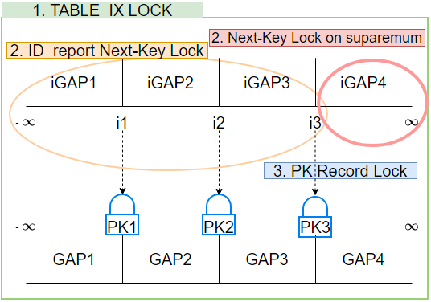

    ```sql
    -- Transaction 2
    -- 開啟moniter，觀察lock情形
    SET GLOBAL innodb_status_output_locks=ON;
    
    begin;
    
    UPDATE test_g_order.g_order force index(ID_settle) 
    SET status = 3, pay = 0
    WHERE round_closed_at = '2019-07-02 10:30:00' 
    AND round_id = 1  
    AND game_id = 'game_1' 
    AND wager = 'any' 
    AND status = 1;
    
    show engine innodb status\G
    ------------
    TRANSACTIONS
    ------------
    Trx id counter 5899
    Purge done for trx's n:o < 5899 undo n:o < 0 state: running but idle
    History list length 2
    LIST OF TRANSACTIONS FOR EACH SESSION:
    ---TRANSACTION 421338064415296, not started
    0 lock struct(s), heap size 1136, 0 row lock(s)
    ---TRANSACTION 421338064414440, not started
    0 lock struct(s), heap size 1136, 0 row lock(s)
    ---TRANSACTION 5894, ACTIVE 10 sec
    4 lock struct(s), heap size 1136, 5 row lock(s), undo log entries 2
    MySQL thread id 20189, OS thread handle 139863067211520, query id 44245 localhost root starting
    show engine innodb status
    **# 第一步驟是在整個TABLE上加上 IX鎖 (意向排他鎖)，來預防其他third對整個TABLE加S鎖或X鎖**
    TABLE LOCK table `test_g_order`.`g_order` trx id 5894 lock mode IX
    
    **# 第二步因為透過index ID_settle 來找符合的row，因此在符合的INDEX加上 X鎖(next-key lock)**
    RECORD LOCKS space id 4 page no 6 n bits 72 index ID_settle of table `test_g_order`.`g_order` 
    trx id 5894 lock_mode X
    
    **# 第三步便是透過INDEX找到Primay key並在其上加上X鎖 (Record lock)**
    RECORD LOCKS space id 4 page no 4 n bits 72 index PRIMARY of table `test_g_order`.`g_order` 
    trx id 5894 lock_mode X locks rec but not gap
    
    **# 第四步：需要在第一個不符合條件的Index ID_settle 加上X鎖 (gap lock)，避免INSERT新的資料**
    RECORD LOCKS space id 4 page no 6 n bits 72 index ID_settle of table `test_g_order`.`g_order` 
    trx id 5894 lock_mode X locks gap before re
    
    SELECT DISTINCT ENGINE_TRANSACTION_ID AS TID,OBJECT_NAME,INDEX_NAME,LOCK_TYPE,LOCK_MODE,LOCK_STATUS 
    FROM performance_schema.data_locks;
    +------+-------------+------------+-----------+---------------+-------------+
    | TID  | OBJECT_NAME | INDEX_NAME | LOCK_TYPE | LOCK_MODE     | LOCK_STATUS |
    +------+-------------+------------+-----------+---------------+-------------+
    | 5943 | g_order     | NULL       | TABLE     | IX            | GRANTED     |
    | 5943 | g_order     | ID_settle  | RECORD    | X             | GRANTED     |
    | 5943 | g_order     | PRIMARY    | RECORD    | X,REC_NOT_GAP | GRANTED     |
    | 5943 | g_order     | ID_settle  | RECORD    | X,GAP         | GRANTED     |
    +------+-------------+------------+-----------+---------------+-------------+
    ```

   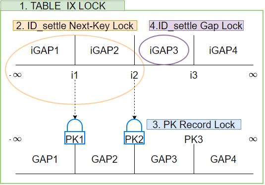

2. 先執行 Transaction 1 再執行 Transaction 2

    ```sql
    ------------
    TRANSACTIONS
    ------------
    Trx id counter 11644
    Purge done for trx's n:o < 11642 undo n:o < 0 state: running but idle
    History list length 3
    LIST OF TRANSACTIONS FOR EACH SESSION:
    ---TRANSACTION 421338064415296, not started
    0 lock struct(s), heap size 1136, 0 row lock(s)
    ---TRANSACTION 421338064414440, not started
    0 lock struct(s), heap size 1136, 0 row lock(s)
    ---TRANSACTION 11643, ACTIVE 6 sec starting index read
    mysql tables in use 1, locked 1
    LOCK WAIT 3 lock struct(s), heap size 1136, 2 row lock(s)
    MySQL thread id 141084, OS thread handle 139863066326784, query id 287362 10.17.117.203 root Searching rows for update
    UPDATE test_g_order.g_order force index(ID_settle)
    SET status = 3, pay = 0
    WHERE round_closed_at = '2019-07-02 10:30:00'
    AND round_id = 1
    AND game_id = 'game_1'
    AND wager = 'any'
    AND status = 1
    ------- TRX HAS BEEN WAITING 6 SEC FOR THIS LOCK TO BE GRANTED:
    **# Transaction 2 等待 Transaction 1 釋放 PRIMARY KEY 上的 LOCK**
    RECORD LOCKS space id 216 page no 4 n bits 72 index PRIMARY of table `test_g_order`.`g_order` trx id 11643 lock_mode X locks rec but not gap waiting
    
    **# Transaction 2**
    ------------------
    **# 第一步驟是在整個TABLE上加上 IX鎖 (意向排他鎖)，來預防其他third對整個TABLE加S鎖或X鎖**
    TABLE LOCK table `test_g_order`.`g_order` trx id 11643 lock mode IX
    **# 第二步因為透過index ID_settle 來找符合的row，因此在符合的INDEX加上 X鎖(next-key 包含了gap)**
    RECORD LOCKS space id 216 page no 6 n bits 72 index ID_settle of table `test_g_order`.`g_order` trx id 11643 lock_mode X
    **# 第三步便是透過INDEX找到Primay key並在其上加上X鎖 (Record lock不含gap)**
    RECORD LOCKS space id 216 page no 4 n bits 72 index PRIMARY of table `test_g_order`.`g_order` trx id 11643 lock_mode X locks rec but not gap waiting
    
    **# Transaction 1**
    ---TRANSACTION 11642, ACTIVE 7 sec
    3 lock struct(s), heap size 1136, 7 row lock(s)
    MySQL thread id 141082, OS thread handle 139863067801344, query id 287365 10.17.117.203 root starting
    show engine innodb status
    **# 第一步驟是在整個TABLE上加上 IX鎖 (意向排他鎖)，來預防其他third對整個TABLE加S鎖或X鎖**
    TABLE LOCK table `test_g_order`.`g_order` trx id 11642 lock mode IX
    **# 第二步因為透過index ID_report 來找符合的row，因此在符合的INDEX加上 X鎖(next-key 包含了gap)**
    RECORD LOCKS space id 216 page no 5 n bits 72 index ID_report of table `test_g_order`.`g_order` trx id 11642 lock_mode X
    **# 因為目前 ID_report 所有的值都符合條件，所以也在正無窮上加 nexk-key lock**
    Record lock, heap no 1 PHYSICAL RECORD: n_fields 1; compact format; info bits 0
     0: len 8; hex 73757072656d756d; asc supremum;; 
    **# 第三步便是透過INDEX找到Primay key並在其上加上X鎖 (Record lock不含gap)**
    RECORD LOCKS space id 216 page no 4 n bits 72 index PRIMARY of table `test_g_order`.`g_order` trx id 11642 lock_mode X locks rec but not gap
    
    SELECT DISTINCT ENGINE_TRANSACTION_ID AS TID,OBJECT_NAME,INDEX_NAME,LOCK_TYPE,LOCK_MODE,LOCK_STATUS 
    FROM performance_schema.data_locks;
    +-------+-------------+------------+-----------+---------------+-------------+
    | TID   | OBJECT_NAME | INDEX_NAME | LOCK_TYPE | LOCK_MODE     | LOCK_STATUS |
    +-------+-------------+------------+-----------+---------------+-------------+
    | 11642 | g_order     | NULL       | TABLE     | IX            | GRANTED     |
    | 11642 | g_order     | ID_report  | RECORD    | X             | GRANTED     |
    | 11642 | g_order     | PRIMARY    | RECORD    | X,REC_NOT_GAP | GRANTED     |
    | 11643 | g_order     | NULL       | TABLE     | IX            | GRANTED     |
    | 11643 | g_order     | ID_settle  | RECORD    | X             | GRANTED     |
    | 11643 | g_order     | PRIMARY    | RECORD    | X,REC_NOT_GAP | WAITING     |
    +-------+-------------+------------+-----------+---------------+-------------+
    ```

   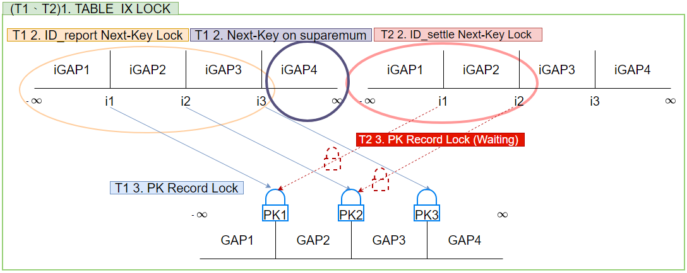

3. 先執行 Transaction 2 再執行 Transaction 1，可以發現 Transaction 2 多了一個 LOCK

    ```sql
    ------------
    TRANSACTIONS
    ------------
    Trx id counter 5957
    Purge done for trx's n:o < 5956 undo n:o < 0 state: running but idle
    History list length 2
    LIST OF TRANSACTIONS FOR EACH SESSION:
    ---TRANSACTION 421338064415296, not started
    0 lock struct(s), heap size 1136, 0 row lock(s)
    ---TRANSACTION 421338064414440, not started
    0 lock struct(s), heap size 1136, 0 row lock(s)
    ---TRANSACTION 5956, ACTIVE 12 sec starting index read
    mysql tables in use 1, locked 1
    LOCK WAIT 2 lock struct(s), heap size 1136, 1 row lock(s)
    MySQL thread id 25903, OS thread handle 139863067506432, query id 56073 localhost root Searching rows for update
    UPDATE test_g_order.g_order force index(ID_settle)
    SET status = 3, pay = bet * 10
    WHERE round_closed_at = '2019-07-02 10:30:00'
    AND round_id = 1
    AND game_id = 'game_1'
    AND wager = 'compare'
    AND status = 1
    AND odds_key IN ('1','2','3','4','5')
    ------- TRX HAS BEEN WAITING 12 SEC FOR THIS LOCK TO BE GRANTED:
    **# Transaction 1 等待 Transaction 2 釋放 ID_report Index 上的 LOCK**
    RECORD LOCKS space id 4 page no 5 n bits 72 index ID_report of table `test_g_order`.`g_order` 
    trx id 5956 lock_mode X waiting
    
    **# Transaction 1**
    ------------------
    **# 第一步驟是在整個TABLE上加上 IX鎖 (意向排他鎖)，來預防其他third對整個TABLE加S鎖或X鎖**
    TABLE LOCK table `test_g_order`.`g_order` trx id 5956 lock mode IX
    **# 第二步因為透過index ID_report 來找符合的row，因此在符合的INDEX加上 X鎖(next-key 包含了gap)**
    RECORD LOCKS space id 4 page no 5 n bits 72 index ID_report of table `test_g_order`.`g_order` 
    trx id 5956 lock_mode X waiting
    
    **# Transaction 2**
    ---TRANSACTION 5951, ACTIVE 18 sec
    5 lock struct(s), heap size 1136, 6 row lock(s), undo log entries 2
    MySQL thread id 25899, OS thread handle 139863067211520, query id 56077 localhost root starting
    show engine innodb status
    **# 第一步驟是在整個TABLE上加上 IX鎖 (意向排他鎖)，來預防其他third對整個TABLE加S鎖或X鎖**
    TABLE LOCK table `test_g_order`.`g_order` trx id 5951 lock mode IX
    **# 第二步因為透過index ID_settle 來找符合的row，因此在符合的INDEX加上 X鎖(next-key 包含了gap)**
    RECORD LOCKS space id 4 page no 6 n bits 72 index ID_settle of table `test_g_order`.`g_order` 
    trx id 5951 lock_mode X
    **# 第三步便是透過INDEX找到Primay key並在其上加上X鎖 (Record lock不含gap)**
    RECORD LOCKS space id 4 page no 4 n bits 72 index PRIMARY of table `test_g_order`.`g_order` 
    trx id 5951 lock_mode X locks rec but not gap
    **# 第四步Index ID_settle 加上X鎖 (Gap Lock)**
    RECORD LOCKS space id 4 page no 6 n bits 72 index ID_settle of table `test_g_order`.`g_order` 
    trx id 5951 lock_mode X locks gap before rec
    **# 第五步Index ID_report 加上X鎖 (Record lock不含gap)**
    RECORD LOCKS space id 4 page no 5 n bits 72 index ID_report of table `test_g_order`.`g_order` 
    trx id 5951 lock_mode X locks rec but not gap
    
    SELECT DISTINCT ENGINE_TRANSACTION_ID AS TID,OBJECT_NAME,INDEX_NAME,LOCK_TYPE,LOCK_MODE,LOCK_STATUS 
    FROM performance_schema.data_locks;
    +------+-------------+------------+-----------+---------------+-------------+
    | TID  | OBJECT_NAME | INDEX_NAME | LOCK_TYPE | LOCK_MODE     | LOCK_STATUS |
    +------+-------------+------------+-----------+---------------+-------------+
    | 5956 | g_order     | NULL       | TABLE     | IX            | GRANTED     |
    | 5956 | g_order     | ID_report  | RECORD    | X             | WAITING     |
    | 5951 | g_order     | NULL       | TABLE     | IX            | GRANTED     |
    | 5951 | g_order     | ID_settle  | RECORD    | X             | GRANTED     |
    | 5951 | g_order     | PRIMARY    | RECORD    | X,REC_NOT_GAP | GRANTED     |
    | 5951 | g_order     | ID_settle  | RECORD    | X,GAP         | GRANTED     |
    | 5951 | g_order     | ID_report  | RECORD    | X,REC_NOT_GAP | GRANTED     |
    +------+-------------+------------+-----------+---------------+-------------+
    ```

   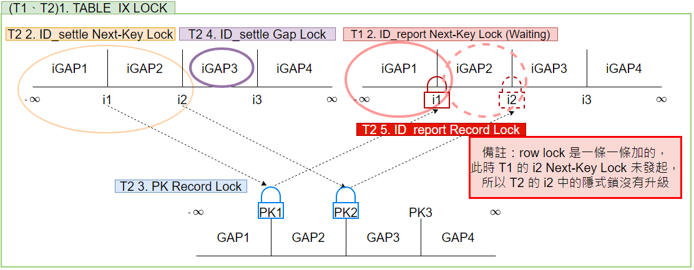


經由以上測試，我們確認了此例的 Lock 的成因如下表格－

| Transaction 1            | Transaction 2                                         |
|--------------------------|-------------------------------------------------------|
| Lock IX(TABLE)           | Lock IX(TABLE)                                        |
| Lock ID_report(Next-Key) | Lock ID_settle(Next-Key)                              |
|                          | Lock primary key(Record)                              |
|                          | Lock ID_settle(Gap)                                   |
| Waiting Lock PK(Record)  |                                                       |
|                          | Waiting Lock convert impli to expli ID_report(Record) |
| DEADLOCK                 | DEADLOCK                                              |

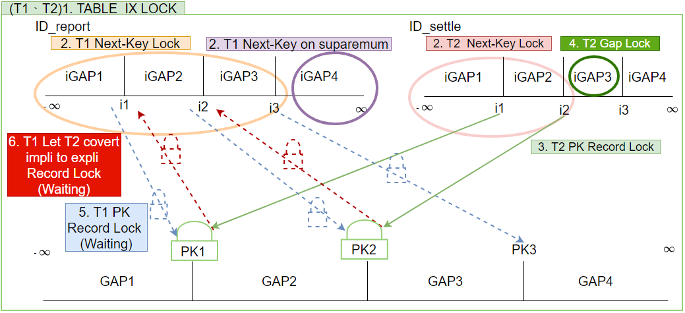

在分析個過程中，我們可以看到當優先執行 `Transaction 2`時，我們可以看到最後一個 `wating Lock ID_report (no gap)` 是不存在的，直到我們執行 `Transaction 1`時，這一個 `LOCK`才會出現，這就是 **`隱式鎖(implicit lock)`** 。

## 什麼是隱式鎖?

在 [MySQL官方文檔](https://dev.mysql.com/doc/refman/8.0/en/innodb-locks-set.html) 中關於隱式鎖就只有這麼一條說明－

> When UPDATE modifies a clustered index record, implicit locks are taken on affected secondary index records.
>

資訊量實在不是很足夠，再加上討論到的文章其實不是很多，因此只好搭配少量的文章搭配源碼來了解，下方出現的源碼取自 8.0 版本，並加上一些個人加上的註解方便理解。

### 延遲加鎖機制

---

讓我們試想一下，如果一張表上面有多個索引，這樣在異動其中一筆資料的時候，豈不是要在好幾個 B+Tree 上同時加鎖嗎 ?

加鎖也是一筆開銷，如果衝突的可能性很小的時候，多數的鎖應該都是不必要的。

Innodb 實現了一個延遲加鎖機制，以此來減少加鎖的數量，減少效能損耗的同時也提升併發性能。

### 隱式鎖的簡介

---

Innodb 實現的延遲加鎖的機制，在源碼中被稱為**`隱式鎖(implicit lock)`**

隱式鎖沒有實際加鎖，而是一種 `logical entity`，transaction 是否持有是透過一些過程來計算的。

隱式鎖中有一個重要的元素： `db_trx_id`！用來儲存產生該筆紀錄的 `transaction ID`，這是在 `MVCC` 中實現 **`快照讀`** 也有使用到的元素。

### 隱式鎖的特點

---

1. 只有在很可能發生衝突時才加鎖，減少鎖的數量
2. 隱式鎖式針對 B+Tree 上被修改的紀錄，因此都是 `record lock`，不可能是 `gap lock` 或 `next-key lock`
3. 和顯式鎖的區別：

| 顯式鎖 (explicit lock) | 隱式鎖 (implicit lock) |
|---------------------|---------------------|
| 實際加鎖                | 邏輯加鎖                |
| 佔用內存                | 不佔用內存               |


### 隱式鎖的使用

---

1. `INSERT` 操作一般只會加隱式鎖，不加顯示鎖。除了以下情況：
    - 若 `INSERT` 的位置有 `gap lock` 時，則會加上 `insert intention lock`。

   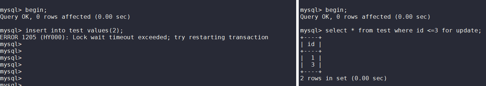

   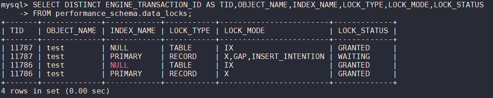

    - 若 `INSERT` 的位置發生唯一鍵衝突時，則會將對方的隱式鎖升級為顯示鎖，自己則加上 `shared lock` 等待。

   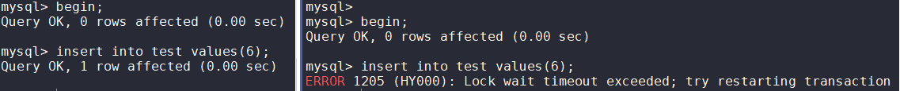

   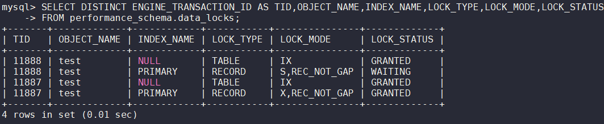

2. `UPDATE` 和 `DELETE` 操作在查詢時，會直接對查詢走的 `index` 和 `primary key` 使用顯示鎖，其他的 `index` 使用隱式鎖。

### 隱式鎖的具體過程

---

1. 如果 transaction 要獲取行鎖 (不論是顯式或隱式)，則需要先判斷是否存在活躍的隱式鎖
    - cluster index：首先取得在該紀錄上持有隱式鎖的 transaction id，隨後透過 cluster index  中的隱藏欄位 `db_trx_id` 判斷前者是否為活躍事務。

      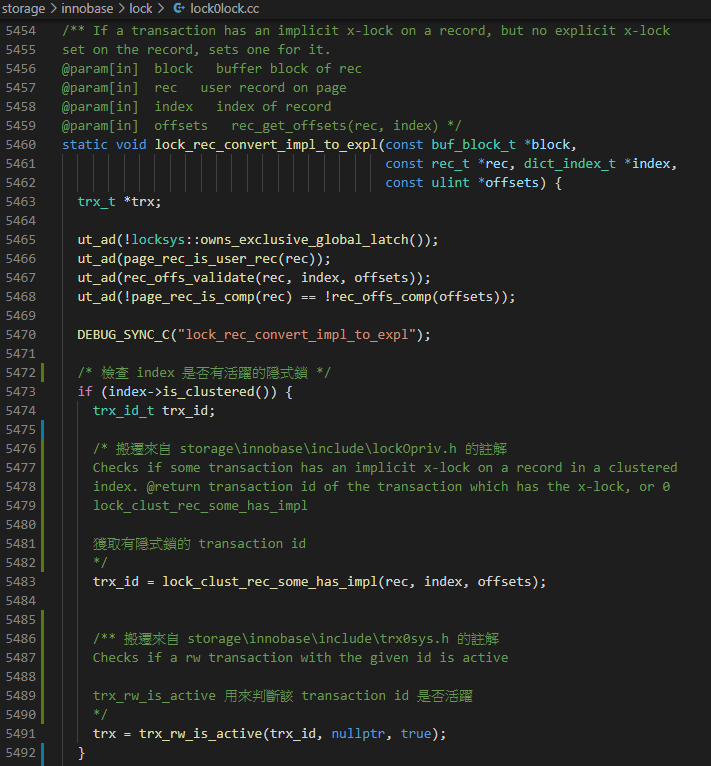

      - secondary index：
        1. 從 secondary index  page 中取得 `PAGE_MAX_TRX_ID (T1)`

            > `PAGE_MAX_TRX_ID`：該字段存在於 secondary index  page 中，用於保存修改該 page 的最大 Transaction ID，當該 page 的任何紀錄被更新後，都會更新此值。
        
        2. 取得 InnoDB 活躍中事務中 `最小的 Transaction ID (T2)`
        3. 假如 T1 < T2 則說明修改這個 page 的 T1 已經 commit ，因此不存在隱式鎖。

           反之，則必須再透過 cluster index 搭配 undo log 回溯舊版本數據進行判斷，此步驟較為複雜暫不詳解 (可透過 `storage\innobase\row\row0vers.cc` 中 `row_vers_impl_x_locked` 和 `row_vers_impl_x_locked_low` 了解詳細過程)


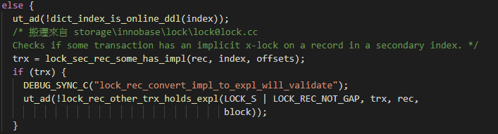
        
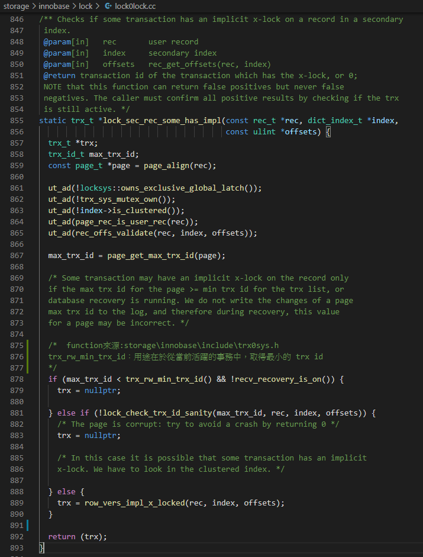

2. 若為活躍事務，則為該活躍事務將 `implicit lock` 轉換為 `explicit lock`

   另外可已注意到 `implicit lock` 轉換後的 `explicit lock` 不會有 `gap lock`

   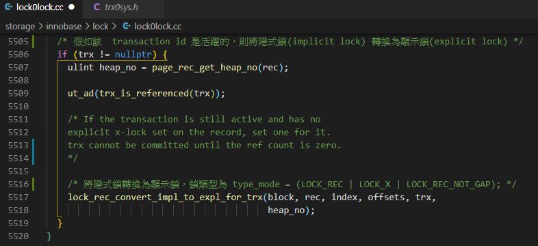

3. 等待加鎖成功後修改數據，並且將自己的 Transaction id 寫入 `db_trx_id`；或者是 timeout。

## 參考

[Introduction to Transaction Locks in InnoDB Storage Engine (from oracle blog) - plant MySQL 備份](https://planet.mysql.com/entry/?id=79629)

[Introduction to Transaction Locks in InnoDB Storage Engine (from oracle blog) - CSDN 備份](https://blog.csdn.net/sun_ashe/article/details/82499483)

[percona live - mysql conference 2015 - Understanding InnoDB locks and deadlocks (page 44)](https://docs.huihoo.com/mysql/percona/live/mysql-conference-2015/Understanding-InnoDB-locks-and-deadlocks.pdf)

[Understanding-InnoDB-locks-and-deadlocks.pdf](%E9%9A%B1%E5%BC%8F%E9%8E%96(implicit%20lock)%20e467409b715f4c2888953772b5dc3fe5/Understanding-InnoDB-locks-and-deadlocks.pdf)

[M18 Deep Dive InnoDB Transactions and Write Paths](https://mariadb.org/wp-content/uploads/2018/02/Deep-Dive_-InnoDB-Transactions-and-Write-Paths.pdf)

[Deep-Dive_-InnoDB-Transactions-and-Write-Paths.pdf](%E9%9A%B1%E5%BC%8F%E9%8E%96(implicit%20lock)%20e467409b715f4c2888953772b5dc3fe5/Deep-Dive_-InnoDB-Transactions-and-Write-Paths.pdf)

[MySQL数据库InnoDB存储引擎中的锁机制](http://www.uml.org.cn/sjjm/201205302.asp)

[MySQL加锁分析](http://www.fanyilun.me/2017/04/20/MySQL%E5%8A%A0%E9%94%81%E5%88%86%E6%9E%90/)

[InnoDB Transaction Lock and MVCC - 何登成 (page 31)](https://github.com/hedengcheng/tech/blob/master/database/MySQL/InnoDB%20Transaction%20Lock%20and%20MVCC.pdf)

[InnoDB Transaction Lock and MVCC.pdf](%E9%9A%B1%E5%BC%8F%E9%8E%96(implicit%20lock)%20e467409b715f4c2888953772b5dc3fe5/InnoDB_Transaction_Lock_and_MVCC.pdf)

[MySQL · 引擎特性 · InnoDB 事务子系统介绍 (數據庫內核月報 - 2015/12)](http://mysql.taobao.org/monthly/2015/12/01/?spm=a2c6h.12873639.0.0.63591453HCfF7l)

[MySQL · 引擎特性 · InnoDB 事务锁系统简介 (數據庫內核月報 - 2016/01)](http://mysql.taobao.org/monthly/2016/01/01/)

[MySQL · 引擎特性 · InnoDB隐式锁功能解析 (數據庫內核月報 - 2020/09)](http://mysql.taobao.org/monthly/2020/09/06/)

[MySQL锁系列（一）之锁的种类和](https://keithlan.github.io/2017/06/05/innodb_locks_1/)

[innodB的隐式锁](https://blog.csdn.net/taozhi20084525/article/details/19545231)

## PPT

[隱式鎖.pptx](%E9%9A%B1%E5%BC%8F%E9%8E%96(implicit%20lock)%20e467409b715f4c2888953772b5dc3fe5.pptx)