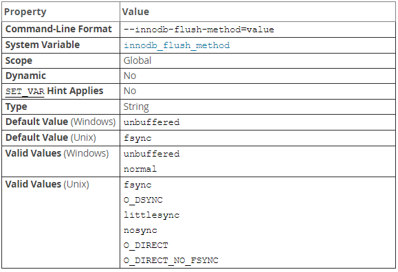

## MySQL 8.4 更新
從 MySQL 8.4 開始，UNIX 預設值改為 O_DIRECT if supported, otherwise fsync
所以未來不太需要調整此參數了

## 原文 (MySQL 8.0)

設定 `flush data`  到 InnoDB `data files` 和 `log files` 使用的方法，此參數會影響到 IO 吞吐量

- fsync(or 0)：InnoDB use `fsync() system call` to flush data，這在 5.7、8.0 為默認設定。
- O_DSYNC(or 1)：InnoDB use `O_SYNC` to open and flush the `log files`, and `fsync()` to flush the `data file`。 InnoDB不直接使用 `O_DSYNC` 因為在許多 Unix 版本上都存在問題。
- littlesync(or 2)：此選項用於內部性能測試，目前版本不支持。使用後風險自負。(5.7、8.0)
- nosync(or 3)：此選項用於內部性能測試，目前版本不支持。使用後風險自負。(5.7、8.0)
- O_DIRECT(or 4)：InnoDB use `O_DIRECT (or directio() on Solaris)` to open the `date files` , and use `fsync()` to flush both the data and log files. 此選項在某些 GNU/Linux 版本、 FreeBSD 和 Solaris 上可以使用。
- O_DIRECT_NO_FSYNC：InnoDB use `O_DIRECT` during flushing I/O, but skips the `fsync() system call` after each write operation.
    1. 在 5.7.25、8.0.14 之前，此設定不適用於 `XFS`、 `EXT4` 等 file system，因這類 file sysetm需要調用 `fsync()` 來同步 `file system metadata`的變更，如果不確定是否需要請調整為 `O_DIRECT`。
    2. 在 5.7.25、8.0.14 開始，在建立新的文件、增加文件大小、關閉文件後這些變更到 `file system metadata` 的情況才會調用 `fsync()`，其餘情寫入操作會跳過 `fsync()`。
    3. 如果 `data files` 和 `log files` 儲存在不同的設備，且 `data files` 的儲存設備沒有後備電池，則可能導致數據丟失建議改為使用 `O_DIRECT`。

在 MySQL 8.0.14 開始，若 `innodb_dedicated_server` 啟用時，則會將 `innodb_flush_method` 設定為 `O_DIRECT_NO_FSYNC`

| 設定值               | Open log files | Flush log | Open dataFile | Flush data |
|-------------------|----------------|-----------|---------------|------------|
| fsync             |                | fsync()   |               | fsync()    |
| O_DSYNC           | O_SYNC         | O_SYNC    |               | fsync()    |
| O_DIRECT          |                | fsync()   | O_DIRECT      | fsync()    |
| O_DIRECT_NO_FSYNC |                |           |               |            |

## 參考

[Adjusting MySQL 8.0 Memory Parameters - Percona](https://www.percona.com/blog/2020/11/03/adjusting-mysql-8-0-memory-parameters/)

[使用O_DIRECT_NO_FSYNC来提升MySQL性能 - 溫正湖(網易數據庫內核開發)](https://zhuanlan.zhihu.com/p/134669835)