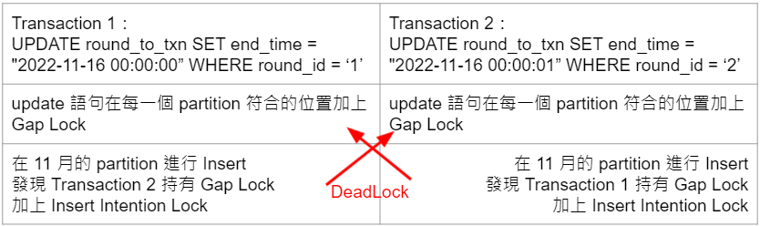

## 重現

- 事前準備 (schema、初始資料)

    ```sql
    CREATE TABLE `round_to_txn` (
      `round_id` varchar(30) NOT NULL COMMENT '訂單號',
      `txn_id` char(50) NOT NULL COMMENT '交易代碼',
      `end_time` timestamp NOT NULL DEFAULT '0000-00-00 00:00:00' COMMENT '結算時間',
      `create_time` timestamp NOT NULL DEFAULT CURRENT_TIMESTAMP COMMENT '建立時間',
      PRIMARY KEY (`round_id`,`txn_id`,`end_time`)
    ) ENGINE=InnoDB DEFAULT CHARSET=utf8mb4 COLLATE=utf8mb4_0900_ai_ci COMMENT='局號關聯的交易單號'
    /*!50100 PARTITION BY RANGE (unix_timestamp(`end_time`))
    (PARTITION PHISTORY VALUES LESS THAN (1654056000) ENGINE = InnoDB,
     PARTITION P202206 VALUES LESS THAN (1656648000) ENGINE = InnoDB,
     PARTITION P202207 VALUES LESS THAN (1659326400) ENGINE = InnoDB,
     PARTITION P202208 VALUES LESS THAN (1662004800) ENGINE = InnoDB,
     PARTITION P202209 VALUES LESS THAN (1664596800) ENGINE = InnoDB,
     PARTITION P202210 VALUES LESS THAN (1667275200) ENGINE = InnoDB,
     PARTITION P202211 VALUES LESS THAN (1669867200) ENGINE = InnoDB,
     PARTITION P202212 VALUES LESS THAN (1672545600) ENGINE = InnoDB,
     PARTITION P202301 VALUES LESS THAN (1675224000) ENGINE = InnoDB,
     PARTITION P202302 VALUES LESS THAN (1677643200) ENGINE = InnoDB,
     PARTITION P202303 VALUES LESS THAN (1680321600) ENGINE = InnoDB,
     PARTITION P202304 VALUES LESS THAN (1682913600) ENGINE = InnoDB,
     PARTITION P202305 VALUES LESS THAN (1685592000) ENGINE = InnoDB,
     PARTITION P202306 VALUES LESS THAN (1688184000) ENGINE = InnoDB,
     PARTITION POTHER VALUES LESS THAN MAXVALUE ENGINE = InnoDB) */
    ;
    
    INSERT INTO round_to_txn(round_id, txn_id, end_time) VALUES
    ('039910eukXEC', '5', '0000-00-00 00:00:00'),
    ('039911eukXEC', '6', '0000-00-00 00:00:00'),
    ('039910eukXEC', '7', '0000-00-00 00:00:00'),
    ('039911eukXEC', '8', '0000-00-00 00:00:00'),
    ('039912eukXEC', '9', '0000-00-00 00:00:00'),
    ('039913eukXEC', '10', '0000-00-00 00:00:00'),
    ('039912eukXEC', '11', '0000-00-00 00:00:00'),
    ('039913eukXEC', '12', '0000-00-00 00:00:00'),
    ('039914eukXEC', '13', '0000-00-00 00:00:00'),
    ('039914eukXEC', '14', '0000-00-00 00:00:00'),
    ('039915eukXEC', '15', '0000-00-00 00:00:00'),
    ('039915eukXEC', '16', '0000-00-00 00:00:00'),
    ('039916eukXEC', '17', '0000-00-00 00:00:00'),
    ('039917eukXEC', '18', '0000-00-00 00:00:00'),
    ('039916eukXEC', '19', '0000-00-00 00:00:00'),
    ('039917eukXEC', '20', '0000-00-00 00:00:00'),
    ('039918eukXEC', '21', '0000-00-00 00:00:00'),
    ('039919eukXEC', '22', '0000-00-00 00:00:00'),
    ('039918eukXEC', '23', '0000-00-00 00:00:00'),
    ('039919eukXEC', '24', '0000-00-00 00:00:00'),
    ('039920eukXEC', '25', '0000-00-00 00:00:00'),
    ('039920eukXEC', '26', '0000-00-00 00:00:00'),
    ('039921eukXEC', '27', '0000-00-00 00:00:00'),
    ('039909eukXEC', '4', '2022-11-01 00:10:00'),
    ('039909eukXEC', '3', '2022-11-01 00:10:00'),
    ('039908eukXEC', '2', '2022-10-01 00:10:00'),
    ('039908eukXEC', '1', '2022-10-01 00:10:00');
    ```

- 模擬並行 update 資料的程式

    ```go
    package main
    
    import (
    	"database/sql"
    
    	_ "github.com/go-sql-driver/mysql"
    
    	"fmt"
    	"sync"
    	"time"
    )
    
    const (
    	dbHost         string = "10.17.117.203"
    	dbPort         int    = 3331
    	dbUser         string = "root"
    	dbPassword     string = "root"
    	dbDatabase     string = "test"
    	dbMaxOpenConns int    = 10
    	dbMaxIdleConns int    = 10
    	dbMaxLifetime  int    = 3600
    )
    
    var DB *sql.DB
    
    func initDB() {
    	var err error
    	dsn := fmt.Sprintf("%s:%s@tcp(%s:%d)/%s", dbUser, dbPassword, dbHost, dbPort, dbDatabase)
    	DB, err = sql.Open("mysql", dsn)
    
    	DB.SetMaxOpenConns(dbMaxOpenConns)
    	DB.SetMaxIdleConns(dbMaxIdleConns)
    	DB.SetConnMaxLifetime(time.Duration(dbMaxLifetime) * time.Second)
    
    	if err != nil {
    		fmt.Println("connection to mysql failed:", err)
    		return
    	}
    	fmt.Println("connnect success")
    }
    
    func txUpdateTest(roundId string, endTime string, wg *sync.WaitGroup) {
    	defer wg.Done()
    
    	// begin transaction
    	tx, err := DB.Begin()
    	if err != nil {
    		fmt.Println("begin fail: ", err)
    		return
    	}
    
    	// prepare
    	stmt, err := tx.Prepare("UPDATE `round_to_txn` SET `end_time` = ? WHERE `round_id` = ?") // 會 deadlock
    	// stmt, err := tx.Prepare("UPDATE `round_to_txn` SET `end_time` = ? WHERE `round_id` = ? AND `end_time` = '0000-00-00 00:00:00'") // 不會 deadlock
    	// stmt, err := tx.Prepare("UPDATE `round_to_txn` SET `end_time` = ? WHERE `round_id` = ? AND `end_time` <= '2022-10-31 23:59:59'") // 不會 deadlock
    	//stmt, err := tx.Prepare("UPDATE `round_to_txn` SET `end_time` = ? WHERE `round_id` = ? AND (`end_time` <= '2022-10-31 23:59:59' OR `end_time` >= '2022-12-01 00:00:00' )") // 不會 deadlock
    	// stmt, err := tx.Prepare("UPDATE `round_to_txn` SET `end_time` = ? WHERE `round_id` = ? AND (`end_time` <= '2022-11-10 23:59:59')") // 會 deadlock
    	if err != nil {
    		fmt.Println("prepare fail: ", err)
    		return
    	}
    
    	// exec
    	_, err = stmt.Exec(endTime, roundId)
    	if err != nil {
    		fmt.Println("Exec fail: ", err)
    		return
    	}
    
    	// commit
    	tx.Commit()
    }
    
    func updateTest(roundId string, endTime string) {
    	_, err := DB.Exec("UPDATE `round_to_txn` SET `end_time` = ? WHERE `round_id` = ?", endTime, roundId)
    	if err != nil {
    		fmt.Println("update fail:", err)
    		return
    	}
    }
    
    func main() {
    	wg := new(sync.WaitGroup)
    	initDB()
    	defer DB.Close()
    
    	type sqlValue struct {
    		roundId string
    		endTime string
    	}
    
    	var initValue = []sqlValue{}
    	for i := 10; i < 21; i++ {
    		initValue = append(initValue, sqlValue{fmt.Sprintf("0399%deukXEC", i), "0000-00-00 00:00:00"})
    	}
    
    	for _, e := range initValue {
    		updateTest(e.roundId, e.endTime)
    	}
    
    	var testValue = []sqlValue{}
    	for i := 10; i < 21; i++ {
    		testValue = append(testValue, sqlValue{fmt.Sprintf("0399%deukXEC", i), "2022-11-16 08:53:08"})
    	}
    
    	for _, e := range testValue {
    		wg.Add(1)
    		go txUpdateTest(e.roundId, e.endTime, wg)
    	}
    
    	wg.Wait()
    }
    ```


測試結果如下表：

| 語法：UPDATE `round_to_txn` SET `end_time` = "2022-11-16 08:53:08” WHERE …  | 是否有 deadlock |
| --- | --- |
| `round_id` = ?  | Yes |
| `round_id` = ? AND `end_time` = ‘0000-00-00 00:00:00’ | No |
| `round_id` = ? AND `end_time` <= '2022-10-31 23:59:59' | No |
| `round_id` = ? AND `end_time` <= '2022-11-10 23:59:59' | No |
| `round_id` = ? AND (`end_time` <= '2022-10-31 23:59:59' OR `end_time` >= '2022-12-01 00:00:00' ) | Yes |

## DeadLock 分析

```
------------------------
LATEST DETECTED DEADLOCK
------------------------
2022-11-18 09:00:57 140176279025408
*** (1) TRANSACTION:
TRANSACTION 4914, ACTIVE 0 sec inserting
mysql tables in use 1, locked 1
LOCK WAIT 32 lock struct(s), heap size 3488, 18 row lock(s)
MySQL thread id 9140, OS thread handle 140176259069696, query id 21183 10.17.117.103 root updating
UPDATE `round_to_txn` SET `end_time` = '2022-11-16 08:53:08' WHERE `round_id` = '039912eukXEC'

*** (1) HOLDS THE LOCK(S):
RECORD LOCKS space id 74 page no 4 n bits 80 index PRIMARY of table `test`.`round_to_txn` /* Partition `p202211` */ trx id 4914 lock_mode X locks gap before rec
...

*** (1) WAITING FOR THIS LOCK TO BE GRANTED:
RECORD LOCKS space id 74 page no 4 n bits 80 index PRIMARY of table `test`.`round_to_txn` /* Partition `p202211` */ trx id 4914 lock_mode X locks gap before rec insert intention waiting
...

*** (2) TRANSACTION:
TRANSACTION 4923, ACTIVE 0 sec inserting
mysql tables in use 1, locked 1
LOCK WAIT 32 lock struct(s), heap size 3488, 18 row lock(s)
MySQL thread id 9142, OS thread handle 140176262240000, query id 21200 10.17.117.103 root updating
UPDATE `round_to_txn` SET `end_time` = '2022-11-16 08:53:08' WHERE `round_id` = '039915eukXEC'

*** (2) HOLDS THE LOCK(S):
RECORD LOCKS space id 74 page no 4 n bits 80 index PRIMARY of table `test`.`round_to_txn` /* Partition `p202211` */ trx id 4923 lock_mode X locks gap before rec
...

*** (2) WAITING FOR THIS LOCK TO BE GRANTED:
RECORD LOCKS space id 74 page no 4 n bits 80 index PRIMARY of table `test`.`round_to_txn` /* Partition `p202211` */ trx id 4923 lock_mode X locks gap before rec insert intention waiting
...
*** WE ROLL BACK TRANSACTION (2)
```

看一下上方的 log 可以看到 deadlock 的原因是兩者都有 GAP LOCK，而 GAP LOCK 本身互相不衝突，但是都會阻塞 INSERT 操作來達到 RR 級別的可重複讀，就在這時候 2 個 Transaction 同時又要求  Insert Intention Locks，這就導致雙方都在等待對方釋放 GAP LOCK，因此發生了 DEADLOCK。

但是問題來了，這兩個 Transaction 都是 `UPDATE` 操作，為什麼會有 `INSERT` 操作才有的 Insert Intention Locks 呢?

## 實驗

### 沒有 partition 的測試

我們建立一個 schema 相同，但是沒有 partition 的 table 測試

```sql
mysql> show create table nop_test\G
*************************** 1. row ***************************
       Table: nop_test
Create Table: CREATE TABLE `nop_test` (
  `round_id` varchar(30) NOT NULL COMMENT '訂單號',
  `txn_id` char(50) NOT NULL COMMENT '交易代碼',
  `end_time` timestamp NOT NULL DEFAULT '0000-00-00 00:00:00' COMMENT '結算時間',
  `create_time` timestamp NOT NULL DEFAULT CURRENT_TIMESTAMP COMMENT '建立時間',
  `update_time` timestamp NOT NULL DEFAULT CURRENT_TIMESTAMP ON UPDATE CURRENT_TIMESTAMP COMMENT '最新更新時間',
  PRIMARY KEY (`round_id`,`txn_id`,`end_time`)
) ENGINE=InnoDB DEFAULT CHARSET=utf8mb4 COLLATE=utf8mb4_0900_ai_ci COMMENT='局號關聯的交易單號'
```

#### 單獨一個 update 操作的 Lock 測試

```sql
mysql> begin;
Query OK, 0 rows affected (0.00 sec)

mysql> update nop_test set end_time = now() where round_id = '039910eukXEC';
Query OK, 2 rows affected (0.00 sec)
Rows matched: 2  Changed: 2  Warnings: 0

mysql>  SELECT DISTINCT ENGINE_TRANSACTION_ID AS TID,OBJECT_NAME,INDEX_NAME,LOCK_TYPE,LOCK_MODE,LOCK_STATUS  FROM performance_schema.data_locks;
+------+-------------+------------+-----------+-----------+-------------+
| TID  | OBJECT_NAME | INDEX_NAME | LOCK_TYPE | LOCK_MODE | LOCK_STATUS |
+------+-------------+------------+-----------+-----------+-------------+
| 6502 | nop_test    | NULL       | TABLE     | IX        | GRANTED     |
| 6502 | nop_test    | PRIMARY    | RECORD    | X         | GRANTED     |
| 6502 | nop_test    | PRIMARY    | RECORD    | X,GAP     | GRANTED     |
+------+-------------+------------+-----------+-----------+-------------+

mysql> SHOW ENGINE INNODB STATUS\G
*************************** 1. row ***************************
...
---TRANSACTION 6502, ACTIVE 18 sec
3 lock struct(s), heap size 1128, 5 row lock(s), undo log entries 4
MySQL thread id 17233, OS thread handle 140176258012928, query id 39405 localhost root starting
SHOW ENGINE INNODB STATUS
TABLE LOCK table `test`.`nop_test` trx id 6502 lock mode IX
RECORD LOCKS space id 115 page no 4 n bits 96 index PRIMARY of table `test`.`nop_test` trx id 6502 lock_mode X
Record lock, heap no 2 PHYSICAL RECORD: n_fields 7; compact format; info bits 32
 0: len 12; hex 30333939313065756b584543; asc 039910eukXEC;;
 1: len 30; hex 352020202020202020202020202020202020202020202020202020202020; asc 5                             ; (total 50 bytes);
 2: len 4; hex 00000000; asc     ;;
 3: len 6; hex 000000001966; asc      f;;
 4: len 7; hex 020000011e1518; asc        ;;
 5: len 4; hex 637ae7b8; asc cz  ;;
 6: len 4; hex 637ae7b8; asc cz  ;;
...
...
Record lock, heap no 30 PHYSICAL RECORD: n_fields 7; compact format; info bits 0
 0: len 12; hex 30333939313065756b584543; asc 039910eukXEC;;
 1: len 30; hex 372020202020202020202020202020202020202020202020202020202020; asc 7                             ; (total 50 bytes);
 2: len 4; hex 637ae7c9; asc cz  ;;
 3: len 6; hex 000000001966; asc      f;;
 4: len 7; hex 8200000105015d; asc       ];;
 5: len 4; hex 637ae7b8; asc cz  ;;
 6: len 4; hex 637ae7c9; asc cz  ;;
```

可以看到如果在沒有 partition 的 table 上進行 update 操作會有以下 LOCK：

- 該 Table 的 IX
- 因為是透過 PK 來掃描，因此在 PK 上命中的行加上 Record Lock
- 因為條件沒有覆蓋 PK 條件，因此在符合的位置加上 Gap Lock 避免被 INSERT

#### 複數 update 操作的 Lock 測試

```sql
-- Transaction 1
mysql> begin;
Query OK, 0 rows affected (0.00 sec)

mysql> update p_test set end_time = now() where round_id = '039910eukXEC';
Query OK, 2 rows affected (0.00 sec)
Rows matched: 2  Changed: 2  Warnings: 0

-- Transaction 2
mysql> begin;
Query OK, 0 rows affected (0.00 sec)

mysql> update p_test set end_time = now() where round_id = '039910eukXEC';
Query OK, 2 rows affected (0.00 sec)
Rows matched: 2  Changed: 2  Warnings: 0

mysql> SELECT DISTINCT ENGINE_TRANSACTION_ID AS TID,OBJECT_NAME,INDEX_NAME,LOCK_TYPE,LOCK_MODE,LOCK_STATUS  FROM performance_schema.data_locks;
+------+-------------+------------+-----------+-----------+-------------+
| TID  | OBJECT_NAME | INDEX_NAME | LOCK_TYPE | LOCK_MODE | LOCK_STATUS |
+------+-------------+------------+-----------+-----------+-------------+
| 6545 | nop_test    | NULL       | TABLE     | IX        | GRANTED     |
| 6545 | nop_test    | PRIMARY    | RECORD    | X         | GRANTED     |
| 6545 | nop_test    | PRIMARY    | RECORD    | X,GAP     | GRANTED     |
| 6544 | nop_test    | NULL       | TABLE     | IX        | GRANTED     |
| 6544 | nop_test    | PRIMARY    | RECORD    | X         | GRANTED     |
| 6544 | nop_test    | PRIMARY    | RECORD    | X,GAP     | GRANTED     |
+------+-------------+------------+-----------+-----------+-------------+

mysql> show engine innodb status\G
*************************** 1. row ***************************
---TRANSACTION 6545, ACTIVE 21 sec
3 lock struct(s), heap size 1128, 5 row lock(s), undo log entries 4
MySQL thread id 17290, OS thread handle 140175996847872, query id 39805 localhost root
TABLE LOCK table `test`.`nop_test` trx id 6545 lock mode IX
RECORD LOCKS space id 115 page no 4 n bits 96 index PRIMARY of table `test`.`nop_test` trx id 6545 lock_mode X
...

RECORD LOCKS space id 115 page no 4 n bits 96 index PRIMARY of table `test`.`nop_test` trx id 6545 lock_mode X locks gap before rec
...

---TRANSACTION 6544, ACTIVE 32 sec
3 lock struct(s), heap size 1128, 5 row lock(s), undo log entries 4
MySQL thread id 17233, OS thread handle 140176258012928, query id 39809 localhost root starting
show engine innodb status
TABLE LOCK table `test`.`nop_test` trx id 6544 lock mode IX
RECORD LOCKS space id 115 page no 4 n bits 96 index PRIMARY of table `test`.`nop_test` trx id 6544 lock_mode X
...

RECORD LOCKS space id 115 page no 4 n bits 96 index PRIMARY of table `test`.`nop_test` trx id 6544 lock_mode X locks gap before rec
...
```

可以看到當有 2 句 update 操作時其實 LOCK 情況並沒有分別，且因為兩者 Record Lock 不衝突，且 Gap Lock 互相不阻塞，因此兩者都能成功 UPDATE。

### 有 partition 的測試

#### 單獨一個 update  非 partition key操作的 Lock 測試

```sql
mysql> begin;
Query OK, 0 rows affected (0.00 sec)

mysql>  update p_test set update_time = now() where round_id = '039910eukXEC';
Query OK, 2 rows affected (0.00 sec)
Rows matched: 2  Changed: 2  Warnings: 0

mysql> SELECT DISTINCT ENGINE_TRANSACTION_ID AS TID,OBJECT_NAME,INDEX_NAME,LOCK_TYPE,LOCK_MODE,LOCK_STATUS  FROM performance_schema.data_locks;
+------+-------------+------------+-----------+-----------+-------------+
| TID  | OBJECT_NAME | INDEX_NAME | LOCK_TYPE | LOCK_MODE | LOCK_STATUS |
+------+-------------+------------+-----------+-----------+-------------+
| 7968 | p_test      | NULL       | TABLE     | IX        | GRANTED     |
| 7968 | p_test      | PRIMARY    | RECORD    | X         | GRANTED     |
| 7968 | p_test      | PRIMARY    | RECORD    | X,GAP     | GRANTED     |
+------+-------------+------------+-----------+-----------+-------------+
3 rows in set (0.00 sec)

mysql> SHOW ENGINE INNODB STATUS\G
*************************** 1. row ***************************
...
---TRANSACTION 7968, ACTIVE 34 sec
31 lock struct(s), heap size 3488, 17 row lock(s), undo log entries 2
MySQL thread id 17290, OS thread handle 140175996847872, query id 43462 localhost root starting
SHOW ENGINE INNODB STATUS
TABLE LOCK table `test`.`p_test` /* Partition `pother` */ trx id 7968 lock mode IX
TABLE LOCK table `test`.`p_test` /* Partition `p202306` */ trx id 7968 lock mode IX
TABLE LOCK table `test`.`p_test` /* Partition `p202305` */ trx id 7968 lock mode IX
TABLE LOCK table `test`.`p_test` /* Partition `p202304` */ trx id 7968 lock mode IX
TABLE LOCK table `test`.`p_test` /* Partition `p202303` */ trx id 7968 lock mode IX
TABLE LOCK table `test`.`p_test` /* Partition `p202302` */ trx id 7968 lock mode IX
TABLE LOCK table `test`.`p_test` /* Partition `p202301` */ trx id 7968 lock mode IX
TABLE LOCK table `test`.`p_test` /* Partition `p202212` */ trx id 7968 lock mode IX
TABLE LOCK table `test`.`p_test` /* Partition `p202211` */ trx id 7968 lock mode IX
TABLE LOCK table `test`.`p_test` /* Partition `p202210` */ trx id 7968 lock mode IX
10 LOCKS PRINTED FOR THIS TRX: SUPPRESSING FURTHER PRINTS
--------
```

看起來和 partition 的單獨 update 相同，只是因為有切 partition，所以需要對每個 Partition 加上 IX 。

#### 複數 update 非 partition key 操作的 Lock 測試

```sql
-- Transaction 1 
mysql> begin;
Query OK, 0 rows affected (0.01 sec)

mysql> UPDATE `round_to_txn` SET `update_time` = '2022-11-16 08:53:08' WHERE `round_id` = '039912eukXEC';
Query OK, 2 rows affected (0.00 sec)
Rows matched: 2  Changed: 2  Warnings: 0

-- Transaction 2 
mysql> begin;
Query OK, 0 rows affected (0.01 sec)

mysql>  UPDATE `round_to_txn` SET `update_time` = '2022-11-16 08:53:08' WHERE `round_id` = '039913eukXEC';
Query OK, 2 rows affected (0.00 sec)
Rows matched: 2  Changed: 2  Warnings: 0

mysql> SELECT DISTINCT ENGINE_TRANSACTION_ID AS TID,OBJECT_NAME,INDEX_NAME,LOCK_TYPE,LOCK_MODE,LOCK_STATUS  FROM performance_schema.data_locks;
+------+-------------+------------+-----------+-----------+-------------+
| TID  | OBJECT_NAME | INDEX_NAME | LOCK_TYPE | LOCK_MODE | LOCK_STATUS |
+------+-------------+------------+-----------+-----------+-------------+
| 7969 | p_test      | NULL       | TABLE     | IX        | GRANTED     |
| 7969 | p_test      | PRIMARY    | RECORD    | X         | GRANTED     |
| 7969 | p_test      | PRIMARY    | RECORD    | X,GAP     | GRANTED     |
| 7968 | p_test      | NULL       | TABLE     | IX        | GRANTED     |
| 7968 | p_test      | PRIMARY    | RECORD    | X         | GRANTED     |
| 7968 | p_test      | PRIMARY    | RECORD    | X,GAP     | GRANTED     |
+------+-------------+------------+-----------+-----------+-------------+
6 rows in set (0.00 sec)

mysql> show engine innodb status\G
*************************** 1. row ***************************
---TRANSACTION 7969, ACTIVE 35 sec
31 lock struct(s), heap size 3488, 17 row lock(s), undo log entries 2
MySQL thread id 17233, OS thread handle 140176258012928, query id 43468 localhost root
TABLE LOCK table `test`.`p_test` /* Partition `pother` */ trx id 7969 lock mode IX
TABLE LOCK table `test`.`p_test` /* Partition `p202306` */ trx id 7969 lock mode IX
TABLE LOCK table `test`.`p_test` /* Partition `p202305` */ trx id 7969 lock mode IX
TABLE LOCK table `test`.`p_test` /* Partition `p202304` */ trx id 7969 lock mode IX
TABLE LOCK table `test`.`p_test` /* Partition `p202303` */ trx id 7969 lock mode IX
TABLE LOCK table `test`.`p_test` /* Partition `p202302` */ trx id 7969 lock mode IX
TABLE LOCK table `test`.`p_test` /* Partition `p202301` */ trx id 7969 lock mode IX
TABLE LOCK table `test`.`p_test` /* Partition `p202212` */ trx id 7969 lock mode IX
TABLE LOCK table `test`.`p_test` /* Partition `p202211` */ trx id 7969 lock mode IX
TABLE LOCK table `test`.`p_test` /* Partition `p202210` */ trx id 7969 lock mode IX
10 LOCKS PRINTED FOR THIS TRX: SUPPRESSING FURTHER PRINTS
---TRANSACTION 7968, ACTIVE 108 sec
31 lock struct(s), heap size 3488, 17 row lock(s), undo log entries 2
MySQL thread id 17290, OS thread handle 140175996847872, query id 43472 localhost root starting
show engine innodb status
TABLE LOCK table `test`.`p_test` /* Partition `pother` */ trx id 7968 lock mode IX
TABLE LOCK table `test`.`p_test` /* Partition `p202306` */ trx id 7968 lock mode IX
TABLE LOCK table `test`.`p_test` /* Partition `p202305` */ trx id 7968 lock mode IX
TABLE LOCK table `test`.`p_test` /* Partition `p202304` */ trx id 7968 lock mode IX
TABLE LOCK table `test`.`p_test` /* Partition `p202303` */ trx id 7968 lock mode IX
TABLE LOCK table `test`.`p_test` /* Partition `p202302` */ trx id 7968 lock mode IX
TABLE LOCK table `test`.`p_test` /* Partition `p202301` */ trx id 7968 lock mode IX
TABLE LOCK table `test`.`p_test` /* Partition `p202212` */ trx id 7968 lock mode IX
TABLE LOCK table `test`.`p_test` /* Partition `p202211` */ trx id 7968 lock mode IX
TABLE LOCK table `test`.`p_test` /* Partition `p202210` */ trx id 7968 lock mode IX
10 LOCKS PRINTED FOR THIS TRX: SUPPRESSING FURTHER PRINTS
```

可以看到和單獨執行一句 update 一樣，只有 Record Lock、Gap Lock 並沒有產生衝突

#### 單獨一個 update partition key 操作的 Lock 測試

```sql
mysql> begin;
Query OK, 0 rows affected (0.00 sec)

mysql>  update p_test set end_time = now() where round_id = '039910eukXEC';
Query OK, 2 rows affected (0.00 sec)
Rows matched: 2  Changed: 2  Warnings: 0

mysql> SELECT DISTINCT ENGINE_TRANSACTION_ID AS TID,OBJECT_NAME,INDEX_NAME,LOCK_TYPE,LOCK_MODE,LOCK_STATUS  FROM performance_schema.data_locks;
+------+-------------+------------+-----------+-----------+-------------+
| TID  | OBJECT_NAME | INDEX_NAME | LOCK_TYPE | LOCK_MODE | LOCK_STATUS |
+------+-------------+------------+-----------+-----------+-------------+
| 6228 | p_test      | NULL       | TABLE     | IX        | GRANTED     |
| 6228 | p_test      | PRIMARY    | RECORD    | X         | GRANTED     |
| 6228 | p_test      | PRIMARY    | RECORD    | X,GAP     | GRANTED     |
+------+-------------+------------+-----------+-----------+-------------+
3 rows in set (0.00 sec)

mysql> SHOW ENGINE INNODB STATUS\G
*************************** 1. row ***************************
...
---TRANSACTION 6228, ACTIVE 48 sec
32 lock struct(s), heap size 3488, 19 row lock(s), undo log entries 4
MySQL thread id 17233, OS thread handle 140176258012928, query id 39374 localhost root starting
SHOW ENGINE INNODB STATUS
TABLE LOCK table `test`.`p_test` /* Partition `pother` */ trx id 6228 lock mode IX
TABLE LOCK table `test`.`p_test` /* Partition `p202306` */ trx id 6228 lock mode IX
TABLE LOCK table `test`.`p_test` /* Partition `p202305` */ trx id 6228 lock mode IX
TABLE LOCK table `test`.`p_test` /* Partition `p202304` */ trx id 6228 lock mode IX
TABLE LOCK table `test`.`p_test` /* Partition `p202303` */ trx id 6228 lock mode IX
TABLE LOCK table `test`.`p_test` /* Partition `p202302` */ trx id 6228 lock mode IX
TABLE LOCK table `test`.`p_test` /* Partition `p202301` */ trx id 6228 lock mode IX
TABLE LOCK table `test`.`p_test` /* Partition `p202212` */ trx id 6228 lock mode IX
TABLE LOCK table `test`.`p_test` /* Partition `p202211` */ trx id 6228 lock mode IX
TABLE LOCK table `test`.`p_test` /* Partition `p202210` */ trx id 6228 lock mode IX
10 LOCKS PRINTED FOR THIS TRX: SUPPRESSING FURTHER PRINTS
--------
```

看起來和 partition 的單獨 update 相同，只是因為有切 partition，所以需要對每個 Partition 加上 IX 。

#### 複數 update partition key  操作的 Lock 測試

```sql
-- Transaction 1 
mysql> begin;
Query OK, 0 rows affected (0.01 sec)

mysql> UPDATE `round_to_txn` SET `end_time` = '2022-11-16 08:53:08' WHERE `round_id` = '039912eukXEC';
Query OK, 2 rows affected (0.00 sec)
Rows matched: 2  Changed: 2  Warnings: 0

-- Transaction 2 
mysql> begin;
Query OK, 0 rows affected (0.01 sec)

mysql>  UPDATE `round_to_txn` SET `end_time` = '2022-11-16 08:53:08' WHERE `round_id` = '039913eukXEC';
-- Lock Wait ...

mysql>  SELECT DISTINCT ENGINE_TRANSACTION_ID AS TID,OBJECT_NAME,INDEX_NAME,LOCK_TYPE,LOCK_MODE,LOCK_STATUS  FROM performance_schema.data_locks;
+------+--------------+------------+-----------+------------------------+-------------+
| TID  | OBJECT_NAME  | INDEX_NAME | LOCK_TYPE | LOCK_MODE              | LOCK_STATUS |
+------+--------------+------------+-----------+------------------------+-------------+
| 7961 | round_to_txn | NULL       | TABLE     | IX                     | GRANTED     |
| 7961 | round_to_txn | PRIMARY    | RECORD    | X                      | GRANTED     |
| 7961 | round_to_txn | PRIMARY    | RECORD    | X,GAP                  | GRANTED     |
| 7961 | round_to_txn | PRIMARY    | RECORD    | X,GAP,INSERT_INTENTION | WAITING     |
| 7956 | round_to_txn | NULL       | TABLE     | IX                     | GRANTED     |
| 7956 | round_to_txn | PRIMARY    | RECORD    | X                      | GRANTED     |
| 7956 | round_to_txn | PRIMARY    | RECORD    | X,GAP                  | GRANTED     |
+------+--------------+------------+-----------+------------------------+-------------+

mysql> show engine innodb status\G
*************************** 1. row ***************************
---TRANSACTION 7961, ACTIVE 20 sec inserting
mysql tables in use 1, locked 1
LOCK WAIT 32 lock struct(s), heap size 3488, 18 row lock(s)
MySQL thread id 17290, OS thread handle 140175996847872, query id 43421 localhost root updating
UPDATE `round_to_txn` SET `end_time` = '2022-11-16 08:53:08' WHERE `round_id` = '039913eukXEC'
------- TRX HAS BEEN WAITING 20 SEC FOR THIS LOCK TO BE GRANTED:
RECORD LOCKS space id 74 page no 4 n bits 80 index PRIMARY of table `test`.`round_to_txn` /* Partition `p202211` */ trx id 7961 lock_mode X locks gap before rec insert intention waiting
Record lock, heap no 6 PHYSICAL RECORD: n_fields 7; compact format; info bits 0
 0: len 12; hex 30333939313865756b584543; asc 039918eukXEC;;
 1: len 30; hex 323120202020202020202020202020202020202020202020202020202020; asc 21                            ; (total 50 bytes);
 2: len 4; hex 6374a4f4; asc ct  ;;
 3: len 6; hex 000000001f09; asc       ;;
 4: len 7; hex 82000000fc0110; asc        ;;
 5: len 4; hex 63760cc6; asc cv  ;;
 6: len 4; hex 637b2b14; asc c ;;

------------------
TABLE LOCK table `test`.`round_to_txn` /* Partition `pother` */ trx id 7961 lock mode IX
TABLE LOCK table `test`.`round_to_txn` /* Partition `p202306` */ trx id 7961 lock mode IX
TABLE LOCK table `test`.`round_to_txn` /* Partition `p202305` */ trx id 7961 lock mode IX
TABLE LOCK table `test`.`round_to_txn` /* Partition `p202304` */ trx id 7961 lock mode IX
TABLE LOCK table `test`.`round_to_txn` /* Partition `p202303` */ trx id 7961 lock mode IX
TABLE LOCK table `test`.`round_to_txn` /* Partition `p202302` */ trx id 7961 lock mode IX
TABLE LOCK table `test`.`round_to_txn` /* Partition `p202301` */ trx id 7961 lock mode IX
TABLE LOCK table `test`.`round_to_txn` /* Partition `p202212` */ trx id 7961 lock mode IX
TABLE LOCK table `test`.`round_to_txn` /* Partition `p202211` */ trx id 7961 lock mode IX
TABLE LOCK table `test`.`round_to_txn` /* Partition `p202210` */ trx id 7961 lock mode IX
10 LOCKS PRINTED FOR THIS TRX: SUPPRESSING FURTHER PRINTS
---TRANSACTION 7956, ACTIVE 27 sec
31 lock struct(s), heap size 3488, 19 row lock(s), undo log entries 4
MySQL thread id 17233, OS thread handle 140176258012928, query id 43425 localhost root starting
show engine innodb status
TABLE LOCK table `test`.`round_to_txn` /* Partition `pother` */ trx id 7956 lock mode IX
TABLE LOCK table `test`.`round_to_txn` /* Partition `p202306` */ trx id 7956 lock mode IX
TABLE LOCK table `test`.`round_to_txn` /* Partition `p202305` */ trx id 7956 lock mode IX
TABLE LOCK table `test`.`round_to_txn` /* Partition `p202304` */ trx id 7956 lock mode IX
TABLE LOCK table `test`.`round_to_txn` /* Partition `p202303` */ trx id 7956 lock mode IX
TABLE LOCK table `test`.`round_to_txn` /* Partition `p202302` */ trx id 7956 lock mode IX
TABLE LOCK table `test`.`round_to_txn` /* Partition `p202301` */ trx id 7956 lock mode IX
TABLE LOCK table `test`.`round_to_txn` /* Partition `p202212` */ trx id 7956 lock mode IX
TABLE LOCK table `test`.`round_to_txn` /* Partition `p202211` */ trx id 7956 lock mode IX
TABLE LOCK table `test`.`round_to_txn` /* Partition `p202210` */ trx id 7956 lock mode IX
10 LOCKS PRINTED FOR THIS TRX: SUPPRESSING FURTHER PRINTS
```

我們可以看到出現了 Insert Intention Locks，因為 Insert Intention Locks 是延遲加鎖機制，只有和 Gap Lock 發生衝突才加上來的，所以單獨執行沒發生衝突也看不到 Insert Intention Locks，同時我們也知道了當在

#### 複數 update partition key  操作，但不變動 partition key 的 Lock 測試

```sql
-- Transaction 1 
mysql> begin;
Query OK, 0 rows affected (0.01 sec)

mysql> UPDATE `round_to_txn` SET `end_time` = '2020-11-16 08:53:08' WHERE `round_id` = '039912eukXEC';
Query OK, 2 rows affected (0.00 sec)
Rows matched: 2  Changed: 2  Warnings: 0

-- Transaction 2 
mysql> begin;
Query OK, 0 rows affected (0.01 sec)

mysql>  UPDATE `round_to_txn` SET `end_time` = '2020-11-16 08:53:08' WHERE `round_id` = '039913eukXEC';
Query OK, 2 rows affected (0.00 sec)
Rows matched: 2  Changed: 2  Warnings: 0

mysql>  SELECT DISTINCT ENGINE_TRANSACTION_ID AS TID,OBJECT_NAME,INDEX_NAME,LOCK_TYPE,LOCK_MODE,LOCK_STATUS  FROM performance_schema.data_locks;
+------+--------------+------------+-----------+-----------+-------------+
| TID  | OBJECT_NAME  | INDEX_NAME | LOCK_TYPE | LOCK_MODE | LOCK_STATUS |
+------+--------------+------------+-----------+-----------+-------------+
| 8908 | round_to_txn | NULL       | TABLE     | IX        | GRANTED     |
| 8908 | round_to_txn | PRIMARY    | RECORD    | X,GAP     | GRANTED     |
| 8908 | round_to_txn | PRIMARY    | RECORD    | X         | GRANTED     |
| 8907 | round_to_txn | NULL       | TABLE     | IX        | GRANTED     |
| 8907 | round_to_txn | PRIMARY    | RECORD    | X,GAP     | GRANTED     |
| 8907 | round_to_txn | PRIMARY    | RECORD    | X         | GRANTED     |
+------+--------------+------------+-----------+-----------+-------------+

mysql> show engine innodb status\G
*************************** 1. row ***************************
------------
TRANSACTIONS
------------
Trx id counter 8913
Purge done for trx's n:o < 8913 undo n:o < 0 state: running but idle
History list length 2
LIST OF TRANSACTIONS FOR EACH SESSION:
---TRANSACTION 421651726690736, not started
0 lock struct(s), heap size 1128, 0 row lock(s)
---TRANSACTION 421651726689928, not started
0 lock struct(s), heap size 1128, 0 row lock(s)
---TRANSACTION 8908, ACTIVE 39 sec
31 lock struct(s), heap size 3488, 19 row lock(s), undo log entries 4
MySQL thread id 29087, OS thread handle 140175996847872, query id 66467 localhost root starting
show engine innodb status
TABLE LOCK table `test`.`round_to_txn` /* Partition `pother` */ trx id 8908 lock mode IX
TABLE LOCK table `test`.`round_to_txn` /* Partition `p202306` */ trx id 8908 lock mode IX
TABLE LOCK table `test`.`round_to_txn` /* Partition `p202305` */ trx id 8908 lock mode IX
TABLE LOCK table `test`.`round_to_txn` /* Partition `p202304` */ trx id 8908 lock mode IX
TABLE LOCK table `test`.`round_to_txn` /* Partition `p202303` */ trx id 8908 lock mode IX
TABLE LOCK table `test`.`round_to_txn` /* Partition `p202302` */ trx id 8908 lock mode IX
TABLE LOCK table `test`.`round_to_txn` /* Partition `p202301` */ trx id 8908 lock mode IX
TABLE LOCK table `test`.`round_to_txn` /* Partition `p202212` */ trx id 8908 lock mode IX
TABLE LOCK table `test`.`round_to_txn` /* Partition `p202211` */ trx id 8908 lock mode IX
TABLE LOCK table `test`.`round_to_txn` /* Partition `p202210` */ trx id 8908 lock mode IX
10 LOCKS PRINTED FOR THIS TRX: SUPPRESSING FURTHER PRINTS
---TRANSACTION 8907, ACTIVE 50 sec
31 lock struct(s), heap size 3488, 19 row lock(s), undo log entries 4
MySQL thread id 29008, OS thread handle 140176595552000, query id 66460 localhost root
TABLE LOCK table `test`.`round_to_txn` /* Partition `pother` */ trx id 8907 lock mode IX
TABLE LOCK table `test`.`round_to_txn` /* Partition `p202306` */ trx id 8907 lock mode IX
TABLE LOCK table `test`.`round_to_txn` /* Partition `p202305` */ trx id 8907 lock mode IX
TABLE LOCK table `test`.`round_to_txn` /* Partition `p202304` */ trx id 8907 lock mode IX
TABLE LOCK table `test`.`round_to_txn` /* Partition `p202303` */ trx id 8907 lock mode IX
TABLE LOCK table `test`.`round_to_txn` /* Partition `p202302` */ trx id 8907 lock mode IX
TABLE LOCK table `test`.`round_to_txn` /* Partition `p202301` */ trx id 8907 lock mode IX
TABLE LOCK table `test`.`round_to_txn` /* Partition `p202212` */ trx id 8907 lock mode IX
TABLE LOCK table `test`.`round_to_txn` /* Partition `p202211` */ trx id 8907 lock mode IX
TABLE LOCK table `test`.`round_to_txn` /* Partition `p202210` */ trx id 8907 lock mode IX
10 LOCKS PRINTED FOR THIS TRX: SUPPRESSING FURTHER PRINTS
```

我們可以看到這一次沒有 Insert Intention Locks，這是因為 update 的值沒有導致資料需要被變更到別的 partition，所以加鎖的情況會等同於普通的 update 並不會產生 Insert Intention Locks 從而導致 DeadLock 的發生。

## 結論

在有 partition 的 Table 上執行 UPDATE 操作更新 partition key 發生跨區時，會先由 `UPDATE` 操作產生 Record Lock (或 Next Key Lock 也就是包含 Gap Lock)，之後轉變成 `INSERT` 操作將資料塞入新的分區。



因此如果可以盡量避免去 UPDATE 有切 partition 的欄位。