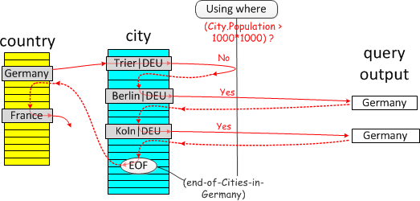
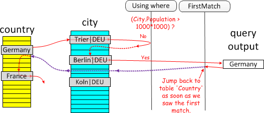
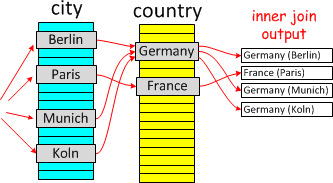
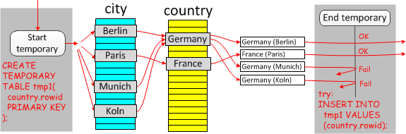
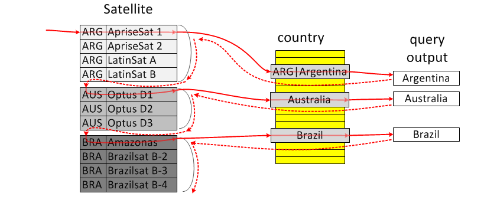
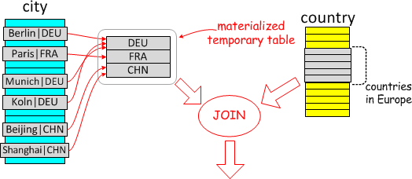
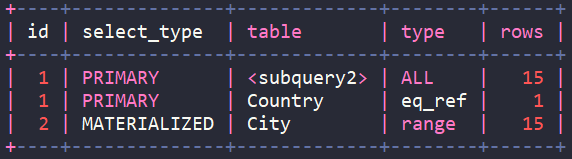

## semi-join

當兩個 Table 之間進行 `INNER JOIN` 時，當同一個值有多個符合的行，就會返回同等的數量。但是有時候，我們只在乎是否有符合的行，而不是符合的數量。假設當我們想知道有哪些商品(product)被購買時，可以使用以下的語法：

```sql
SELECT product.product_num , product.product_name
FROM product
INNER JOIN orders
WHERE product.product_num = orders.product_num;
```

但是當有一樣商品被重複購買時，上述查詢會產生重複的結果。

當然也可以透過 `DISTINCT` 來去除重複，但先生產所有符合的行才去除重複，因此效率很低。此時可以使用子查詢來獲得同樣不重複

```sql
SELECT product.product_num , product.product_name
FROM product
WHERE product_num IN 
	(SELECT product_num FROM orders);
```

使用以上語法優化器可以知道此處的 `IN` 語句要求子查詢只需要返回不重複的 `product_num`，在此情況下，查詢會使用 `semi-join`。

從 `8.0.16`開始，帶有 `EXISTS`子查詢的語句，也能享受到 `IN` 子查詢所使用的 `semi-join`優化－

```sql
SELECT product.product_num , product.product_name
FROM product
WHERE EXISTS
	(SELECT * FROM orders WHERE product.product_num = orders.product_num);
```

## anti-join

從 `8.0.17` 開始加入了 `anti-join`的優化，和 `semi-join`是相同的，差別在於多了 `NOT`的修飾，以下子查詢將被轉換為 `anti-join`：

- NOT IN (SELECT ... FROM ...)  `*子查詢中不可有NULL值`
- NOT EXISTS (SELECT ... FROM ...)
- IN (SELECT ... FROM ...) IS NOT TRUE
- EXISTS (SELECT ... FROM ...) IS NOT TRUE
- IN (SELECT ... FROM ...) IS FALSE
- EXISTS (SELECT ... FROM ...) IS FALSE

簡而言之，只要是否定帶有 `IN (SELECT ... FROM ...)` 或 `EXISTS (SELECT ... FROM ...)` 的子查詢都會被轉換為 `anti-join`。

`anti-join` 只會返回沒有符合的行，考慮以下查詢－

```sql
SELECT product.product_num , product.product_name
FROM product
WHERE product_num NOT IN 
	(SELECT product_num FROM orders);
```

此查詢會在內部被改寫為 `anti-join`，對於 `product` 的每一行資料，只要在 `orders` 中有找到符合的資料， `product` 就會丟棄符合的資料。

此外當遇到表達式有 `NULL`值時，則無法轉換為 `anti-join`，除非使用 `... NOT IN (SELECT ...) IS NOT FALSE`或同等的 `... IN (SELECT ...) IS NOT TRUE`才能轉換為 `anti-join`。

## 適用情境

子查詢若符合以下條件，就能使用 `semi-join(8.0.17 anti-join)`來優化

- 通用規則
    - 必須是 `IN` 或 `=ANY` 出現在最外層的 `WHERE`或 `ON`語句
    - 不包含 `UNION`結構的 `SINGAL SELECT`
    - 不包含 `HAVING`
    - 不能包含任何聚合函數(`SUM`、 `MAX`...)
    - 不包含 `LIMIT`
    - 不包含 `STRAIGHT_JOIN` (按照撰寫順序做 `INNER JOIN`的語句)
    - The number of outer and inner tables together must be less than the maximum number of tables permitted in a join.
- `5.7.*` 規則
    - 不包含 `GROUP BY`
    - 不包含 `ORDER BY`
    - 不包含 `IS [NOT] TRUE|FALSE`
- `8.0.16以上` 規則
    - 除了 `IN` 或 `=ANY` 還可以是 `EXISTS`
    - 在沒有聚合函數的情況下使用 `GROUP BY`，但會被忽略掉
    - `DISTINTCT` 可以使用，但會被忽略掉
    - `ORDER BY` 可以使用，但會被忽略掉
    - 不包含 `IS [NOT] TRUE|FALSE`
- `8.0.17以上`規則
    - 可以包含 `IS [NOT] TRUE|FALSE`

注意： `UPDATE` 和 `DELETE` 無法使用 `semi-join` 優化，建議採用 `JOIN` 來進行優化

## 優化方式

- `TablePullout`

  假設有以下查詢，找出所屬城市有小於特定人口數的國家

    ```sql
    SELECT *
    FROM city
    WHERE city.country IN (
    	SELECT country.code
    	FROM country
    	WHERE country.population < 100*1000
    );
    ```

  當 `conutry.code`在 `country` 中不重複(即為 `PRIMARY KEY`或 `UNIQUE INDEX`) 時，可以直接改寫為一般的 `INNER JOIN`即可。

    ```sql
    SELECT city.*
    FROM city,country
    WHERE city.country = country.code
    AND country.population < 100*1000;
    ```

  當觸發 `TablePullout`時， `EXPLAIN` 後 `SHOW WARNINGS` 時可以看到語句被改寫為 `INNER JOIN`

  適用情境：

    - `optimizer_switch` 中 `semijoin=on` (預設)
    - `IN` 子句當中的欄位，必須為該表的 `PRIMARY KEY` 或 `UNIQUE INDEX`
- `FirstMatch`

  假設有以下查詢，找出所屬城市有超過特定人口數的國家

    ```sql
    SELECT *
    FROM country
    WHERE country.code IN (
    	SELECT city.country
    	FROM city
    	WHERE city.population > 1*1000*1000
    );
    ```

  假設使用 `INNER JOIN` 如下圖，可以看到就算找到了Germany有符合條件的城市(Berlin)，仍舊會篩選Germany的下一個城市(Koln)，從而造成不必要的篩選與重複結果

  

  若使用 `FirstMatch` 則如下圖，可以看出區別在於當找到Germany有符合的城市(Berlin)之後，就不會再往下確認下一個城市(Koln)，而是會確認下一個country France是否有符合的城市，避免了不必要的檢查與產生重複的結果

  

  當觸發 `FirstMatch`時， `EXPLAIN` 中的 `EXTRA` 中會顯示 `FirstMatch`

  適用情境：

    - `optimizer_switch`中 `firstmatch=on`(預設)
    - 子查詢中沒有 GROUP BY / 聚合函數
- `Duplicate Weedout`

  此方案會先使用一般的 `INNER JOIN` 之後，並使用 `臨時表`去除重複。假設有一個查詢為找出有城市人口數超過國家總人口的33%以上且超過 1*1000*1000

    ```sql
    SELECT *
    FROM country
    where country.code IN (
    	SELECT city.country
    	FROM city
    	WHERE city.population > 0.33 * country.population
    	AND city.population > 1*1000*1000
    );
    ```

    1. 對這兩張表進行 `INNER JOIN`

       

    2. 透過帶有 `PRIMARY KEY`的 `臨時表` 將重複的資料進行過濾

       

       當觸發 `Duplicate Weedout`時，會在 `EXPLAIN` 的 `Extra` 中顯示 `Start temporary; End temporary`

       適用情境：

        - `optimizer_switch`中 `duplicateweedout=on` (預設)
        - 子查詢中沒有 GROUP BY / 聚合函數
- `LooseScan`

  假設有以下查詢擁有衛星的國家，其中 `satellite.country_code` 有 `INDEX`

    ```sql
    SELECT *
    FROM country
    WHERE country.code IN (
    	SELECT country_code
    	FROM satellite
    );
    ```

  此時會透過 `INDEX` 取得 `GROUP BY` 的動作，來達到去除重複的目的

  

  當觸發 `LooseScan`時，會在 `EXPLAIN` 的 `Extra` 中顯示 `LooseScan`

  適用情境：

    - `optimizer_switch`中 `looseScan=on` (預設)
    - `expr IN (SELECT tbl.keypart1 FROM tbl ...)` 或

      `expr IN (SELECT tbl.keypart2 FROM tbl WHERE tbl.keypart1=const AND ...)`

- `materialization`

  假設有以下查詢要尋找擁有大城市的歐洲國家

    ```sql
    SELECT *
    FROM country
    WHERE country.code IN (
    	SELECT city.country
    	FROM city
    	WHERE city.population > 7*1000*1000
    ) AND country.continent = 'Europe'
    ```

  此方案會先執行 `IN`後面的子句並將結果存入 `臨時表`，表中有 `PRIMARY KEY`來去除重複，之後再和外側的Country做 `INNDER JOIN`來篩選歐洲國家

  

  當觸發 `materialization`時，會在 `EXPLAIN` 的 `table` 中出現 `<subquery>` 並且 `select_type` 中會出現 `MATERIALIZED`

  


## 參考資料

[MySQL 5.7 文檔](https://dev.mysql.com/doc/refman/5.7/en/semijoins.html)

[MySQL 8.0 文檔](https://dev.mysql.com/doc/refman/8.0/en/semijoins.html)

[Maria DB 文檔](https://mariadb.com/kb/en/semi-join-subquery-optimizations/)

[Antijoin in MySQL8(by MySQL Server Blog)](https://mysqlserverteam.com/antijoin-in-mysql-8/)

[anti-join幾點總結(by 知乎-知數堂)](https://zhuanlan.zhihu.com/p/99195571)